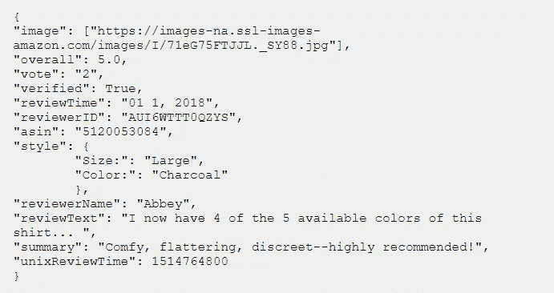

# 亚马逊书评的神经网络协同过滤

> 原文：<https://towardsdatascience.com/neural-network-collaborative-filtering-with-amazon-book-reviews-c50a919a84a7?source=collection_archive---------21----------------------->

## 在我的项目中，我用亚马逊评论数据构建了一个图书推荐系统。

这个项目的目的是通过分析亚马逊评论并使用 Tensorflow 和 Keras 开发神经网络模型来创建一个**协同过滤图书推荐系统。**

图片由 [Shiromani Kant](https://unsplash.com/@readerpreneur) 在 [Unsplash](https://unsplash.com/) 上拍摄

**TL；博士:**

*   从亚马逊评论数据集[**中检索亚马逊评论数据(2018)**](https://nijianmo.github.io/amazon/index.html)
*   在图书上应用**情感分析**
*   已创建 **SVD 嵌入**
*   **tensor flow/Keras 构建的神经网络**协同过滤

# 一.背景

推荐系统是企业用来帮助客户匹配他们可能接触的产品的有用工具。如果开发得当，这些系统非常强大，可以直接提高公司吸引用户的能力。协同过滤是一种通过分析具有相似品味的其他用户的偏好来预测用户偏好的方法。有不同类型的协同过滤系统，这个[参考](/various-implementations-of-collaborative-filtering-100385c6dfe0)解释得很好。

传统的协同过滤模型容易出现欠拟合，这导致它们在向用户推荐时有较高的误差。随着神经网络变得越来越流行，它们非常适合为推荐系统创建高度自适应的模型。构建神经网络协同过滤模型的指南并不多，因此我在本文中着手帮助演示这一点。

# 二。数据集

我们的数据集是从 UCSD【1】收集的[存储库中加载的。该知识库是通过抓取数百万亚马逊页面创建的，因此它是亚马逊评论和产品评级的非常全面的集合。这些数据在很多方面都很有用，非常适合构建一个推荐系统。原始文件非常大，所以我选择只选择有 5 个或更多评论的](https://nijianmo.github.io/amazon/index.html)[书](http://deepyeti.ucsd.edu/jianmo/amazon/categoryFilesSmall/Books_5.json.gz)(仍然是一个非常大的文件— 27，164，983 个评论)。

理论上，我们可以创建一个适合所有 27，164，983 条评论的协同过滤模型，但这将导致长时间的训练和低质量的嵌入，因为用户-图书矩阵非常稀疏。所以为了克服这一点，模型只选择了评论超过 100 的书籍和用户。

来自亚马逊评论数据集的评论数据

数据集包含. json 格式的上述信息。Pandas 可用于加载和结构化数据，但它需要成块加载，如下所示:

# 三。情感分析

情感分析是一个复杂的过程。NLTK (Vader)和 Textblob 等很多包都是基于规则的情感分析包，速度快，简单明了，但是不分析数据中任何更深层次的模式。当涉及到持续分析我们数据集中评论的情绪时，他们很难做到。

Flair 是一个强大的自然语言处理工具包，它使用预先训练的模型来预测文本情感。它在亚马逊评论数据上工作得非常好，所以 Flair 是获得所有用户图书评论的情感值的明确选择。唯一的缺点是运行时间，因为 Flair 的运行时间要长得多。

因为 Flair 包更像是一个逻辑分类器，所以我必须使用一些 QuantileTransformers 来转换变量，以便为我们的模型正确地缩放目标变量。

# 四。模型

我们模型的起点是用户手册矩阵。它是我们原始数据集的数据透视表，每行代表一个唯一的用户，每列代表一本书。

从用户手册矩阵到嵌入(图片由作者提供)

从用户手册矩阵中，可以创建嵌入，这是我们建模的基础。**嵌入是表示数据集中要素的矢量。例如，在我们的例子中，嵌入可以代表书籍的流派、主题、长度、风格或者两者的某种组合**。嵌入不能被明确地定义，所以我们永远无法确切地知道它们是什么，但是这是一个思考它们的好方法。

在这里了解更多关于嵌入的信息:[Kerem Turgutlu 的结构化深度学习](/structured-deep-learning-b8ca4138b848)

## 一.矩阵分解方法

简单的矩阵分解包括两个步骤:

*   将初始用户手册矩阵分解成嵌入(在我们的例子中，我们将使用 64 个单元嵌入)
*   *用户嵌入向量*和*图书嵌入向量*的加权点积，得到预测的情感得分。

矩阵分解法(图片由作者提供)

矩阵分解方法的实现如下所示。我用 scipy 将`user_book_matrix`分解成两个嵌入矩阵，`user_embed_df`和`book_embed_df`。

虽然这种方法快速而直接，但它在用户嵌入向量和书籍嵌入向量可以预测评论情感的程度方面有所限制。我们得到的 RMSE 是 0.131，这是可以改进的。

## 二。神经网络方法

为了改进我们模型的拟合，需要额外的建模来改进简单矩阵分解的局限性。矩阵分解很快，但是它的适应性不足以解释用户嵌入和图书嵌入如何相互作用的复杂性。

对于神经网络来说，这是一个完美的问题，我使用 Tensorflow 和 Keras 建立了一个模型来完成这一任务。如下图所示的神经网络有 3，050，337 个可训练的权重，这些权重中的每一个都可以被训练，这样神经网络就可以充分地考虑任何可能与我们的嵌入发生的复杂交互。

神经网络方法(图片由作者提供)

我们的神经网络结构包含 2048、1024、512、256、64 和 16 个单元的密集层。我们为`epochs = 100`训练模型，使用`batch_size = 64`。使用 RTX 2060 图形处理器，训练只花了大约 5 分钟。大多数 CPU 应该能够相当容易地处理这个问题。

该模型有脱落层和批量标准化层，以防止过拟合。我还使用了 optimizer = 'adam '，loss = 'mean_squared_error '，并添加了' mean_absolute_error '作为要跟踪的附加损失变量。我们在验证数据集上的 MSE 是 0.07，这是对矩阵分解模型的显著改进。

## 三。比较

让我们在用户身上尝试我们的神经网络模型，看看他们的表现如何:

## 约翰·史密斯(阅读数据集中的 53 本书)

作者图片

对约翰·史密斯来说，他最好的书是关于历史、战争和政治的书籍。根据我们的情感分析，这些书是约翰留下最积极评价的。推荐的书籍似乎符合他的口味，符合历史、传教士故事和移民的体裁。这些书是我们的神经网络模型预测得分最高的书。

推荐者推荐了丹尼尔·席尔瓦的《黑寡妇》,这部小说更像是一部惊悚小说。这似乎有点超出了约翰所习惯的范围，但是，嘿，也许他会喜欢的！

似乎我们的模型工作得相当好！仍有改进的空间，如进一步开发模型，或调整数据准备过程。

所有代码和笔记都可以在我的 [github 页面这里](https://github.com/kenhua15/Metis-Projects/tree/master/5%20-%20amazon_recommendation_system)找到。感谢您的阅读，希望对您有所帮助！任何反馈也非常感谢。

## 引用:

[1]简墨倪，，朱利安·麦考利，<https://cseweb.ucsd.edu//~jmcauley/pdfs/emnlp19a.pdf>**【2019】*【自然语言处理中的经验方法】***