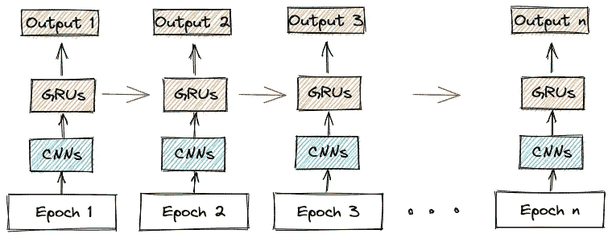
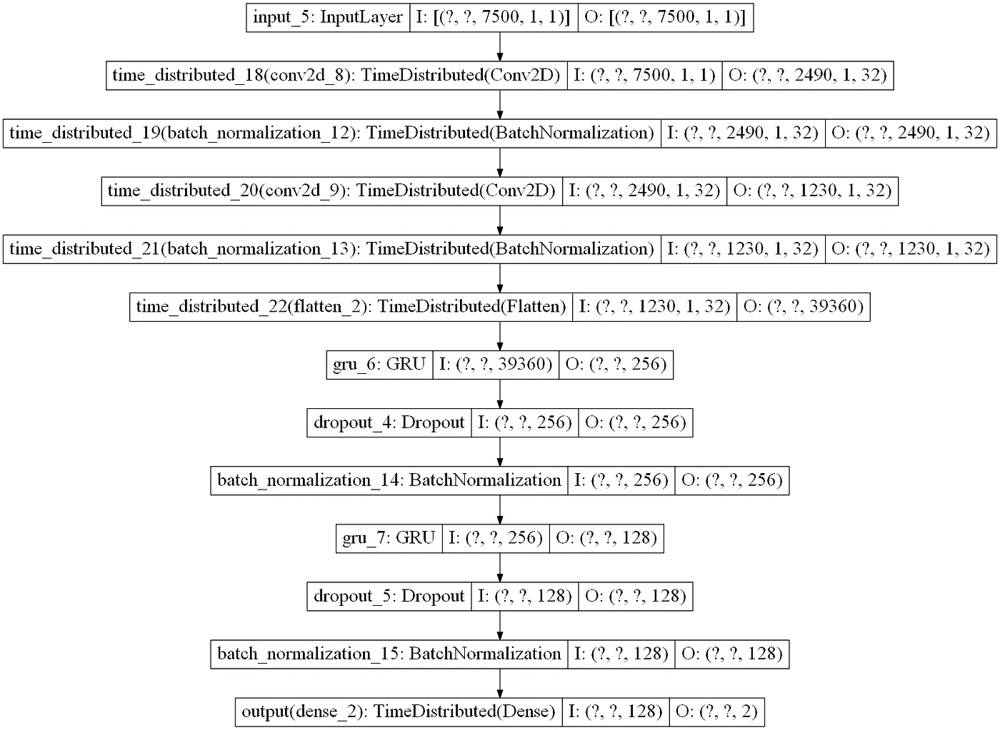

# 采用张量流时间分布包装器的变长输入神经网络

> 原文：<https://towardsdatascience.com/neural-network-for-input-of-variable-length-using-tensorflow-timedistributed-wrapper-a45972f4da51?source=collection_archive---------5----------------------->

## 如何使用 Tensorflow 时间分布包装器处理可变长度输入(通常是信号)的指南

# 目录

1.  为什么输入长度可变？
2.  Tensorflow 时间分布式包装器
3.  数据生成程序
4.  参考

# 为什么输入长度可变？

你是否曾经想要将神经网络应用于你的数据集，但是数据(信号、时间序列、文本等。)有了一个**可变长度**？不幸的是，这种情况对于数据科学家来说很常见。

> 正如我们所知，在现实世界中，数据永远不会像我们希望的那样漂亮和有条理。

有各种各样的方法来解决这个问题，但是没有一个让我满意。

最普遍采用的解决方案是**将所有输入截断**到相同长度，这通常与较短长度的输入相一致。然而，这造成了巨大的数据损失，正如我们所知，数据对我们来说是金子。

一个可能的替代方案是它的反面，即 [**填充**](https://www.tensorflow.org/guide/keras/masking_and_padding) (添加数据直到所有信号长度相同)。填充的问题是，它添加了没有实际意义的数据，而且输入非常长，网络的规模变得不可持续。当然，填充可以通过 [**增强**](https://www.tensorflow.org/tutorials/images/data_augmentation) 来完成。然而，特别是对于数据顺序非常重要的信号，应用增强会“污染”这些信息。

> 我感到很失落，但当我看到这个包装纸时，我知道它就是我要的。

# Tensorflow 时间分布式包装器

The[**time distributed**](https://www.tensorflow.org/api_docs/python/tf/keras/layers/TimeDistributed)wrapper 允许对输入的每个时间片应用一个层。

假设作为输入，我们有一个由以 100 Hz(每秒 100 点)采样的**信号**组成的数据集。我们的目标是对每个 30 秒的片段进行分类(称为**纪元**)。

因此，我们希望建立一个深度神经网络，递归地应用于这些片段中的每一个。为了阐明网络的工作原理，下面是一个简化的示意图:



网络如何运作的模式[图片由作者提供]

让我们从导入所有必需的元素开始:

```
from tensorflow.keras.layers import Conv2D, TimeDistributed,Dropout,Input, Dense,\
    BatchNormalization, GRU, Layer, Flatten
from tensorflow.keras.regularizers import l2
from tensorflow.keras.models import Model
from tensorflow.keras.utils import plot_model
from tensorflow.keras.optimizers import Adam
```

现在我们可以建立我们的网络。我们将使用[**【CNN】**](https://www.tensorflow.org/tutorials/images/cnn)卷积块从原始信号中提取特征，随后使用**[**【GRU】**](https://www.tensorflow.org/api_docs/python/tf/keras/layers/GRU)组合提取的特征。所以让我们写我们的函数:**

```
def nn(shape_1,shape_2):
    input = Input(shape=[None, shape_1,shape_2,1])

    conv1 = TimeDistributed(Conv2D(filters=32, kernel_size=[32,1], activation='relu',strides =(3,1)))(input)
    batch1 = TimeDistributed(BatchNormalization())(conv1)

    conv2 = TimeDistributed(Conv2D(filters=32, kernel_size=[32,1], activation='relu',strides =(2,1)))(batch1)
    batch2 = TimeDistributed(BatchNormalization())(conv2)

    conv3 = TimeDistributed(Conv2D(filters=32, kernel_size=[32,1], activation='relu',strides =(2,1)))(batch2)
    batch3 = TimeDistributed(BatchNormalization())(conv3)

    conv4 = TimeDistributed(Conv2D(filters=32, kernel_size=[32,1], activation='relu',strides =(2,1)))(batch3)
    batch4 = TimeDistributed(BatchNormalization())(conv4)

    flat = TimeDistributed(Flatten())(batch4)

    gru1 = GRU(256, activation='relu',return_sequences=True, kernel_regularizer=l2(0.01))(flat)
    drop1 = Dropout(rate=0.4)(gru1)
    batch1 = BatchNormalization()(drop1)

    gru2 = GRU(128, activation='relu',return_sequences=True, kernel_regularizer=l2(0.01))(batch1)
    drop2 = Dropout(rate=0.4)(gru2)
    batch2 = BatchNormalization()(drop2)

    dense = TimeDistributed(Dense(2, activation='softmax'),name = 'output')(batch2)

    return [input], [dense]
```

**正如我们所见，网络由**四个卷积层**和**两个卷积层**组成。网络中还有其他元素，如 [**批量归一化层**](https://www.tensorflow.org/api_docs/python/tf/keras/layers/BatchNormalization) ，由于时间原因我们不再赘述。最后，一个[**密集层**](https://www.tensorflow.org/api_docs/python/tf/keras/layers/Dense) 允许分类。如果您想要对整个信号而不是每个时期进行分类，我们可以使用以下内容作为最后一层:**

```
dense = Dense(2, activation='sigmoid',name = 'status_output')(batch2)
```

**需要注意的重要一点是，包装器**不应该应用于时间层**，比如 GRU 或 LSTM。默认情况下，这种类型的层已经可以处理可变长度。**

**一旦函数准备就绪，让我们构建模型并详细查看它:**

```
EPOCH_LENGTH = 30
SAMPLE_RATE = 100

input, output = nn(SAMPLE_RATE*EPOCH_LENGTH,1)
model = Model(inputs=input,outputs=output)

optimizer = Adam(learning_rate=2*1e-4)

# Compile Model
model.compile(optimizer=optimizer, loss={
                  'output': 'sparse_categorical_crossentropy', },
              metrics={
                  'output': 'sparse_categorical_accuracy', },
              sample_weight_mode='temporal')
model.summary()
```

*****输出:*****

```
Layer (type)                 Output Shape              Param #   
=================================================================
input_13 (InputLayer)        [(None, None, 3000, 1, 1) 0         
_________________________________________________________________
time_distributed_58 (TimeDis (None, None, 990, 1, 32)  1056      
_________________________________________________________________
time_distributed_59 (TimeDis (None, None, 990, 1, 32)  128       
_________________________________________________________________
time_distributed_60 (TimeDis (None, None, 480, 1, 32)  32800     
_________________________________________________________________
time_distributed_61 (TimeDis (None, None, 480, 1, 32)  128       
_________________________________________________________________
time_distributed_62 (TimeDis (None, None, 225, 1, 32)  32800     
_________________________________________________________________
time_distributed_63 (TimeDis (None, None, 225, 1, 32)  128       
_________________________________________________________________
time_distributed_64 (TimeDis (None, None, 97, 1, 32)   32800     
_________________________________________________________________
time_distributed_65 (TimeDis (None, None, 97, 1, 32)   128       
_________________________________________________________________
time_distributed_66 (TimeDis (None, None, 3104)        0         
_________________________________________________________________
gru_22 (GRU)                 (None, None, 256)         2582016   
_________________________________________________________________
dropout_20 (Dropout)         (None, None, 256)         0         
_________________________________________________________________
batch_normalization_48 (Batc (None, None, 256)         1024      
_________________________________________________________________
gru_23 (GRU)                 (None, None, 128)         148224    
_________________________________________________________________
dropout_21 (Dropout)         (None, None, 128)         0         
_________________________________________________________________
batch_normalization_49 (Batc (None, None, 128)         512       
_________________________________________________________________
output (TimeDistributed)     (None, None, 2)           258       
=================================================================
Total params: 2,832,002
Trainable params: 2,830,978
Non-trainable params: 1,024
_________________________________________________________________
```

**正如我们所看到的，网络有 280 万个可训练参数，总的来说这是一个很小的数目。让我们形象地描述一下:**

```
model._layers = [
    layer for layer in model._layers if isinstance(layer, Layer)
]

plot_model(model, 'model.png', show_shapes=True)
```

****

**模型形状[图片来自作者]**

**从网络的形状中，我们注意到 **TimeDistributed 在默认的基础上增加了一个维度**(即第二个问号)，它对应于每个信号的不同时期数。**

**此外，GRU(或 [**LSTM**](https://www.tensorflow.org/api_docs/python/tf/keras/layers/LSTM) )允许我们利用时间信息，这在信号中是必不可少的。**

**不幸的是，这个网络不能自我训练，特别是在我们的例子中，我们有各种由 IDs 标识的文件。然后，我们构建一个生成器来管理输入。**

# **数据生成程序**

**在我们的例子中，我们有一个文件列表，每个文件代表一个输入信号。因此，我们需要为 Tensorflow 构建一个生成器，在运行时接收信号并为网络做好准备。**

**现在让我们构建一个类，它将类型为 [**的对象序列**](https://www.tensorflow.org/api_docs/python/tf/keras/utils/Sequence) 作为输入，并实现训练网络所需的所有方法( *__init__，__len__，__getitem__，on_epoch_end* ):**

```
import numpy as np
from keras.utils import Sequence
from keras.preprocessing.sequence import pad_sequences

class DataGenerator(Sequence):
    *"""Generates data for Keras
    Sequence based data generator. Suitable for building data generator for training and prediction.
    """* def __init__(self, list_IDs, input_path, target_path,
                 to_fit=True, batch_size=32, shuffle=True):
        *"""Initialization* ***:param*** *list_IDs: list of all 'label' ids to use in the generator* ***:param*** *to_fit: True to return X and y, False to return X only* ***:param*** *batch_size: batch size at each iteration* ***:param*** *shuffle: True to shuffle label indexes after every epoch
        """* self.input_path = input_path
        self.target_path = target_path
        self.list_IDs = list_IDs
        self.to_fit = to_fit
        self.batch_size = batch_size
        self.shuffle = shuffle
        self.on_epoch_end()

    def __len__(self):
        *"""Denotes the number of batches per epoch* ***:return****: number of batches per epoch
        """* return int(np.floor(len(self.list_IDs) / self.batch_size))

    def __getitem__(self, index):
        *"""Generate one batch of data* ***:param*** *index: index of the batch* ***:return****: X and y when fitting. X only when predicting
        """* # Generate indexes of the batch
        indexes = self.indexes[index * self.batch_size:(index + 1) * self.batch_size]

        # Find list of IDs
        list_IDs_temp = [self.list_IDs[k] for k in indexes]

        # Generate data
        X = self._generate_X(list_IDs_temp)

        if self.to_fit:
            y = self._generate_y(list_IDs_temp)
            return [X], y
        else:
            return [X]

    def on_epoch_end(self):
        *"""
        Updates indexes after each epoch
        """* self.indexes = np.arange(len(self.list_IDs))
        if self.shuffle:
            np.random.shuffle(self.indexes)

    def _generate_X(self, list_IDs_temp):
        *"""Generates data containing batch_size images* ***:param*** *list_IDs_temp: list of label ids to load* ***:return****: batch of images
        """* # Initialization
        X = []

        # Generate data
        for i, ID in enumerate(list_IDs_temp):
            # Store sample
            temp = self._load_input(self.input_path, ID)
            X.append(temp)

        X = pad_sequences(X, value=0, padding='post')

        return X

    def _generate_y(self, list_IDs_temp):
        *"""Generates data containing batch_size masks* ***:param*** *list_IDs_temp: list of label ids to load* ***:return****: batch if masks
        """* y = []

        # Generate data
        for i, ID in enumerate(list_IDs_temp):
            # Store sample
            y.append(self._load_target(self.target_path, ID))

        y = pad_sequences(y, value=0, padding='post')

        return y
```

**一旦生成器类被编写，让我们提取文件的 id 列表，将它们分成**训练**、**验证**和**测试**。注意，我们构建了两个生成器，一个用于训练，一个用于验证:**

```
import numpy as np
import re
from os import listdir
from os.path import isfile, joinTEST_SIZE = 128
onlyfiles = [f for f in listdir(input_path) if isfile(join(input_path, f))]

id = [re.search('(.+?).npz', x).group(1) for x in onlyfiles]
id.sort()

np.random.seed(1234)
id_test = np.random.choice(id, size=TEST_SIZE,replace=False)
id = list(set(id) - set(id_test))
id_validation = np.random.choice(id, size=TEST_SIZE,replace=False)
id = list(set(id) - set(id_validation))

print(len(id))

training_generator = DataGenerator(id,  input_path = input_path,
                                   target_path=target_path)

validation_generator = DataGenerator(id_validation, input_path = input_path,
                                   target_path=target_path)
```

**我们现在终于可以进行模型训练了，祈祷好运吧😆。**

```
model.fit(training_generator,
                    validation_data=validation_generator,
                    epochs=8,
                    use_multiprocessing=True)
```

**对于本文，我们已经完成了，我在参考资料中为您留下了包含代码的 repo 的链接。**

**一会儿见，**

**弗朗西斯科**

# **参考**

1.  **[时间分布式张量流包装器](https://www.tensorflow.org/api_docs/python/tf/keras/layers/TimeDistributed)**
2.  **带有代码的 Github [库](https://github.com/dallanoce/timedistributed)**