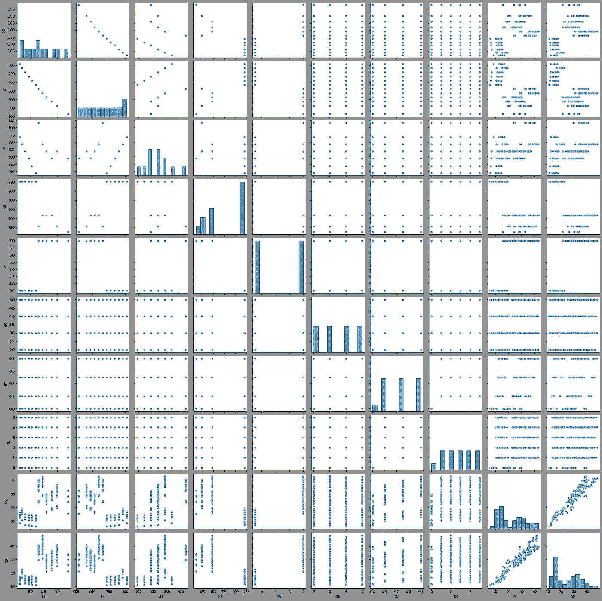
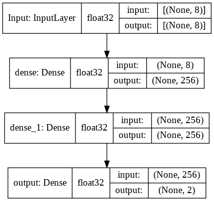
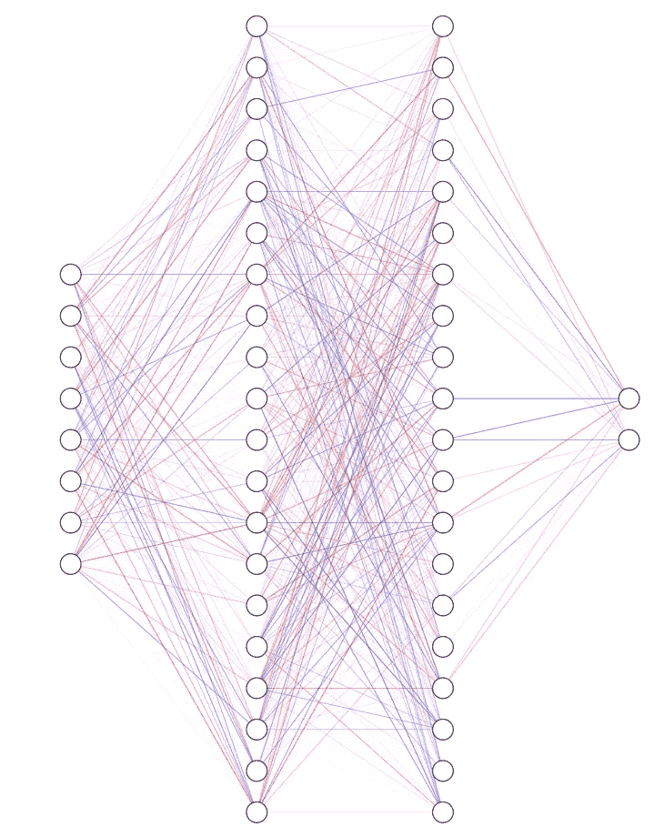
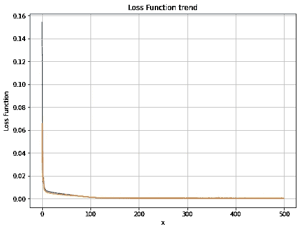
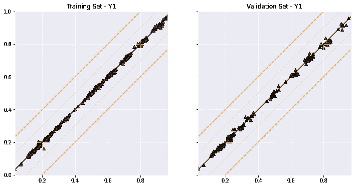
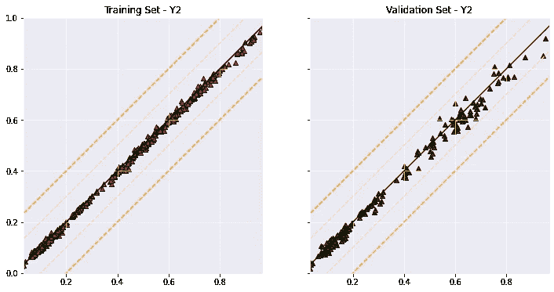

# 预测建筑物能源性能的神经网络

> 原文：<https://towardsdatascience.com/neural-network-for-predicting-the-energy-performance-of-a-building-5c2bf5820ebe?source=collection_archive---------24----------------------->

## 用 Tensorflow 和 Colab 估算夏季和冬季负荷

在我攻读工程学硕士学位期间，我花了几年时间，试图为能源系统建模。在大多数情况下，对于特别简单方便的**几何**和**边界条件**，只有**最简单的问题**可以直接建模(所研究系统的控制微分方程的解析解)。使用各种数学/数值或程序技术来处理更复杂的问题，以简化它们的性质，从而可以开发出相当精确(尽管是近似的)的计算模型。


照片由 [Zbynek Burival](https://unsplash.com/@zburival?utm_source=medium&utm_medium=referral) 在 [Unsplash](https://unsplash.com?utm_source=medium&utm_medium=referral) 上拍摄

我最近在深度学习和最广泛意义上的工程(结构分析、流体动力学、能源系统……)的集成方面的经验中，最有趣的一个方面是以完全不同的方式处理所研究的问题的可能性。

数据的**丰富性**和**复杂性**不再是一个问题，而是一个优势，允许开发更加**准确的**和更加**复杂的**预测模型。

在一个问题可以被完美地解释和解析地解决之前，没有必要再把这个问题简化到骨子里。数据的可靠性，再加上复杂的**神经网络**模型，足以以超过可接受的工程和功能精度对系统进行建模。


[Outsite Co](https://unsplash.com/@outsite?utm_source=medium&utm_medium=referral) 在 [Unsplash](https://unsplash.com?utm_source=medium&utm_medium=referral) 上拍摄的照片

所有这些序言对于介绍本文中提出的问题是必要的，即从结构化数据集中对建筑物的夏季和冬季热负荷进行**估计。在我的学习和个人生活中，我多次遇到这个问题。按照我的惯例，我总是使用不可避免的 **Excel** 电子表格和相关的国家**立法**来处理估算能源性能的问题。这考虑了各种因素的总和(直接和间接的太阳能负荷、通风、显热和潜热负荷……)，采用了基于效应叠加和一维的方法，产生了一种解决该问题的常用简化方法。与其实施相关的标准的解释可能远不是一个简单的任务**，更多的是因为缺乏清晰度，而不是要开发的计算的数字难度。

*通过将数字模拟或安装的家庭自动化传感器生成的大量数据结合起来，彻底改变这种方法的可能性可能是一个有趣的思考点。*

## **为什么要看这篇文章？**

在这个故事中，我们将看到如何开发一个**顺序**(全连接)密集神经网络模型，用于从使用 **Autodesk Ecotect** 生成的开源数据集中估算建筑的**夏季和冬季热负荷**。我们将评估我们网络的性能和结构。

## **数据集**

本分析从 [**能效数据集**](https://archive.ics.uci.edu/ml/datasets/energy+efficiency) 开始，免费提供。该能源分析涵盖了 12 栋建筑。每个模拟都是用 Ecotect 进行的。这些建筑在玻璃面积、玻璃面积分布、朝向等方面各不相同……测试了上述参数的各种组合，从总共 8 个自由度开始，获得了 **768 种建筑形状**。数据集包括 768 个样本、8 个特征和两个实值响应(输出/特征)。



配对图—作者提供的图像

数据集包括 8 个属性/特征(**)*和两个响应/标签(**)*。**

***目标是用这八个特征来预测两个反应* ***中的每一个。*** *具体来说:***

*   ***X1 相对紧密度***
*   ***X2 表面积***
*   ***X3 城墙区域***
*   ***X4 屋顶面积***
*   ***X5 总高度***
*   ***X6 方位***
*   ***X7 玻璃区域***
*   ***X8 玻璃区域分布***
*   ***Y1 加热负荷***
*   ***Y2 冷负荷***

## **Ecotect**

**[Autodesk Ecotect Analysis](https://en.wikipedia.org/wiki/Autodesk_Ecotect_Analysis)是一种环境分析工具，使设计师能够在概念设计过程的早期模拟建筑性能。它将分析功能与交互式可视化相结合，直接在建筑模型的上下文中呈现分析结果。**

## **密集神经网络**

**为了这个分析，我使用了一个密集的神经网络。我使用了 2 个隐藏层(浅层网络)，每层 256 个神经元，激活函数为“relu”。**

****

**热负荷神经网络—图片由作者提供**

**如果你对我如何制作这个情节感兴趣，我写了一篇关于它的文章。对于这个分析，我选择了 [Keras Functional API](https://keras.io/guides/functional_api/) 来生成神经网络。你可以在这里找到[源代码](https://github.com/GitMarco27/TMML/blob/main/Notebooks/005_Energy_Efficiency.ipynb)，在 GitHub 和 [YouTube](https://www.youtube.com/channel/UCExkeDZ9WC0tg9aoFMsNF0w) 上找到完整的[库](https://github.com/GitMarco27/TMML)。我选择 **Meas 平方误差**作为损失函数，在训练期间还监控平均绝对误差和平均百分比绝对误差。最后，我使用 Adam 作为自适应学习率优化器，没有学习率衰减调度。最后，数据集必须分成**训练**和**验证**数据。将数据归一化到**便于**模型训练过程。**

****

**热负荷神经网络概念—图片由作者提供**

## **结果**

**神经网络已经训练了 500 个历元，批次大小为 128。我们得到了**培训**(蓝线)和**验证**(橙线)损失的良好趋势。**

****

**跨时代的损失函数-按作者分类的图像**

**为了评估模型的性能，建议制作**验证图**。这些图在横坐标中示出了标签的精确值，而纵坐标示出了神经网络对同一组输入的预测值。对于热负荷，我们得到以下趋势:**

****

**热负荷验证图-作者提供的图片**

**从**定量**的角度，评估了平均绝对误差、均方误差、**皮尔逊系数**和**决定系数**。**

```
**Y0 - mae-train - 0.00474
Y0 - mse-train - 4.44430
Y0 - r2-train - 0.99940
Y0 - pearson-train - 0.99972
Y0 - mae-test - 0.00947
Y0 - mse-test - 0.00015
Y0 - r2-test - 0.99783**
```

**我们可以看到，我们的算法在两个集合上都达到了非常高的精度(对于决定系数和皮尔逊系数，理想条件是值为 1)。对于冷负荷，我们得到以下趋势:**

****

**冷负荷验证图-作者提供的图片**

**从**定量**的角度来看:**

```
**Y1 - mae-train - 0.00685
Y1 - mse-train - 8.63810
Y1 - r2-train - 0.99870
Y1 - pearson-train - 0.99951
Y1 - mae-test - 0.01739
Y1 - mse-test - 0.00058
Y1 - r2-test - 0.99042
Y1 - pearson-test - 0.99606**
```

**无论是数字上的**还是质量上的**和**(趋势)，所获得的结果仍然非常令人满意。尽管这些结果是部分的，并且没有对模型从未见过的进一步数据进行可能的优化和测试的有益效果，但结果证明是有希望的，并且惊人地准确。****

## ****结论****

****我们利用**模拟软件** + **深度学习算法**的有趣组合，利用 Python、Colab 和 Tensorflow 的潜力，解决了一个**复杂的工程问题**。我们开发了一个**神经网络模型**，在结构化数据集上训练，用于预测热负荷。我们获得了**非常好的结果**，表明应用这种方法评估新数据的热性能以及解决这种工程分析的可能性。****

 ****下次见，马尔科****

## ****3 分钟机器学习****

****3 分钟机器学习是一系列与人工智能、深度学习和数据科学相关的教程、视频和文章。你可以在 YouTube 上找到完整的视频集。GitHub [存储库](https://github.com/GitMarco27/TMML)包含了文章和视频中显示的所有 Google Colab 笔记本。希望这些内容对你有用，或者只是你感兴趣。欢迎任何反馈。****

****查看其他剧集:****

*   ****[使用神经类型转移和张量流生成图像](/images-generation-with-neural-style-transfer-and-tensorflow-a823b0353b06)****
*   ****[猫 VS 狗卷积分类器](/cats-vs-dogs-convolutional-classifier-44ec04c8eb7a)****
*   ****[使用 Keras Functional API 绘制张量流模型](/plot-a-tensorflow-model-with-keras-functional-api-f2db639dbbd8)****