# 利用时间反演原理的神经网络

> 原文：<https://towardsdatascience.com/neural-network-from-tenet-exploiting-time-inversion-fdc512f5fec3?source=collection_archive---------8----------------------->

## 用递归神经网络建模动态系统

前一段时间，我使用了一种基于时间反演的时间序列预测方法，这种方法完美地融入了 Hans-Georg Zimmermann 博士发明的一种特殊类型的递归神经网络，他是一位世界级的深度学习实践者，多年来在西门子领导了一项应用于工业和金融问题的神经网络研究[1]。他利用的潜在哲学思想超出了克里斯托弗·诺兰的宗旨范围，但这种方法仍然是超级合法的。

# 宗旨的理念

**动力系统**是一组状态随时间变化的相关事物。**开放系统**可以对环境做出反应，而**封闭系统**不受环境影响，完全自主运行。它们仿照如下方式:

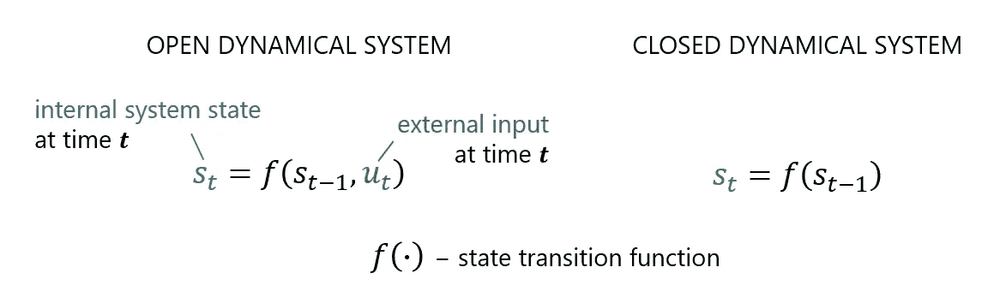

(1)开放和封闭的动力系统模型

上述模型假设动态系统具有从过去到现在在时间上前进的**信息**(因果)。

但是在一些动态系统中,**信息流从未来到现在沿着相反的时间方向前进。这些是动态系统，其随时间的变化受到涉及未来可观测性预测的规划的影响。例如，大多数市场价格不仅由供给和需求决定，还由市场参与者的计划方面决定。在这种情况下，我们可能会受益于使用假设因果和追溯因果影响混合的模型。**

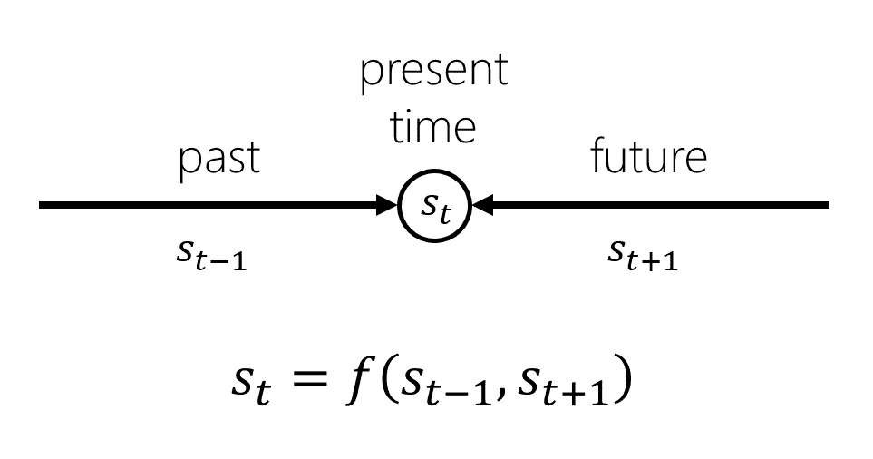

(2)具有因果和倒因果影响的动力系统模型

# **幕后模特**

## 1.封闭动力系统的动机

让我们首先考虑因果开放动力系统模型(1)。如果对于转换函数，我们采用一个应用于线性状态转换的激活函数，并添加一个输出方程，您可能会识别出一个标准的**递归神经网络** (RNN)，它非常适合于通过构造进行动态系统建模，并广泛用于处理时序数据，例如时间序列和自然语言。

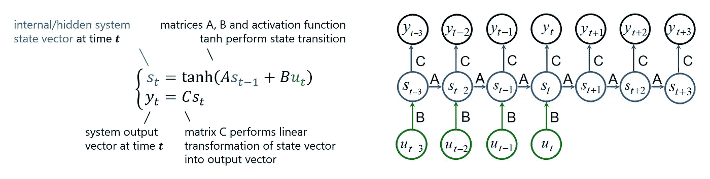

(3)开放动力系统的简单递归神经网络

这是一个相当复杂的模型，需要考虑内部自治系统状态和外部输入。因此，让我们**通过将问题重新表述为更复杂的问题**来简化这个复杂的模型——考虑一下**封闭动力系统**。为此，我们必须通过添加包含外部变量动态的外部子系统来扩展我们的内部系统空间。模型复杂性和问题复杂性之间的这种**权衡**并不便宜，我们以后在教模型理解扩展的内部空间的新变量关系时会付出代价。

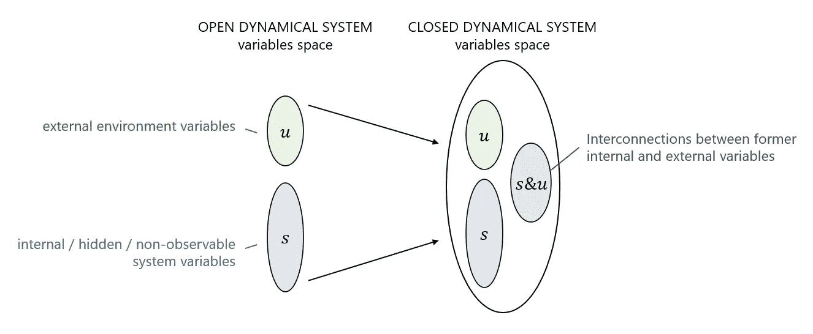

(4)将开放动力系统转化为封闭动力系统

但是我们获得了一个简单的模型(5 ),其长期一致性仅取决于内部系统变量的相互关系的强度，而不取决于外部输入，这在实践中也很难获得。请注意，在新模型中，我们还摆脱了复杂的输出提取—我们的输出 ***y*** 只是系统状态 ***s*** 的子集，没有任何变化。

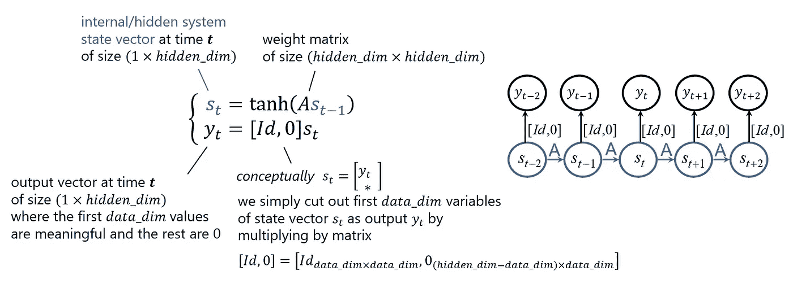

(5) RNN 模拟一个封闭的动力系统

## 2.教授因果/时间向前模型

在模型(5)中，所有拟合参数位于**权重矩阵 a 中。**为了拟合它们，我们使用标准误差**时间反向传播** (BPTT)算法，该算法具有在每个时间戳纠正误差的特殊技巧，称为**教师强制**。

**目标/损失函数**，我们希望通过调整权重矩阵 A 使其最小化，初始状态偏差是每个时间戳的误差平方和。

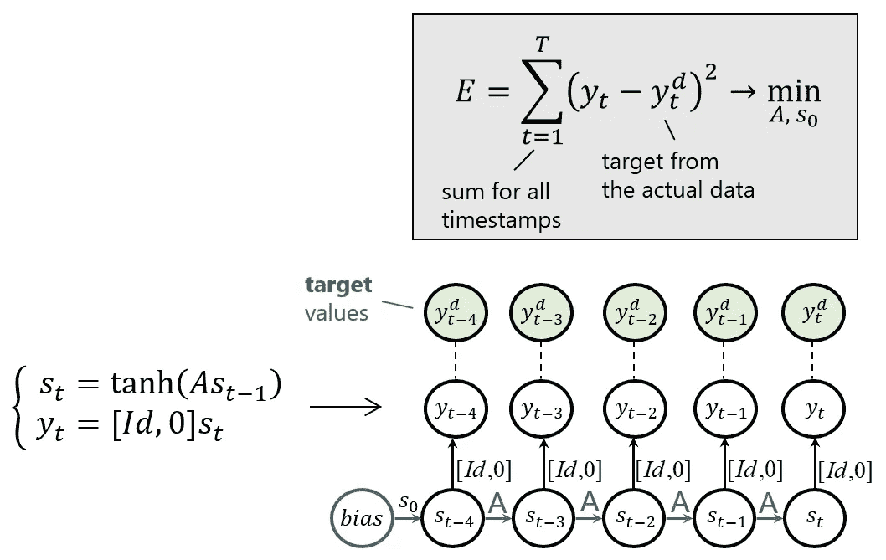

(6)目标/损失函数——系统的识别

**拟合 RNN** ，即时间反向传播涉及
1)正向传递，其中我们计算每个时间戳的输出
2)每个时间戳的误差计算，然后总误差计算
3)通过时间反向传播误差来计算总误差相对于模型参数的梯度
4)根据梯度更新权重
重复步骤 1-4，直到模型误差足够低。

由于只有一条历史路径，即观察序列 ***y*** ，我们只有一个数据样本来训练模型。

在拟合过程的**正向传递**中，我们使用**教师强制** —在每个时间戳，目标被替换在对应于可观察输出**的内部系统状态**的部分中。***然而，系统内部状态的其余部分 ***s*** 对应的这个不可观测的系统变量保持不变。这样，我们不会传播错误，因此在训练模型时不会累积错误。*

*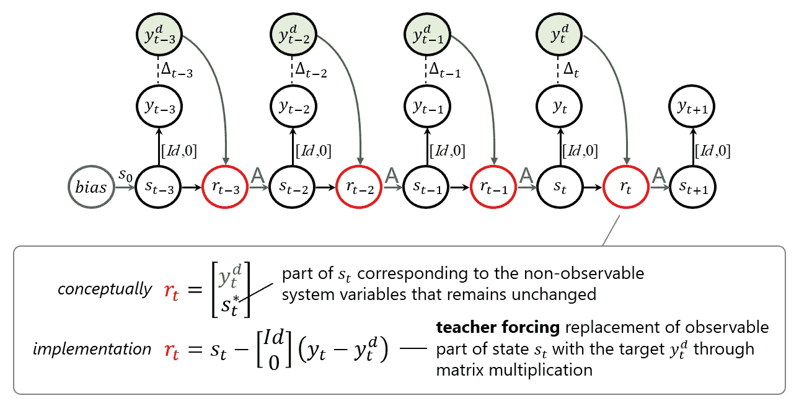*

*(7)教师强制纠错*

*在向前传递之后，我们可以使用模型输出和目标容易地计算总误差(6)。然后，我们必须计算误差相对于模型参数的梯度。*

*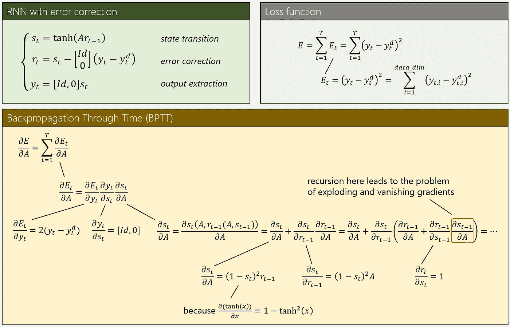*

*(8)关于权重矩阵的误差梯度*

*在算法的最后一步，使用计算的梯度，我们更新模型参数/状态转移相关性，即权重矩阵 A:*

*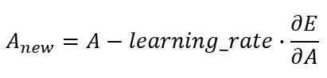*

*(9)BPTT 权重矩阵更新*

*上面描述的带教师强迫的递归神经网络称为**误差修正神经网络(ECNN)** 或历史一致性神经网络**(HCNN)【2】。***

***请注意，由于自治系统扩展(4)，权重矩阵 A 可能非常大，其中标量权重的数量等于系统变量总数的平方。当我们增加系统空间时，它会快速增长，这是建模方法的一个瓶颈。加快训练过程的一个很好的实用技巧是使用稀疏权重矩阵 A——假设系统变量之间的一些联系比假设一切都是相互关联的更接近现实。***

***您还可以查看我对这一部分的 python 实现:***

*   ***in plain NumPy:[https://github . com/uselesskills/hcnn/blob/master/tutorials/hcnn _ NumPy . ipynb](https://github.com/uselessskills/hcnn/blob/master/tutorials/hcnn_numpy.ipynb)***
*   ***带 PyTorch 后端:[https://github . com/uselesskills/hcnn/blob/master/tutorials/hcnn _ py torch . ipynb](https://github.com/uselessskills/hcnn/blob/master/tutorials/hcnn_pytorch.ipynb)***

## ***3.时间反演:从因果模型到逆因果模型***

***我在 Zimmermann 博士的演讲中发现的逆向工程原理的表述阐明了追溯因果模型背后的内在动机:***

> ***当我们能够确定代理人的目标时，我们就可以试着从这些目标向后解释动力学***

***事实上，我们并不局限于只学习因果依赖，在这里它被利用了。让我们假设**我们生活在反转的时间世界**中，简单地使用相同的模型架构来学习从未来到过去的系统转换。***

***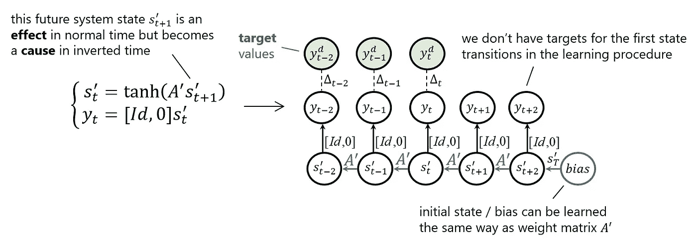***

***(10)时间倒推的追溯因果 RNN***

***同样的方法，我们应用 BPTT 与教师强迫，以适应倒置的时间系统转移权重矩阵和初始状态偏差。***

***对于这部分的实现，我们基本上只需要在**倒序**上训练来自第二部分的标准**因果 RNN** 。***

## ***4.【宗旨】因果和逆因果神经网络的叠加***

***最后，我们将正常时间网络和反转时间网络对称地组合成一个网络[3]。***

***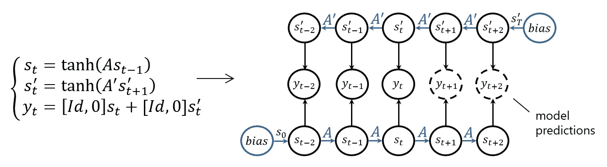***

***(11)组合的因果和逆因果神经网络***

***再次训练这个网络需要 BPTT 和老师的强迫。***

***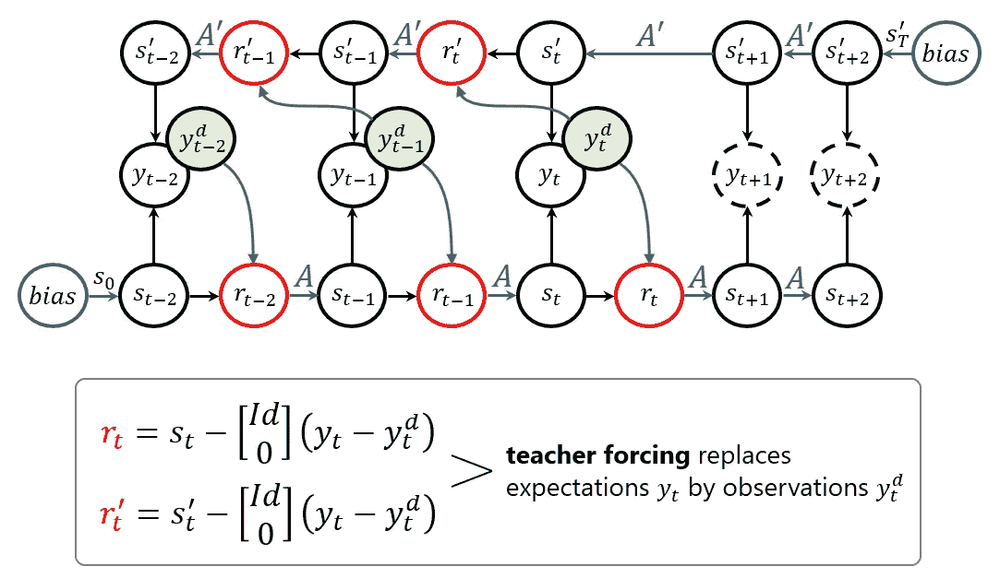***

***(12)因果和追溯因果网络结合的教师强迫***

***这部分我在 PyTorch 上的实现:[https://github . com/uselesskills/hcnn/blob/master/tutorials/CRC _ hcnn . ipynb](https://github.com/uselessskills/hcnn/blob/master/tutorials/crc_hcnn.ipynb)***

# ***结论***

***我们从 TENET 提出的时间反演思想开始，然后将其映射到一个由递归神经网络驱动的模型。还是真的反过来了？***

***特别感谢阿列克谢·米宁博士，他向我介绍了这种非凡的方法，并在我试图理解它时耐心地给我多次建议，直到我感觉到它。***

# ***参考***

***[1][https://www.researchgate.net/profile/Hans-Zimmermann-4](https://www.researchgate.net/profile/Hans-Zimmermann-4)***

***[2] [齐默尔曼汞。、Tietz C .、Grothmann R .,《历史一致性神经网络:市场建模、预测和风险分析的新视角》,施普林格，2013 年](https://link.springer.com/chapter/10.1007/978-3-642-28696-4_10)***

***[3] [齐默尔曼汞。Grothmann R .，Tietz C,“用因果-回溯-因果神经网络预测市场价格”, Springer，2012 年](https://link.springer.com/chapter/10.1007/978-3-642-29210-1_92)***

***[4] Python 包与我实现的网络描述(HCNN，Causal & Retro-Causal NN):[https://github.com/uselessskills/hcnn](https://github.com/uselessskills/hcnn)***