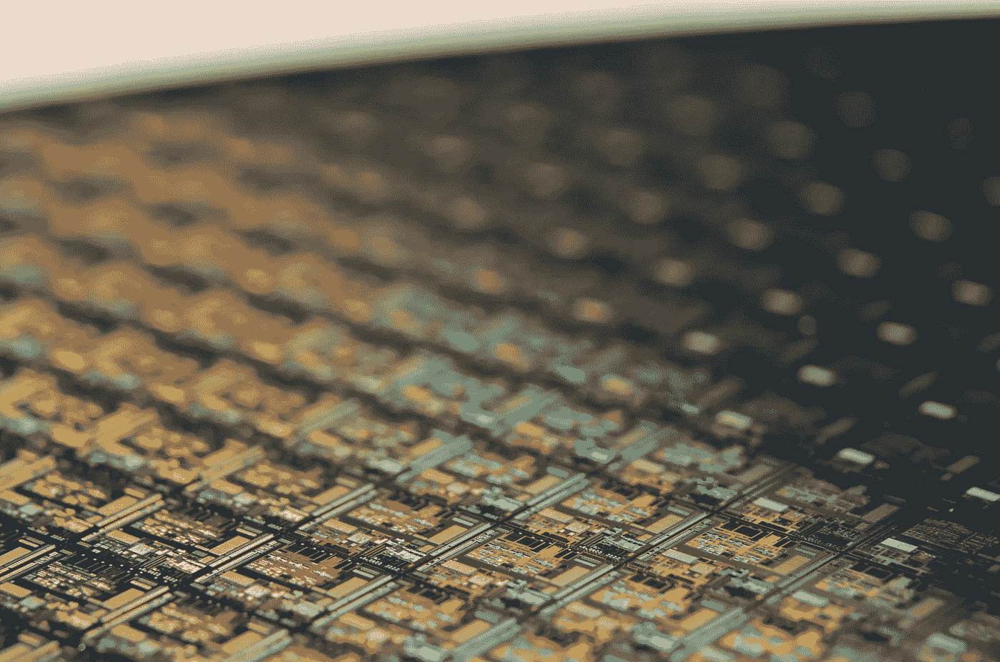
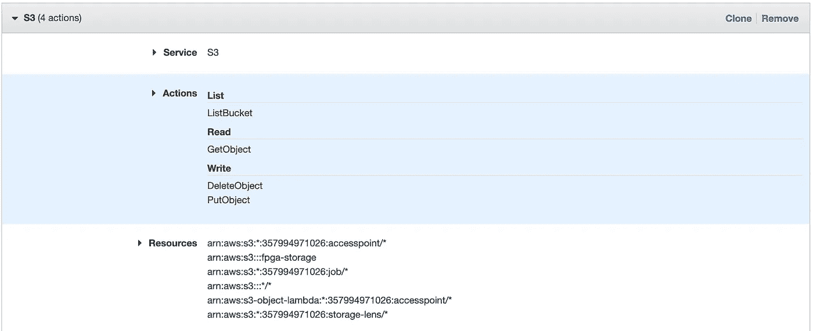
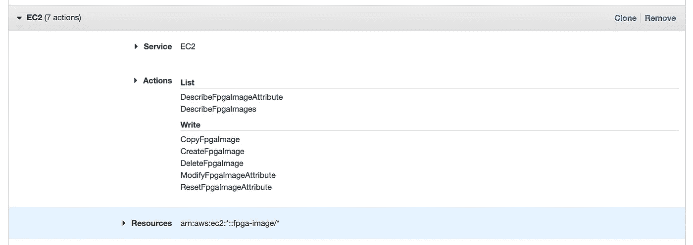
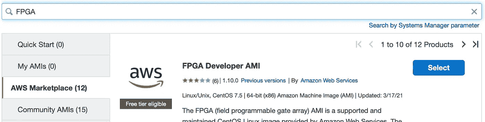

# 基于 FPGAs 的神经网络推理

> 原文：<https://towardsdatascience.com/neural-network-inference-on-fpgas-d1c20c479e84?source=collection_archive---------12----------------------->

## 如何在 AWS 上从头开始构建和实现 FPGA 应用

**作者:** [丹尼尔·苏斯](https://www.linkedin.com/in/daniel-suess/)[高级机器学习工程师马克斯·凯尔森](https://maxkelsen.com)



劳拉·奥克尔在 [Unsplash](https://unsplash.com/s/photos/chip-neon?utm_source=unsplash&utm_medium=referral&utm_content=creditCopyText) 上的照片

与传统的云部署相比，将深度学习模型直接部署到边缘设备具有许多优势:消除通信可以减少延迟和对网络连接的依赖；由于数据从不离开设备，边缘推断有助于维护用户隐私；由于云资源的数量急剧减少，边缘推理也可以降低持续成本。

运行在边缘设备上的 ML 的激增既推动了专用硬件加速器(如 GPU、ASICs 或 FPGAs)的发展，也受其推动。对于每种硬件类型的优缺点的概述，请参见[本系列文章](https://blog.inten.to/hardware-for-deep-learning-current-state-and-trends-51c01ebbb6dc)或[本文](/deep-learning-hardware-know-your-options-9e95026b5d5e)。

在这篇文章中，我们将讨论如何在 FPGA 器件上运行简单神经网络的推理。主要重点将是更好地了解 FPGA 编程，并略微降低其传统的高准入门槛。

这篇文章将通过一个在 2 层全连接网络上运行推理的[简单示例应用](https://github.com/dsuess/nn-on-fpgas/tree/part-1-v1)来回顾基本开发。通过使用 AWS 的 F1 实例及其提供的 AMI 和所有必要的软件，您需要做的就是创建一个 AWS 帐户。稍加修改，该示例也可以在大多数 Xilinx FPGAs 上运行。

# FPGAs 编程

使用 FPGA 的主要挑战之一是，它们的编程模型与大多数其他“编程”有着根本的不同:对 FPGA 编程意味着对实际硬件编程，而不是生成由处理单元运行的指令。要理解这一点，我们首先需要了解什么是 FPGA。

高度简化后，FPGA 由许多可编程逻辑模块组成，例如查找表(LUT)、存储器以及这些构建模块之间的可重新配置连接。重新配置逻辑块的行为和它们之间的连接允许我们实现不同的数字电路。因此，最终的“程序”可以看作是由 FPGA 实现的原理图。

传统上，FPGAs 使用硬件描述语言(如 Verilog 或 VHDL)编程。这些与流行的编程语言有很大不同，这是 FPGA 编程门槛高的一个主要原因。

随着高级综合(HLS)工具的引入，这一障碍已经大大降低，这些工具允许用 C/C++等更主流的语言编写 FPGAs 代码。

通常情况下，这种抽象性和简洁性的提高往往是以电路效率的降低为代价的。因此，对于性能关键的实现，对底层硬件层的良好理解是必不可少的。

对于我们的第一个实现，我们将使用 Xilinx 的基于 OpenCL 的 Vitis 平台:OpenCL 设备(如 FPGA)执行称为“内核”的小程序。这些内核由主机设备(CPU)管理和启动。通过使用 HLS 实现这些内核，FPGA 的实现看起来非常接近 CPU 的类似实现。

> 主要区别在于，FPGA 内核不仅仅是像在 CPU 上一样处理的指令，而是作为设备上的数字电路来实现。

所以举个例子，如果我们想并行运行部分代码，不能只在多核上并行运行；相反，我们需要在 FPGA 上复制物理电路。

请注意，Xilinx' [Vitis AI](https://github.com/Xilinx/Vitis-AI) 平台为常见的网络架构(如用于图像分类的 Resnets)和单级对象检测器(如 SSD 和 Yolo)提供了现成的运行时。然而，在写这篇文章的时候，AWS F1 实例[还不被支持](https://github.com/Xilinx/Vitis-AI/issues/2)。

将来，我想看看必要层的简单实现在效率上能有多接近这样的参考实现。

# 设置开发环境

这篇文章附带的代码可以在 [GitHub](https://github.com/dsuess/nn-on-fpgas/tree/part-1-v1) 上找到。在第一个技术部分，我们将讨论如何运行它。由于必要的软件似乎不是免费提供的，我们将在 AWS 上使用 [FPGA 开发者 AMI](https://aws.amazon.com/marketplace/pp/Amazon-Web-Services-FPGA-Developer-AMI/B06VVYBLZZ) 。

你将需要一个 AWS 帐户支付设置，因为自由层的机器是不够强大的。

本例中的构建脚本基于[官方 Vitis 教程](https://github.com/Xilinx/Vitis-Tutorials)。然而，这些在 AWS 的 FPGA 环境中不能开箱即用，需要进行两项更改:

*   需要将`[PLATFORM](https://github.com/Xilinx/Vitis-Tutorials/blob/master/Hardware_Accelerators/Introduction/03-Algorithm_Acceleration/docs/module1_baseline/Makefile#L36)`变量设置为`[$AWS_PLATFORM](https://github.com/dsuess/nn-on-fpgas/blob/master/CMakeLists.txt#L14)`——由 FPGA AMI 设置的环境变量，以及
*   使用的 FPGA 内存条需要在硬件仿真模式下[更改](https://github.com/dsuess/nn-on-fpgas/blob/master/src/matrix.hpp#L22)。

最后一句话已经让我们看到了使用 FPGAs 的一个要点:为实际硬件设备合成程序可能需要很长时间，甚至几个小时，即使是简单的设计也是如此。这就是为什么我们将广泛使用两种不同类型的仿真。

首先，在软件仿真模式下，内核被编译成本机代码，直接在 CPU 上运行。一方面，这使得编译速度非常快，并且在特性开发期间实现快速开发周期是理想的。另一方面，由于这个步骤不需要实际的原理图合成，某些错误不会在软件仿真中出现。

第二种是硬件仿真模式，在仿真设备上运行实际的合成原理图。由于这种模拟非常详细，硬件模拟运行起来比软件模拟慢得多。它也增加了开发周期的额外编译时间，但仍然比实际 FPGA 的编译快得多。

从好的方面来看，硬件仿真不仅允许功能测试，还允许探测在物理设备上运行的性能特征和资源需求。

由于这两种仿真模式都不需要 FPGA，大多数开发工作可以(也应该)在一台强大的纯 CPU 机器上完成，从而节省了大量资金。我们只需要一个 FPGA 实例进行最后的测试。

# 设置 EC2 实例

如前所述，大多数开发工作不需要 FPGA 实例，可以在通用实例类型上完成。按照本教程，您将需要一个 S3 桶(在这里命名为`fpga-storage`)和一个 EC2 实例，它具有:

*   AWS FPGA 开发人员 AMI 加载，
*   至少 16GB 的 RAM(例如，`m5.xlarge`实例类型或更大以加速仿真)，以及
*   对 S3 存储桶具有读/写访问权限的 IAM 角色，并具有以下权限:

`DescribeFpgaImageAttribute`

`DescribeFpgaImages`

`CopyFpgaImage`

`CreateFpgaImage`

`DeleteFpgaImage`

`ModifyFpgaImageAttribute`

在本节的剩余部分，我们将提供如何启动所需实例的分步说明。有经验的 AWS 用户可以跳到下面的**设置环境**部分。

1.从 [S3 管理控制台](https://s3.console.aws.amazon.com/s3/home)创建一个新的 S3 桶。将名称设置为`fpga-storage`，并保留其余选项的默认值。

2.从 [IAM 策略创建](https://console.aws.amazon.com/iam/home#/policies)创建新策略。

3.对于服务，选择“S3”；对于操作，选择“ListBucket”、“GetObject”、“PutObject”和“DeleteObject”，对于资源，为除“Bucket”之外的所有字段选择“Any”，对于“bucket”，您将 bucket-name 设置为“fpga-storage”:



*S3 服务的策略设置*

4.单击“添加附加权限”并为“EC2”服务添加以下权限(也在上面列出):



*EC2 服务的策略设置*

5.继续浏览各个屏幕，直到您到达“审查政策”屏幕。输入“FpgaDevPolicy”作为名称，并完成角色创建。

6.您现在可以使用 [IAM 角色创建](https://console.aws.amazon.com/iam/home#/roles)来创建一个新角色。

7.从下一个屏幕中选择“AWS 服务”→“EC2”作为可信实体。

8.从列表中选择新创建的“FpgaDevPolicy ”,并继续操作，直到到达“查看角色”屏幕。输入名称“FpgaDevRole”并完成角色创建。

9.从 [EC2 控制台](https://console.aws.amazon.com/ec2/v2/home#Instances:)中，点击“启动实例”。

10、在 AMI 搜索栏中，输入“FPGA”，从左侧菜单中选择 AWS Marketplace。从列表中选择 AWS 的“FPGA Developer AMI”。



*选择 FPGA AMI*

11.继续执行实例选择步骤。选择`m5.xlarge`实例类型并点击“下一步:配置实例细节”按钮。

12.为 IAM 角色条目选择创建的“FpgaDevRole”。单击“添加存储”。

13.删除额外的 EBS 卷，并将根分区的大小增加到 200GB。

14.单击“查看并启动”和“启动实例”。

15.如有必要，[使用 AWS 中显示的公共 IP 将 ssh 认证](https://docs.aws.amazon.com/AWSEC2/latest/UserGuide/ec2-key-pairs.html)和 ssh 设置到新实例中:

```
*$* ssh -i ~/.ssh/PATH_TO_PRIVATE_KEY centos@xxx.xxx.xxx.xxx
```

# 设置环境

现在我们已经使用 FPGA 开发工具连接到 EC2 实例，我们需要安装一些额外的要求:

```
*$ sudo* yum *install* cmake3 jq
*$* git clone https://github.com/aws/aws-fpga ~/src/project_data/aws-fpga
```

第二行从 AWS 的官方 Github repo 中克隆了一个 repo 和一些额外的助手脚本。我们主要需要它通过运行以下命令在机器上设置开发环境:

```
*$ source* ~/src/project_data/aws-fpga/vitis_setup.sh
```

> 注意，上述命令需要在每次登录机器时运行**，因为它修改了 shell 环境。**

# 运行示例

我们现在准备在这台机器上运行[示例](https://github.com/dsuess/nn-on-fpgas/tree/part-1-v1)。为此，我们将遵循正常的开发周期:软件仿真、硬件仿真，最后为硬件设备编译。要遵循以下示例，您需要克隆示例 repo:

```
$ git clone https://github.com/dsuess/nn-on-fpgas -b part-1-v1 --recursive && cd nn-on-fpgas
```

# 软件仿真

运行这些示例的最快方法是使用软件仿真。这将内核编译成本机代码，完全避开了电路合成。

在构建脚本中，编译模式是通过`TARGET`变量控制的，该变量有三个可能的值`sw_emu`、`hw_emu`和`hw`。要在软件仿真中编译示例，我们可以简单地运行:

```
*$ mkdir* build_sw **&&** *cd* build_sw **&&** cmake3 -DTARGET**=**sw_emu .. **&&** make main kernels tests emconfig.json
```

如果该命令引发错误，请确保您遵循了上面**设置环境**部分的说明。这将在`build_sw`子目录中构建所有必需的目标:

*   `main`构建示例程序，
*   `tests`为内核构建测试套件，
*   `kernels`构建内核二进制文件`xclbin/kernels.xclbin`，并且
*   `emconfig.json`包含目标硬件平台的信息。

内核(即应该在 FPGA 上运行的基本数学运算)由应用在运行时加载。

我们现在可以运行测试或示例应用程序了:

```
*$ XCL_EMULATION_MODE***=**sw_emu ./tests
*$ XCL_EMULATION_MODE***=**sw_emu ./main
```

后者应该在最后一行打印`0 1 2 2 4 5 6 7 8 9`。这些是模型在对类别 0 到 9 的图像运行时的类别预测。该模型的精确度约为 94%,这是我们看到标签 3 错误的原因。

# 硬件仿真

为硬件仿真构建内核只需要改变`TARGET`变量:

```
*$ mkdir* build_hw **&&** *cd* build_hw **&&** cmake3 -DTARGET**=**hw_emu .. **&&** make kernels tests emconfig.json
```

该命令应该从 git repo 的根目录运行。请注意，与软件仿真模式相比，编译需要更长的时间。运行示例也是如此，这就是为什么我们只在硬件仿真中运行测试:

```
*XCL_EMULATION_MODE***=**hw_emu ./tests
```

除了二进制文件之外，硬件仿真还会生成关于资源利用的详细报告，并建议在`_x/reports`中进行更改。我们将在本系列的后面部分回到这些诊断。

# 在 FPGA 上运行

最后，我们现在可以在实际的 FPGA 硬件设备上运行示例了:

```
*$ mkdir* build **&&** *cd* build **&&** cmake3 -DTARGET**=**hw .. **&&** make kernels
```

这一步只会在`xclbin/kernels.xclbin`中构建内核二进制文件，可能需要一个多小时才能完成。如果你不想等那么久，我们提供一个二进制文件的完成版本作为 Github 版本。

在标准的 Xilinx 系统上，我们可以直接从 xclbin 文件运行内核。然而，AWS 需要一个额外的步骤，即把 xclbin 转换成亚马逊 FGPA 图像(AFI)。构建步骤在[官方 AWS FPGA 报告](https://github.com/aws/aws-fpga/blob/master/Vitis/README.md#build-the-host-application-and-xilinx-fpga-binary)中概述。

首先，我们需要将用于以下命令的默认区域设置为支持 FPGA 实例的区域(这里是`us-east-1`)

```
*$* aws configure *set* default.region us-east-1
```

现在我们可以创建 AFI 映像，并将其保存到我们在初始环境设置中创建的 S3 存储桶`fpga-storage`:

```
*$ $VITIS_DIR*/tools/create_vitis_afi.sh -xclbin**=**xclbin/kernels.xclbin \
		-o**=**xclbin/kernels \
		-s3_bucket**=**fpga-storage -s3_dcp_key**=**kernels -s3_logs_key**=**logs
```

这将创建一个 xclbin 文件`xclbin/kernels.awsxclbin`，在 F1 实例上运行时，它应该由运行时加载，而不是由`xclbin/kernels.xclbin`加载。在我们的标准运行时中，这是基于编译时标志自动完成的。我们将该文件复制到 S3 存储桶中以备后用。

```
*$* aws s3 *cp* xclbin/kernels.awsxclbin s3://fpga-storage/
```

此外，应该创建一个包含 AFI ID 的`*_afi_id.txt`文件。使用 AFI ID，我们可以检查在后台运行的转换过程的状态:

```
*$ export AFI_ID***=**$(*cat* *****_afi_id.txt | jq -r ".FpgaImageId")
*$* aws ec2 describe-fpga-images --fpga-image-ids *$AFI_ID*
```

注意，当多次运行`create_vitis_afi.sh`脚本时，目录中将会有多个符合第一个命令的 glob-pattern 的文件。要么手动选择正确的选项，要么删除所有选项并重新运行脚本。

一旦 describe-fpga-images 命令输出的状态代码从“pending”变为“available”，我们就可以在 fpga 硬件设备上运行这个示例了。

为此，遵循上面的**设置 EC2 实例**一节中概述的设置步骤，但是选择 F1 实例类型。在克隆了示例 repo 之后，我们需要构建除内核之外的所有东西:

```
*$ mkdir* build **&&** *cd* build **&&** cmake3 -DTARGET**=**hw .. **&&** make emconfig.json main tests
```

我们可以简单地从 S3 复制 AFI 内核二进制文件:

```
*$ mkdir* xclbin **&&** aws s3 *cp* s3://fpga-storage/kernels.awsxclbin xclbin/
```

并在 FPGA 上运行测试和示例应用程序:

```
*$* ./tests
*$* ./main
```

# 履行

既然我们已经介绍了如何构建用于仿真和硬件部署的[示例](https://github.com/dsuess/nn-on-fpgas/tree/part-1-v1)，我们将回顾一下在 FPGAs 上运行推理的 2 层全连接网络的简单基线实现。

# 代码走查

我们试图运行的[模型](https://github.com/dsuess/nn-on-fpgas/blob/4811b23d4fd4300c53a2f7638d5b9deee93a051d/train.py)非常简单。两个完全连接的层；第一层重新激活，第二层(也是最后一层)激活 softmax。

```
**class** **FCNN:**
    **def** **__init__(***self***,** input_size**:** *int***,** num_classes**:** *int***):**
        *self***.**layer1 **=** Dense**(**input_size**,** 64**)**
        *self***.**layer2 **=** Dense**(**64**,** num_classes**)****def** **__call__(***self***,** x**:** Tensor**)** **->** Tensor**:**
        y **=** x
        y **=** *self***.**layer1**(**y**).**relu6**()**
        **return** *self***.**layer2**(**y**).**logsoftmax**()**
```

这意味着我们需要实现以下三个内核:

*   矩阵-矩阵乘法
*   偏置相加+ ReLu 非线性
*   偏置相加+ softmax 非线性

> 将矩阵乘法和偏置加法操作分成两个内核的原因是，前者可能会成为最大的性能瓶颈。

因此，将它们分开会使以后用不同的矩阵乘法实现进行实验更容易。

此外，将偏置相加和非线性函数融合到单个内核中可能有利于性能。这两种操作都相对较快，因此启动内核的额外开销会更明显。

这两种操作还具有低的计算-存储器-传输比，因此，通过在一次通过中执行偏置相加和非线性，受益于减少存储器访问。

在`[net.hpp](https://github.com/dsuess/nn-on-fpgas/blob/f301d3053bbc0ab7baea4ea92b440add63734369/src/net.hpp)`文件中的 C++实现也复制了模型的结构，我们将在后面介绍。

# 内核实现

我们将编写的第一个也是最简单的内核是 bias + ReLu6 内核。由于 HLS 使用 C++并且不包括任何可选的 FPGA 特定代码，第一个[基线实现](https://github.com/dsuess/nn-on-fpgas/blob/4811b23d4fd4300c53a2f7638d5b9deee93a051d/src/bias_relu6_kernel.cpp)看起来像标准 C++代码:

```
**extern** "C" **void** **bias_relu6_kernel(float** ***const** activation**,** **const** **float** ***const** bias**,** **const** uint batch_size**,** **const** uint dim**)**
**{**
   **for** **(**uint b **=** 0**;** b **<** batch_size**;** b**++)**
   **{**
      **for** **(**uint d **=** 0**;** d **<** dim**;** d**++)**
      **{**
         **const** uint ia **=** dim ***** b **+** d**;**
         activation**[**ia**]** **=** relu6**(**activation**[**ia**]** **+** bias**[**d**]);**
      **}**
   **}**
**}**
```

bias + softmax [内核](https://github.com/dsuess/nn-on-fpgas/blob/4811b23d4fd4300c53a2f7638d5b9deee93a051d/src/bias_softmax_kernel.cpp)的实现非常相似。注意，结果是使用`activation`作为输入和输出就地计算的。这对于矩阵乘法核来说是不可能的，因为输入和输出的形状可能不同。

因此，我们需要在内核之外分配足够的内存，并使用额外的`out`参数传入一个指针。使用三个 for 循环的简单实现当然不是最佳的，稍后需要重新考虑:

```
**extern** "C" **void** **matmul_kernel(const** **float** ***const** matrixA**,** **const** **float** ***const** matrixB**,** **const** uint rowsA**,** **const** uint colsA**,** **const** uint colsB**,** **float** ***const** out**)**
**{**
   **for** **(**uint i **=** 0**;** i **<** rowsA**;** **++**i**)**
   **{**
      **for** **(**uint j **=** 0**;** j **<** colsB**;** **++**j**)**
      **{**
         *// Nulling result here causes issues when running in hw-emu mode.*
         *// Looks like io isn't updated "in time"*
         **const** uint io **=** colsB ***** i **+** j**;**
         **for** **(**uint k **=** 0**;** k **<** colsA**;** **++**k**)**
         **{**
            **const** uint ia **=** colsA ***** i **+** k**;**
            **const** uint ib **=** colsB ***** k **+** j**;**
            out**[**io**]** **+=** matrixA**[**ia**]** ***** matrixB**[**ib**];**
         **}**
      **}**
   **}**
**}**
```

输出数组`out`应该在内核之外初始化为零，并且所有的数组都假定以行优先的顺序存储它们的元素。

# 主机应用程序

到目前为止，我们已经实现了将在 FPGA 器件上“运行”的所有代码。剩下的部分构成了代码的大部分，用于主机设备(CPU)和内存管理以及内核调度。

`[Matrix](https://github.com/dsuess/nn-on-fpgas/blob/4811b23d4fd4300c53a2f7638d5b9deee93a051d/src/matrix.hpp#L37)` [类](https://github.com/dsuess/nn-on-fpgas/blob/4811b23d4fd4300c53a2f7638d5b9deee93a051d/src/matrix.hpp#L37)抽象出内存管理以及主机设备内存传输。使用 Vitis 的一个主要限制是，复制到 FPGA 器件或从 FPGA 器件复制的所有存储器都需要在主机器件上按页对齐，即起始地址和存储器大小都必须能被页大小整除。为此，我们使用一个[定制分配器](https://github.com/dsuess/nn-on-fpgas/blob/4811b23d4fd4300c53a2f7638d5b9deee93a051d/src/matrix.hpp#L27)，其中`DEFAULT_ALIGNMENT`被硬编码为页面大小`4096`:

```
**template** **<typename** **T>**
T ***aligned_alloc(**std**::size_t** num**,** std**::size_t** alignment **=** DEFAULT_ALIGNMENT**)**
**{**
    **void** *****ptr **=** *nullptr***;**
    **if** **(**posix_memalign**(&**ptr**,** alignment**,** num ***** **sizeof(**T**)))**
    **{**
        **throw** std**::**bad_alloc**();**
    **}**
    **return** **reinterpret_cast<**T ***>(**ptr**);**
**}**
```

函数`[to_device](https://github.com/dsuess/nn-on-fpgas/blob/4811b23d4fd4300c53a2f7638d5b9deee93a051d/src/matrix.hpp#L178)`和`[to_cpu](https://github.com/dsuess/nn-on-fpgas/blob/4811b23d4fd4300c53a2f7638d5b9deee93a051d/src/matrix.hpp#L196)`处理主机和设备之间的内存传输。我们通过实现特殊的构造函数和`=`-操作符来实现`Matrix`类的移动语义，以允许从函数中自由复制返回值。

最后，`[matrix.hpp](https://github.com/dsuess/nn-on-fpgas/blob/4811b23d4fd4300c53a2f7638d5b9deee93a051d/src/matrix.hpp#L210)`底部的两个助手函数为我们抽象了 OpenCL 内核调度开销。例如，`apply_matmul`函数将`matmul_kernel`应用于两个`Matrix`实例:

```
std**::**pair**<**Matrix**,** cl**::**Event**>** apply_matmul**(**Matrix **&**matrixA**,** Matrix **&**matrixB**,** cl**::**Kernel **&**kernel**,** std**::**vector**<**cl**::**Event**>** *****wait_on **=** *NULL***,** DeviceHandle **&**handle **=** HANDLE**)**
**{**
    Matrix result **=** Matrix**::**constant**(**matrixA**.**rows**,** matrixB**.**cols**,** 0.0**,** 4096**);**
    result**.**to_device**(**handle**);**
    kernel**.**setArg**(**0**,** matrixA**.**get_buffer**());**
    kernel**.**setArg**(**1**,** matrixB**.**get_buffer**());**
    kernel**.**setArg**(**2**,** matrixA**.**rows**);**
    kernel**.**setArg**(**3**,** matrixA**.**cols**);**
    kernel**.**setArg**(**4**,** matrixB**.**cols**);**
    kernel**.**setArg**(**5**,** result**.**get_buffer**());**cl**::**Event event**;**
    handle**.**q**.**enqueueTask**(**kernel**,** wait_on**,** **&**event**);**
    **return** std**::**make_pair**(**std**::**move**(**result**),** event**);**
**}**
```

由于 OpenCL 提供了一个异步 API，我们不只是简单地调用内核，而是将运行内核的任务放入一个[命令队列](https://livebook.manning.com/book/opencl-in-action/chapter-7/)。该任务可能依赖于其他先前排队的任务，这可以使用(可选)`wait_on`参数来表示。

对新调用的任务的引用作为类型`cl::Event`的第二个返回值返回。只有在这个任务被处理之后，返回值`result`才包含计算值。

要了解这是如何使用的，请看一下网络的[正向传递](https://github.com/dsuess/nn-on-fpgas/blob/f301d3053bbc0ab7baea4ea92b440add63734369/src/net.hpp#L40):

```
Matrix **operator()(**Matrix **&**input**)**
    **{**
        std**::**vector**<**cl**::**Event**>** events**;**
        events**.**resize**(**3**);**
        Matrix y**;**
        std**::**tie**(**y**,** events**[**0**])** **=** apply_matmul**(**input**,** weight1**,** MATMUL_KERNEL**);**
```

第一层中的矩阵乘法独立于任何运算。因此，我们不传递该行中的`wait_on`参数。然后将 event-result 分配给`events`向量的第一个条目，并复制到下面的行中，以确保`events`的每个条目都是有效的`cl::Event`实例:

```
events**[**1**]** **=** events**[**0**];**
        events**[**2**]** **=** events**[**0**];**
        events**[**1**]** **=** apply_bias**(**y**,** bias1**,** BIAS_RELU6_KERNEL**,** **&**events**);**
```

指向这个向量的指针然后被传递到第一层的偏置激活部分，因为它依赖于先前的矩阵乘法来完成。此时只分配一个大小为 1 的向量也可以达到类似的效果，但是在每次额外的操作之后，我们必须调整向量的大小。接下来的几行相应地应用了网络的第二层。

```
std**::**tie**(**y**,** events**[**2**])** **=** apply_matmul**(**y**,** weight2**,** MATMUL_KERNEL**,** **&**events**);**
        apply_bias**(**y**,** bias2**,** BIAS_SOFTMAX_KERNEL**,** **&**events**);**
        **return** y**;**
    }
```

现在我们准备看看 [main.cpp](https://github.com/dsuess/nn-on-fpgas/blob/f301d3053bbc0ab7baea4ea92b440add63734369/src/main.cpp) 中的高级实现:

```
**int** **main(int** argc**,** **const** **char** *****argv**[])**
**{**
    init_kernels**();****auto** model **=** FCNN**(**"weights/"**);**
    **auto** input **=** Matrix**::**from_npy**(**"weights/samples.npy"**);**
    input**.**to_device**();**
```

对`[init_kernels](https://github.com/dsuess/nn-on-fpgas/blob/f301d3053bbc0ab7baea4ea92b440add63734369/src/utils.hpp#L40)`的第一次调用从一个单独的二进制文件加载 OpenCL 内核，并将对它们的引用存储在全局变量中。接下来，我们从单独的`.npy`文件中加载模型权重，每个张量一个。最后，我们还加载将输入到模型中的输入样本。这些`.npy`文件由[训练脚本](https://github.com/dsuess/nn-on-fpgas/blob/f301d3053bbc0ab7baea4ea92b440add63734369/train.py#L97)准备，并存储为 float32 数组。

接下来，我们运行模型，等待所有 OpenCL 事件完成，并将结果从设备复制回主机:

```
**auto** result **=** model**(**input**);**finish_cl_queue**();**
    result**.**to_cpu**();**
    finish_cl_queue**();**
```

最后，对于批处理中的每个元素，我们计算置信度得分的 argmax，以获得最终的预测，并将其打印到 stdout:

```
*// print argmax result*
    **for** **(int** i **=** 0**;** i **<** result**.**rows**;** i**++)**
    **{**
        **float** minval **=** **-**1**;**
        **int** idx **=** **-**1**;****for** **(int** j **=** 0**;** j **<** result**.**cols**;** j**++)**
        **{**
            **auto** val **=** result**(**i**,** j**);**
            **if** **(**minval **<** val**)**
            **{**
                idx **=** j**;**
                minval **=** val**;**
            **}**
        **}**std**::**cout **<<** idx **<<** " "**;**
    **}**
    std**::**cout **<<** std**::**endl**;**
}
```

我们希望你喜欢这篇文章。在随后的帖子中，我们将研究这种基线实现的性能特征，以及如何改善延迟和减少资源需求。