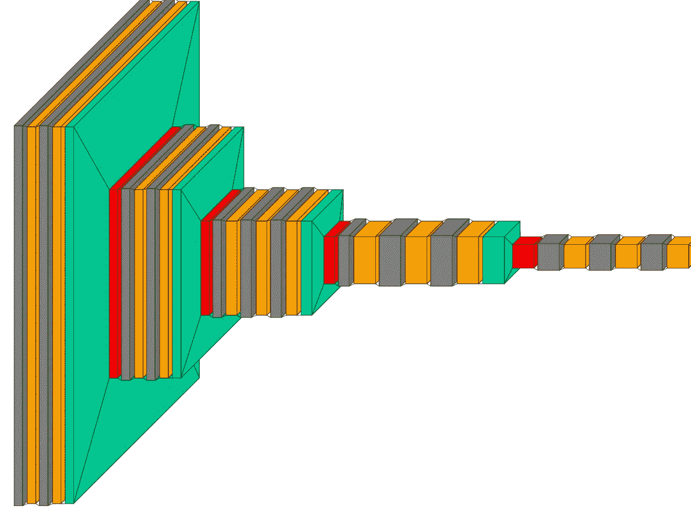
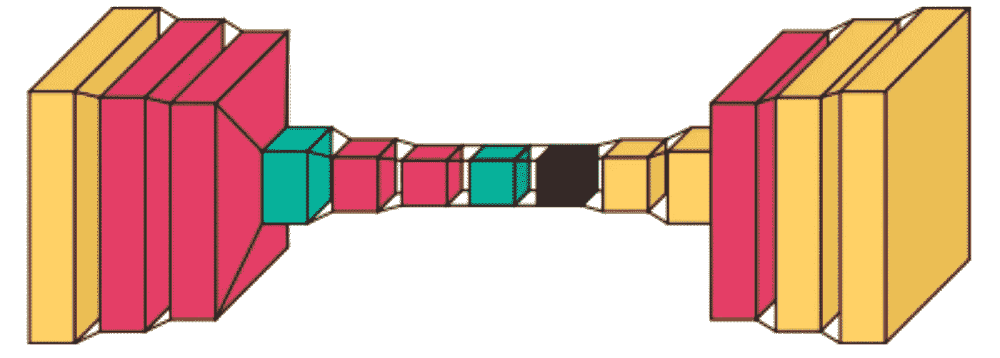

# 神经网络模型体系结构可视化

> 原文：<https://towardsdatascience.com/neural-network-model-architecture-visualization-3c2fae610330?source=collection_archive---------15----------------------->

## 利用 Visualkeras 可视化 keras 模型



神经网络(来源:作者)

神经网络是机器学习的一个子集，受人脑的启发，用于解决人工智能相关的问题。它的灵感来自于人类大脑中发现的神经元，这是一个使用不同神经元连接的网络，称为神经网络。这是数据科学的一个高级领域，通常有助于解决与人工智能相关的问题。

可视化神经网络有助于理解不同层如何相互连接，以及每层之间有多少神经元。这是理解黑盒模型从内部看起来是什么样子的最佳方式之一。可视化也可以通过向某人展示模型来帮助他们理解神经网络的不同层实际上是如何相互连接的。

Visualkeras 是一个开源 Python 库，用于创建神经网络模型可视化。它是理解不同层如何连接的最佳库之一。

在本文中，我们将探索 Visualkeras 并使用它们创建一些可视化效果。

让我们开始吧…

# 安装所需的库

我们将从使用 pip 安装来安装 Visualkeras 开始。下面给出的命令将使用 pip 安装 Visualkeras。

```
pip install visualkeras
```

# 导入所需的库

在这一步中，我们将导入创建可视化所需的所有库。

```
from tensorflow import keras
from tensorflow.keras import layers
import visualkeras
```

# 创建模型架构

现在，我们将从创建神经网络模型开始。我们将定义一个模型使用不同的层，如密集，展平，Conv2D 等。然后我们将在那之后可视化模型。

```
encoder_input = keras.Input(shape=(28, 28, 1), name='img')
x = layers.Conv2D(16, 3, activation='relu')(encoder_input)
x = layers.Conv2D(32, 3, activation='relu')(x)
x = layers.MaxPooling2D(3)(x)
x = layers.Conv2D(32, 3, activation='relu')(x)
x = layers.Conv2D(16, 3, activation='relu')(x)
encoder_output = layers.GlobalMaxPooling2D()(x)
encoder = keras.Model(encoder_input, encoder_output, name='encoder')visualkeras.layered_view(encoder, to_file='encoder.png')x = layers.Reshape((4, 4, 1))(encoder_output)
x = layers.Conv2DTranspose(16, 3, activation='relu')(x)
x = layers.Conv2DTranspose(32, 3, activation='relu')(x)
x = layers.UpSampling2D(3)(x)
x = layers.Conv2DTranspose(16, 3, activation='relu')(x)
decoder_output = layers.Conv2DTranspose(1, 3, activation='relu')(x)
autoencoder = keras.Model(encoder_input, decoder_output, name='autoencoder')
```

在这里，您可以看到我们如何使用不同的层来定义神经网络模型。现在让我们把这个模型形象化。

# 模型可视化

现在我们将使用 Visualkeras 来可视化模型。

```
visualkeras.layered_view(autoencoder, to_file="model.png')
```



模型(来源:作者)

这里我们可以看到神经网络的不同层是如何连接的。这有助于理解模型从内部看起来的样子。

尝试不同的模型，创建不同的可视化效果，让我知道你在回复部分的评论。

本文是与 [Piyush Ingale](https://medium.com/u/40808d551f5a?source=post_page-----3c2fae610330--------------------------------) 合作完成的。

# 在你走之前

***感谢*** *的阅读！如果你想与我取得联系，请随时通过 hmix13@gmail.com 联系我或我的* [***LinkedIn 个人资料***](http://www.linkedin.com/in/himanshusharmads) *。可以查看我的*[***Github***](https://github.com/hmix13)**简介针对不同的数据科学项目和包教程。还有，随意探索* [***我的简介***](https://medium.com/@hmix13) *，阅读我写过的与数据科学相关的不同文章。**