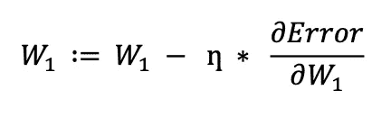
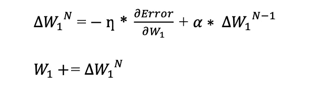
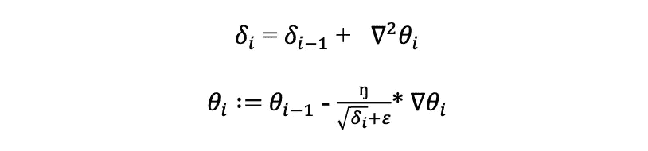
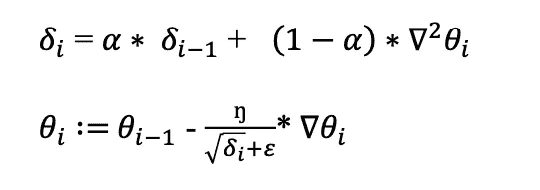
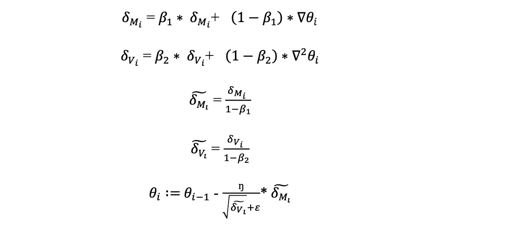

# Python 中从头开始的神经网络优化器

> 原文：<https://towardsdatascience.com/neural-network-optimizers-from-scratch-in-python-af76ee087aab?source=collection_archive---------7----------------------->

## 从数学和实践角度看非凸优化:Python 中的 SGD、SGDMomentum、AdaGrad、RMSprop 和 Adam

照片由 [Pexels](https://www.pexels.com/photo/person-writing-on-notebook-669615/?utm_content=attributionCopyText&utm_medium=referral&utm_source=pexels) 的 [Lukas](https://www.pexels.com/@goumbik?utm_content=attributionCopyText&utm_medium=referral&utm_source=pexels) 拍摄

本文将从头开始提供常见非凸优化器及其 Python 实现的简短数学表达式。理解这些优化算法背后的数学将在训练复杂的机器学习模型时启发你的观点。这篇文章的结构如下。首先，我将谈论特定的优化算法；然后，我会给出数学公式，并提供 Python 代码。所有算法都是纯 NumPy 实现的。下面是我们将要讨论的非凸优化算法

*   随机梯度下降
*   SGDMomentum
*   阿达格拉德
*   RMSprop
*   圣经》和《古兰经》传统中）亚当（人类第一人的名字

先说最简单的，随机梯度下降。

**随机梯度下降**

SGD 是在可微误差曲面上的迭代、非凸和一阶优化算法。它是梯度下降的随机估计，其中训练数据是随机化的。这是一种计算稳定、数学上成熟的优化算法。SGD 背后的直觉是，我们对我们可以优化的参数取目标函数的偏导数，这产生了它的梯度，它显示了误差损失的增加方向。因此，我们取该梯度的负值，在损失不增加的地方向前移动。为了确保稳定和较少振荡的优化，我们引入学习率参数ŋ，然后用ŋ.乘以梯度最后，从我们可以以迭代方式优化的参数中减去获得的值。下面是 SGD 更新公式和 Python 代码。

SGD Python 实现

**SGDMomentum**

在 SGD 的上下文中，我们不是计算损失函数的精确导数，而是以迭代的方式在小批量上逼近它。因此，不能确定模型在损失最小化的方向上学习。为了提出更稳定、方向感知和快速的学习，我们引入了 SGDMomentum，它将下一次更新确定为梯度和前一次更新的线性组合。因此，它也考虑了以前的更新。

总的来说，动量随机梯度下降比经典下降有两个优点:

*   快速收敛
*   少振荡训练

下面是 SGDMomentum 的公式和 Python 代码。

其中，α是动量系数，取值范围为[0，1]。α是一个指数衰减因子，它决定了当前梯度和早期梯度对权重变化的相对贡献[1]。在α = 0 的情况下，公式正好是纯 SGD。在α = 1 的情况下，优化过程考虑了先前更新的全部历史。

SGDMomentum Python 实现

从那时起，我们将在深度学习的背景下进入更复杂的优化器。有一些广泛使用的优化算法，如 AdaGrad、RMSprop 和 Adam。它们都是自适应优化算法，即它们通过重新安排学习速率来适应学习过程，以便模型能够更有效和更快地达到期望的全局最小值。下面是公式和实现。

阿达格勒

AdaGrad 优化算法跟踪平方梯度的总和，平方梯度衰减传播到其更新历史的参数的学习速率。其数学表达式为:

其中，𝛿𝑖是梯度平方的累积和，∇𝜃𝑖是𝜃𝑖的梯度，是网络的可配置参数，𝜀是防止零除的标量。当累积和逐渐增加时，更新项的分母同时增加，导致整个更新项ŋ * ∇𝜃𝑖.的减少随着更新项√𝛿𝑖+𝜀的减小，AdaGrad 优化变得更慢。因此，当接近收敛时，AdaGrad 被卡住，因为累积和逐渐增加，使得总的更新项显著减少。

AdaGrad Python 实现

**RMSprop**

RMSprop 优化算法通过将衰减率乘以累积和来解决 AdaGrad 的问题，并能够在某个点之后忘记累积和的历史，这取决于有助于收敛到全局最小值的衰减项。RMSprop 的数学表达式由下式给出:

𝛼是衰落的术语。因此，这个衰减项提供了更快的收敛，并且忘记了梯度历史的累积和，从而产生了更优化的解。

RMSprop Python 实现

**亚当**

Adam 优化算法是 RMSprop 的发展版本，它分别采用梯度的一阶和二阶动量。因此，Adam 还解决了在关闭全局最小值时收敛缓慢的问题。在这个版本的自适应算法中，数学表达式由下式给出:

其中，𝛿𝑀𝑖是梯度的一阶衰减累积和，𝛿𝑉𝑖是梯度的二阶衰减累积和，帽子符号𝛿𝑀和𝛿𝑉是𝛿𝑀和𝛿𝑉𝑖的偏差校正值，ŋ是学习率。

Adam Python 实现

**非凸优化在起作用**

在计算问题公式化的背景下，理解这些优化算法背后的直觉将启发学习曲线以及深度神经网络如何从复杂数据中学习。此外，理解这些非凸算法背后的直觉将有助于您在训练机器学习模型时选择您的优化算法。在本文中，我介绍了非凸算法及其简单 Python 实现的直观观点。例如，当涉及到训练大型深度神经网络时，您会有为什么许多研究人员和数据科学家使用 Adam 优化器而不是 SGD 的直觉，因为 Adam 优化器是自适应处理的，并且与 SGD 相反，具有一阶和二阶动量。文章到此结束。如果你有问题，请告诉我。以下是方法。

**我在这里**

[Twitter](https://twitter.com/canKocagil2)|[Linkedin](https://www.linkedin.com/in/can-kocagil-970506184/)|[Medium](https://cankocagil.medium.com/)|[Mail](mailto:cankocagil123@gmail.com)

**参考文献**

[1]维基百科撰稿人，《随机梯度下降》，*维基百科，自由百科，*2021 年 11 月 6 日 11:32 UTC，<[https://en.wikipedia.org/w/index.php?title = random _ gradient _ descent&oldid = 1053840730](https://en.wikipedia.org/w/index.php?title=Stochastic_gradient_descent&oldid=1053840730)>【2021 年 11 月 7 日访问】