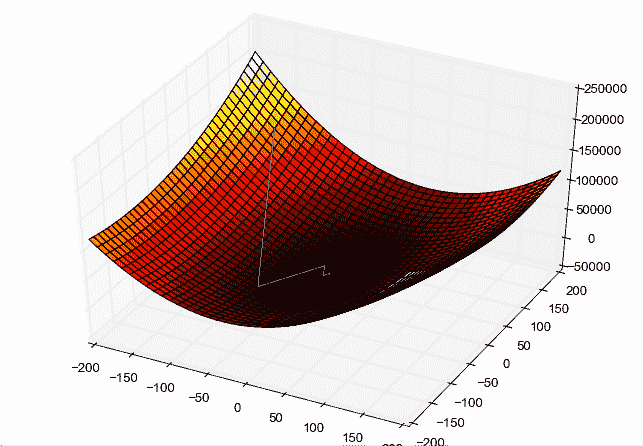
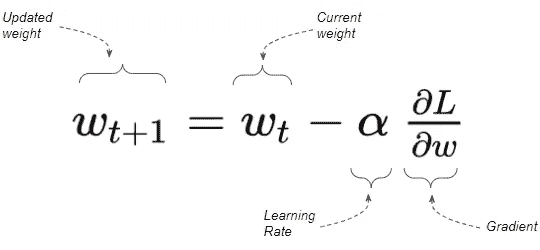
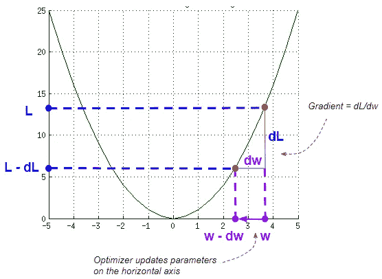
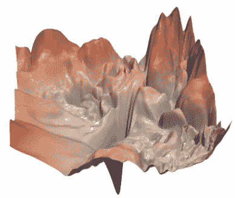
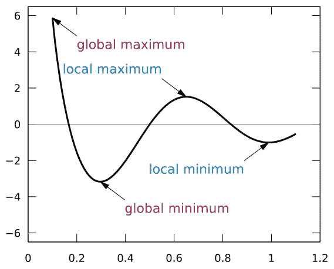
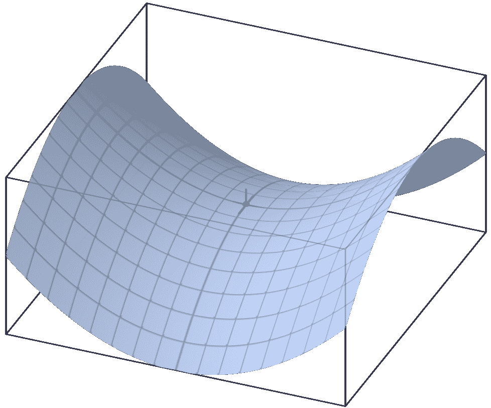
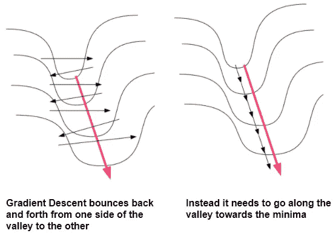
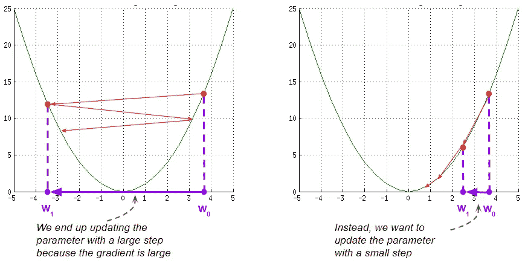

# 神经网络优化器变得简单:核心算法和为什么需要它们

> 原文：<https://towardsdatascience.com/neural-network-optimizers-made-simple-core-algorithms-and-why-they-are-needed-7fd072cd2788?source=collection_archive---------4----------------------->

## [动手教程](https://towardsdatascience.com/tagged/hands-on-tutorials)，直观的深度学习

## 一个温和的指导，用简单的英语介绍梯度下降优化器使用的基本技术，如 SGD，Momentum，RMSProp，Adam 和其他优化器

照片由[乔治·斯塔克波尔](https://unsplash.com/@stacksvrollin?utm_source=medium&utm_medium=referral)在 [Unsplash](https://unsplash.com?utm_source=medium&utm_medium=referral) 上拍摄

优化器是神经网络架构的关键组件。在训练期间，它们在帮助网络学会做出越来越好的预测方面发挥着关键作用。

他们通过找到最佳的模型参数集来做到这一点，如权重和偏差，以便模型可以为他们正在解决的问题产生最佳输出。

大多数神经网络最常用的优化技术是梯度下降。

大多数流行的深度学习库，如 Pytorch 和 Keras，都有大量基于梯度下降的内置优化器，如随机梯度下降(SGD)、Adadelta、Adagrad、RMSProp、Adam 等。

为什么有这么多不同的优化算法？我们如何决定选择哪一个？

如果你阅读每一个的文档，它们描述了一个如何更新模型参数的公式。每个公式是什么意思，有什么意义？

在我们准备深入研究数学之前，我这篇文章的目标是提供一些总体背景，并对每种算法如何适用有一些直觉。事实上，我不会在这里讨论公式本身，而是将它留给另一篇文章。

如果你对一般的神经网络架构感兴趣，我有一些你可能会喜欢的文章。

1.  [批处理规范—其工作原理](/batch-norm-explained-visually-how-it-works-and-why-neural-networks-need-it-b18919692739) *(显著稳定和加速模型训练的必要深度学习层)*
2.  [差分和自适应学习率](/differential-and-adaptive-learning-rates-neural-network-optimizers-and-schedulers-demystified-2edc589fa2c9) ( *优化器和调度器如何用于增强模型训练和调整超参数*)
3.  [图像字幕架构](/image-captions-with-deep-learning-state-of-the-art-architectures-3290573712db) *(具有图像特征编码器、序列解码器和注意力的多模态 CNN 和 RNN 架构)*

# 梯度下降优化综述

## 损失曲线

让我们从梯度下降算法在工作中的典型 3D 图片开始。

梯度下降损失曲线([来源](https://upload.wikimedia.org/wikipedia/commons/5/5b/Gradient_descent_method.png)

此图显示了具有两个权重参数的网络:

*   水平面有两个轴，分别代表重量 w1 和 w2。
*   纵轴显示了每个权重组合的损失值

换句话说，曲线的形状显示了神经网络的“损失情况”。它绘制了不同权重值的损失，而我们保持输入数据集固定。

蓝线描绘了优化过程中梯度下降算法的轨迹:

*   它首先为两个权重选择一些随机值，然后计算损失值。
*   在每次迭代中，当它更新它的权重值，导致更低的损失(希望如此)时，它沿着曲线移动到更低的点
*   最后，它到达它的目标，也就是曲线底部损失最低的地方。

## 计算梯度

该算法基于在该点的损失曲线的梯度和学习率因子来更新权重。

梯度下降参数更新(图片由作者提供)

梯度测量斜率，是垂直方向的变化(*D1*)除以水平方向的变化( *dW* )。这意味着陡坡的坡度大，缓坡的坡度小。

计算渐变(图片由作者提供)

## 实践中的梯度下降

这些损失曲线有助于理解梯度下降的概念。然而，我们应该认识到这是一个理想化的场景，而不是现实的场景:

*   上图显示了一条平滑的凸形曲线。现实中，曲线非常坎坷。

神经网络损失图([来源](https://arxiv.org/pdf/1712.09913.pdf)，经郝莉许可)

*   其次，我们不会只有两个参数。往往有几千万或者几亿，在你的脑子里是不可能把那个形象化甚至想象出来的。

在每一次迭代中，梯度下降的工作原理是“向各个方向寻找它可以下降的最佳坡度”。那么，当最佳斜率(此时)不是最佳方向时，会发生什么呢？

*   如果景观向一个方向陡峭倾斜，但最低点在更平缓的斜坡方向，该怎么办？
*   或者如果周围的地形相当平坦呢？
*   或者，如果它掉进了一个深沟，它是如何爬出来的？

这些是给它带来困难的曲线的一些例子。接下来让我们看看这些。

# 梯度下降优化的挑战

## 局部最小值

在典型的损失曲线中，除了全局最小值之外，你可能还有许多局部最小值。因为梯度下降被设计成保持向下，一旦下降到局部最小值，它发现很难再爬上斜坡。所以它可能会停留在那里，而没有达到全局最小值。

局部最小值和全局最小值([来源](https://upload.wikimedia.org/wikipedia/commons/6/68/Extrema_example_original.svg)

## 鞍点

另一个关键挑战是“鞍点”的出现。这是在对应于一个参数的一个方向上曲线处于局部最小值的点。另一方面，在对应于另一参数的第二方向上，曲线处于局部最大值。

鞍点([来源](https://upload.wikimedia.org/wikipedia/commons/4/40/Saddle_point.png)

使鞍点变得棘手的是鞍点周围的区域通常相当平坦，就像一个高原。这意味着梯度接近于零。这导致优化器在第一个参数的方向上围绕鞍点振荡，而不能在第二个参数的方向上沿着斜坡下降。

因此，梯度下降错误地认为它已经找到了最小值。

## 沟壑

梯度下降也很难穿越峡谷。这是一个狭长的山谷，向一个方向陡峭地倾斜。山谷的两侧)和轻轻地(即。沿着山谷)在第二方向。通常这个峡谷通向最低处。由于难以导航，这种形状也被称为病理弯曲。

沟壑(经詹姆斯·马腾斯许可，改编自[来源](https://icml.cc/Conferences/2010/papers/458.pdf))

把这想象成一个狭窄的河谷，从山上缓缓向下倾斜，直到它在一个湖中结束。你要做的是迅速向下游的山谷方向移动。然而，梯度下降非常容易沿着山谷的两侧来回反弹，并朝着河流的方向非常缓慢地移动。

尽管他们继续使用梯度下降作为核心，但优化算法已经在普通梯度下降的基础上开发了一系列改进，以应对这些挑战。

# 梯度下降的第一个改进—随机梯度下降(SGD)

梯度下降通常意味着“整批梯度下降”，其中损失和梯度是使用数据集中的所有项目计算的。

相反，小批量随机梯度下降为每次训练迭代随机选择数据集的子集。

这种随机性有助于我们探索损失景观。

前面我们提到过，损失曲线是在保持输入数据集不变的情况下，通过改变模型参数获得的。但是，如果通过在每个小批量中选择不同的数据样本来改变输入，损失值和梯度也会改变。换句话说，通过改变输入数据集，每个小批量的损失曲线略有不同。

因此，即使你在一个小批次中被困在风景中的某个地方，你可能会在下一个小批次中看到不同的风景，这让你继续前进。这可以防止算法卡在景观的特定部分，尤其是在训练的早期阶段。

# 梯度下降的第二个改进—动量

## 动态调整更新量

梯度下降的一个棘手方面是处理陡坡。因为那里的坡度很大，当你真的想慢慢地、小心翼翼地前进时，你可以迈出一大步。这可能会导致来回跳动，从而减慢训练速度。

(图片由作者提供)

理想情况下，您希望动态地改变更新的幅度，以便能够对周围环境的变化做出响应。如果坡很陡，你要减速。如果斜坡非常平坦，你可能想要加速等等。

使用梯度下降，您可以根据梯度和学习率更新每一步的权重。因此，要修改更新的大小，您可以做两件事:

*   调整渐变
*   调整学习速度

## 动量 vs 新加坡元

动量是在 ie 上面做前者的一种方式。调整渐变。

使用 SGD，我们只查看当前的梯度，而忽略我们所走路径上所有过去的梯度。这意味着，如果损失曲线突然出现异常，你的轨迹可能会偏离轨道。

另一方面，当使用动量时，你让过去的梯度引导你的整体方向，这样你就能保持在正确的方向上。这让你可以利用到那时为止你所看到的周围景观的知识，并有助于抑制损失曲线中异常值的影响。

1.  第一个问题是你能追溯到过去多久？越往后走，受异常的影响就越小。
2.  其次，从过去开始的每一个梯度都同样重要吗？不久前的事情应该比遥远过去的事情更重要，这是有道理的。因此，如果环境的变化不是暂时的异常，而是真正的结构性变化，那么你确实需要对此做出反应，并逐渐改变你的路线。

动量算法使用梯度的指数移动平均值，而不是当前梯度值。

## 利用动量穿越峡谷

动量帮助您解决病理曲率的狭窄峡谷问题，其中一个权重参数的梯度非常高，而另一个参数的梯度非常低。

冲力帮助你穿越峡谷(经詹姆斯·马腾斯许可，由[来源](https://icml.cc/Conferences/2010/papers/458.pdf)修改)

通过使用动量，你可以抑制 SGD 可能出现的曲折振荡。

*   对于具有陡坡的第一个参数，大的坡度导致从山谷的一侧到另一侧呈“之”字形。然而，在下一步中，这被反方向的“曲折”抵消了。
*   另一方面，对于第二参数，来自第一步骤的小更新被第二步骤的小更新加强，因为它们在相同的方向上。这是你想去的山谷的方向。

使用不同公式的动量优化算法的一些示例如下:

*   带动量的 SGD
*   涅斯托罗夫加速梯度

# **梯度下降的第三个改进——修改学习率(基于梯度)**

如上所述，修改参数更新量的第二种方式是通过调整学习速率。

到目前为止，从一次迭代到下一次迭代，我们一直保持学习速率不变。其次，梯度更新对所有参数使用相同的学习速率。

然而，正如我们已经看到的，不同参数的梯度之间可能有很大的变化。一个参数可能有一个陡坡，而另一个有一个缓坡。

我们可以利用这一点来调整每个参数的学习速率。我们可以利用过去的梯度(分别针对每个参数)来选择该参数的学习速率。

有一些优化算法可以做到这一点，使用稍微不同的技术，如 Adagrad，Adadelta，RMS Prop。

例如，Adagrad 将过去的梯度平方并相加，对它们进行平均加权。RMSProp 也对过去的梯度求平方，但是使用它们的指数移动平均值，因此给予最近的梯度更多的重要性。

现在，通过平方梯度，它们都变成正的。方向一致。这否定了我们讨论动量的抵消效应，梯度方向相反。

这意味着对于一个斜率很陡的参数，梯度很大，梯度的平方也很大，并且总是正的，所以它们积累得很快。为了抑制这种情况，该算法通过将累积的平方梯度除以一个较大的因子来计算学习率。这使得它在陡坡上减速。

类似地，对于较浅的斜率，累积较小，因此该算法将累积的平方除以较小的因子来计算学习率。这提高了缓坡的学习速度。

一些优化器算法结合了这两种方法——如上修改学习率，以及使用动量来修改梯度。亚当和它的许多变种，羔羊。

# **梯度下降的第四个改进——修改学习率(根据你的训练进度)**

在前面的部分中，基于参数的梯度修改了学习率。此外，我们可以根据训练过程的进度调整学习速度。学习率是基于训练时期设置的，并且与该点的模型参数无关。

这其实根本不是优化人员做的。事实上，它是被称为调度器的神经网络的一个独立组件。我提到这一点是为了完整性，并显示与我们已经讨论过的优化技术的关系，但在这里不会进一步讨论它们。

# **结论**

我们现在了解了基于梯度下降的优化器所使用的基本技术，为什么使用它们，以及它们之间的关系。

这使我们能够更深入地研究许多具体的优化算法，并详细了解它们是如何工作的。我希望很快在另一篇文章中讨论这个问题…

最后，如果你喜欢这篇文章，你可能也会喜欢我关于变形金刚、音频深度学习和地理定位机器学习的其他系列。

 [## 直观解释的变压器(第 1 部分):功能概述

### NLP 变形金刚的简明指南，以及为什么它们比 rnn 更好，用简单的英语。注意力如何帮助…

towardsdatascience.com](/transformers-explained-visually-part-1-overview-of-functionality-95a6dd460452)  [## 音频深度学习变得简单(第一部分):最新技术

### 颠覆性深度学习音频应用和架构世界的温和指南。以及为什么我们都需要…

towardsdatascience.com](/audio-deep-learning-made-simple-part-1-state-of-the-art-techniques-da1d3dff2504)  [## 利用地理位置数据进行机器学习:基本技术

### 简明的地理空间数据特征工程和可视化指南

towardsdatascience.com](/leveraging-geolocation-data-for-machine-learning-essential-techniques-192ce3a969bc) 

让我们继续学习吧！