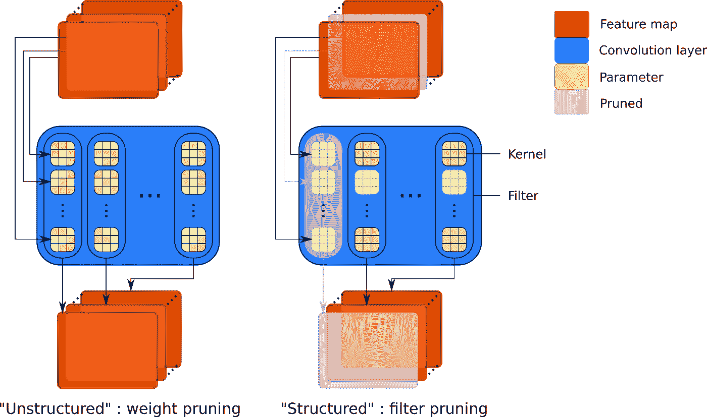
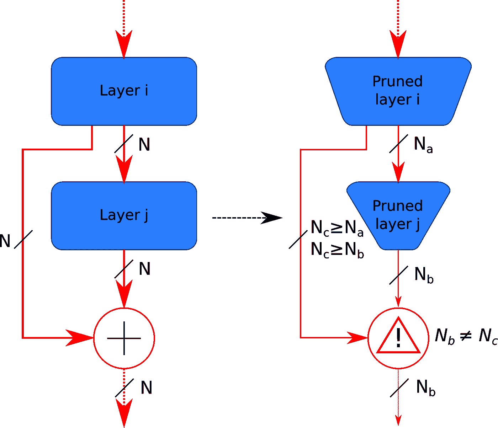
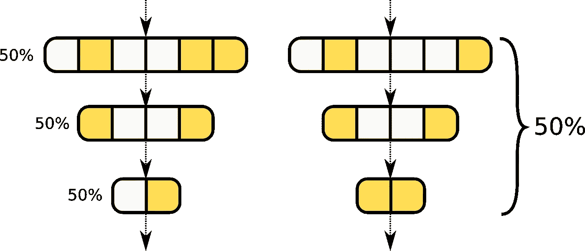
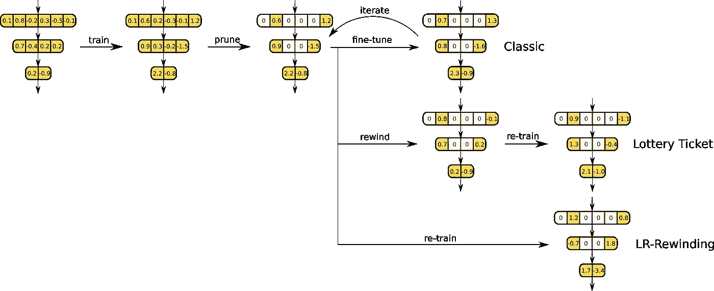

# 神经网络修剪 101

> 原文：<https://towardsdatascience.com/neural-network-pruning-101-af816aaea61?source=collection_archive---------2----------------------->

## 你需要知道的是不要迷路

无论是在计算机视觉、自然语言处理还是图像生成方面，深度神经网络都达到了最先进的水平。然而，它们在计算能力、内存或能耗方面的成本可能令人望而却步，这使得它们中的一些对于大多数有限的硬件来说完全负担不起。然而，许多领域将受益于神经网络，因此需要在保持其性能的同时降低其成本。

这就是神经网络压缩的全部意义。这个领域统计了多个方法家族，比如量化[11]，因式分解[13]，蒸馏[32]或者，这将是这篇帖子修剪的重点。

神经网络修剪是一种方法，它围绕着一个直观的想法，即删除网络中表现良好但耗费大量资源的多余部分。事实上，尽管大型神经网络已经无数次证明了它们的学习能力，但事实证明，在训练过程结束后，并非所有的部分都仍然有用。想法是在不影响网络性能的情况下消除这些部分。

不幸的是，每年发表的几十篇论文，如果不是几百篇的话，揭示了一个被认为是直截了当的想法隐藏的复杂性。事实上，在训练之前、之中或之后，文献的快速浏览产生了无数种识别所述无用部分或移除它们的方法；事实证明，并不是所有的修剪都可以加速神经网络，而这才是最重要的。

这篇文章的目标是提供一个坚实的基础，以解决神经网络修剪周围令人生畏的野生文学。我们将依次回顾三个问题，它们似乎是整个领域的核心:“我应该修剪什么样的部分？”，“如何判断哪些部分可以修剪？”以及“如何在不损害网络的情况下删减部分内容？”。综上所述，我们将详细介绍**修剪结构**、**修剪标准**和**修剪方法**。

# 1-修剪结构

# 1.1 —非结构化修剪

当谈到神经网络的成本时，参数计数肯定是使用最广泛的指标之一，还有 FLOPS(每秒浮点运算次数)。看到网络显示天文数字的重量(对一些人来说高达数十亿)确实令人生畏，这通常与恒星的性能相关。因此，通过删除参数本身来直接减少这个计数是非常直观的。实际上，修剪连接是文献中最普遍的范例之一，足以被认为是处理修剪时的默认框架。韩等人的开创性工作[26]提出了这种修剪，并作为许多贡献的基础[18，21，25]。

直接修剪参数有很多好处。首先，这很简单，因为在参数张量中用零替换它们的权重值就足以删除连接。广泛的深度学习框架，如 Pytorch，允许轻松访问网络的所有参数，使其实现起来极其简单。尽管如此，修剪连接的最大优点仍然是它们是网络中最小的、最基本的元素，因此，它们数量众多，足以大量修剪它们而不影响性能。这种精细的粒度允许修剪非常细微的模式，例如高达卷积核内的参数。由于修剪权重完全不受任何约束的限制，并且是修剪网络的最佳方式，这样的范例被称为**非结构化修剪**。

然而，这种方法存在一个重大的致命缺陷:大多数框架和硬件都无法加速稀疏矩阵的计算，这意味着无论你用多少个零填充参数张量，都不会影响网络的实际成本。然而，真正影响它的是以一种直接改变网络架构的方式进行修剪，这是任何框架都可以处理的。

非结构化剪枝(左)和结构化剪枝(右)的区别:结构化剪枝移除卷积滤波器和核的行，而不仅仅是剪枝连接。这导致中间制图表达中的要素地图更少。(图片由作者提供)

## 1.2 —结构化修剪

这就是为什么许多工作都集中在修剪更大的结构，如整个神经元[36]，或更现代的深度卷积网络中的直接等效物，卷积滤波器[40，41，66]。过滤器修剪允许可利用且足够精细的粒度，因为大型网络往往包括许多卷积层，每个卷积层多达数百或数千个过滤器。移除这样的结构不仅导致可以直接实例化为更薄的层的稀疏层，而且这样做还消除了作为这样的过滤器的输出的特征图。

因此，这种网络不仅由于更少的参数而更易于存储，而且它们需要更少的计算并生成更轻的中间表示，因此在运行时需要更少的存储器。实际上，有时减少带宽比减少参数数量更有益。事实上，对于涉及大型图像的任务，如语义分割或对象检测，中间表示可能会非常消耗内存，远远超过网络本身。由于这些原因，过滤器修剪现在被视为默认的**结构化修剪**。

然而，当应用这种修剪时，应该注意以下方面。让我们考虑一个卷积层是如何构建的:对于 *Cin* 输入通道和 *Cout* 输出通道，一个卷积层由 *Cout* 滤波器组成，每个滤波器计数 *Cin* 内核；每个滤波器输出一个特征图，并且在每个滤波器内，一个内核专用于每个输入通道。考虑到这种架构，并且承认常规卷积网络基本上堆叠卷积层，当修剪整个滤波器时，可以观察到修剪滤波器以及它输出的特征图实际上也导致修剪随后层中的相应核。这意味着，在删除过滤器时，实际删除的参数数量可能是最初认为要删除的两倍。

让我们也考虑一下，当整个层碰巧被修剪时(由于层折叠[62]而倾向于发生，但并不总是破坏网络，这取决于架构)，前一层的输出现在完全不连接，因此也被修剪:修剪整个层实际上可以修剪其输出没有以某种方式连接到别处的所有前一层(由于剩余连接[28]或整个并行路径[61])。因此，**在修剪滤波器时，应该考虑计算实际修剪参数的确切数量**。事实上，修剪相同数量的滤波器(取决于它们在架构中的分布)可能不会导致相同的实际修剪参数数量，从而无法比较任何结果。

在改变话题之前，让我们提一下，尽管是少数，一些工作集中在修剪卷积核，核内结构[2，24，46]或甚至 T10 特定的参数式结构 T11。然而，这种结构需要特殊的实现来加速(对于非结构化修剪)。然而，另一种可利用的结构是通过修剪每个内核中除一个参数之外的所有参数，将卷积转变为“移位层”，然后可以总结为移位操作和 1 × 1 卷积的组合[24]。

结构化修剪的危险:改变层的输入和输出维度会导致一些差异。如果在左侧，两个图层都输出相同数量的特征地图，并且可以在之后很好地进行汇总，则它们在右侧的修剪后的对应物会产生不同维度的中间表示，如果不对其进行处理，则无法进行汇总。(图片由作者提供)

# 2 —修剪标准

一旦决定了要修剪什么样的结构，下一个问题可能是:“现在，我如何确定哪些要保留，哪些要修剪？”。为了回答这个问题，我们需要一个合适的剪枝标准，它将对参数、过滤器或其他的相对重要性进行排序。

## 2.1-重量等级标准

一个非常直观且效率惊人的标准是修剪绝对值(或“幅度”)最小的权重。事实上，在权重衰减的约束下，那些对功能没有显著贡献的预期在训练期间具有它们的大小收缩。因此，多余的重量应该是较小的重量[8]。尽管它很简单，但震级标准仍然被广泛应用于现代著作[21，26，58]，使其成为该领域的主要内容。

然而，尽管这个标准在非结构化修剪的情况下实现起来似乎微不足道，但是人们可能想知道如何使它适应结构化修剪。一种简单的方法是根据滤波器的范数(例如 L 1 或 L 2)对滤波器进行排序[40，70]。如果这种方法非常简单，人们可能希望将多组参数封装在一个度量中:例如，卷积滤波器、其偏差及其批量归一化参数，或者甚至是并行层中的对应滤波器，其输出随后被融合，并且我们希望减少其通道。

一种无需计算这些参数的组合范数的方法是，在要修剪的每组图层后为每个要素地图插入一个可学习的乘法参数。当该门减小到零时，有效地删除了负责该通道的整个参数集，并且该门的大小说明了所有这些参数的重要性。因此，该方法包括修剪较小幅度的门[36，41]。

## 2.2 —梯度幅度修剪

重量的大小并不是唯一流行的标准(或标准系列)。实际上，另一个一直持续到现在的主要标准是梯度的大小。事实上，早在 80 年代，一些基础工作[37，53]通过对移除参数对损失的影响进行泰勒分解，理论上认为，从反向传播梯度中得出的一些度量可以提供一种很好的方法来确定哪些参数可以被删除而不会损坏网络。

这个标准的更现代的实现[4，50]实际上在训练数据的小批量上累积梯度，并且基于这个梯度和每个参数的相应权重之间的乘积进行修剪。这一标准也适用于前述的门[49]。

## 2.3 —全局或局部修剪

要考虑的最后一个方面是，所选择的标准是全局应用于网络的所有参数或滤波器，还是针对每一层独立计算。虽然全局修剪已经被多次证明可以产生更好的结果，但它会导致层崩溃[62]。避免这个问题的一个简单方法是，当所使用的方法不能防止层崩溃时，采取逐层的局部修剪，即在每层修剪相同的速率。

局部修剪(左)和全局修剪(右)之间的区别:局部修剪将相同的速率应用于每一层，而全局修剪将它同时应用于整个网络。(图片由作者提供)

# 3 —修剪方法

现在我们已经有了剪枝结构和标准，剩下的唯一参数是我们应该使用哪种方法来剪枝网络。这实际上是文献中最令人困惑的主题，因为每篇论文都会带来自己的怪癖和噱头，以至于人们可能会迷失在什么是系统相关的和什么只是给定论文的特殊性之间。

这就是为什么我们将按主题概述一些最流行的修剪神经网络的方法，以便突出在训练期间使用稀疏性的演变。

## 3.1 —经典框架:训练、修剪和微调

需要了解的第一个基本框架是训练、修剪和微调方法，该方法显然包括 1)训练网络 2)通过将修剪结构和标准所针对的所有参数设置为 0 来修剪网络(这些参数不能在一段时间后恢复),以及 3)以最低的学习速率训练网络几个额外的时期，以使其有机会从修剪所导致的性能损失中恢复。通常，这最后两个步骤可以重复进行，每次修剪的速度越来越快。

Han 等人[26]提出的方法将该方法应用于权重幅度修剪，在修剪和微调之间有 5 次迭代。迭代已经证明可以提高性能，但代价是额外的计算和训练时间。这个简单的框架是许多作品的基础[26，40，41，50，66]，并且可以被视为所有其他作品的默认构建方法。

## 3.2 —扩展经典框架

虽然没有偏离太远，但一些方法对前面提到的韩等人的经典框架进行了重大修改[26]。Gale 等人[21]通过在整个训练过程中逐步去除越来越多的权重，进一步推动了迭代的原理，这允许受益于迭代的优点，并去除了整个微调过程。He 等人[29]在每个时期将可修剪的滤波器减少到 0，同时不阻止它们学习和随后被更新，以便让它们的权重在修剪后恢复，同时在训练期间加强稀疏性。

最后，Renda 等人[58]的方法包括在网络被修剪后对其进行完全再训练。与以最低学习率进行的微调不同，再培训遵循与培训相同的学习率计划，因此得名“学习率倒带”。事实证明，这种再培训比单纯的微调能产生更好的效果，但成本要高得多。

## 3.3 —初始化时修剪

为了加速训练，避免微调，并防止在训练期间或之后对体系结构的任何改变，许多工作都集中在训练之前的修剪上。在 SNIP [39]之后，许多著作研究了使用 Le Cun 等人[37]或莫泽尔和斯摩棱斯基[53]的工作在初始化[12，64]时进行修剪，包括深入的理论研究[27，38，62]。然而，最佳脑损伤[37]依赖于多种近似，包括“极端”近似，即“假设参数删除将在训练收敛后进行”[37]；这个事实很少被提及，甚至在以它为基础的作品中。一些作品对这种方法生成的掩模的能力提出了保留意见，这些掩模的相关性胜过每层类似分布的随机掩模[20]。

另一个研究剪枝和初始化之间关系的方法家族倾向于“彩票假说”[18]。这一假设指出“随机初始化的密集神经网络包含一个子网网络，该子网网络被初始化，使得在隔离训练时，它可以在最多相同次数的迭代训练后匹配原始网络的测试精度”。在实践中，该文献研究了使用已经收敛的网络定义的修剪掩码在网络刚刚初始化时应用于网络的效果。多部著作扩展、稳定或研究了这一假设[14，19，45，51，69]。然而，又一次，多项工作倾向于质疑假设的有效性和用于研究它的方法[21，42]，一些工作甚至倾向于表明，它的好处更多地来自于使用确定的面具而不是假设的“中奖彩票”进行充分训练的原则[58]。

经典的“训练、修剪和微调”框架[26]、彩票实验[18]和学习率倒回[58]之间的比较。(图片由作者提供)

## 3.4 —稀疏训练

先前的方法被一个看似共享的潜在主题联系在一起:稀疏约束下的训练。这一原则是一系列方法的核心，称为**稀疏训练**，包括在训练期间实施恒定的稀疏率，同时其分布变化并逐步调整。由 Mocanu 等人[47]介绍，它包括:1)用一个随机掩码初始化网络，该掩码修剪网络的一定比例；2)在一个时期内训练这个修剪的网络；3)修剪一定量的较低幅度的权重；以及 4)重新生长相同量的随机权重。

通过这种方式，最初随机的剪枝掩码被逐步调整为以最小的导入权重为目标，同时在整个训练过程中实施稀疏性。对于每一层[47]或全局[52]，稀疏水平可以是相同的。其他方法扩展了稀疏训练，使用某种标准来重新生成权重，而不是随机选择它们[15，17]。

稀疏训练在训练期间周期性地减少和增加不同的权重，这导致调整后的掩码应该只针对相关参数。(图片由作者提供)

## 3.5 —面具学习

多种方法集中于在训练期间学习修剪掩模，而不是依赖于任意标准来修剪或重新生长权重。两种类型的方法似乎在该领域中流行:1)通过单独的网络或层的掩模学习，以及 2)通过辅助参数的掩模学习。多种策略可以适用于第一种类型的方法:训练单独的代理在最大化准确性的同时尽可能多地修剪一层的过滤器[33]，插入基于注意力的层[68]或使用强化学习[30]。第二种方法旨在将修剪视为一个优化问题，该优化问题倾向于最小化网络的 L0 范数及其监督损失。

因为 L0 是不可微的，所以各种方法主要涉及通过使用在正向传递过程中与其相应参数相乘的惩罚辅助参数来规避这个问题[59，23]。许多方法[44，60，67]依赖于一种类似于“二元连接”[11]的方法，即:在参数上应用随机门，这些参数的值每个都是从它们自己的参数 *p* 的伯努利分布中随机抽取的，这些参数是使用“直通估计器”[3]或其他手段[44]学习的。

## 3.6 —基于惩罚的方法

许多方法不是手动修剪连接或惩罚辅助参数，而是对权重本身应用各种惩罚，使它们逐渐向 0 收缩。这个概念实际上是非常古老的[57]，因为重量衰减已经是重量级标准的一个基本要素。除了使用简单的权重衰减之外，即使在当时，也有许多工作专注于精心设计专门用于增强稀疏性的惩罚[55，65]。如今，各种方法在权重衰减的基础上应用不同的正则化，以进一步增加稀疏度(通常使用 L 1 范数[41])。

在现代作品中，多种方法依赖于 LASSO(最小绝对收缩和选择算子)[22，31，66]来修剪权重或组。其他方法开发了针对弱连接的惩罚，以增加要保留的参数和要删减的参数之间的差距，从而使它们的删除影响较小[7，16]。一些方法表明，通过在整个训练过程中不断增长的惩罚来瞄准权重的子集，可以逐步修剪它们，并使它们的去除无缝[6，9，63]。该文献还列举了一系列围绕“变分放弃”原则建立的方法[34]，这是一种基于变分推理[5]的方法，适用于深度学习[35]。作为一种修剪方法[48]，它产生了多种作品，使其原理适应结构化修剪[43，54]。

# 4 —可用框架

如果这些方法中的大多数必须从头实现(或者可以从每篇论文提供的资源中重用，如果它们提供的话)，那么存在一些框架来应用基本方法或使上述实现更容易。

## 4.1 — Pytorch

*py torch*【56】提供多种生活质量特征，帮助修剪网络。所提供的工具允许容易地将掩码应用于网络，并在训练期间维护该掩码，并且如果需要，还允许容易地恢复该掩码。Pytorch 还提供了一些基本的剪枝方法，比如全局或局部剪枝，无论是否结构化。结构化剪枝可以应用于权重张量的任何维度，这允许剪枝过滤器、内核的行或者甚至内核内部的一些行和列。那些内置的基本方法也允许随机或根据各种规范进行修剪。

## 4.2 —张量流

来自*tensor flow*【1】的*Keras*【10】库提供了一些基本工具来修剪较低量级的权重。如在 Han 等人[25]的工作中，修剪的效率是根据由所有插入的零引入的冗余允许更好地压缩模型的程度来测量的(这与量化结合得很好)。

## 4.3 —收缩基准

Blalock 等人[4]在他们的工作中提供了一个定制库，以帮助社区规范剪枝算法的比较。基于*py torch*,*shrink bench*旨在使修剪方法的实现更容易，同时规范它们被训练和测试的条件。它提供了不同的基线，如随机剪枝、全局或分层剪枝以及权重幅度或梯度幅度剪枝。

# 5 —简要回顾已审查的方法

在这篇文章中，引用了许多论文。下面是一个简单的表格，大致总结了它们的作用和区别(假设日期是第一次出版的日期):

# 6 —结论

在我们对文献的快速概述中，我们看到 1)修剪结构定义了从修剪中预期哪种增益 2)修剪标准基于各种理论或实践的合理性，以及 3)修剪方法倾向于围绕在训练期间引入稀疏性来调和性能和成本。我们还看到，即使它的创始工作可以追溯到 80 年代末，神经网络修剪仍然是一个非常动态的领域，今天仍然经历着基本的发现和新的基本概念。

尽管该领域每天都有贡献，但似乎仍有大量探索和创新的空间。如果方法的每一个子类都可以被看作是对一个问题的回答(“如何重新生成修剪过的权重？”、“如何通过优化学习剪枝遮罩？”、“如何用更柔和的手段放松减肥？”…)，那么文献的演变似乎指出了一个确定的方向:贯穿训练的稀疏性。这个方向给自己提出了许多问题，例如:“修剪标准在还没有收敛的网络上工作得好吗？”或者“如何从一开始就区分选择要修剪的权重和使用任何稀疏度进行训练的好处？”

# 参考

[1]马丁·阿巴迪、阿希什·阿加瓦尔、保罗·巴勒姆、尤金·布莱夫多、陈质枫、克雷格·西特罗、格雷格·科拉多、安迪·戴维斯、杰弗里·迪恩、马蒂厄·德文、桑杰·格玛瓦特、伊恩·古德菲勒、安德鲁·哈普、杰弗里·欧文、迈克尔·伊萨德、杨青·贾、拉斐尔·约泽福维茨、卢卡斯·凯泽、曼朱纳斯·库德鲁尔、乔希·莱文伯格、蒲公英·曼内、拉杰特·蒙加、雪莉·穆尔、德里克·默里、克里斯·奥拉、迈克·舒斯特 TensorFlow:异构系统上的大规模机器学习，2015。tensorflow.org 提供的软件。

[2]赛义德·安瓦尔、黄奎元和宋元勇。深度卷积神经网络的结构化剪枝。ACM 计算系统新兴技术期刊(JETC)，13(3):1–18，2017。

[3]约舒阿·本吉奥、尼古拉斯·莱昂纳尔和亚伦·库维尔。为条件计算通过随机神经元估计或传播梯度。arXiv 预印本 arXiv:1308.3432，2013。

[4]戴维斯·布拉洛克、何塞·哈维尔·冈萨雷斯·奥尔蒂斯、乔纳森·弗兰克尔和约翰·古塔格。神经网络剪枝是什么状态？arXiv 预印本:2003.03033，2020。

[5]戴维·布莱、阿尔普·库库尔比尔和乔恩·麦考利夫。统计学家评论。美国统计协会杂志，112(518):859–877，2017。

[6]米格尔·卡雷拉-佩皮南和叶尔兰·伊德尔巴耶夫。神经网络剪枝的“学习-压缩”算法。IEEE 计算机视觉和模式识别会议论文集，第 8532-8541 页，2018 年。

[7]景长与金莎。用改进的 L1/2 罚函数修剪深度神经网络。IEEE 访问，7:2273–2280，2018。

[8]伊夫·肖万。优化使用隐藏单元的反向传播算法。NIPS，第 1 卷，第 519–526 页，1988 年。

[9] Yoojin Choi、Mostafa El-Khamy 和 Jungwon Lee。联合稀疏约束下的深度卷积神经网络压缩。arXiv 预印本 arXiv:1805.08303，2018。

[10] Francois Chollet 等人，Keras，2015 年。

[11] Matthieu Courbariaux、Yoshua Bengio 和 Jean-Pierre David。Binaryconnect:在传播过程中使用二进制权重训练深度神经网络。在日本，2015 年。

[12] Pau de Jorge、Amartya Sanyal、Harkirat S Behl、Philip HS Torr、Gregory Rogez 和 Puneet K Dokania。渐进骨架化:在初始化时从网络中剔除更多脂肪。arXiv 预印本 arXiv:2006.09081，2020。

[13]艾米莉·丹顿、沃伊切赫·扎伦巴、琼·布鲁纳、扬·勒昆和罗布·弗格斯。利用卷积网络中的线性结构进行有效评估。2014 年第 28 届神经信息处理系统年会，NIPS 2014，第 1269–1277 页。神经信息处理系统基金会，2014 年。

[14] Shrey Desai，Hongyuan Zhan 和 Ahmed Aly。分布转移下的彩票评估。《第二届低资源 NLP 深度学习方法研讨会论文集》(DeepLo 2019)，第 153–162 页，2019 年。

15 蒂姆·德特默斯和卢克·塞特勒莫耶。稀疏网络从零开始:更快的训练而不损失性能。arXiv 预印本 arXiv:1907.04840，2019。

[16]丁小涵、丁桂光、周、郭、韩和。用于修剪深度神经网络的全局稀疏动量 sgd。arXiv 预印本 arXiv:1909.12778，2019。

17 乌特库·埃夫西、特雷弗·盖尔、雅各布·梅尼克、巴勃罗·萨缪尔·卡斯特罗和埃里希·埃尔森。操纵彩票:让所有彩票中奖。在机器学习国际会议上，第 2943–2952 页。PMLR，2020 年。

18 乔纳森·弗兰克尔和迈克尔·卡宾。寻找稀疏的、可训练的神经网络。arXiv 预印本 arXiv:1803.03635，2018。

[19] Jonathan Frankle，Gintare Karolina Dziugaite，Daniel M Roy 和 Michael Carbin。稳定彩票假说。arXiv 预印本 arXiv:1903.01611，2019。

[20] Jonathan Frankle，Gintare Karolina Dziugaite，Daniel M Roy 和 Michael Carbin。在初始化时修剪神经网络:为什么我们会遗漏标记？arXiv 预印本 arXiv:2009.08576，2020。

[21]特雷弗·盖尔，埃里希·埃尔森和萨拉·胡克。深度神经网络中的稀疏状态。arXiv 预印本 arXiv:1902.09574，2019。

[22]苏珊·高、、钱隆生、威廉·张和何塞·M·阿尔瓦雷斯。Vacl:用于修剪深度残差网络的方差感知跨层正则化。IEEE/CVF 国际计算机视觉研讨会论文集，第 0-0 页，2019。

[23]、郭、姚安邦和。高效 dnns 的动态网络手术。在 NIPS，2016。

[24] Ghouthi Boukli Hacene、Carlos Lassance、Vincent Gripon、Matthieu Courbariaux 和 Yoshua Bengio。基于注意力的移位网络剪枝。2020 年第 25 届国际模式识别会议(ICPR)，第 4054–4061 页。IEEE，2021。

[25]宋汉，毛和威廉 J 戴利。深度压缩:通过剪枝、训练量化和霍夫曼编码压缩深度神经网络。arXiv 预印本 arXiv:1510.00149，2015。

[26]宋汉、杰夫·普尔、约翰·特兰和威廉·J·戴利。学习有效神经网络的权值和连接。在日本，2015 年。

[27]苏菲亚内·哈尤、江泽龙·东、阿诺·杜塞和伊怀德。初始化时的健壮修剪。

[28]，何，，，任，。用于图像识别的深度残差学习。IEEE 计算机视觉和模式识别会议论文集，第 770–778 页，2016 年。

[29]杨何，，康，董宣义，，傅，。加速深度卷积神经网络的软滤波器修剪。arXiv 预印本 arXiv:1808.06866，2018。

[30]，何继林，，，王，李，，宋汉.Amc:用于移动设备上模型压缩和加速的 Automl。《欧洲计算机视觉会议论文集》(ECCV)，第 784-800 页，2018 年。

[31]何、、、。加速深度神经网络的通道剪枝。IEEE 计算机视觉国际会议论文集，第 1389-1397 页，2017 年。

32 Geoffrey hint on、Oriol Vinyals 和 Jeff Dean。从神经网络中提取知识。统计，2015 年 10:50:9。

[33]黄乾贵，，苏亚友，和乌尔里希·诺依曼。学习修剪卷积神经网络中的滤波器。2018 年 IEEE 计算机视觉应用冬季会议(WACV)，第 709–718 页。IEEE，2018。

[34]迪德里克·P·金马、蒂姆·萨利曼斯和马克斯·韦林。变分丢失和局部重新参数化技巧。统计，2015 年 10:50:8。

[35]迪德里克·金马和马克斯·韦林。自动编码变分贝叶斯。统计，2014 年 1050:1。

[36]约翰·克鲁施克和哈维尔·莫韦兰。增益的好处:加速学习和最小化反向传播网络中的隐藏层。IEEE 系统、人和控制论汇刊，21(1):273–280，1991。

[37]扬·勒昆、易小轩·登克和萨拉·索拉最佳脑损伤。神经信息处理系统进展，598-605 页，1990。

[38] Namhoon Lee，Thalaiyasingam Ajanthan，Stephen Gould 和 Philip HS Torr。初始化时修剪神经网络的信号传播观点。在 2019 年国际学习代表大会上。

[39] Namhoon Lee，Thalaiyasingam Ajanthan 和 Philip HS Torr。Snip:基于连接敏感度的单次网络剪枝。2019 年 ICLR 国际学习代表大会。

[40]李浩、阿西姆·卡达夫、伊戈尔·杜尔丹诺维奇、哈南·萨梅特和汉斯·彼得·格拉夫。高效网络的剪枝滤波器。arXiv 预印本 arXiv:1608.08710，2016。

[41]，，，，严守孟，张长水。通过网络瘦身学习高效卷积网络。IEEE 计算机视觉国际会议论文集，第 2736-2744 页，2017。

[42]、孙明杰、周廷辉、和特雷弗·达雷尔。重新思考网络修剪的价值。在 2018 年国际学习代表大会上。

43 路易索斯、乌烈芝和韦林用于深度学习的贝叶斯压缩。第 31 届神经信息处理系统会议(NIPS 2017)，美国加州长滩。, 2017.

[44]克里斯特斯·路易斯、马克斯·韦林和迪德里克·金马。通过 l 0 正则化学习稀疏神经网络。arXiv 预印本 arXiv:1712.01312，2017。

[45] Eran Malach，Gilad Yehudai，Shai Shalev-Schwartz 和 Ohad Shamir。证明彩票假说:修剪是你所需要的。在机器学习国际会议上，第 6682–6691 页。PMLR，2020 年。

[46]蕙子·毛、宋汉、杰夫·普尔、、、和威廉·J·戴利探索卷积神经网络中稀疏结构的规律性。arXiv 预印本 arXiv:1705.08922，2017。

[47] Decebal Constantin Mocanu、Elena Mocanu、皮特·斯通、Phuong H Nguyen、Madeleine Gibescu 和 Antonio Liotta。受网络科学启发的具有自适应稀疏连接的人工神经网络的可扩展训练。自然通讯，9(1):1–12，2018。

[48] Dmitry Molchanov、Arsenii Ashukha 和 Dmitry Vetrov。变分丢失使深度神经网络稀疏化。在机器学习国际会议上，第 2498–2507 页。PMLR，2017。

[49] Pavlo Molchanov、Arun Mallya、Stephen Tyree、Iuri Frosio 和 Jan Kautz。神经网络剪枝的重要性估计。IEEE/CVF 计算机视觉和模式识别会议论文集，第 11264-11272 页，2019 年。

[50] Pavlo Molchanov、Stephen Tyree、Tero Karras、Timo Aila 和 Jan Kautz。修剪卷积神经网络进行资源有效的推理。arXiv 预印本 arXiv:1611.06440，2016。

[51]Ari S . Morcos、余浩南、Michela Paganini 和田远东。一张票赢所有人:跨数据集和优化器推广彩票初始化。统计，2019 年 1050:6。

52 希沙姆·穆斯塔法和王欣。通过动态稀疏重新参数化的深度卷积神经网络的参数有效训练。在机器学习国际会议上，第 4646–4655 页。PMLR，2019。

53 迈克尔·莫泽尔和保罗·斯摩棱斯基。骨架化:一种通过相关性评估从网络中剔除脂肪的技术。神经信息处理系统进展，107-115 页，1989。

[54] Kirill Neklyudov、Dmitry Molchanov、Arsenii Ashukha 和 Dmitry Vetrov。基于对数正态乘性噪声的结构化贝叶斯剪枝。《第 31 届神经信息处理系统国际会议论文集》，第 6778–6787 页，2017 年。

55 史蒂文·J·诺兰和杰弗里·E·辛顿。通过软加权共享简化神经网络。神经计算，4(4):473–493，1992。

[56] Adam Paszke、Sam Gross、Soumith Chintala、Gregory Chanan、杨德昌、Zachary DeVito、林泽铭、Alban Desmaison、Luca Antiga 和 Adam Lerer。pytorch 中的自动微分。2017.

57 拉塞尔·里德。剪枝算法-综述。IEEE 神经网络汇刊，4(5):740–747，1993。

58 亚历克斯·伦达、乔纳森·弗兰克尔和迈克尔·卡宾。比较神经网络剪枝中的倒回和微调。arXiv 预印本 arXiv:2003.02389，2020

[59]佩德罗·萨瓦雷塞、乌戈·席尔瓦和迈克尔·梅尔。用持续的稀疏赢得彩票。神经信息处理系统进展，33，2020。

[60] Suraj Srinivas、Akshayvarun Subramanya 和 R Venkatesh Babu。训练稀疏神经网络。IEEE 计算机视觉和模式识别研讨会会议录，第 138-145 页，2017 年。

[61]克里斯蒂安·塞格迪、贾、皮埃尔·塞尔马内、斯科特·里德、德拉戈米尔·安盖洛夫、杜米特鲁·埃汉、文森特·万霍克和安德鲁·拉宾诺维奇。用回旋越走越深。IEEE 计算机视觉和模式识别会议论文集，第 1–9 页，2015。

[62]田畑秀则·田中、丹尼尔·库宁、丹尼尔·亚明斯和苏里亚·甘古利。通过迭代保存突触流来修剪没有任何数据的神经网络。神经信息处理系统进展，33，2020。

[63] Hugo Tessier、Vincent Gripon、Mathieu Léonardon、Matthieu Arzel、Thomas Hannagan 和 David Bertrand。重新思考有效神经网络修剪的权重衰减。2021.

[64]齐超·王、，和罗杰·格罗斯。通过保持梯度流在训练前挑选中奖票。在 2019 年国际学习代表大会上。

[65]安德烈亚斯·韦根德、戴维·鲁梅尔哈特和贝尔纳多·胡伯尔曼。加权消除泛化及其在预测中的应用。神经信息处理系统进展，875-882 页，1991。

[66]魏文、吴、王燕丹、陈、。深度神经网络中的结构化稀疏学习。在 NIPS，2016。

[67]小霞、王自庚和 Sanguthevar Rajasekaran。Autoprune:通过正则化辅助参数来自动修剪网络。神经信息处理系统进展，32，2019。

[68]山本康平和仓藤前野。PCA:用注意力统计剪枝通道进行深度网络压缩。arXiv 预印本 arXiv:1806.05382，2018。

[69] Hattie Zhou、Janice Lan、Rosanne Liu 和 Jason Yosinski。解构彩票:零，标志，和超级面具。arXiv 预印本 arXiv:1905.01067，2019。

[70]庄、谭明奎、庄博汉、、、吴庆尧、黄和。深度神经网络的区分感知通道剪枝。在 NeurIPS，2018。