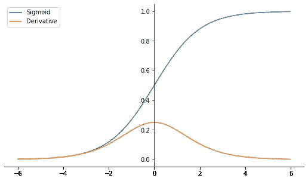
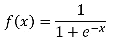
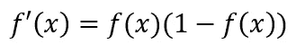
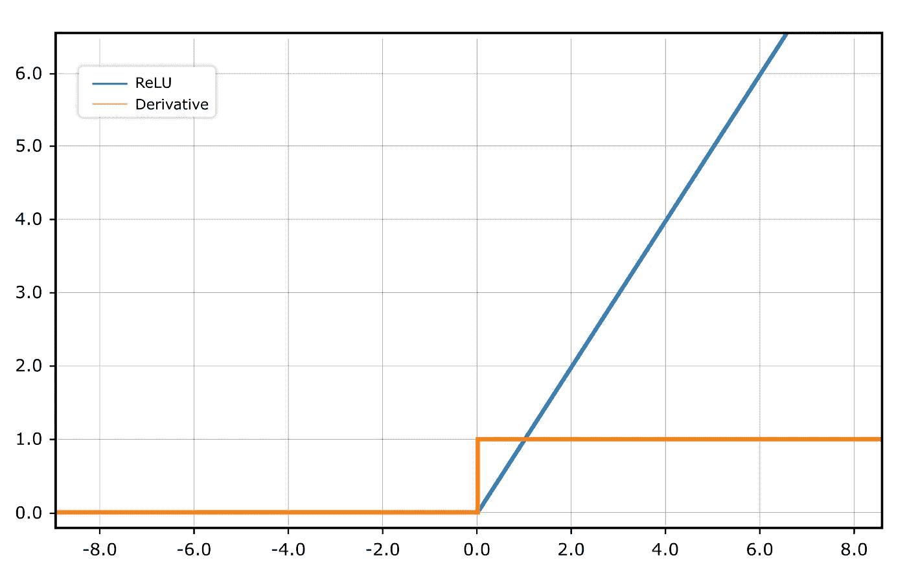
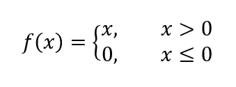
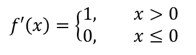
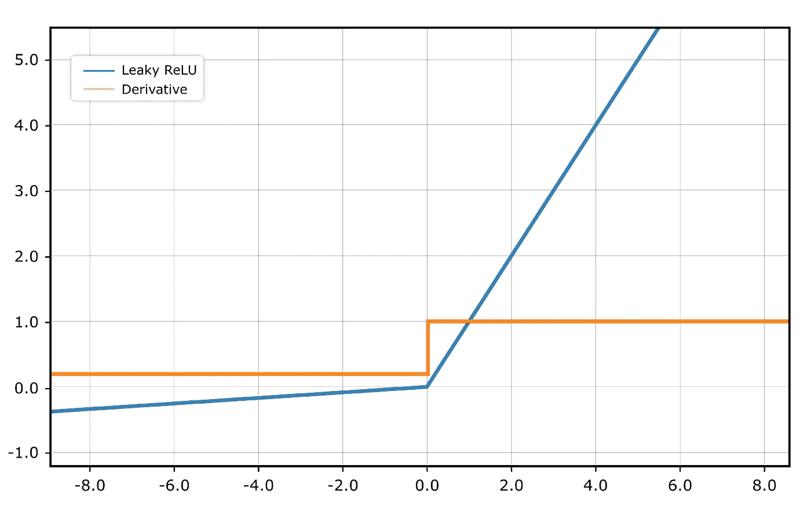
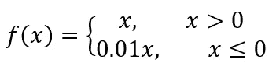
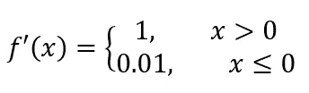

# 神经网络:死亡的神经元

> 原文：<https://towardsdatascience.com/neural-network-the-dead-neuron-eaa92e575748?source=collection_archive---------9----------------------->

## 深度学习

## ReLU 激活功能的最大缺点

乔希·里默尔在 [Unsplash](https://unsplash.com?utm_source=medium&utm_medium=referral) 上的照片

为隐藏层选择激活功能并不是一件容易的事情。隐藏层的配置是一个非常活跃的研究主题，它只是没有任何关于给定数据集有多少神经元、多少层以及使用什么激活函数的理论。当时，由于其非线性，sigmoid 是最受欢迎的激活函数。随着时间的推移，神经网络向更深层次的网络架构发展，这提出了消失梯度问题。纠正线性单位(ReLU)原来是隐藏层的激活功能的默认选项，因为它通过比 sigmoid 更大的梯度来解决消失梯度问题。

## 消失梯度

消失梯度是训练深度神经网络时最大的挑战之一。这是一种深度神经网络无法将梯度从输出层反向传播回第一个隐藏层的情况。当您试图在其隐藏层上建立一个具有 sigmoid 激活函数的深度神经网络时，经常会发生这种情况。

作者图片

乙状结肠公式如下:

作者图片

它的导数是:

作者图片

问题是 sigmoid 导数总是小于 1。根据上面的公式，我们可以说当 f(x) = 0.5 时获得最大导数，因此 f '(x)= 0.5 *(1–0.5)，也就是 0.25。

现在想象一下，当你试图建立 7 层神经网络，每层都有一个 sigmoid 激活函数。无论损失函数提供的梯度是什么，如果我们将梯度乘以 0.25，梯度将随着我们通过网络反向传播而变得越来越小，层数是 7，这意味着我们用小于 0 的值将梯度乘以 7 次。

这是最好的情况。在实际例子中，sigmoid 的导数不会总是 0.25。可能是 0.1，0.06，0.04，也可能是 0.001。那么第一个隐藏层的渐变如何呢？非常小，不是吗？

最简单的解决方案是用校正线性单元(ReLU)替换隐藏层上的激活函数。

## 整流线性单元

ReLU 被认为是深度学习的最大突破之一，因为 ReLU 使训练非常深度的神经网络成为可能。ReLU 易于优化，因为它非常简单，计算成本低，并且类似于线性激活函数，但事实上，ReLU 是一种非线性激活函数，允许学习数据中的复杂模式。线性激活函数和 ReLU 之间的唯一 difference 是 ReLU 将负值推至 0。

图片由 M. Farid Landriandani 拍摄

ReLU 的公式如下:

作者图片

它的导数是:

作者图片

ReLU 在 x > 0 时产生一个导数为 1 的线性，然后在 x ≤ 0 时产生一个导数为 0 的 0。这使得通过 ReLU 神经元的导数在向前传播期间只要该神经元是活动的就保持很大。当训练更深的神经网络时，在隐藏层上使用 ReLU 被认为是解决消失梯度问题的一种可能的方法，因为导数是 1 或 0。

## 死亡神经元

ReLU 的缺点是他们不能从激活度为零的例子中学习。如果用 0 初始化整个神经网络并将 ReLU 放在隐藏层上，通常会发生这种情况。另一个原因是当大梯度流过时，ReLU 神经元将更新其权重，并可能以大的负权重和偏差结束。如果发生这种情况，该神经元在正向传播期间将总是产生 0，然后不管输入如何，流经该神经元的梯度将永远为零。

换句话说，这个神经元的权重永远不会再更新。这样的神经元可以被认为是死亡神经元，用生物学术语来说，这被认为是一种永久性的**脑损伤**。一个死亡的神经元可以被认为是自然的**退出**。但问题是，如果特定隐藏层中的每个神经元都死了，它会切断前一层的梯度，导致后一层的梯度为零。它可以通过使用较小的学习率来解决，这样大的梯度不会在 ReLU 神经元中设置大的负权重和偏差。另一个方法是使用泄漏 ReLU，它允许活跃间期之外的神经元向后泄漏一些梯度。

## 泄漏 ReLU

Leaky ReLU 不是将负值推至 0，而是通过将 x 乘以常数 0.01，在负区域允许一些湖

图片来自 [M. Farid Landriandani](https://www.linkedin.com/in/landriandani/)

通过这样做，即使神经元有很大的负权重和偏差，仍然有可能通过层反向传播梯度。泄漏 ReLU 的公式如下:

作者图片

它的导数是:

作者图片

Leaky ReLU 在 x > 0 时产生导数为 1 的线性，然后在 x ≤ 0 时产生导数为 0.01 的 0.01 * x。负区域中的常数也可以制成超参数，如[深入研究整流器](http://arxiv.org/abs/1502.01852)中介绍的 PReLU 或参数 ReLU 激活功能所示。

## 结论

无论流行与否，ReLU 都有一个缺点，叫做“T2”死神经元“T3”。这主要是由于流经网络的大负梯度导致 ReLU 神经元的大负权重。在前向和反向传播期间，该神经元将总是产生零，因此该神经元的权重将不再被更新，并且被认为是永远死亡的。作为一个自然的**退出者**，这可能很难，但是如果这发生在特定层的每个神经元上，它会切断前一层的梯度，导致后一层的梯度为零。作为替代，我们可以使用**泄漏 ReLU** ，当前馈期间的输出为零时，它至少具有 0.01 导数。

## 参考

 [## 使用校正线性单元(ReLU)的深度学习

### 我们介绍了在深度神经网络(DNN)中使用校正线性单元(ReLU)作为分类函数

arxiv.org](https://arxiv.org/abs/1803.08375#:~:text=We%20introduce%20the%20use%20of,function%20as%20their%20classification%20function)  [## 深度学习(自适应计算和机器学习系列)

### Amazon.com:深度学习(自适应计算和机器学习系列)电子书:Goodfellow、Ian、Bengio、yo shua……

www.amazon.com](https://www.amazon.com/Deep-Learning-Adaptive-Computation-Machine-ebook/dp/B08FH8Y533/ref=sr_1_2?dchild=1&keywords=deep+learning&qid=1605266647&s=digital-text&sr=1-2)  [## 神经网络和深度学习:教科书

### 神经网络和深度学习:一本关于 Amazon.com 的教科书。*符合条件的优惠可享受免费*运输…

www.amazon.com](https://www.amazon.com/Neural-Networks-Deep-Learning-Textbook/dp/3319944622/ref=sr_1_1?dchild=1&keywords=Neural+Networks+and+Deep+Learning&qid=1605266979&sr=8-1)  [## 如何使用 ReLU - Machine Learning Mastery 解决渐变消失问题

### 消失梯度问题是一个不稳定行为的例子，当你训练一个深度神经…

machinelearningmastery.com](https://machinelearningmastery.com/how-to-fix-vanishing-gradients-using-the-rectified-linear-activation-function/)  [## 深入研究整流器:在 ImageNet 分类上超越人类水平的性能

### 整流激活单元(整流器)对于最先进的神经网络是必不可少的。在这项工作中，我们研究…

arxiv.org](http://arxiv.org/abs/1502.01852)