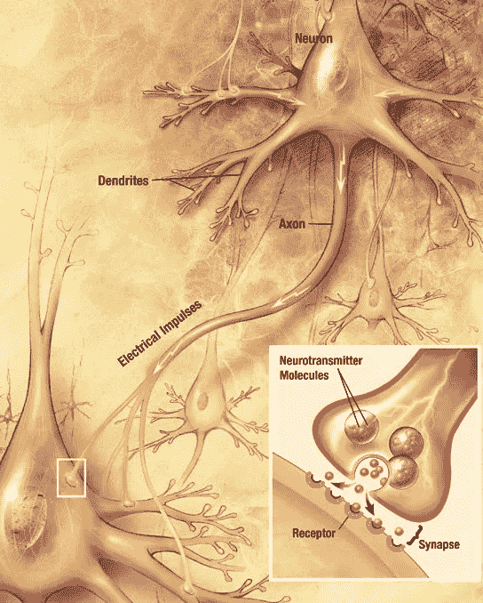
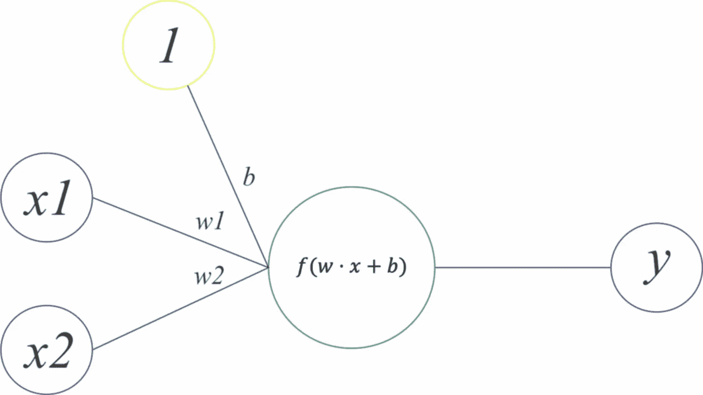
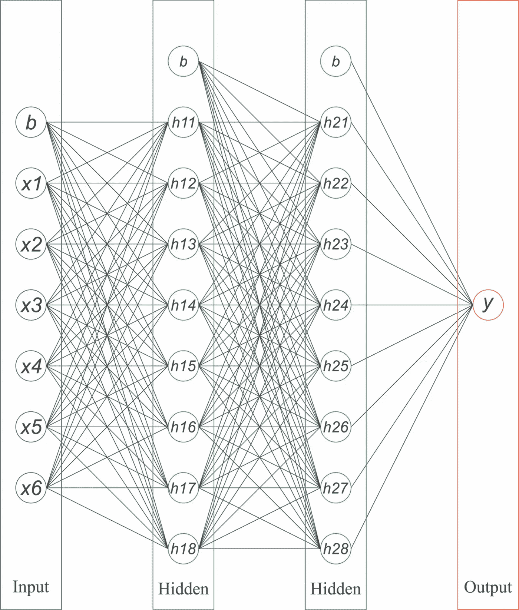

# 神经网络:人工神经网络的本质

> 原文：<https://towardsdatascience.com/neural-network-the-essence-of-artificial-neural-network-c605eb32de56?source=collection_archive---------35----------------------->

## 机器学习，深度学习

## 人工神经网络到底是什么

乔尔·菲利普在 [Unsplash](https://unsplash.com?utm_source=medium&utm_medium=referral) 上的照片

人脑由数十亿个相互连接的神经元组成，每个神经元通过这种连接向另一个神经元传递信号。这导致人类有一个特定的行动被执行。例如，你想伸手到口袋里去拿手机，那么就会有一个信号被发送到你的大脑，并通过这数十亿个神经元连接传递。然后，负责这项任务的神经元就会启动，发回信号，让你的手动起来，抓住你的手机。

人脑具有极其复杂的结构，从其神经元的数量、处理速度和效率来看，都证明了人类是一个完美的生命体。出生时，婴儿的大脑包含 1000 亿个神经元。在生命的早期阶段，大脑会消除很少或从不使用的连接，这是大脑发育的正常部分。

## 神经元

神经元是人脑中的一个细胞，负责从外部世界接收感官输入，向人体肌肉发送信号，并在其间的每一步转换和传递电信号。

图片由[维基百科](https://en.wikipedia.org/wiki/Neuron)

神经元由 3 个主要部分组成，即树突、轴突和细胞体。树突是一个神经元从其他神经元接收输入的地方。轴突是神经元的输出，它将信号传递给其他神经元。细胞体包含细胞核和控制细胞活动的遗传物质。

神经元通过在发送神经元的轴突和接收神经元的树突之间的狭窄空间(称为突触)发送信号(称为神经递质)来相互通信。

## 人工神经元

人工神经网络的目的是模仿人类大脑的工作方式，希望我们可以建立一个像人一样行为的机器。人工神经元是人工神经网络的核心构件。

作者图片

人工神经元的结构与生物神经元非常相似，它由 3 个主要部分组成，权重和偏置分别作为树突用 w 和 b 表示，输出作为轴突用 y 表示，激活功能作为细胞体(细胞核)用 f(x)表示。x 是树突接收的输入信号。

在人工神经元中，输入和权重表示为向量，而偏差表示为标量。人工神经元通过在输入向量和权重向量之间执行点积来处理输入信号，添加偏差，然后应用激活函数，最后将结果传播给其他神经元。

我们刚才谈到的激活函数是什么？为什么激活功能很重要？激活功能的作用是什么使得它如此重要？

## 激活功能

激活函数是我们不应该低估的重要部分，它是人工神经元用来获得神经元输出的函数，也称为传递函数。权重和输入加偏差之间的点积结果在-inf 和+inf 范围内，激活函数旨在根据函数将结果映射到某个范围内。

图片由[维基百科](https://en.wikipedia.org/wiki/Activation_function)

有许多激活函数，但最重要的是 sigmoid 激活函数。它通常用作二进制分类任务的输出层中的激活。Sigmoid 将结果限制在 0 到 1 的范围内，它表示 x 属于第 1 类还是第 0 类的概率。Sigmoid 通过对结果进行阈值处理来做出决定，如果结果≥ 0.5，则 x 被分类为 1，否则，x 被分类为 0。

## 人工神经网络

人工神经网络是一组相互连接的人工神经元。人工神经网络(ann)像人脑一样学习解决问题。它们通过密集连接的人工神经元过滤信息来处理信息。神经元之间的每个连接都可以相互传递信号。

作者图片

神经元被构造成几个连续的层。一层中的每个神经元都与上一层和下一层中的每个神经元相连。每一层接收来自前一层的输入，对其进行处理，并将其提供给下一层。第一层被称为输入层，它接受输入并将它们提供给下一层。它没有任何权重、偏置和激活功能。最后一层称为输出层，它对输入的数据做出决策。在这两层之间称为隐藏层。这是计算发生的地方。我们可以堆叠尽可能多的隐藏层，但是会有一个计算速度的权衡。

## 人工神经网络如何工作

人工神经网络的工作原理是通过整个网络处理输入信号，并在输出层获得结果。这也称为前馈。然后使用函数将结果与地面真实情况进行比较。这个函数被称为损失函数，它是一个告诉我们神经网络对数据建模有多好的度量。损失越高，模型越差。

## 人工神经网络如何学习

人工神经网络通过微调其权重和偏差进行学习，以便有更好的预测。最流行的算法是梯度下降，这是一个迭代过程，旨在最小化损失函数。换句话说，它试图找到权重和偏差，如果我们使用这些权重和偏差，损失函数将是最小的。

## 结论

人工神经网络是一种试图模仿人脑工作方式的算法。它通过密集连接的人工神经元过滤信息来处理信息。它通过寻找损失函数最小的权重和偏差来学习。

## 参考

<https://extension.umaine.edu/publications/4356e/#:~:text=At%20birth%2C%20a%20baby%27s%20brain,about%20three%20weeks%20after%20conception.>  </common-loss-functions-in-machine-learning-46af0ffc4d23>  </activation-functions-neural-networks-1cbd9f8d91d6> 