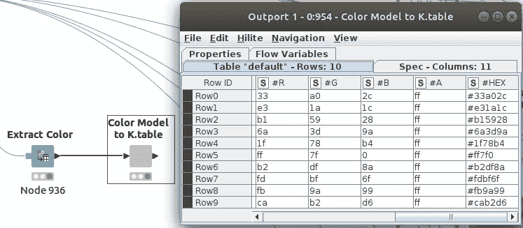

# 作为降维工具的神经网络和神经自动编码器:Knime 和 Python

> 原文：<https://towardsdatascience.com/neural-networks-and-neural-autoencoders-as-dimensional-reduction-tools-knime-and-python-cb8fcf3644fc?source=collection_archive---------4----------------------->

## 用 Python 中的 Knime 和张量流实现，分析空竹中间的数据。


我们能抓住物体的本质吗？。在 [Unsplash](https://unsplash.com?utm_source=medium&utm_medium=referral) 上由 [Maja Petric](https://unsplash.com/@majapetric?utm_source=medium&utm_medium=referral) 拍摄的照片

[在我的第一个故事](/umap-dimension-reduction-and-dbscan-for-clustering-mnist-database-within-knime-421f471fcbd)中，我写了一个关于嵌入来自 OpenML 的 [MNIST 数据集中的图像的小故事，这些图像是由 Yann LeCun、Corinna Cortes 和 Christopher J.C. Burges](https://www.openml.org/d/554) 写的从 0 到 9 的手写数字。我用 UMAP 算法进行降维。之后，我使用 DBSCAN 进行聚类，并识别出原始聚类。我将再次使用相同的数据集。

# 这个故事的提议是什么？

现在，我将探索一条非常相似的路径，但是我将使用神经网络和神经自动编码器，而不是 UMAP 算法来进行降维。我将在 Knime、Keras integration、environment 和 Python 中的 TensorFlow 中这样做。降维后，我将使用 DBSCAN 来验证由神经网络创建的聚类是否可以被识别。所有代码和工作流将被共享。

关于无代码深度学习的更多信息，我建议下面这本由 [Rosaria Silipo](https://medium.com/u/fb562cc4a1e2?source=post_page-----cb8fcf3644fc--------------------------------) 和[Kathrin Melcher](https://medium.com/u/5d882a91cc7f?source=post_page-----cb8fcf3644fc--------------------------------):*[*无代码深度学习*](https://www.knime.com/codeless-deep-learning-book)*编写的书，作为在 Knime 环境中安静地走过深度学习的指南。**

# **神经自动编码器**

****

**图一。深度神经自动编码器。(图片由作者提供)**

**简单的神经自动编码器是前馈神经网络的一种特殊结构，如前图 1 所示，输入层的维数等于输出的维数，每幅图像的 *n* 。**

**自动编码器像常规前馈神经网络一样，通过反向传播来训练，以便得到与输入相等的输出。因此，它们能够再现它们被训练过的输入。事实上，如果我们向训练好的网络输入类似于训练时使用的输入，那么预期的输出将非常接近输入。如果没有发生这种情况，我们可以得出结论，该输入不是一个“常规”或常见的输入。例如，这种能力通常用于检测欺诈性信用卡交易。由于没有太多的欺诈卡交易数据可用，所以用正常交易数据训练网络是有意义的，如果最终网络不能再现输入，我们可以说我们面临欺诈。这就是为什么自动编码器被认为是一种无人监管的算法。你可以在 TDS 的以下文章中找到更多关于自动编码器的信息， [*使用自动编码器进行异常检测*](/anomaly-detection-using-autoencoders-5b032178a1ea) 或 [*应用深度学习—第三部分:自动编码器*](/applied-deep-learning-part-3-autoencoders-1c083af4d798) 你也可以查看我的[自动编码器公开列表](https://israel-fernandez-pina.medium.com/list/autoencoders-6d46c729284a)故事*。***

**回到我最初的目的，即使用自动编码器作为降维技术，如图 1 所示，有一个最小维度层。*空竹的中心。***

****

**图 2。奥斯卡·尼迈耶首都大教堂。 [ckturistando](https://unsplash.com/@ckturistando?utm_source=medium&utm_medium=referral) 在 [Unsplash](https://unsplash.com?utm_source=medium&utm_medium=referral) 上拍摄的照片**

**特别是在图中，维数是 n=2。这一层是代码。它被称为潜在空间。在神经网络中的这一点上，我们可以认为我们已经对输入进行了编码，并且我们应该能够检测到，在这种情况下，在 2D 图中，根据输入数据中存在的不同隐式类别，我们具有不同的点聚类。**

# **结构和来源**

**我们将使用 TensorFlow 在 Knime 和 Python 中执行测试。**

**Knime 中需要一些配置，这样你就可以用 Keras 训练一个神经网络。请跟随本教程 [KNIME 深度学习——Keras 整合](https://www.knime.com/deeplearning/keras)。**

**这篇文章的结构如下:**

**第一部分。使用自动编码器进行降维**

**如上所述，我们使用简单的密集自动编码器进行降维，并将逐步比较它在 Knime 和 Python 中的实现。**

**第二部分。使用密集神经网络进行降维**

**将执行另一个有趣的方法。因为用于该测试的参考数据集具有关于每个样本的类别的信息，而不是使用自动编码器，所以将使用具有 2 或 3 个神经元的内部层的密集神经网络，因此将定义一种潜在空间。请检查下面的图 3，该图描述了具有特定数量的类 C=10 的网络，这是我们的数据集的情况。**

****

**图 3。深度神经网络。(图片由作者提供)**

**类似地，我们将逐步分析 Knime 和 Python 中的实现。**

**在我们开始之前，你会在我的 [GitHub](https://github.com/Icemaninhell/Knime/tree/main) 中找到所有 Python 代码，在 Knime Hub 的[我的公共空间](https://kni.me/w/itXKOCEflnRLas-r)中找到 Knime 工作流。**

## **Knime 工作流程**

**您会发现 Knime 工作流包含了针对每种不同方法的两种不同的解决方案:**

**第一部分。使用自动编码器进行维度缩减。对于 2D 和 3D 潜在空间来说，工作流程会有两种不同的结局。或者，**

***第二部分。使用密集神经网络进行降维*也有两个不同的分支，分别用于 2D 和 3D 最小维表示。**

**让我向您展示整个工作流程的全局概述，以便您可以了解不同的分支。**

**在图 3b 中，黄色工作流对应于 2D 和 3D 的第 1 部分中的自动编码器架构，蓝色工作流对应于密集架构的第 2 部分。**

****

**图 3 之二。全球工作流程概述(图片由作者提供)**

## **Python 代码**

**有两种 Python 代码可用:**

**[KNIME _ Replication _ 3D _ Midpoint . py](https://github.com/Icemaninhell/Knime/blob/main/KNIME_Replication_3D_Midpoint.py)用自动编码器进行训练和推理[KNIME _ Replication _ 3D _ Midpoint _ DM . py](https://github.com/Icemaninhell/Knime/blob/main/KNIME_Replication_3D_Midpoint_DM.py)用密集连接网络进行训练和推理。在这两个代码中，当不带参数执行代码时，假定潜在空间为 3D。但是，您可以传递一个参数来指示潜在空间的期望大小，例如 3。**

```
**pyhton3 KNIME_Replication_3DMidpoint_DM.py **3****
```

**还提供了一个辅助 Python 文件， [ml_functions.py](https://github.com/Icemaninhell/Knime/blob/main/ml_functions.py) ，其中定义了一个类 ModelGr 及其方法，并在主代码中使用。**

# **第一部分。使用自动编码器降维**

## **数据预处理**

****

**图 4。数据预处理。(图片由作者提供)**

**如图 4 所示，我们使用 Python 源节点捕获数据，对数据进行标准化，然后立即使用颜色管理器节点定义颜色代码，该代码将在整个工作流程中唯一分配给类，因此不同的图将具有相同的图例。之后，建立不同的用于训练和验证的分区。**

****

**图 5。导出颜色代码(图片由作者提供)**

**使用图 5 中的先前节点，我们可以提取正在使用的颜色代码(在#HEX 列中),这样我们就可以在 Python 中重用它们。这将使比较结果更加容易。**

**代码 1 显示了与获取数据和分区相关的部分初始 Python 代码。**

**代码 1。获取和分区。**

**每当使用为 ModelGr()类定义的`forward`方法执行前向推理时，就会进行规范化。请参见下面的代码 2，第 5 行。**

**代码 2。正向函数的规范化。**

## **Keras 神经网络架构**

**在 Knime 中，神经架构被定义为一系列 Keras 密集层节点。接下来，在图 6 中，示出了定义的全局方案。**

****

**图 6。全球培训计划(图片由作者提供)。**

****

**图 7。网络定义。**

**图 7 中显示了一个特殊的节点。这是一个[组件](https://docs.knime.com/2020-07/analytics_platform_components_guide/index.html#introduction)节点，它封装了几个节点和一个配置接口，配置接口带有定义内部节点性能的功能参数。在图 8 中，显示了层的顺序，在图 9 中，您可以找到可以为组件配置的参数。CTRL+双击网络定义组件将进入图 8 所示的内部节点定义。双击网络定义组件将打开图 9 的配置窗口。基本上，可以定义层的大小和激活函数。**

****

**图 8。配置神经网络模型的层序列(图片由作者提供)。**

****

**图 9。网络参数定义(图片作者提供)。**

**请注意，我们已经定义了一个输入层、五个内部层和一个输出层。在这一点上，激活函数对所有层都是通用的，双曲正切，如图 9 所示。除了上面提到的，层配置参数可以通过进入图 8 中每个节点的配置来配置，也就是说，内核和偏置初始化器、正则化器和约束。请注意，在图 9 中，对于 2D 潜在空间的情况，在第四层中，我们将大小定义为 2。对于 3D 选项，您会发现一个替代的工作流程。**

**虽然我没有使用[脱落层来防止过度拟合](/preventing-deep-neural-network-from-overfitting-953458db800a)，但这很容易，如图 9 之二所示。只需添加一个脱落层并重新连接节点。**

****

**图 9 之二。添加脱落层(作者图片)**

**对于 Python 网络，已经定义了一个类`ModelGr()`,当被调用时，将被告知激活函数、层大小、层数和名称。请参见代码 3 第 14 行+中的模型定义:**

**代码 3。网络配置和模型创建。**

**从概念上讲，定义了一个[顺序网络](https://www.tensorflow.org/api_docs/python/tf/keras/Sequential)(代码 4，第 15 行),我们递归地添加包含在调用中的大小和激活函数的层(代码 4，第 17+行)**

**代码 4。神经网络的定义和创建。**

**从不同的图和代码中可以看出，网络具有以下层次和大小:**

*   **[784(输入)，300，48， **2 或 3(潜在空间)**，48，300，784]和**
*   **激活函数是双曲正切函数。**

## **训练网络**

**在 Knime 中训练网络很容易。在前面的图 6 中，Keras 网络学习者只需要输入训练数据和验证数据。必须定义培训的输入和目标数据。由于我们正在训练自动编码器，输入和目标数据具有相同的大小，特别是来自 MNIST 的图像的 784 像素。在其它参数中，在该节点中定义了在训练中要最小化的损失函数。请注意，我们选择的是 MSE，均方误差。我们将训练最小化输入和输出向量之间的 MSE，因为理想情况下，我们希望它们相等。**

****

**图 10。Keras 网络学员配置对话框(图片由作者提供)。**

**对于 Python 和 TensorFlow，定义了一个训练函数。请注意，在代码 5 的第 21 行，损失函数的定义是 RMSE，均方根误差，正如我们在 Knime 中所做的那样。`RMSE_loss()`方法在`ModelGr()`类中定义，可以在代码 5bis 中找到。**

**代码 5。自动编码器的训练功能。**

**代码 5 之二。自动编码器的均方根损失函数。**

**如果您需要检查培训是如何发展的，这两种方法都可以做到。在 Knime 中，在 Keras 网络学习者节点中，右击并点击“查看学习监视器”。参见学习监视器 un 图 10.1**

****

**图 10.1。Keras 网络学习者节点学习监视器(图片由作者提供)。**

**在 TensorFlow 的情况下， [TensorBoard](https://www.tensorflow.org/tensorboard) 可以用来收集和分析网络。**

> **[TensorBoard](https://www.tensorflow.org/tensorboard) 提供机器学习实验所需的可视化和工具:**
> 
> **-跟踪和可视化损失和准确性等指标**
> 
> **-可视化模型图(操作和层)**
> 
> **-查看权重、偏差或其他张量随时间变化的直方图**
> 
> **-将嵌入投影到低维空间…**

**在代码 5 中，添加了几行代码(6、22、23、30+)来收集关于训练和网络图、权重和损失的数据。共享 Python 代码[密集](https://github.com/Icemaninhell/Knime/blob/main/KNIME_Replication_3D_Midpoint_DM.py)和[自动编码器](https://github.com/Icemaninhell/Knime/blob/main/KNIME_Replication_3D_Midpoint.py)，在结束执行前自动启动 TensorBoard。在图 10.2 和图 10.3 中，您可以看到曲线图和损耗变化。**

****

**图 10.2。网络图(图片作者)。**

****

**图 10.2。TensorFlow 中训练时的损耗演变(图片由作者提供)。**

## **提取中点**

**我们已经训练了网络，它们被配置为神经自动编码器，现在是时候得到输出了。在 Knime 中，请注意图 11 中的 Keras 网络学习器有一个红色的输出端口。该输出是经过训练的网络模型。因此，执行网络只是连接被告知模型和数据的 Keras 网络执行器节点。但是必须小心。**

****

**图 11。推断(图片由作者提供)。**

**请记住，我们希望提取自动编码器的潜在空间，因此我们必须配置 Keras 网络执行器节点来提供特定的输出。这通过将对应于潜在空间的层定义为输出来完成。图 12 显示了如何将潜在空间配置为网络执行器节点的输出。**

****

**图 12。配置网络执行器的输出(图片来自作者)。**

**在 Python 中，我们构建了一个紧凑的顺序网络，为了提取中点，我们使用了一个名为`Encoder()`的类。当定义一个对象为`Encoder()`时，通过调用`Encoder = mli.Encoder(model)`和`model`一个顺序网络模型，`__init__`方法将提取网络的层，并将它们添加到另一个顺序网络中，从初始层到最小尺寸层，也就是说，潜在空间。请参见代码 6 第 9 行中的条件。**

**代码 6。编码器的创建。**

**定义了一个`forward`方法来推断编码器。如代码 7 所示。**

**代码 7。编码器模型的正演方法。**

**编码器被定义为从初始层到最小尺寸层的神经网络部分，因此`forward`方法将提供潜在空间。**

## **自动编码器网络的结果**

**将显示潜在空间的图形结果。**

****2D 结果并试图得到集群。****

**在图 12 和 13 中，绘制了 Knime 和 Python 两种环境下自动编码器的 2D 潜在空间。可以检查到，人眼可以感知某种顺序和一致性，但是，对该数据应用 DBSCAN 算法不会导致与在自动编码器的潜在空间中定义的那些聚类相关的任何聚类。**

****

**图 13。自动编码器网络的 KNIME 工作流程中的 2D 潜在空间(图片由作者提供)。**

****

**图 14。2D 的潜在空间。用于自动编码器网络的 TensorFlow 和 Python。(图片由作者提供)。**

**在自动编码器工作流程的右侧，应用了 DBSCAN 算法。请记住，DBSCAN 由两个参数决定:**

*****ε****:指定点之间的距离，这样它们就可以被认为是一个簇的一部分。如果两个点之间的距离小于ε，则这两个点将被视为属于同一聚类的邻居。***

*****最小点数*** *:从一个点 p 可达的最小点数，使得 p 点可以被认为是核心点。***

**经过几次测试后，没有一对参数能够得到正确的聚类。在图 15 中，为了证明这种尝试，显示了 DBSCAN 集群。**

****

**图 15。自动编码器网络的 KNIME 工作流中的 2D 潜在空间 DBSCAN 聚类。**

****3D 结果并尝试获取聚类****

**或者，我进行了同样的工作，但有一个三维潜在空间。没有太多的变化需要解释，但事实是，在 Knime 和 Python 中，定义潜在空间的层的维度在逻辑上是 3，而不是 2。**

**参见下图 16–18，来自 Knime 和 Python 的 3D 潜在空间。**

**可以再次检查，可以设想某种顺序和一致性，但是，再次，对该数据应用 DBSCAN 算法不会导致与在自动编码器的潜在空间中定义的聚类相关的任何类似的聚类。查看图 18。**

****

**图 16。自动编码器网络的 KNIME 工作流中的 3D 潜在空间(图片由作者提供)。**

****

**图 17。3D 潜在空间。用于自动编码器网络的 TensorFlow & Pyhon。(图片由作者提供)。**

****

**图 18。自动编码器网络的 KNIME 工作流中的 3D 潜在空间 DBSCAN 聚类(图片由作者提供)。**

## **自动编码器生成的图像**

**在图 18.1 和 18.2 中，您可以根据 3D 潜在空间自动编码器推断后的 MSE 计算找到最佳和最差图像。**

****

**图 18.1。根据每个原始类别的均方误差得出的最差重建图像(图片由作者提供)**

****

**图 18.2。根据每个原始类别的均方误差的最佳重建图像(图片由作者提供)**

# **第二部分。密集神经网络降维**

**那么，我们可以说，到目前为止，这是一个失败的故事。**

**投降前我尝试了另一种方法。正如我所解释的，因为我们有数据集中每个样本的类别，所以可以为 2D 和 3D 的潜在空间设想一个如图 3 所示的网络。这是一个分类器网络，其最小尺寸为 2 或 3 个内层，可以被认为是潜在空间。**

## **差异**

**显然，训练的损失函数有了重大变化。现在，我们希望优化一个分类器和一个正确的损失函数来做到这一点，即[交叉熵损失](/cross-entropy-loss-function-f38c4ec8643e)。交叉熵损失主要结合 [Softmax 激活函数](/softmax-activation-function-how-it-actually-works-d292d335bd78)使用。**

**研究一下这些概念是很有趣的。**

****

**图 19。具有潜在空间的范畴分类器。Softmax 和交叉熵(图片来自作者)**

**在上图 19 中，Softmax 将 logits，vector ***O*** ，转化为 probabilities，vector ***P*** 。交叉熵的目的是获取向量 ***P*** 中包含的输出概率，并测量与标签向量 ***L*** 中表示的类值的距离，作为一个独热向量。参见图 19 右侧的矢量示例。**

**目标是使模型输出尽可能接近期望的输出(类值)。我们如何做到这一点？**

**克尼姆**

**必须将 Softmax 定义为最后一个 Keras 密集层的激活函数，将交叉熵定义为 Keras 网络学习器中的损失函数。参见图 20 和 21。**

****

**图 20。配置了 Softmax 激活功能(图片由作者提供)。**

****

**图 21。分类交叉熵损失函数已配置(图片由作者提供)。**

***Python 和张量流***

**如前所述，必须根据暴露的标准定义损失函数。参见代码 8。**

**代码 8。分类器结构网络的损失函数**

**在代码 8 中执行逻辑和标签之间的稀疏 Softmax 交叉熵。使用交叉熵函数的 [*稀疏*变异，不需要建立一个热向量，可以直接输入标签。](https://www.tensorflow.org/api_docs/python/tf/nn/sparse_softmax_cross_entropy_with_logits)**

**在这两个平台中，网络具有以下层和大小:**

*   **[784(输入)，300，100，10， **2 或 3(潜在空间)**，10，10]和**
*   **输出图层的激活函数为双曲正切和 softmax**

**两个平台以及 2D 和三维潜在空间的总体准确度在 94%和 96%之间，混淆矩阵类似于图 23 中的以下内容，提取自图 22 中 Knime 的 Scorer 节点。**

****

**图 22。计分器节点(按作者排序的图像)**

****

**图 23。神经分类器的混淆矩阵(图片由作者提供)**

## ****2D 的结果并试图得到集群。****

**接下来，您可以在 Knime(图 24)和 Python(图 26)中找到新方法的 2D 潜在空间的结果。现在可以清楚地区分簇，并且 DBSCAN 算法很容易检测到它们。对 Knime 结果执行 DBSCAN，如图 25 所示。**

****

**图 24。分类器架构的 2D 潜在空间。克尼姆。(图片由作者提供)**

****

**图 25。Knime 结果上的 2D 数据库扫描聚类。克尼姆。(图片由作者提供)**

****

**图 26。Python/TensorFlow 中的 2D 潜在空间(图片由作者提供)**

****3D 结果并尝试获得集群。****

**在查看 3D 结果之前，无需进一步解释。对于神经密集架构，我在 Knime 中准备了一些节点，以准备将数据导入到 [Plotly](https://chart-studio.plotly.com/feed/#/) 中，这样您就可以探索并与绘图互动。这不是一项大工作，但它也包含在[工作流](https://hub.knime.com/iceman/spaces/Public/latest/Autoencoder%20MNIST%20MidPoint%20Focus~itXKOCEflnRLas-r)中，所以你可能想探索它并重用它。**

**图 27 显示了 3D 潜在空间，图 28 显示了 DBSCAN 聚类。这种方法的结果相当不错。识别集群。通过单击图例，可以隐藏轨迹。**

**图 27。分类器的 Knime 结果的 Plotly 3D 交互散布。(Plotly 图表工作室。按作者)**

**图 28。分类器的 Knime 结果的 Plotly 3D 交互散布。(Plotly 图表工作室。按作者)**

**最后，图 29 显示了三维密集网络的张量流结果，这是静态的。**

****

**图 29。Python 3D 潜在空间(图片由作者提供)**

# **结论**

**我的目的是探索一个想法，使用神经网络进行降维，降低到 2 或 3 维，这是非常严格的，并在两种环境中进行，Knime 和 Python。在粗略的方法中，不可能从神经自动编码器中提取清晰的聚类，在这些环境中没有一个*没有进一步的改进*。低至 2 或 3 维的潜在空间是图形探索的一个好选择，但它太有限，无法捕捉原始对象的特征。另一方面，在两种环境中，用具有 2 维或 3 维内层的密集神经分类器确实可以做到这一点。我们可以得出结论，Knime 与 Keras 集成和 Python 与张量流的结果可以被认为是等价的，至少在本文的范围内是这样。在我看来，**是个好消息**，因为机器学习的大门敞开着，不需要强大而坚实的编码背景，因此，贡献的人越多，我们一起到达的路就越长。**

**在不久的将来，我将探索自动编码器中那些*必要的改进*，这样我就可以实现我最初的目标。**