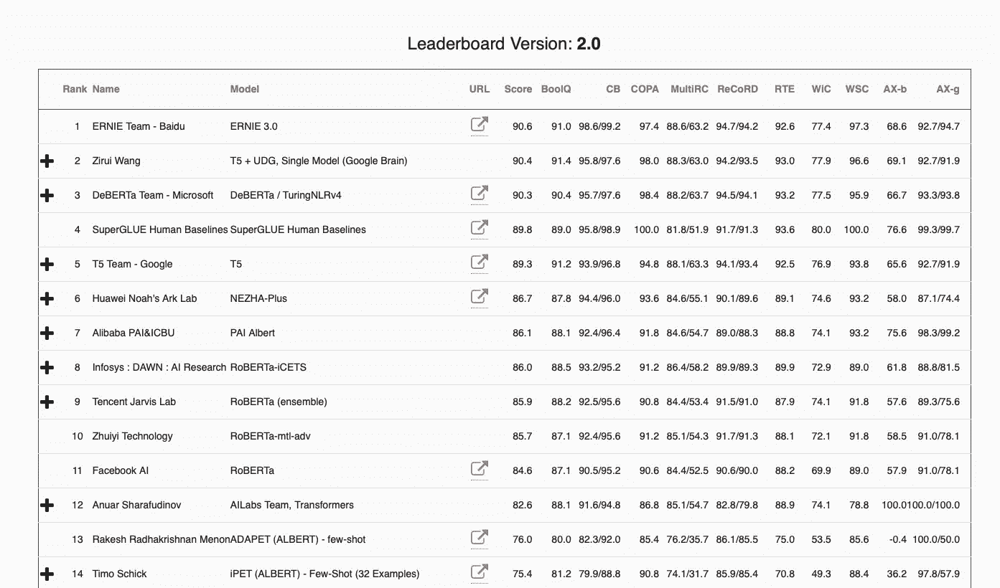

# 神经网络就像人体一样

> 原文：<https://towardsdatascience.com/neural-networks-are-like-human-bodies-852871fcbdb8?source=collection_archive---------32----------------------->

## 优化者就像私人教练

神经网络。他们似乎无处不在。如果你是一个经验丰富的从业者，这不是问题；你明白它们是怎么回事。通常，你会很快想出一个解释。

基拉·奥德·海德在 [Unsplash](https://unsplash.com?utm_source=medium&utm_medium=referral) 拍摄的照片

然而，如果你是一个局外人或这个领域的新手，事情就有点不同了。你可能没有计算机科学背景，直接告诉你渐变、图层和激活毫无意义。为了顺利进入这个迷人的领域，看看下面的简单比较。

# 神经网络就像人体一样

神经网络有我们可以调整的参数。这些参数通常称为权重。

你的身体也是如此。你的身体也有参数；它们只是被称为肌肉和肌腱。

有了神经网络，我们往往想达到一个特定的目标，比如检测物体。为了实现这一点，这些参数共同发挥作用。

在你的身体里，这和*完全*一样。例如，当你走路时，一个目标是保持平衡。为此，你的肌肉相应地收缩和放松，它们一起工作。

现在，神经网络最初并不完美。相反，他们必须接受训练。培训通过向他们展示无数他们应该能够做什么的例子来进行。

以你的身体，这也是一样的。例如，当你学习走路时，你会重复同样的动作很多次，直到它合适为止。大量的重复教会你的肌肉、肌腱和关节相互作用。

**奖励:**为了“感受”什么是神经网络，你可以直立起来。然后，将两臂向侧面抬起，直到成 90 度左右。最后，将一条腿抬离地面，用另一条腿保持平衡。一旦你稳定下来，向前、向后、向侧面倾斜。你可以感觉到你的身体各部分在一起工作以实现你的目标——就像神经网络的重量一样。

# 优化者就像私人教练

如前所述，神经网络需要训练才能胜任任务。人们通常使用优化器来实现这一点。

你可以把优化者想象成健身房里的私人教练。当你练习时，教练会观察你的动作。

用于神经网络的优化器(Adam 是一个常见的名字)也有同样的任务。在训练期间，它们告诉网络如何更新它的权重。

在健身房，你的教练纠正你就是这种情况。这些话可能是:“保持背部挺直”或“锁定肘部”。这是为了帮助你更快地实现目标。

亚当和他的朋友们(SGD，Adagrad 是他们的一些名字)走在同一个方向。他们首先计算特定的权重如何影响模型的输出。然后，他们更新该值，使网络变得更好。

你在健身房得到的指导也是类似的方向。首先，你会被检查是否有明显的缺陷(比如过于圆的背部)，因为它们对你的目标有最大的影响。之后，你的姿势的更小的方面被纠正(比如张开手指做一个练习)。

# 训练就像为比赛做准备

一旦亚当和他的团队来帮忙，神经网络的事情就变得严重了。如前所述，它有特定的任务。

对你来说，这样的任务可能是为武术比赛做准备，而私人教练——你的优化者——会帮助你。

神经网络训练的竞赛被称为“ImageNet 大规模视觉识别挑战”或“通用语言理解评估”。这种挑战使得基于标准规则集比较不同神经网络的性能变得容易。

对于你的武术比赛，规则可以是禁止踢腿或肘击。

为了达到良好的效果，神经网络在上述优化器的帮助下进行训练。他们一起工作，用典型的数据告诉他们在比赛中会发生什么。

在你的情况下，训练可能会被构造成执行相同序列的无休止的变化。结果，你的身体通过增长肌肉、变得更加灵活等方式明确适应强加的需求。

神经网络的权重做类似的事情:它们的值增加或减少，并根据训练加强或削弱它们的连接。

# 验证就像一次中级考试

在训练期间，您通常希望评估神经网络的性能。为此，您可以使用独立于定型数据的数据集:验证数据。每隔几轮训练，网络都要处理这个数据集。

大学讲座也遵循类似的原则。在学期中，你通过做推荐练习来准备期末考试。然后，为了帮助你评估自己的表现，教授们会提供中级考试。

对于神经网络，验证数据必须不同于训练和测试数据，并且应该具有类似的结构。只有这样，我们才能保证我们的评估是公正的，但描述性的。

就你的讲座而言，你的准备练习(=训练数据)和中级考试(=验证数据)应该包含不同的任务，但涵盖相同的概念。同样，训练数据应该不同于两者，但也涵盖相同的想法。这是获得诚实的自我评估的唯一方法。

# 测试就像一场竞赛

在神经网络被训练之后，是时候在一个标准化的任务中测试它的性能了(如前所述)。各种问题都有挑战，各有排行榜。

在体育界，存在着无穷无尽的各种各样的学科。从跑步等经典运动到滑板等更现代的运动，每个运动都有自己的排名。

为了在看不见的数据上测试神经网络，从业者使用测试数据集。该数据集包含新内容，但具有与训练(和验证)数据相同的特征。

以滑板比赛为例。规则是已知的，每个人都有时间准备他们的行动。然后，参与者在确定的地点集合，让陪审团评判他们的表现。

对于神经网络，度量代替了陪审团。这些指标旨在用一个或多个数字来捕捉模型的性能。通常，指标越高，模型的收益越好。

在我们的运动会上，每个滑板运动员都由同一个评审团评判。他们通过分配数字对参与者的表现进行排名。在这里，相同的技巧必须得到相同的分数，不管是谁做的。否则，我们无法确保公平竞争。

在神经网络的世界中，度量标准用于模型之间的比较。因此，可以对模型进行排名，这导致[出现如下](https://super.gluebenchmark.com/leaderboard)所示的排行榜:

强力胶基准测试的[排行榜](https://super.gluebenchmark.com/leaderboard/)(从 12 年 10 月开始。2021).作者截图；关于[强力胶的网页](https://super.gluebenchmark.com/)的更多信息。

如你所见，顶部的空气变得稀薄。两位候选人之间的差距不到一个百分点。通常，研究人员投入了大量的工作才走到这一步。

在体育比赛中，公平竞赛是必不可少的组成部分。如果成功不是自然而然取得的，那么比你的对手优秀是没有用的。

当向神经网络提交挑战时(或者更确切地说，是它们获得的分数)，第三方理解结果是如何获得的是至关重要的。或者，更好的是，复制它们。

在运动和神经网络方面的一切都被清除后，是时候庆祝胜利了。但只能等到下一次挑战。