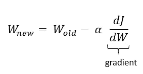

# 神经网络反向传播变得容易

> 原文：<https://towardsdatascience.com/neural-networks-backpropagation-by-dr-lihi-gur-arie-27be67d8fdce?source=collection_archive---------8----------------------->

## 香草神经网络背后的数学直觉的友好指南。

图一。神经网络中的反向传播|作者图片

# 介绍

在设计高效的深度模型时，理解神经网络(NNs)背后的数学操作数对于数据科学家的能力非常重要。在本文中，将展示全连接神经网络的高级演算，重点是反向传播步骤。这篇文章面向对神经网络有基本知识的人，他们试图更深入地研究神经网络的结构。

# 背景

训练过程的目标是找到使误差最小化的权重(W)和偏差(b)。这是通过**梯度下降**算法完成的。首先，随机初始化权重，并且执行细微权重变化的迭代过程，直到收敛。

每次迭代从正向传递开始，输出当前预测，并通过成本函数 J(等式 6)评估模型的误差。接下来，进行反向传递来计算权重梯度。

图二。简化的成本函数曲线。在神经网络中，这个函数可能不是凸的。|作者图片

为了找到使误差最小的最佳参数，我们使用梯度下降算法。目标是找到成本函数(J)的最小点，其中梯度接近于零(图 2)。该算法在最陡下降的方向上朝着最小点逐步迭代移动。步长被称为“**学习速率**，它是一个标量，决定了每次迭代中权重的变化，从而决定了 NN 收敛的速度。学习率是一个必须调整的超参数。较小的学习率需要更多的训练时间，而较大的学习率会导致快速训练，但可能会损害性能和不稳定性。

为了更新权重，梯度乘以学习率(α),并且通过以下公式计算新的权重:

等式 1。梯度下降的权重更新公式。W =权重，alpha =学习率，J =成本。

随着模型的迭代，梯度逐渐向零收敛，其中误差很可能是最低的(或者，模型可能收敛到局部最优并呈现次优性能)。

# **描述网**

本文将遵循两层神经网络的结构，其中 X(也称为 A[0])是输入向量，A[1]是隐藏层，Y-hat 是输出层。网络的基本架构如下图所示(每层中的神经元数量与方程无关，因为我们使用的是矢量化方程):

图 3。两层神经网络|作者图片

# **向前传球**

为了理解反向传播是如何计算的，我们首先需要概述一下正向传播。我们的网络从一个矢量化的线性方程开始，其中的层数用方括号表示。

等式 2。直线方程。

接下来，添加非线性**激活函数** (A)。这种激活使网络能够打破线性并适应数据中的复杂模式。可以使用几种不同的激活函数(例如， [sigmoid](https://en.wikipedia.org/wiki/Sigmoid_function) 、 [ReLU](https://en.wikipedia.org/wiki/Rectifier_(neural_networks)) 、 [tanh](https://en.wikipedia.org/wiki/Hyperbolic_function) )，这里我们将使用我们的 NN 的 sigmoid 激活。

等式 3。乙状结肠激活。

到目前为止，我们计算了第一层。第二层和第一层一样，由一个线性方程(Z[2])组成，后面是一个 sigmoid 激活(A[2])。由于这是我们网中的最后一层，激活结果(A[2])就是模型的预测(Y-hat)。

方程式 4 + 5。直线和 sigmoid 方程。

最后，为了评估和最小化误差，我们定义了一个**成本函数**(关于激活和成本函数的更多信息，请参考参考文献[ [1](https://medium.com/@zeeshanmulla/cost-activation-loss-function-neural-network-deep-learning-what-are-these-91167825a4de) ])。这里我们使用的是“均方误差”(MSE)函数。为了简单起见，我们将使用随机梯度下降(SGD)方法[ [2](/stochastic-gradient-descent-clearly-explained-53d239905d31) ]，这意味着在每次迭代中只处理一个样本。

等式 6。均方误差成本函数。

我们可以总结出向前传球的计算图

图 4。作者提供的向前传递|图像的计算图

# 偶数道次

为了在每次迭代后更新权重和偏差，我们需要计算梯度。在我们的两层网络中，有 4 个参数需要更新:W[2]，b[2]，W[1]和 b[1]，因此需要计算 4 个梯度:

但是我们如何找到这些复合函数的导数呢？根据'**链式法则**'，我们将沿着连接变量的所有路径构建导数的乘积。让我们遵循第二层(W[2])梯度的权重:

图 5。W[2]渐变|作者图片

从上图中，我们可以清楚地看到，成本 J 相对于 W[2]的变化为:

方程式 7。成本 J 相对于第二层 W[2]的权重的梯度

为了解决这个问题，我们将从计算成本 J 对 A[2]的偏导数开始，这也是预测 Y-hat。原始成本函数显示在左侧，导数显示在右侧:

等式 8。MSE 成本函数(左)及其对 A[2]的偏导数(右)。

A[2]中的 sigmoid 激活相对于 Z[2]的偏导数由下式表示(sigmoid 导数的数学发展在参考文献[ [3](https://becominghuman.ai/what-is-derivative-of-sigmoid-function-56525895f0eb) ]中描述):

等式 9。第二层上的 Sigmoid 激活(左)及其对 Z[2]的偏导数(右)。

Z[2]相对于权重 W[2]的偏导数:

方程式 10。第二层的直线方程(左)，它对 W[2]的偏导数(右)。

让我们将所有内容链接在一起，计算 W[2]梯度:

方程式 11。成本 J 相对于第二层的权重的梯度(W[2])

太好了！接下来，我们将以类似的方式计算 b[1]梯度。让我们跟随梯度:

图 6。成本 J 相对于第二层 b[2]的偏差的梯度|作者的图像

方程式 12。成本 J 相对于第二层(b[2])的偏差的梯度

上面已经计算了 b[2]梯度的前两部分(成本 J 相对于 Z[2]的偏导数)，最后一部分等于 1:

方程式 13。第二层的直线方程(左)，它是关于 b[2]的偏导数(右)。

所以总的 b[2]梯度是:

方程式 14。成本 J 相对于第二层 W[2]的权重的梯度

最后，我们完成了第二层的梯度计算。第一层的梯度有点长，但我们已经计算了它的一部分。让我们遵循 W[1]更新的梯度:

图 7。W[1]渐变|作者图片

梯度的前两部分是先前为层 2 计算的。Z[2]关于 A[1]的偏导数是 W[2]:

方程式 15。第二层的直线方程(左)，它对 A[1]的偏导数(右)。

最后两部分的计算方式与第 2 层中的计算方式相同。综合起来，我们得到:

方程式 16。成本 J 相对于第一层 W[1]的权重的梯度

如果我们遵循 b[1]梯度:

图 8。b[1]渐变|作者图片

我们会得到:

方程式 17。成本 J 相对于第一层 b[1]的偏差的梯度

通过这一部分，我们完成了对我们的神经网络的一次迭代的权重和偏差的所有梯度的计算。

# **体重更新**

一旦计算出梯度，我们就可以更新模型的新参数，并再次迭代直到模型收敛。表示α是学习速率，一个将决定收敛速率的超参数。

权重更新。W =权重，alpha =学习率，J =成本。层号用方括号表示。

# 最后的想法

我希望这篇文章有助于更深入地理解神经网络背后的数学。在本文中，我解释了小型网络的工作原理。然而，这些基本概念可以推广并适用于更深层次的神经网络。

# 感谢您的阅读！

**想了解更多信息？**

*   [**探索**](https://medium.com/@lihigurarie) 我写的附加文章
*   [**订阅**](https://medium.com/@lihigurarie/subscribe) 在我发布文章时获得通知
*   关注我的 [**Linkedin**](https://www.linkedin.com/in/lihi-gur-arie/)

***参考文献***

[1] *激活和成本函数。*[https://medium . com/@ zeeshanmulla/cost-activation-loss-function-neural-network-deep-learning-what-thes-91167825 a4 de](https://medium.com/@zeeshanmulla/cost-activation-loss-function-neural-network-deep-learning-what-are-these-91167825a4de)

[2]随机梯度下降。[https://towards data science . com/random-gradient-descent-clearly-explained-53d 239905 d31](/stochastic-gradient-descent-clearly-explained-53d239905d31)

[3] *乙状结肠衍生物。*[https://becoming human . ai/what-is-derivative-of-sigmoid-function-56525895 f0eb](https://becominghuman.ai/what-is-derivative-of-sigmoid-function-56525895f0eb)