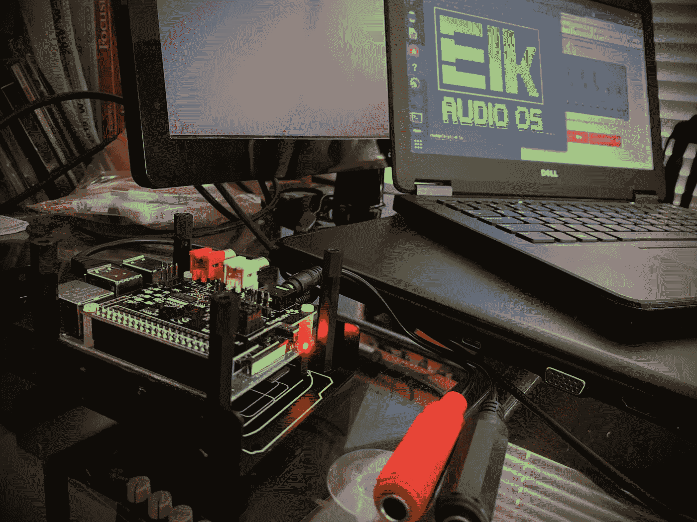

# 实时音频的神经网络:树莓皮吉他踏板

> 原文：<https://towardsdatascience.com/neural-networks-for-real-time-audio-raspberry-pi-guitar-pedal-bded4b6b7f31?source=collection_archive---------3----------------------->


作者图片

这是关于使用神经网络进行实时音频的五部分系列的最后一部分。
上一篇关于有状态 LSTMs 的文章，点击 [这里](/neural-networks-for-real-time-audio-stateful-lstm-b534babeae5d) *。*

***重要提示:*** *从写这篇文章的时候起，软件和硬件都有了很大的改进。这些更新列在本文的末尾，包括一个新的视频演示。*

在本文中，我们将一步一步地在 Raspberry Pi 上构建一个实时运行神经网络的功能性吉他踏板。

我们现在已经介绍了三种不同的神经网络模型，并使用 JUCE 框架在实时吉他插件中实现了它们。作为一名吉他手和工程师，对我来说，下一个合乎逻辑的步骤是使用我们从以前的文章中学到的知识来制作吉他踏板。令人惊讶的是，所有的软件工具都是免费的，硬件成本大约为 150 美元(如果你手头已经有所需的电源和音频适配器，价格会更低)。

让这成为可能的秘方是 [Elk Audio OS](https://elk.audio/) 。这是一个基于 Linux 的开源操作系统，专门用于嵌入式设备上的低延迟音频处理。它允许您在 Raspberry Pi 等设备上运行现有的 VST3 插件。

我写的软件叫 [NeuralPi](https://github.com/GuitarML/NeuralPi) ，在 Github 上开源。我包括了一个[依班娜 TS9 电子管发声器](https://www.amazon.com/Ibanez-TS9-Tube-Screamer-Classic/dp/B000T4PJC6)踏板的模型，以及一个[挡泥板布鲁斯 Jr.](https://www.amazon.com/Fender-0213205700-Junior-Guitar-Amplifier/dp/B001OI6LP0/ref=sr_1_1?dchild=1&keywords=fender+blues+jr&qid=1621863208&sr=8-1) 放大器。

下面是一个视频，展示了在 Raspberry Pi 硬件上使用 NeuralPi VST3 插件完成的项目:

特别感谢我的儿子(5 岁)拍摄的介绍(视频作者)

# 项目设置

该项目由四个主要部分组成:

1.  [Raspberry Pi 4b](https://www.raspberrypi.org/products/raspberry-pi-4-model-b/) (运行插件的迷你电脑)
2.  [HiFi Berry ADC + DAC](https://www.hifiberry.com/shop/boards/hifiberry-dac-adc/) (位于 Raspberry Pi 顶部的模数、数模转换板。
3.  [Elk Audio OS](https://github.com/elk-audio/elk-pi/releases/tag/0.9.0) 用于 Raspberry Pi4(专门用于音频的低延迟操作系统)
4.  为 Elk Audio OS 交叉编译的实时 VST3 插件( [NeuralPi](https://github.com/GuitarML/NeuralPi/releases/tag/v1.0) )(运行带有吉他放大器/踏板模型的神经网络引擎的插件)

# 零件和价格的完整列表:

这是我为这个项目购买的所有东西的清单，除了 HiFiBerry ADC +DAC，我从芝加哥电子公司订购的，其他都是从亚马逊订购的。


Raspberry Pi / HifiBerry 设置(图片由作者提供)

1.  **树莓派 4b** (亚马逊)，50 美元(我见过售价 35 美元的 Rpi4)
2.  Rpi4 电源适配器(USB-C 连接器，5.1V — 3.5A **)** $10
3.  Micro SD 卡(最低 8GB，我买的是 32GB)，12 美元
4.  Rpi4 + HiFiBerry 兼容外壳，(这里你想花多少就花多少；我买了一个适合原型制作的可定制外壳，但不同的外壳更适合成品)$20
5.  HDMI 微型转标准 HDMI 适配器电缆(Rpi4 有 2 个微型 HDMI 输出)$8
6.  **HiFi Berry ADC + DAC** ，(有一款“pro”版售价 65 美元，但我坚持用标准版)$50
7.  双 1/4”女性到 1/8”男性立体声音频适配器(用于将吉他插入 HifiBerry)，8 美元
8.  立体声男性 RCA 到 1/4”女性音频适配器(我买了 1/8”的耳机使用，但 1/4”将是典型的吉他踏板输出)，8 美元

**零件总成本:166 美元+税费和运费**

**我已经拥有的其他物品:**

*   带 HDMI 输入的独立电脑显示器(可使用任何带 HDMI 输入的屏幕)(50 美元及以上)
*   有线 USB 键盘(10 美元)
*   运行 Ubuntu Linux 的笔记本电脑(用于构建 VST3 插件并通过 WiFi 与 Rpi4 通信(翻新，$250)，*你也可以使用运行 Linux 的虚拟机*
*   1/8 英寸公头至 1/4 英寸母头适配器 5 美元(用于使用放大器代替耳机)

*注意:除非你自己交叉编译插件，否则不需要单独的 Linux 计算机。但是，您需要一台单独的计算机来连接和上传 VST3 到 Raspberry Pi(通过 WiFi 或以太网)*

# 组装硬件

HifiBerry 通过两排插脚连接器插入树莓皮顶部。它带有垫片，可以将 HifiBerry 卡固定在 Rpi4 的顶部。我选择了一个通用原型设置的外壳，但 HiFiBerry 网站提供了一个[好看的外壳](https://www.hifiberry.com/shop/cases/steel-case-for-hifiberry-dac-pi-4-2/)用于一个简单的吉他踏板项目，没有额外的脚踏开关或旋钮。我可能最终会为最终产品构建自己的外壳。

硬件组装好后，你就可以连接所有必要的适配器了。如果您熟悉使用 Raspberry Pi 2，您会希望注意到它与 Raspberry Pi 4 的一些主要区别:

1.  HDMI 输出为微型(而非标准尺寸)
2.  电源线是 USB-C(而不是 micro USB)
3.  Rpi4 内置了 Wifi 和蓝牙功能

# 为 Raspberry Pi 4 + HiFiBerry 设置 Elk 音频操作系统 **ADC + DAC**

第一步是用树莓 Pi 4 的 Elk Audio OS 来闪存 micro SD 卡。为此，我们将使用一种叫做 [balenaEtcher](https://www.balena.io/etcher/) 的工具，但也有其他方法可以对 SD 卡进行成像。

**使用 Elk Audio 操作系统对 microSD 进行成像**

1.  从 [Github](https://github.com/elk-audio/elk-pi/releases) (.bz2)下载 Rpi4 的 Elk 音频操作系统镜像。拉开拉链。wic 文件。
2.  下载并安装 balenaEtcher。
3.  将 microSD 卡插入电脑(最低 8GB)(可能需要 USB 适配器将 microSD 连接到电脑)
4.  运行 balenaEtcher 并按照提示下载 microSD 映像。wic 文件。
5.  成像完成后，取出 microSD，插入 Raspberry Pi 4 上的 microSD 插槽。

**使用 Elk Audio 操作系统启动 Rpi4 并执行初始设置**

1.  使用 HDMI 将 Rpi4 连接到外部显示器，连接 USB 键盘，并连接电源。
2.  当登录提示出现时，键入“root”并按 enter 以 root 身份登录(默认情况下，root 没有密码，但如果需要，您可以设置一个)。
3.  配置 Elk 音频操作系统，以配合 HiFiBerry ADC + DAC 使用。在命令提示符下键入以下内容:
    `sudo elk_system_utils --set-audio-hat hifiberry-dac-plus-adc`

并重新启动 Rpi4 以使更改生效:
`sudo reboot`

4.按照官方 [Elk 文档](https://elk-audio.github.io/elk-docs/html/documents/working_with_elk_board.html#connecting-to-your-board)中的详细说明，配置通过 Wifi 或以太网进行通信。

5.您现在可以通过 WiFi 从另一台计算机 ssh(安全 shell)到 Rpi4。在我的 Ubuntu Linux 计算机上，这就像在终端上运行以下命令一样简单:

```
ssh mind@<ip_address_here>
# And enter the default password for "mind" user: "elk"# Files can also be transferred to the Rpi4
scp -r YourFile root@<rpi-ip-address>:/target_path/
```

*注意:一旦您将 Rpi4 连接到 WiFi，您可以通过在 Elk OS 终端中键入“* ip a *”来获取分配给它的 IP 地址。*

# 为吉他踏板选择神经网络模型

在过去的三篇文章中，我们讨论了三种神经网络模型及其实时实现。每个模型都有自己的优点和缺点。为了给我们的踏板选择最合适的型号，我们进行了一项简单的贸易研究。每个神经网络模型都有一个从 1 到 3 的分数等级，3 是最好的。选择了三个类别:训练速度、声音质量和实时性能。


表 1:模型选择贸易研究(图片由作者提供)

*注意:每个类别都被赋予了相同的权重，但实际上对于使用 Raspberry Pi 来说，实时性能将是最重要的因素，其次是声音质量。*

**状态 LSTM 模型在实时性能和声音质量方面获得了最高分。**没有国家的 LSTM 有更高的训练速度，但是对于我们创建定制吉他踏板的应用程序来说，这相对于拥有好的声音来说是次要的。WavNet 有很好的声音，但它较高的 CPU 使用率可能会在 Raspberry Pi 上造成问题(尽管这值得回去测试)。此外，WavNet 在处理高增益吉他声音方面的困难使得它在吉他踏板中的使用不太吸引人。

# Rpi4 与 Elk Audio 工具链和 JUCE 的交叉编译

如果你使用的是来自 [Github](https://github.com/GuitarML/NeuralPi/releases/tag/v1.0) 的 NeuralPi.vst3，可以跳过这一节。如果您想使用 JUCE 编译自己的 VST3，或者修改现有的 VST3 插件以在 Elk OS 上运行，可以使用这些步骤。Elk Audio OS 运行“无头”插件，这意味着没有图形界面。JUCE 6 包含了 headless 构建特性，但是你可能需要进一步修改你的插件，以满足[构建 Elk 插件文档](https://elk-audio.github.io/elk-docs/html/documents/building_plugins_for_elk.html)中详述的需求。

在 Linux 电脑或 Linux 虚拟机上(我用的是 Ubuntu 18.04):

1.  为 Rpi4 下载 [Elk Audio SDK](https://github.com/elk-audio/elkpi-sdk/releases/tag/0.9.0)
2.  运行下载的 SDK(。sh 文件)进行安装。我使用了默认位置:`/opt/elk/1.0`
3.  打开你的。使用 Projucer 应用程序的 jucer 项目(JUCE 6，我使用的是 JUCE 6.08)，并根据 [Elk 文档](https://elk-audio.github.io/elk-docs/html/documents/building_plugins_for_elk.html#cross-compiling-juce-plugin)修改项目(参见“内部 Projucer:”部分)。
4.  创建一个 Linux makefile 构建目标(如果它还不存在),并保存 Projucer 项目以生成 Makefile 目录和 Makefile。
5.  遵循[交叉编译 JUCE 插件](https://elk-audio.github.io/elk-docs/html/documents/building_plugins_for_elk.html#cross-compiling-juce-plugin)文档中详述的步骤。以下是我使用的具体步骤:

进入 *make* 命令后，插件将开始编译。如果一切顺利，你现在将拥有一个兼容 Elk OS / Raspberry Pi 4 的. vst3 插件。

重要提示:确保编译后的 VST3 中的架构文件夹名称为“aarch64-linux”，例如“plugin name . vst 3/Contents/aarch 64-Linux”，否则插件不会在 Elk OS 上运行。如有必要，将文件夹重命名为“aarch64-linux”。

# 使用 RTNeural 优化插件代码

当我第一次在 Raspberry Pi 上运行我的插件时，我立刻遇到了问题。它运行没有任何错误，但它发出了可怕的声音:

在[麋鹿音频论坛](https://forum.elk.audio/t/guitar-pedal-bad-sound-using-juce-cross-compiled-vst3-and-hifiberry-dac-adc/631/6)的帮助下，我的插件运行太慢了。如果我查看进程诊断，它使用了 99%的 CPU 资源，并且很可能超过了这个数量。我必须找到一种方法来优化我的代码，否则它将无法使用。

在我得出结论说我当前的插件不能在 Pi 上工作的第二天，一个非常偶然的事情发生了，RTNeural 的创建者找到了我，对在我的一个插件中实现他的代码感兴趣。事实证明，他在优化音频处理的神经网络方面做了相当多的研究，并创建了 RTNeural 作为实时音频的推理引擎。

事实证明，将我的 LSTM 推理代码换成 RTNeural 相当简单。我用 Pi 上的 RTNeural 加载了新编译的插件，交叉手指，查看了进程诊断。起初我不敢相信我所看到的:它已经从 99%下降到 16%！我插上吉他和耳机，它听起来就像笔记本电脑上的插件。我添加了一些延迟和混响，并直接从树莓派录制了这个样本:

我不会深入解释为什么 RTNeural 能够为我的插件增压，但这与利用 [SIMD](https://en.wikipedia.org/wiki/SIMD) (单指令，多数据)指令有关。这些是使用进程矢量化来并行运行计算的低级操作(类似于图形卡所做的)。现代处理器具有这种在 CPU 上进行高性能计算的能力。

# 在 Elk Audio 操作系统上运行实时插件

Elk 用的是一个叫“寿司”的外挂主机。Sushi 使用配置文件来设置音频路由、插件设置和 midi 设置。你可以在 [Github](https://github.com/GuitarML/NeuralPi/blob/main/elk_configs/config_neuralpi.json) 上查看 NeuralPi 的配置文件示例。为了将你的插件移动到 Raspberry Pi，我推荐在 WiFi 上使用“ssh”(安全外壳)。我使用了一台专用的 Ubuntu Linux 笔记本电脑，但是有几种方法可以做到这一点。我将回顾一下我在这里使用的步骤。

1.  **从** [**Github**](https://github.com/GuitarML/NeuralPi/releases/tag/v1.0) **下载 NeuralPi-elk.zip 并解压. vst3 和配置文件。**

注意:本文引用了 NeuralPi 的原始版本。有关具有更新功能的最新版本，请参见 [**NeuralPi 版本**](https://github.com/GuitarML/NeuralPi/releases) 页面。

**2。将. vst3 移动到 Rpi4。**

使用此处描述的[方法之一连接到 Pi。为了通过 ssh over Wifi 进行连接，我在一台单独的 Linux 计算机上使用了以下命令，该计算机与 Pi 连接到同一个 Wifi 网络。](https://elk-audio.github.io/elk-docs/html/documents/working_with_elk_board.html#connecting-to-your-board)

```
# Secure copy the .vst3 to the Raspberry Piscp -r YourPlugin.vst3 root@<rpi-ip-address>:/home/mind/plugins/ # After you copy the vst3 to the RPi, you can ssh to verify it 
#  copied correctlyssh root@<rpi_ip_address>
```

**3。为运行插件创建一个. json 配置文件。如果运行的是 NeuralPi.vst3，可以使用 Github 发行版中包含的版本。**

```
# Secure copy the .config to the Raspberry Piscp -r YourConfig.config    
       root@<rpi-ip-address>:/home/mind/config_files/
```

**4。连接音频适配器、吉他输入和音频输出设备(扬声器、耳机、放大器)。**

**5。使用 Sushi 运行插件。**

```
# Login to the "mind" user and run the plugin with sushi
#  (the default password is  "elk")ssh mind@<rpi_ip_address> sushi -r --multicore-processing=2 -c ~/config_files/config_neuralpi.json &
```

这将在后台运行无头插件。您可以通过键入以下命令查看实时插件的进程使用情况:
`watch -n 0.5 cat /proc/xenomai/sched/stat`

*注意:使用标准的 Linux 流程工具，如“*top”*只会显示非实时任务。*

要退出插件，请在终端中键入以下内容:
`pkill sushi`

您可以设置 Raspberry Pi 在启动时自动[运行配置。这对于像操作典型的音频效果设备一样操作 Pi 非常有用。](https://elk-audio.github.io/elk-docs/html/documents/working_with_elk_board.html#configuring-automatic-startup)

# 实时性能

当 Pi 上的进程使用率为 16%时，有足够的空间添加其他效果，如 cab 模拟(脉冲响应)、混响、延迟、凸缘或任何数量的 CPU 密集型效果。说到树莓派的可能性，天空是无限的。人们可以创建一个手机应用程序，通过 WiFi 控制插件，添加旋钮和控件，甚至双启动另一个运行媒体中心、网络浏览器或视频游戏模拟器的操作系统。

Elk Audio OS 专为低延迟音频而设计，因此您不必像在普通笔记本电脑上那样担心其他进程会干扰插件性能。Raspberry Pi 4 处理器有四个内核，两个运行实时操作，两个运行非实时操作。这确保了音频性能保持不变。

现在这个树莓皮吉他踏板非常简单，但我计划添加物理旋钮和一个好看的外壳，把它变成一个真正的吉他踏板。一旦完成，我将发布一篇关于构建过程的新文章。

# 软件更新

**更新 1** :自从写这篇文章以来，我已经增加了从 Windows 或 Mac 电脑使用 NeuralPi 插件/应用程序通过 WiFi 控制模型选择、均衡器/增益/音量的能力。多个放大器和踏板模型可用[这里](https://guitarml.com/tonelibrary/tonelib-npi.html)。(1.1 版)更多详情请参见 NeuralPi GitHub 页面:

[](https://github.com/GuitarML/NeuralPi) [## 吉他 ML/NeuralPi

### NeuralPi 是一个吉他踏板，使用神经网络来模拟树莓 Pi 4 上的真实放大器和踏板。神经肽…

github.com](https://github.com/GuitarML/NeuralPi) 

**更新 2**:neural pi 推出 3d 打印表壳。STL 文件可以在[这里](https://guitarml.com/#products)获得。


STL 模型(上图)和无盖印刷盒(下图)(图片由作者提供)

**更新 3**:neural pi 软件的 1.2 版本现在包括加载脉冲响应文件的功能，以及简单的延迟和混响效果。脉冲响应是一种常用的效果，用于模拟吉他音箱或特定空间的混响特性。当与 LSTM 模型相结合，它提供了一个吉他放大器更现实的表现。

[](https://github.com/GuitarML/NeuralPi/releases/tag/v1.2.0) [## 发布 NeuralPi 1.2.0 GuitarML/NeuralPi

### NeuralPi 1.2.0 发布了新特性:增加了红外载入，增加了延迟和混响效果，更新了脚本，增加了新的红外…

github.com](https://github.com/GuitarML/NeuralPi/releases/tag/v1.2.0) 

**更新 4**:neural pi 1.3 版本增加了加载条件模型(增益/驱动旋钮的全范围)的能力，并将默认快照模型替换为 TS-9、Blues Jr 和 HT40 放大器的条件模型。

[](https://github.com/GuitarML/NeuralPi/releases/tag/v1.3.0) [## 发布 NeuralPi 1.3.0 GuitarML/NeuralPi

### NeuralPi 1.3.0 发布了新特性:-除了快照模型之外，增加了加载条件模型的能力。这些…

github.com](https://github.com/GuitarML/NeuralPi/releases/tag/v1.3.0) 

**更新 5(2023 年 2 月 9 日):**我使用 NeuralPi 软件的更新版本制作了一个名为 Proteus 的实际吉他踏板，用于更真实的模型。踏板包括一个金属外壳中的缓冲输入、音量控制和线路/乐器电平开关。您可以在此处观看视频演示和硬件演练:

这结束了我的关于使用神经网络进行实时音频的五部分系列。我希望它能激发你对音乐神经网络可能性的好奇心，甚至说服你自己尝试一下。

*感谢您的阅读！*

如果你想继续阅读关于吉他效果的机器学习，请在这里查看我的下一篇文章:

[](/transfer-learning-for-guitar-effects-4af50609dce1) [## 吉他效果的迁移学习

### 如果每一件新事物都要从头学起，生活会有多艰难？如果一旦你学会了“狗”这个词，你…

towardsdatascience.com](/transfer-learning-for-guitar-effects-4af50609dce1) 

作者图片