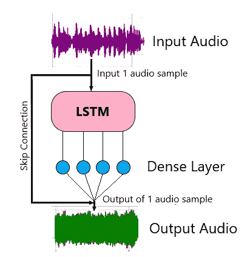
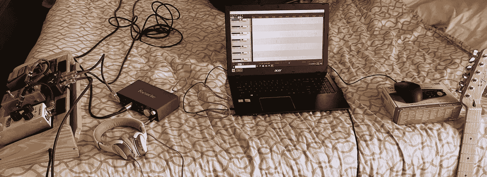
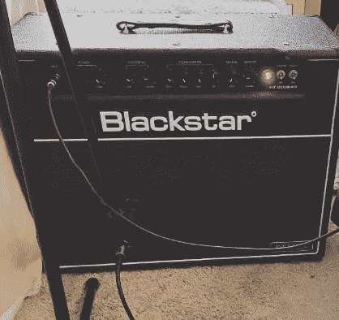
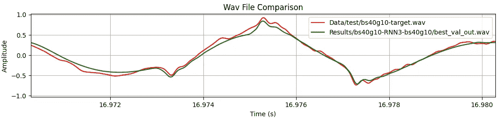

# 用于实时音频的神经网络:状态 LSTM

> 原文：<https://towardsdatascience.com/neural-networks-for-real-time-audio-stateful-lstm-b534babeae5d?source=collection_archive---------11----------------------->

作者图片

## 这是关于使用神经网络进行实时音频的五部分系列的第四部分。上一篇关于无状态 LSTMs 的文章，点击 [*这里*](/neural-networks-for-real-time-audio-stateless-lstm-97ecd1e590b8) *。*

我们将为最后一个神经网络模型重新访问 LSTM。这次我们将使用*状态*版本，并利用其循环内部状态来模拟 Blackstar HT40 吉他放大器。

快速复习；LSTMs(长短期记忆)是一种递归神经网络，通常用于文本到语音或自然语言处理等任务。它们有一个循环状态，每次通过网络输入新数据时都会更新。这样，LSTM 就有了记忆。在本文中，我们将使用论文“*具有深度学习的实时吉他放大器仿真*”中提出的 LSTM 模型。

# 概观

使用有状态 LSTM 允许我们简化前一篇文章中的整个网络结构。我们不会使用两个一维卷积层或数据预处理。这里我们需要的是 LSTM 层，然后是致密层。

图 1:一般网络架构(图片由作者提供)

单个音频样本被馈送到网络，并且单个样本被预测。由于关于过去信号的必要信息存储在 LSTM 循环状态中，因此不需要样本范围。

需要注意的是，会执行一个跳过连接，其中输入样本值会添加到输出值中。这样，网络只需学习输出和输入之间的差异。这种技术在 amp 仿真论文中有定义。

# PyTorch 培训

PyTorch 培训的示例代码来自 Github 上的[自动吉他建模](https://github.com/Alec-Wright/Automated-GuitarAmpModelling)项目。这个项目不包含许可证文件(在撰写本文时)，所以我不会在这里显示代码，但是您可以在 Github 上查看完整的 Python 代码。我使用了在 [networks.py](https://github.com/Alec-Wright/CoreAudioML/blob/823a4727f4578aa434e715eae302e0e930576074/networks.py) 文件中定义的“SimpleRNN”模型。这包括在 amp 仿真白皮书中描述的 LSTM 网络的实施。

在之前的文章中，我们在 25%的增益下使用了 Blackstar HT40 放大器的过驱通道。有状态 LSTM 的初始测试进行得非常顺利，所以我决定将增益提高到 100%，看看网络能处理多少。我用我的 Fender Telecaster 和 HT40 做了一个新的记录。HT40 再次采用舒尔 SM57 动圈话筒。

我使用了 Focusrite Scarlett 2i2 音频接口和运行在 Windows 10 上的 Reaper DAW(数字音频工作站)。录音设置使用吉他的信号分离器，一个信号进入音频接口的通道 1，麦克风输出进入通道 2。这样，两个轨道可以同时记录，两个信号之间的延迟最小。LSTM 模型对两个信号之间的任何时移都非常敏感。

我把录音笔记本电脑和音频接口从扩音器上移开，以减少电子干扰产生的噪音。下图左侧的踏板仅用于信号分离踏板。

录制设置(图片由作者提供)

放大器周围的区域被噪声抑制器(我只是用毯子)包围，以减少录音时的回声。尽可能消除房间混响以提高训练的准确性是很重要的。

麦克风黑星 HT40 放大器(图片由作者提供)

培训是通过在 [Google Colab](https://colab.research.google.com/) 上运行 PyTorch 代码完成的，这是一个基于浏览器的选项，用于在云中运行 python 代码。该网站甚至允许您免费访问 GPU 和 TPU，但有一些限制。使用 GPU 运行时，我能够在大约 40 分钟内训练 HT40 模型。

对于网络大小，amp 仿真纸测试了 LSTM 隐藏大小值 32、64 和 96。网络越大，它能够学习的信号就越复杂，但这是以处理速度为代价的。我发现 20 的隐藏大小完全能够再现我录制的声音，同时提高实时性能。

HT40 放大器在 100%增益时的损耗值为 0.069。训练代码使用一种称为“自适应学习率”的技术，这种技术可以在整个训练过程中降低训练的积极性。您可以将此视为随着模型越来越接近目标而对其进行微调。

以下是我的 Fender Telecaster 的输入录音示例:

这是 Blackstar HT40 在 100%增益下的样本:

这是 PyTorch 对同一样本的预测:

如果我们比较实际信号和预测信号，我们可以看到音频的幅度和特征非常接近。下面的图是使用 Matplotlib 绘制的，Matplotlib 是一个用 python 创建图表的库。

图 2:100%增益(损耗 0.069)下 HT40 放大器的实际信号与预测信号

# 模型转换

在实时使用经过训练的模型之前，该模型必须被转换成用于加载到插件中的格式。[Automated-guitar amp modeling](https://github.com/Alec-Wright/Automated-GuitarAmpModelling)项目自动将模型状态数据导出到一个 json 文件中。json 文件包含有关图层的信息，如 LSTM 隐藏单元的数量和输入/输出大小。大部分数据来自 LSTM 层和密集层的训练权重和偏差。权重和偏差是将被实时代码使用的值的数组。

# 实时实现

下面给出了使用 [Numcpp](https://github.com/dpilger26/NumCpp) 进行矩阵计算的实时实现的示例代码。使用 [JUCE 框架](https://juce.com/)的完整插件实现还没有发布，但是我会在这篇文章公开后更新它。

这是 LSTM/致密层推断的主要处理方法。对于缓冲器中的每个音频样本，`lstm_layer()`和`dense_layer()`被处理。对于跳过连接，输入样本被添加回网络的输出中。

这是 LSTM 层，由 amp 仿真论文提出的算法实现。“c_t”和“h_t”(单元格和隐藏状态)是基于 LSTM 层隐藏大小“HS”为每个索引计算的。基于对准确性和实时性能的测试，我使用了 20 的隐藏大小。

密集层将 LSTM 输出减少到一个音频样本。密集图层只是 LSTM 输出和训练密集图层权重加上偏差值的点积。

这些计算在音频中每秒重复 44100 次。其他数码效果可以添加在 LSTM 模型之前或之后，如均衡或混响。多个模型可用于覆盖特定设置的范围，如*增益*。在 amp 仿真论文中，他们使用参数调节对多个音频样本训练单个模型，每个样本具有不同的增益设置。然后，该模型可以覆盖给定旋钮设置的整个参数空间。

*注:音频中除了 44.1kHz 以外的其他采样率也很常见，比如 48kHz 甚至 96kHz。网络将以更高的采样率运行，但需要更多的测试来确定这对音频的影响。可能是因为训练数据是 44.1kHz，这是唯一可以准确预测的速率。采样速率转换器可能是解决不同输入采样速率的解决方案。*

amp 仿真论文提到，未来的工作可能包括实现*抗锯齿*以进一步改善仿真声音。在录制的音频中会出现混叠现象，非线性函数产生的高次谐波会反射回较低的频率，在音频中产生不希望的失真。关于反走样技术的详细解释，请查看[这篇文章](https://jatinchowdhury18.medium.com/practical-considerations-for-antiderivative-anti-aliasing-d5847167f510)。

# 表演

在三种不同的神经网络模型中，我发现有状态 LSTM 在以实时速度再现一系列吉他放大器和踏板方面是最成功的。它能够处理高增益，如这里使用的 HT40，和干净的声音。适中的训练时间胜过了 WaveNet 模型，代码的简单性使其优于前一篇文章中的 conv1d 层+无状态 LSTM。

*注:amp 仿真论文定义了另一个 RNN 模型，GRU(门控循环单元)。这包含在*[*Automated-guitar amp modeling*](https://github.com/Alec-Wright/Automated-GuitarAmpModelling)*代码中，与 LSTM 的预成型类似。该论文指出，GRU 运行速度稍快，但可能无法像 LSTM 一样处理各种声音。*

下面是一个用 JUCE 框架构建的插件的视频演示，该插件在几个经过训练的模型上运行有状态 LSTM 推理:

作者提供的视频

我们现在已经介绍了三种不同的神经网络架构，以及它们在 c++中使用 JUCE 框架的实时实现。

感谢您的阅读！在最后一篇文章中，我们将**使用有状态 LSTM 模型和 [**树莓派**](https://www.raspberrypi.org/products/raspberry-pi-4-model-b/) 构建一个吉他踏板**。

 [## 实时音频的神经网络:树莓皮吉他踏板

### 这是关于使用神经网络进行实时音频的五部分系列的最后一部分。对于上一篇关于有状态的文章…

link.medium.com](https://link.medium.com/m1n9gMXd9gb) 

1.  Alec Wright 等人《深度学习的实时吉他放大器仿真》*应用科学* 10，第 3 期(2020): 766。