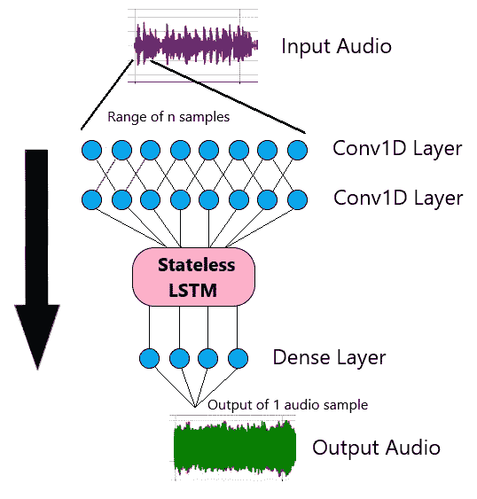
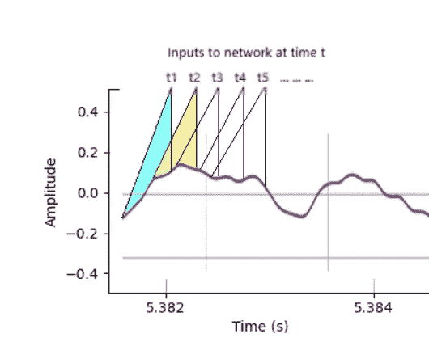
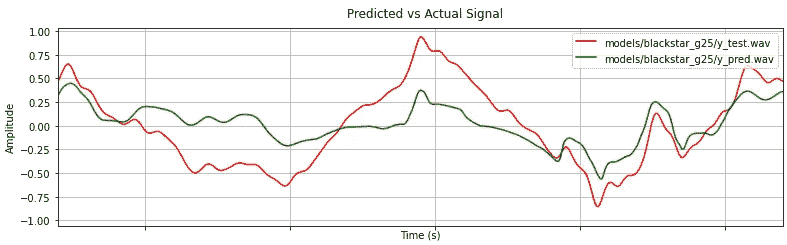

# 实时音频的神经网络:无状态的 LSTM

> 原文：<https://towardsdatascience.com/neural-networks-for-real-time-audio-stateless-lstm-97ecd1e590b8?source=collection_archive---------12----------------------->


作者图片

这是关于使用神经网络进行实时音频的五部分系列的第三部分。上一篇关于 WaveNet 的文章，点击 [*这里*](https://keyth72.medium.com/neural-networks-for-real-time-audio-wavenet-2b5cdf791c4f) *。*

在本文中，我们将使用一个无状态的 LSTM 神经网络来实时模拟一个吉他放大器。

代表“长短期记忆”的 LSTM 模型是在 20 世纪 90 年代中期开发的，是一种递归神经网络(RNN)的形式。从那以后，最初的模型被修改并应用于许多不同类型的问题，包括语音识别和文本到语音转换。

与 WaveNet 这样的“前馈”神经网络不同，LSTM 有一个循环状态，每次数据流经网络时都会更新。这样，过去的信息可以用来预测现在。换句话说，网络是有记忆的。这是有状态 LSTMs 的情况，但是在本文中我们将尝试一些不同的东西。

# 概观

对于这个例子，我们将使用一个*无状态* LSTM，这意味着网络的内存对于每一个批处理都会被重置。在这个具体的例子中，我们将使用单批音频数据。因为我们使用的是单批次，所以 LSTM 实质上变成了一个前馈网络，因为没有递归状态。

为什么我们要对单批数据使用无状态 LSTM 呢？无状态 LSTM 是一种有效的音频方法，通过将内部状态设置为零，我们降低了网络的复杂性，提高了网络速度。然而，对于我们的吉他放大器示例，网络仍然需要知道关于过去信号的一些信息，以做出准确的预测。

我们可以通过在无状态 LSTM 层之前添加 1-D 卷积层来做到这一点。在本例中，我们使用两个 1-D 卷积层，接着是 LSTM，再接着是密集(全连接)层。网络的输入是当前样本和指定数量的先前样本。1-D 卷积层用于从音频中提取特征，并减少进入 LSTM 层的数据量，从而显著加快处理速度。



图 1:通过网络的音频数据流(图片由作者提供)

*注意:“密集”层与上一篇文章的 WaveNet 实现中的“线性”层执行相同的功能。这只是 Keras 和 PyTorch 之间命名约定的不同。*

# Keras 培训

我们将使用在 25%增益下从 Blackstar HT40 放大器记录的相同的 4 分钟样本，如[上一篇文章](https://keyth72.medium.com/neural-networks-for-real-time-audio-wavenet-2b5cdf791c4f)中所述。

选择 Keras/Tensorflow 来实现无状态 LSTM 模型。Keras 是谷歌开发的人工智能框架 Tensorflow 的高级接口。Keras 培训的示例代码来自 Github 上的 [SmartAmpPro](https://github.com/GuitarML/SmartAmpPro) 项目，包含在 [train.py](https://github.com/GuitarML/SmartAmpPro/blob/main/resources/train.py) 文件中。使用顺序 Keras 模型相当简单，如下所示。

*注意:SmartAmpPro 项目是训练和实时代码的结合。对于使用相同模型的纯训练代码，请参见 Github 上的*[*guitar lstm*](https://github.com/GuitarML/GuitarLSTM)*。*

使用`model = Sequential()`创建一个基础模型，使用`.add(layer_type(layer_params,...))`将每个层依次添加到模型中。在上面的代码中，每一层的参数都是由先前定义的变量设置的。在 Keras 中，LSTM 层默认是无状态的，所以唯一需要的参数是`hidden_units`的数量。此参数决定了 LSTM 的大小。`input_size`定义了将使用多少先前的音频样本来预测当前样本。稍后在实时代码中使用的默认设置是 120，这是基于对准确性和处理速度的测试而选择的。这意味着当前的音频样本和先前的 119 个样本被用来预测下一个样本的值应该是什么。下图显示了对于给定的信号，音频数据的范围是如何馈入网络的。



图 2:音频范围如何被馈送到网络的示例(此处显示的样本之间的间隔被夸大)(图片由作者提供)

*注意:Conv1D 层使用“步幅”参数，该参数用于在卷积中跳过数据点。对于步长 2，网络层将跳过每个卷积运算的每隔一个数据点。这加快了计算速度，同时保留了足够的信息来进行准确的预测。*

在初始化顺序模型之后，必须处理输入音频数据。对于`input_size = 120`的情况，音频数据被切片(使用`tf.gather`)以获得每个现有音频样本的 120 个样本。每批 120 个音频样本是网络的新输入。输入批次的顺序被随机化以提高训练性能。这种切片操作只对输入进行。wav 文件，而不是输出。wav 包含 44100 个样本(或 1 秒钟的音频)，带有一个`input_size=120`，那么切片后的结果将是一个形状数组:

(44100 - input_size + 1，120)或(43981，120)

样本量的减少是必要的，因为对于音频的前 119 个样本，我们不能查看过去的 120 个样本来进行预测。但是现在，我们有 43981 个由 120 个样本组成的阵列，彼此重叠，而不是 43981 个单一的音频样本。数据加载和处理如下所示。

*注意:自定义数据加载器可用于对每个数据输入进行 120 个样本切片，而不是在训练前处理整个 wav 文件。这在训练时节省了 RAM 的使用。这是在 SmartAmpPro 项目中的* [*Colab 脚本*](https://github.com/GuitarML/SmartAmpPro/blob/main/train_colab_mse.ipynb) *中实现的。*

训练由`model.fit()`功能启动。随机化的音频数据(`X_random`和`y_random`)是*拟合*函数的输入，同时还有时期数、批量大小以及如何分割数据以进行验证和确认。

# 培训结果

针对这一特定 LSTM 实现的培训速度非常快。1-D 卷积层(使用默认的 SmartAmpPro 设置)将每个 120 个样本输入减少到 4 个样本，然后输入到 LSTM 层。以前的 WaveNet 在一个特定的 CPU 上要花 24 个多小时，而这个模型在同一个 CPU 上只需要 3 分钟。然而，训练不如 WaveNet 模型精确。可以选择更高的模型参数来提高精度，但是这在实时运行时会产生问题。

以下是 Blackstar HT40 在 30 个时期内的训练结果。获得了 0.11 的损失值。这里使用的损失函数是 amp 仿真论文中定义的 MSE(均方误差)的变体。这里显示了 8 毫秒数据的对比图:



图 3:使用无状态 LSTM 模型的 HT40 放大器的预测信号与实际信号

信号的幅度不像 WaveNet 模型那样紧密匹配，但是仍然可以学习主要特征。预测音频与实际音频的差异比较如下:

实际 Blackstar HT40 amp(过驱通道，25%增益):

由 Keras 模型预测:

# 模型转换

在实时使用经过训练的模型之前，必须将模型转换成合适的格式，以便加载到插件中。这里选择的格式是“json ”,这是为了可读性和计算世界的普遍接受。Keras 对模型状态数据使用“. h5”格式，这是 [HDF5](https://www.hdfgroup.org/solutions/hdf5/) 压缩数据格式。SmartAmpPro " [train.py](https://github.com/GuitarML/SmartAmpPro/blob/main/resources/train.py) "脚本中的 Python 代码用于执行这种转换。在转换之前，附加的“输入大小”和“步幅”参数被添加到. h5 模型文件中。实时代码中需要这些参数。

# 实时实现

实时实现的示例代码也来自 Github 上的 [**SmartAmpPro**](https://github.com/GuitarML/SmartAmpPro) 。代码使用[N**um CPP**](https://github.com/dpilger26/NumCpp)**进行矩阵计算，使用 [**json**](https://github.com/nlohmann/json) 加载转换后的 json 模型。NumCpp 是 Numpy Python 库的一个只有头文件的 c++实现。**

**实时音频插件使用了 [**JUCE**](https://juce.com/) 框架，这是一个用于创建音频应用的跨平台 c++框架。这里的基本目标是用高性能 c++代码重新创建通过 Keras 顺序模型的正向传递。为了将代码转换成 c++，我写了一个中间的 [Python 脚本](https://github.com/GuitarML/SmartAmpPro/blob/main/test/keras_np_compare_final.py)来确保我理解底层的计算。Pytorch 和 Tensorflow 处理图层的方法略有不同，因此实时应用程序以与训练代码完全相同的方式处理图层至关重要。**

**在“ [ModelLoader](https://github.com/GuitarML/SmartAmpPro/blob/main/Source/ModelLoader.h) ”类中加载并设置来自转换后的 json 模型的模型数据(状态参数)。一个经过训练的 json 模型的例子可以在 [Github](https://github.com/GuitarML/SmartAmpPro/blob/main/models/TubeClean.json) 上查看。然后，来自 ModelLoader 的数据用于实例化“lstm”类，该类也包含 1-D 卷积层和密集层。**

**下面是 *lstm* 类的主要处理方法。如果您熟悉 JUCE，这就是您在 PluginProcessor 的 processBlock()方法中调用的内容:**

**我们必须从训练代码中执行相同的音频切片，这需要对音频缓冲区进行一些仔细的处理，因为需要来自先前缓冲区(或块)的信息来预测当前缓冲区中的样本。用`check_buffer(numSamples);`检查缓冲区大小(可能有更好的方法来处理这个问题，但是如果用户改变了缓冲区大小， *lstm* 类需要知道)。然后调用`set_data`方法来安排音频输入到 LSTM 推理代码。让我们看看这是怎么回事:**

**在上面的代码中，前一个缓冲区的结束被设置在临时缓冲区的开始，`new_buffer`。然后当前缓冲区的数据被分配到`new_buffer`的末尾。执行切片操作，获取每个音频样本并将先前的样本`input_size`附加到二维数组`data`。`old_buffer`被设置为等于将用于下一个音频块的当前缓冲器。现在，来自`data`的每个输入数组都可以输入到第一个一维卷积层。**

**一维卷积是最复杂的层。可能有比这里写的更简单和更有效的方法来进行计算。NumCpp 库用于所有矩阵计算，这里使用的主要数据类型是`nc::NdArray<float>`。**

**这是零填充函数，它向输入数据添加零，以使控件成为输出形状:**

**这是展开功能，它以与之前音频处理相同的方式分割数据。这些切片数组用于执行卷积计算。**

**前两个方法是从 main `conv1d_layer`方法调用的，该方法获取展开的矩阵，并对矩阵执行 tensordot(或 einsum)运算以完成卷积。**

***注意:第二个 Conv1d 层与第一个基本相同，但它处理输入的方式不同。为了简洁起见，这里省略了它，但是可以在 Github 上查看完整的内容。***

**处理完前两个 Conv1d 层后，再处理 LSTM 层。这是吉他仿真论文中算法的简化版本。它被简化了，因为对于一个*无状态的* LSTM 来说，初始单元状态和隐藏状态可以被设置为零。**

**首先，在 Conv1d 层的输出和的训练 LSTM 权重之间执行点积。json 文件。这里也加入了偏差。**

```
gates = nc::dot(conv1d_1_out, W) + bias;
```

**当前隐藏状态是在*内为*循环计算的，其中循环次数由 LSTM 的 hidden_size `HS`决定。在 [PyTorch 文档](https://pytorch.org/docs/stable/generated/torch.nn.LSTM.html)中可以看到*有状态* LSTM 的完整方程组。对于*无状态*实现，先前的隐藏状态 *h(t-1)* 可以被设置为零，并且不需要计算单元状态，因为它不用于下一个 LSTM 状态。这里显示了无状态的 LSTM 实现:**

**最后，LSTM 层的输出被馈送到密集层，它只是输入和来自的训练好的权重的点积。json 文件加上偏差向量。该层的输出是预测音频的单个样本。下一秒声音重复 44100 次。咻！**

# **实时性能**

**一般来说，上述算法比以前的 WaveNet 实现运行得更快。但是，如果您将层参数增加到高于 SmartAmpPro 默认值，它会很快变得太慢而无法实时运行，尤其是对于 Conv1d 层。大于 120 的 input_size 也会降低处理速度。**

**因为该模型只考虑了之前的 119 个样本(大约 27 毫秒)，所以预测的信号有时会在错误的方向上剧烈摆动，但通常会很快自我校正。当与 WaveNet 输出图比较时，信号可能更加*不稳定*，这会对声音产生嗡嗡声/噪音影响。在我看来，WaveNet 的声音更流畅。声音的平滑度可以通过更高数量的时期来提高。需要注意的是，声音可能会非常干燥，所以应该使用混响等附加效果来获得更自然的声音。**

**训练速度是无状态LSTM 的最大优势，对于 TS-9 电子管震音踏板这样“容易”训练的声音，在 CPU 上不到 3 分钟就能获得很高的精度。这里是一个使用 SmartAmpPro 实时插件(加上额外的混响)的双声道录音。该演示展示了如何将相同的基础模型用于两种不同的吉他声音(干净的和过驱动的)。**

**在下一篇文章中，我们将使用一个*有状态* LSTM 进行研究，看看我们能否提高训练的准确性和实时性能。**

**[](/neural-networks-for-real-time-audio-stateful-lstm-b534babeae5d) [## 用于实时音频的神经网络:状态 LSTM

towardsdatascience.com](/neural-networks-for-real-time-audio-stateful-lstm-b534babeae5d) 

感谢您的阅读！

1.  Alec Wright 等人，“深度学习的实时吉他放大器仿真”*应用科学* 10 期，第 3 期(2020): 766。**