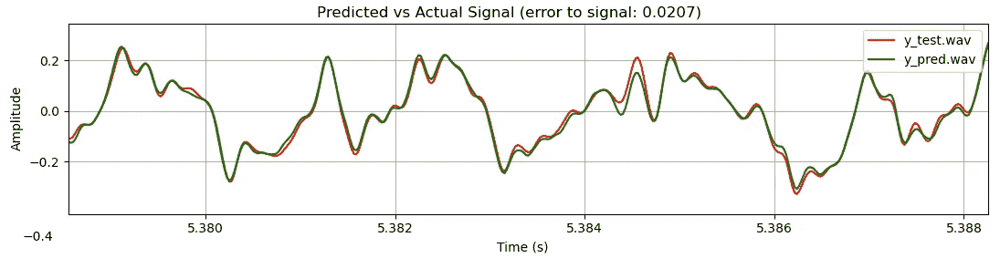

# 实时音频的神经网络:WaveNet

> 原文：<https://towardsdatascience.com/neural-networks-for-real-time-audio-wavenet-2b5cdf791c4f?source=collection_archive---------6----------------------->

作者图片

这是关于使用神经网络进行实时音频的五部分系列的第二部分。对于之前的介绍文章，点击 [*这里*](https://medium.com/nerd-for-tech/neural-networks-for-real-time-audio-introduction-ed5d575dc341) *。*

在本文中，我们将使用 WaveNet 实时模拟吉他放大器。

**WaveNet** 由 DeepMind 公司开发，并在 2016 年的论文*wave net:Raw Audio 的生成模型*中介绍。它解释了该模型如何用于生成音频，如逼真的人类语音。它是一个前馈神经网络，意味着信息只通过网络向前移动，而不像 RNNs(递归神经网络)那样循环。

# 概观

这里使用的 WaveNet 的具体实现在论文 [*带深度学习的实时吉他放大器仿真*](https://www.mdpi.com/2076-3417/10/3/766/htm) 中有定义。本文使用扩展卷积层来捕捉吉他放大器的动态响应。扩张的层用于增加网络的感受域，允许它及时到达更远的时间来预测当前的音频样本。网络对过去的信号了解得越多，就能越好地预测下一个样本的值。

音频数据是一维的。它是一个随时间变化的数值(振幅)。一个 40 秒声音文件的可视示例(。wav 格式)显示在这里:

图 1:来自电吉他的 40 秒音频图

如果放大上面的图，可以清楚地看到信号是如何随时间变化的。下面显示的是大约 1/125 秒(8 毫秒)的相同音频。

图 2:电吉他 8 毫秒音频的曲线图

这里是上面吉他录音的音频:

这是直接从挡泥板电吉他远程音频信号。不太令人兴奋，是吗？但是，如果我们通过一个 Blackstar HT40 电子管放大器发送同样的信号，情况会变得更加有趣:

在下一节中，我们将尝试使用 WaveNet 在特定设置下创建 HT40 放大器的实时模型。使用过驱通道和中性均衡器将放大器设置为 25%的增益。录音是使用 SM57 麦克风进行的，距离扬声器格栅约 1 厘米，位于锥体中部。

Blackstar HT40 amp 和 SM57 麦克风(图片由作者提供)

请注意，麦克风和扬声器/音箱都会修改来自放大器电子设备的音频信号，这种设置可能不太适合尽可能精确地模拟放大器。但是考虑到这个放大器是租来的，我想他们更希望我不要打开它(你也不应该打开，除非你知道你在做什么！真空管电子设备包含非常高的电流和电压)。

# PyTorch 培训

PyTorch 训练的示例代码来自 Github 上的 [**PedalNetRT**](https://github.com/GuitarML/PedalNetRT) ，用 Python 编写。注意，PedalNetRT 使用了[**Pytorch-lightning**](https://www.pytorchlightning.ai/)，这是一个有用的 py torch 包装器。

为了训练神经网络，我们将检查来自" [model.py](https://github.com/GuitarML/PedalNetRT/blob/master/model.py) " python 文件的代码，该文件定义了 WaveNet 类的实现。整个结构由一维卷积层组成。继承 PyTorch 的`nn.Module`的基本 WaveNet 类如下所示:

`forward()`功能是进行音频处理的地方。此处使用了*门控激活*，如吉他放大器仿真论文中所定义。*门控激活*的输出被馈入`self.residual`层堆栈。输入样本`x`被添加回输出，该输出通过`self.linear_mix`层馈送，以将输出减少为单个音频样本。

网络接收输入音频样本，然后提取内部层中的声音特征，并输出单个预测音频样本。请记住，这种情况每秒钟发生 44，100 次！预测样本与已知音频(来自 HT40 amp 录音)进行比较，PyTorch 确定如何调整网络值以更接近目标。每次通过 4 分钟的训练数据是一个“时期”。在达到可接受的损失之前，典型的训练期可以持续 1500 个时期或更多。

WaveNet 类用定义神经网络的大小和结构的几个参数初始化。基本结构由`self.input_layer`、`self.hidden_layer` / `self.residuals`(都是卷积层的堆叠)和`self.linear_mix`(输出层)组成。你可能已经注意到使用了一个定制的`CausalConv1d`类，而不是 PyTorch 内置的`nn.Conv1d`。这是因为 PyTorch 中的因果卷积必须手动完成(在撰写本文时)。因果卷积仅在数据的一侧使用零填充，而不是“相同的”填充，它会均等地填充两侧。

*注意:通过向特定维度添加额外的零，使用零填充数据来控制卷积层的输出大小。*

自定义的`CausalConv1d`类本质上是`nn.Conv1d`的包装器，它只在左侧填充输入数据。这里显示了`CausalConv1d`类的实现:

设置基本 WaveNet 类的最后一部分是`_conv_stack`函数，它堆叠所需数量的`CausalConv1d`层。堆栈中的层数由整数`dilations`定义。对于`dilations=4`，你得到一个四层的堆栈，每个层的膨胀率为“1，2，4，8”。对于`dilations=8`，你得到一个 8 层的堆叠，具有“1，2，4，8，16，32，64，128”的膨胀率。参数`num_repeat`重复膨胀层。例如，对于`dilations=8`和`num_repeat=2`，您得到

“1, 2, 4, 8, 16, 32, 64, 128, 1, 2, 4, 8, 16, 32, 64, 128”

总共 16 个隐藏卷积层。`_conv_stack`功能如下所示:

如前所述，在我们很好地匹配目标之前，WaveNet 的典型训练会话可以持续 1500 个时期。根据目标信号的复杂性，更多的历元可以导致更高的精度。一般规律是信号越失真(例如高增益)，训练就越困难。通过选择更大的模型参数，可以以处理时间为代价来提高训练性能。训练速度和实时性能之间的权衡在这里很重要，并且对于每个目标硬件是不同的。

还需要注意的是，在吉他踏板的情况下，这种神经网络方法不适用于基于时间的效果，如延迟/混响/合唱/凸缘。它对失真/过驱动有效(即动态响应小于约 50 毫秒的效果)。

# 培训结果

以下是使用 PedalNetRT 对 HT40 进行 1500 多次训练的结果。损失值下降到大约 0.02。这里使用的损失函数是 amp 仿真论文中定义的 MSE(均方误差)的变体。这里显示了 8 毫秒数据的对比图:

图 HT40 放大器的实际信号和预测信号之间的比较

这是预测的音频(与之前的实际 HT40 音频相比):

由此产生的 0.02 的损失非常接近原始记录。从 SoundCloud mp3 样本中，你很难分辨出哪个是哪个。训练有素的耳朵，高品质的录音室监听系统，以及原声。wav 文件，人们可能会告诉区别，但我认为 0.02 损失是一个成功的捕捉 HT40 放大器。根据其他测试，0.05 损失听起来不错，但感觉不同，0.10 损失明显不同，但可以通过额外的均衡器处理听起来接近。0.2 或更高的损失仍然是一个有趣的声音，但根据经验，我认为这是一个不成功的捕捉。

训练时间取决于硬件、型号大小和录音长度。在 Nvidia Quadro 2000 GPU 上，运行 1500 个 epochs 需要大约 4 个小时。在内置 Nvidia 显卡的中等价位笔记本电脑上，同样的培训大约需要 8 个小时。对于纯 CPU 培训，您将需要 24 小时以上的培训时间。

# 模型转换

在实时使用经过训练的模型之前，必须将模型转换成合适的格式，以便加载到插件中。这里选择的格式是“json ”,因为它的可读性和在计算世界中的普遍接受性。PyTorch 使用它自己的”。pt“格式”。ckpt "代表 py torch-闪电。PedalNetRT 中使用一个名为“ [export.py](https://github.com/GuitarML/PedalNetRT/blob/master/export.py) 的脚本来执行这种转换，并以 WaveNetVA 理解的方式排列数据。

# 实时实现

实时 c++的示例代码来自 Github 上的 [**WaveNetVA**](https://github.com/damskaggep/WaveNetVA) (也在[**smart guitar amp**](https://github.com/GuitarML/SmartGuitarAmp)**和**[**smart guitar pedal**](https://github.com/GuitarML/SmartGuitarPedal)中实现)。代码使用 [**特征值**](https://eigen.tuxfamily.org/dox/) 进行矩阵计算。****

****实时插件使用 [**JUCE**](https://juce.com/) 框架，这是一个跨平台的 c++框架，用于创建音频应用。基本目标是用高性能 c++代码从 PyTorch WaveNet 类中重新创建`forward()`函数。我们不会在这里涵盖所有的代码，但我会触及关键点。****

****来自转换后的 json 模型的模型数据(状态参数)在 WaveNet 类中加载和设置。下面显示了`setParams`方法，它基于 json 数据建立了一个 WaveNet 实例。一个经过训练的 json 模型的例子可以在 [Github](https://github.com/GuitarML/PedalNetRT/blob/master/models/pedalnet/pedalnet.json) 上查看。****

****这里定义了`inputLayer`、`outputLayer`、`convStack`(内层)。每层都有通道数、滤波器宽度、扩张和激活功能的设置。****

****这里显示了 WaveNet 类的主要处理方法，它获取输入音频缓冲区`inputData`，通过每一层(`inputLayer`、`convStack`、`outputLayer`)对其进行处理，然后将处理后的音频复制到输出缓冲区`outputData`。****

****音频数据实时流经每一层(通过音频缓冲区或“块”)，但实际的卷积计算是在“[convolution . CPP](https://github.com/damskaggep/WaveNetVA/blob/master/Source/Convolution.cpp)”`processSingleSample`方法中执行的，该方法处理单个音频样本:****

****该方法使用 json 模型中的层设置来确定数据如何卷积，或者数据如何在层中流动。在最基本的操作中，这只是与内核(训练的神经网络值)相乘:****

****`outVec = outVec + *(fifo+readPos) * (*it);`****

****以及偏置向量的加法:****

****`outVec = outVec + bias`****

****复杂的部分是确定如何索引每个数组，以便正确计算卷积层。我会留到下一天再说！****

****一旦当前音频缓冲区被处理(从 16 到 4096 个 2 的倍数的样本，取决于音频设备设置)，它将被转换回模拟，并从扬声器或耳机输出。幸运的是，JUCE 框架处理了所有这些问题。****

# ****实时性能****

****这个 WaveNet 实现完全能够在任何现代计算机上实时运行。然而，与使用传统建模的音频 DSP 软件相比，它的 CPU 使用率要高得多。使用电路分析可以以更快的处理速度实现相同质量的建模(以吉他放大器为例)。可以说，只用音频样本而没有领域专业知识来模拟这些复杂系统的能力是一个很好的权衡。****

****这是一个 SmartAmp 插件的实时演示视频，它使用 WaveNet 来模拟小管放大器(Fender Blues Jr .)和其他放大器。****

****作为一名吉他手，我对 WaveNet 的看法是，与目标放大器/踏板相比，它的声音非常自然。它似乎在高增益方面有问题(如在金属音乐中)，但可以准确处理中增益和干净的音调。在模型中也观察到了低音的衰减。改变模型的大小会对声音产生很大的影响，也会影响它实时平稳运行的能力。****

****在下一篇文章中，我们将研究使用无状态 LSTM，看看我们是否可以在保持高质量声音的同时提高 CPU 使用率和训练时间。在此继续阅读:****

****<https://link.medium.com/Jg5ft4WM0fb>  

感谢您的阅读！

1.  Aaron van den Oord 等人，“wave net:Raw Audio 的生成模型” *arXiv 预印本 arXiv:1609.03499* ，2016 年。
2.  Alec Wright 等人，“深度学习的实时吉他放大器仿真”*应用科学* 10 期，第 3 期(2020): 766。****