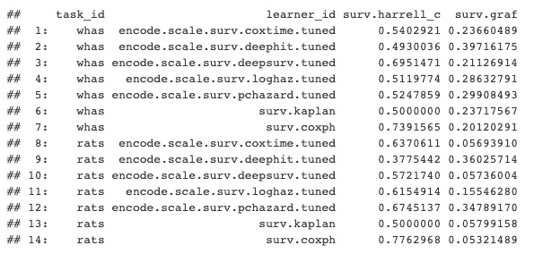
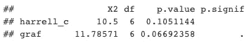
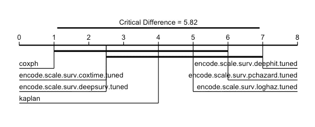

# 用于 R 中生存分析的神经网络

> 原文：<https://towardsdatascience.com/neural-networks-for-survival-analysis-in-r-1e0421584ab?source=collection_archive---------14----------------------->

## 训练、调整和比较生存网络的演示

更新:我已经把本教程中的大部分包从 CRAN 上拿走了，原因是如果你感兴趣，你可以在这里阅读。要安装本教程中的软件包，你只需要将我的 R-universe 页面添加到你的 repos 中——这在下面的第一个要点中演示过，或者你可以在这里查看安装这些软件包的其他方法。

我收到了许多关于 R 中的生存神经网络(“生存网络”)的问题，从“这可能吗？”到“我如何在 R 中安装 Python？”以及“我如何调整这些模型？”。如果你是一个对生存网络感兴趣的 R 用户，那么这篇文章就是为你准备的！这不是一个如何使用相关软件包的教程，而是一个回答这些问题的演示。

这是一个高级演示，我假设你知道:I)什么是生存分析；ii)什么是神经网络(以及常见的超参数)；iii)基本的机器学习(ML)方法，如重采样和调谐。如果需要，我很乐意在以后的文章中全面讨论这些话题。

在本文中，我们将介绍如何:I)在 R 中安装 Python 模块；ii)通过{mlr3proba}使用{survivalmodels}中实现的模型；iii)用{mlr3tuning}调整模型，用{mlr3pipelines}⁴预处理数据；iv)对{mlr3proba}中的模型进行基准测试和比较；v)分析{mlr3benchmark}⁵.的结果这些软件包中有许多都属于 mlr3 系列，如果您想了解更多，我建议您从 mlr3book⁶.开始

本演示中的代码是一个“玩具”示例，选择在我非常旧的笔记本电脑上快速运行代码，预计所有型号的性能都很差。

让我们得到深度学习！

照片由[乌列尔 SC](https://unsplash.com/@urielsc26?utm_source=medium&utm_medium=referral) 在 [Unsplash](https://unsplash.com?utm_source=medium&utm_medium=referral) 上拍摄

# 安装软件包

我们将使用几个软件包，确保您安装了以下软件:

对于这个演示，我使用了以下包版本:gg plot(v 3 . 3 . 2)；MLR 3 benchmark(v 0 . 1 . 2)；MLR 3 extra learners(v 0 . 3 . 5)；MLR 3 管道(v 0 . 3 . 4)；MLR 3 proba(v 0 . 3 . 2)；MLR 3 调优(v 0 . 8 . 0)；生存模型(v0.1.7)。

# 生存模型

包{survivalmodels}当前包含神经网络:

*   CoxTime⁷
*   DeepHit⁸
*   DeepSurv⁹
*   物流危害⁰
*   PCHazard
*   DNNSurv

其中的前五个使用{reticulate}来连接伟大的 Python {pycox} ⁴包，该包由哈瓦德·克瓦梅编写，这意味着您可以使用 r 语言中的神经网络来实现 Python 的速度。DNNSurv 使用 R {keras} ⁵软件包。

在本文中，我们将只看前五个，因为它们在文献中被更好地建立，并且它们具有相同的接口，这简化了调谐，正如我们将在下面看到的。在这篇文章中没有提供网络的描述，但是如果需要的话，我很乐意在以后的文章中详细描述。

## 在 R 中使用 Python

要在{survivalmodels}中使用 Python 模型，您需要在 R 中设置一个 Miniconda 环境，并安装所需的 Python 模块。使用{survivalmodels}中的函数可以安装所需的模块:

`install_pycox`使用`reticulate::py_install`安装 Python 包{pycox}和可选的{torch} ⁶ ( `install_torch = TRUE`)。`install_keras` 将安装{keras}和可选的{tensorflow} ⁷ ( `install_tensorflow = TRUE`)。

## 播种

确保用 Python 实现的模型产生可再现的结果比通常要稍微复杂一些，因为必须在多个地方设置种子。{survivalmodels}用一个名为`set_seed`的函数简化了这一过程。

# mlr3proba

为了在安装后运行这些模型，我们将使用不同的界面。{survivalmodels}的功能有限，这对于基本的模型拟合/预测来说是可以的，但神经网络通常需要数据预处理和模型调整，因此我们将使用{mlr3proba}，它是{mlr3} ⁸系列软件包的一部分，包括概率监督学习功能，生存分析是其中的一部分。{mlr3}软件包使用 R6 ⁹接口在 r 中进行面向对象的机器学习。mlr3 的完整教程可以在{mlr3book}中找到，其中还有一章是关于{mlr3proba} ⁰.的生存分析

现在让我们来设置我们的实验！

## 生存数据

我们需要做的第一件事是获取一些生存数据集来训练我们的模型，在{mlr3proba}中，数据集保存在任务中，其中包括关于特征和目标的信息。我们将使用{mlr3proba}、`whas`附带的一个任务，以及我们自己设置的一个任务(虽然{mlr3proba}中也已提供，但这只是一个示例)。

## 获取和调整学习者

现在该你上场了！我们将在{survivalmodels}(除了 DNNSurv)中训练和调整 Pycox 神经网络。调节由{mlr3tuning}包处理。我们不会为模型指定一个定制架构，而是使用默认架构，如果您熟悉 PyTorch，那么您可以选择创建自己的架构，如果您愿意的话，可以将它传递给模型中的`custom_net`参数。

**超参数配置** 训练和调整神经网络是一门艺术，但对于本文，我们保持简单。我们将使用以下配置来调整神经网络:

*   辍学分数在[0，1]范围内调整
*   重量在[0，0.5]范围内衰减
*   学习率超过[0，1]
*   {1，…，32}上一层中的节点数
*   {1，…，4}上的隐藏层数

为此，我们使用{paradox}包(也是{mlr3}的一部分)来创建超参数搜索空间。{survivalmodels}中的所有 Pycox 学习器都有一个相同的参数接口，因此只需提供一个搜索空间。在{survivalmodels}中，节点数`num_nodes`被指定为任意长度的向量，这是不可直接调整的。因此，我们分别调整一层中的节点数`nodes`和层数`k`，然后提供一个转换来组合这两者。

请注意，在我们的转换中，我们假设每层有相同数量的节点，这是一个相当常见的假设，但是我们可以考虑更高级的转换。

我们现在将学习者包裹在一个`AutoTuner`中，这使得学习者可以很容易地在基准实验中调整。因为我们正在调优多个相似的学习者，所以我们可以创建一个函数来简化`AutoTuner` 的创建。对于调优，我们使用:2/3 分离维持、c 索引优化和 2 次迭代随机搜索。这些设置不应该在实践中使用，只是为了让事情运行得更快。在实践中，我通常推荐三重嵌套交叉验证，`rsmp("cv", folds = 3)`和 60 次迭代随机搜索，`trm("evals", n_evals = 60)`。

现在让我们找到我们的学习者并应用我们的函数。对于所有学员，我们将设置以下超级参数:

*   嵌套训练数据的 30%将被保留作为提前停止的验证数据，`frac = 0.3, early_stopping = TRUE`
*   亚当优化器，`optimizer = “adam"`
*   最多 10 个历元，`epochs = 10`

当我们使用早期停止时，历元的数量通常会大幅度增加(比如最少 100 个)，但在这里会减少以加快运行速度。所有其他超参数使用模型默认值。

**预处理
所有的神经网络都需要一些数据预处理。{mlr3pipelines}包，特别是`encode`和`scale` pipeops 使这变得简单，它们分别执行一键编码和特征标准化(通过改变参数可获得其他方法)。同样，我们将创建一个适用于所有学习者的函数。**

## 基准

我们准备好了！对于我们的实验，我们将使用三重交叉验证，但通常五重交叉验证将是首选，`rsmp("cv", folds = 5)`。为了比较，我们还将卡普兰-迈耶和考克斯 PH ⁴学习者添加到实验中。我们将把我们的基准结果与哈勒尔的 c 指数⁵和⁶综合格拉夫得分(也有许多其他措施可用)进行汇总。

结果由 Harrell's C 和 Graf 综合评分汇总

在我们的玩具演示中，我们可以从这些结果中初步得出结论，Cox PH 的性能最好，DeepHit 的性能最差。

# 分析结果

由于我们已经在多个独立数据集上运行了我们的模型，我们可以使用{mlr3benchmark}更详细地比较我们的结果。下面的注释代码只是展示了可能的情况，但没有提供任何细节(如果您对未来的教程感兴趣，请告诉我！).

独立数据集上的弗里德曼检验结果。

Friedman 检验结果表明，两个模型在任何一个测量方面都没有显著差异(假设 p ≤ 0.05 是显著的)。现在让我们说，如果 p ≤ 0.1，模型是显著不同的(我不建议这是普遍的)，所以我们可以看看临界差异图⁷来比较这些模型。

IGS 的临界差异图，左边是表现最好的学生，右边越来越差。粗黑线将没有显著差异的学习者联系起来。

结果表明，没有模型优于 Kaplan-Meier 基线，我们的分析是完整的(对于这个玩具设置，这并不奇怪！).

# 摘要

在这个演示中，我们使用了用 Python 实现的神经网络，并通过{survivalmodels}进行接口。我们用{mlr3proba}接口加载了这些模型，得到了一些生存任务。我们使用{mlr3tuning}设置超参数配置和调节控制，使用{mlr3pipelines}进行数据预处理。最后，我们使用{mlr3benchmark}来分析多个数据集的结果。我希望这篇文章展示了 mlr3 接口是如何简化从{survivalmodels}中选择、调整和比较模型的。

感谢阅读！继续评论，发电子邮件，或发微博给我(拉斐尔 101 ),提出问题，评论，或只是聊聊 ML 和统计！

# 参考

¹ Sonabend, R. (2020). survivalmodels: Models for Survival Analysis. CRAN. [https://cran.r-project.org/package=survivalmodels](https://cran.r-project.org/package=survivalmodels)
² Sonabend, R., Király, F. J., Bender, A., Bischl, B., & Lang, M. (2021). mlr3proba: An R Package for Machine Learning in Survival Analysis. *Bioinformatics*. [https://doi.org/10.1093/bioinformatics/btab039](https://doi.org/10.1093/bioinformatics/btab039)
³ Lang, M., Richter, J., Bischl, B., & Schalk, D. (2019). mlr3tuning: Tuning for “mlr3.” CRAN. [https://cran.r-project.org/package=mlr3tuning](https://cran.r-project.org/package=mlr3tuning)
⁴ Binder, M., Pfisterer, F., Bischl, B., Lang, M., & Dandl, S. (2019). mlr3pipelines: Preprocessing Operators and Pipelines for “mlr3.” CRAN. [https://cran.r-project.org/package=mlr3pipelines](https://cran.r-project.org/package=mlr3pipelines)
⁵ Sonabend, R., & Pfisterer, F. (2020). mlr3benchmark: Benchmarking analysis for “mlr3.” CRAN. [https://cran.r-project.org/package=mlr3benchmark](https://cran.r-project.org/package=mlr3benchmark)
⁶ [https://mlr3book.mlr-org.com/](https://mlr3book.mlr-org.com/)
⁷ Kvamme, H., Borgan, Ø., & Scheel, I. (2019). Time-to-event prediction with neural networks and Cox regression. *Journal of Machine Learning Research*, *20*(129), 1–30.
⁸ Lee, C., Zame, W. R., Yoon, J., & van der Schaar, M. (2018). Deephit: A deep learning approach to survival analysis with competing risks. In *Thirty-Second AAAI Conference on Artificial Intelligence*.
⁹ Katzman, J. L., Shaham, U., Cloninger, A., Bates, J., Jiang, T., & Kluger, Y. (2018). DeepSurv: personalized treatment recommender system using a Cox proportional hazards deep neural network. *BMC Medical Research Methodology*, *18*(1), 24\. [https://doi.org/10.1186/s12874-018-0482-1](https://doi.org/10.1186/s12874-018-0482-1)
¹⁰ Gensheimer, M. F., & Narasimhan, B. (2019). A scalable discrete-time survival model for neural networks. *PeerJ*, *7*, e6257.
¹¹ Kvamme, H., & Borgan, Ø. (2019). Continuous and discrete-time survival prediction with neural networks. *ArXiv Preprint ArXiv:1910.06724*.
¹² Zhao, L., & Feng, D. (2020). DNNSurv: Deep Neural Networks for Survival Analysis Using Pseudo Values. [https://arxiv.org/abs/1908.02337](https://arxiv.org/abs/1908.02337)
¹³ Ushey, K., Allaire, J. J., & Tang, Y. (2020). reticulate: Interface to “Python.” CRAN. [https://cran.r-project.org/package=reticulate](https://cran.r-project.org/package=reticulate)
¹⁴ Kvamme, H. (2018). pycox. [https://pypi.org/project/pycox/](https://pypi.org/project/pycox/)
¹⁵ Allaire, J. J., & Chollet, F. (2020). keras: R Interface to “Keras.” CRAN. [https://cran.r-project.org/package=keras](https://cran.r-project.org/package=keras)
¹⁶ Paszke, A., Gross, S., Chintala, S., Chanan, G., Yang, E., DeVito, Z., … Lerer, A. (2017). Automatic differentiation in pytorch.
¹⁷ Abadi, M., Agarwal, A., Barham, P., Brevdo, E., Chen, Z., Citro, C., … Zheng, X. (2015). TensorFlow: Large-Scale Machine Learning on Heterogeneous Systems. [https://www.tensorflow.org/](https://www.tensorflow.org/)
¹⁸ Lang, M., Binder, M., Richter, J., Schratz, P., Pfisterer, F., Coors, S., … Bischl, B. (2019). mlr3: A modern object-oriented machine learning framework in R. *Journal of Open Source Software*, *4*(44), 1903\. [https://doi.org/10.21105/joss.01903](https://doi.org/10.21105/joss.01903)
¹⁹ Chang, W. (2018). R6: Classes with Reference Semantics. [https://cran.r-project.org/package=R6](https://cran.r-project.org/package=R6)
²⁰ [https://mlr3book.mlr-org.com/survival.html](https://mlr3book.mlr-org.com/survival.html)
²¹ Lang, M., Bischl, B., Richter, J., Sun, X., & Binder, M. (2019). paradox: Define and Work with Parameter Spaces for Complex Algorithms. CRAN. [https://cran.r-project.org/package=paradox](https://cran.r-project.org/package=paradox)
²² Bergstra, J., & Bengio, Y. (2012). Random search for hyper-parameter optimization. *The Journal of Machine Learning Research*, *13*(1), 281–305.
²³ Kaplan, E. L., & Meier, P. (1958). Nonparametric Estimation from Incomplete Observations. *Journal of the American Statistical Association*, *53*(282), 457–481\. [https://doi.org/10.2307/2281868](https://doi.org/10.2307/2281868)
²⁴ Cox, D. R. (1972). Regression Models and Life-Tables. *Journal of the Royal Statistical Society: Series B (Statistical Methodology)*, *34*(2), 187–220.
²⁵ Harrell, F. E., Califf, R. M., & Pryor, D. B. (1982). Evaluating the yield of medical tests. *JAMA*, *247*(18), 2543–2546\. [http://dx.doi.org/10.1001/jama.1982.03320430047030](http://dx.doi.org/10.1001/jama.1982.03320430047030)
²⁶ Graf, E., Schmoor, C., Sauerbrei, W., & Schumacher, M. (1999). Assessment and comparison of prognostic classification schemes for survival data. *Statistics in Medicine*, *18*(17–18), 2529–2545\. https://doi.org/10.1002/(SICI)1097-0258(19990915/30)18:17/18<2529::AID-SIM274>3.0.CO;2-5
²⁷ Demšar, J. (2006). Statistical comparisons of classifiers over multiple data sets. *Journal of Machine Learning Research*, *7*(Jan), 1–30.