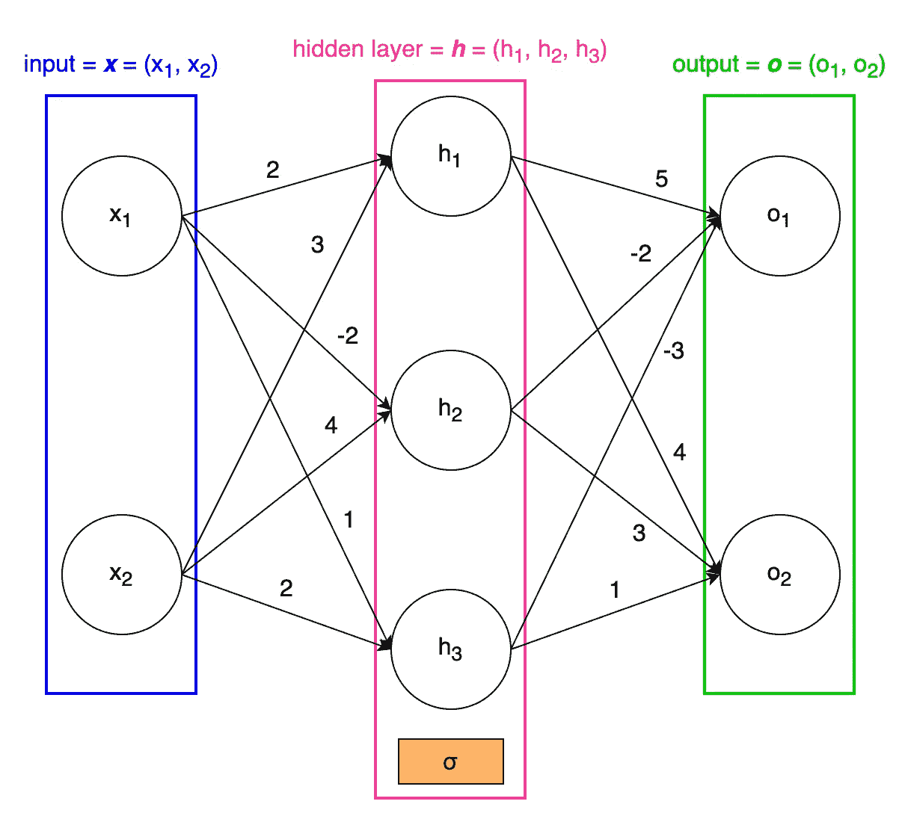
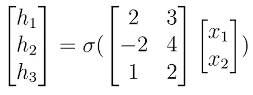
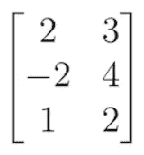
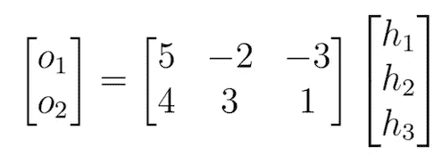
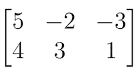

# 从头开始的神经网络(第一部分)

> 原文：<https://towardsdatascience.com/neural-networks-from-the-ground-up-part-1-880e6228d991?source=collection_archive---------37----------------------->

## 了解神经网络如何工作。不需要神经网络的先验知识。

大家都知道神经网络很神奇。在过去的二十年里，神经网络已经从一种实验方法发展成为我们今天使用最广泛的机器学习技术。现在，你自己也比以往任何时候都更容易获得神经网络的力量；像 TensorFlow 这样的框架使得构建神经网络变得轻而易举。然而，我认为它仍然是值得的，看看引擎盖下，了解一切是如何工作的。

这将是一个多部分的系列，我们将详细研究神经网络，首先发展理论，然后从头开始编码。除了一些高中数学知识外，不需要任何先验知识，也不会使用任何框架——一切都将从头开始编码。在这第一部分中，我们着重于神经网络理论。

**第一部分:神经网络力学**

让我们从一个神经网络图开始:

一个神经网络的例子。图片作者。

我们网络的输入是向量 ***x*** = (x₁，x₂).在机器学习行话中，我们将输入称为**输入层**。我们网络的目标是计算输出向量 ***o*** ，也称为**输出层**。从图中，我们注意到还有另一个向量， ***h*** ，在我们可以计算 ***o*** 之前需要计算它。向量 ***h*** 被称为**隐层**，因为它夹在网络中间，不被只能看到输入输出层的外界观察者看到。在这个网络中只有一个隐藏层，实际上你可以有更多的隐藏层。

各层的单个组件(图中的圆圈)被称为网络的**节点**。箭头上的数字称为网络的**权重**。每个节点的值是根据前一层的节点和来自这些节点的箭头上的权重来计算的。这听起来很混乱，所以我们来看一个具体的例子。隐藏层中的节点 h₁有两个指向它的箭头，分别来自节点 x₁和 x₂.这两个箭头的权重分别为 2 和 3。由于来自 x₁的箭的重量是 2，对 h₁的贡献是 2x₁.相应的，x₂对 h₁的贡献是 3x₂.因此 h₁的价值是 2x₁ + 3x₂.我们按照这种方法来计算隐藏层中所有节点的值:

> h₁ = 2x₁ + 3x₂
> 
> h₂ = -2x₁ + 4x₂
> 
> h₃ = x₁ + 2x₂

然而，我们还没有计算完*。请注意隐藏层下橙色框中的 sigma 符号。这代表了一个**激活函数**，在我们从上一层计算出隐藏层的所有元素后，我们对它们进行元素化的使用。激活函数的存在是为了给我们的网络引入非线性，允许它学习更多类型的函数。在这篇[文章](/understanding-the-expressive-power-of-neural-networks-d4918c9e98da)中，我会更详细地解释为什么会这样。一些常见的激活函数是 sigmoid、tanh 和 ReLU 函数。我们将在以后的文章中讨论这些常见的函数，因为现在我们假设σ是某个任意的激活函数。为了加入激活函数，我们需要将方程编辑为:*

> *h₁ = σ(2x₁ + 3x₂)*
> 
> *h₂ = σ(-2x₁ + 4x₂)*
> 
> *h₃ = σ(x₁ + 2x₂)*

*现在我们已经计算了 ***h*** ，我们可以计算 ***o*** 。再次跟随箭头，我们有:*

> *o₁=5h₁–2h₂–3h₃*
> 
> *o₂ = 4h₁ + 3h₂ + h₃*

*请注意，输出层上没有激活功能，这是由一个网络接一个网络做出的决定。有时输出层会有一个激活功能，在我们的例子中没有。*

***第 2 部分:使用矩阵***

*我们现在已经看到了神经网络不同部分的概述，以及如何从输入层计算输出层。我们的下一个目标是使这种计算更有效。我们目前单独计算每一层的每个节点。如果有一种方法可以并行计算一层中的所有节点，我们可以节省很多时间。事实证明，矩阵乘法正是这样做的。再次考虑我们计算隐藏层的三个等式:*

> *h₁ = σ(2x₁ + 3x₂)*
> 
> *h₂ = σ(-2x₁ + 4x₂)*
> 
> *h₃ = σ(x₁ + 2x₂)*

*我们可以用一个矩阵乘法方程来表示这三个方程:*

**

*图片作者。*

*以前σ是从一个标量到另一个标量的激活函数，现在σ是从一个矢量到另一个矢量的激活函数。你可以自己算出，这个矩阵方程确实给出了和上面一样的三个方程。我们也可以把这个矩阵方程写成矢量化的形式:**h**=σ(w₁****x***)。W₁被称为**权重矩阵**，因为它包含了从一层到另一层的权重。这里是 W₁:*

**

*图片作者。*

*我们还可以使用矩阵来计算输出层:*

**

*图片作者。*

*这个方程的矢量化形式是***o***=w₂****h***。W₂是另一个权重矩阵:*

**

*图片作者。*

*我们现在可以把整个神经网络写成矢量化的形式:***o***=w₂*σ(w₁****x***)。当我们在以后的文章中为我们的网络编写代码时，我们会看到这种矢量化的形式更容易实现，并且运行速度比我们原来的方程快得多。我们的矢量化方程也可以重写为函数的组合。这看起来像是无用的记数工作，但是当我们推导出训练网络的规则时，另一种形式就会派上用场。*

*考虑函数 f(W，***x***)= W ****x***。该函数取一个矩阵 W 和一个向量 ***x*** 作为其输入，并返回矩阵乘法结果作为输出。我们可以把我们的矢量化网络改写为 ***o*** = f(W₂，σ(f(W₁， ***x*** ))。这将是我们在以后的文章中用来推导训练网络的规则的等式。*

*到目前为止，我们已经检查了神经网络的机制，并找到了一种很好的计算输出层的矢量化方法。在下一篇文章中，我们将学习如何训练网络。敬请期待！*