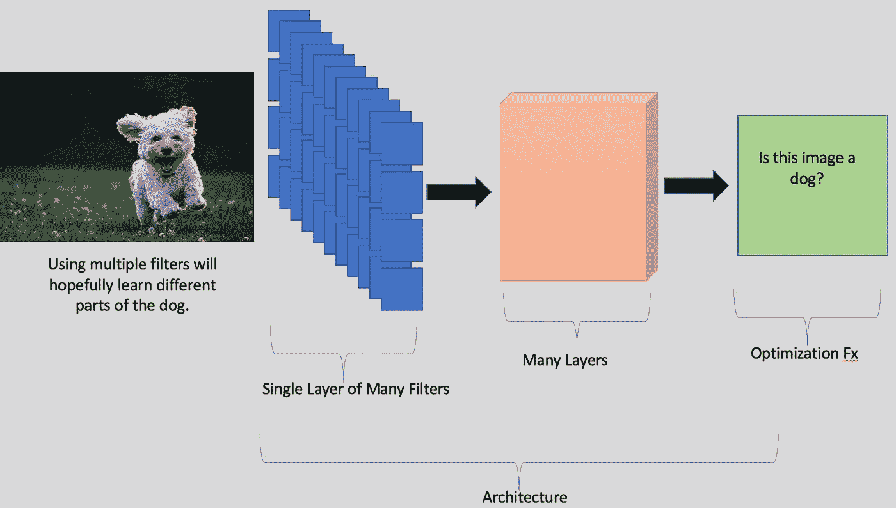
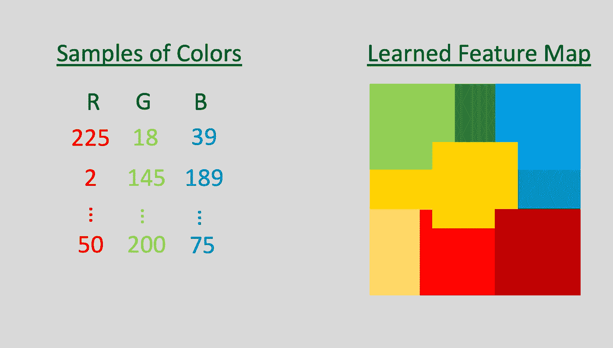

# 神经网络:不仅仅是深度学习

> 原文：<https://towardsdatascience.com/neural-networks-more-than-deep-learning-a0c9e1629781?source=collection_archive---------23----------------------->

## 神经网络是多功能的，让我们看看三种类型

神经网络是计算智能的一个分支，远远超出了深度学习。虽然许多人在寻找最深的网络，但其他人正在寻找不同类型网络的独特实现和用途。在这篇文章中，我给出了三种不同类型的神经网络的高层次概述——卷积神经网络、自组织特征映射和极限学习机。

埃伯哈德·🖐·格罗斯加斯泰格在 [Unsplash](https://unsplash.com?utm_source=medium&utm_medium=referral) 上拍摄的照片

# 动机

计算智能(CI)社区每年产生的研究数量令人震惊。竞争情报的一个特殊分支是一直受欢迎的**神经网络**。神经网络之所以成为主流，是因为它们的性能和对我们能把架构做多深的着迷。如今，深度学习似乎是“人工智能”的代名词，这推动了他们的接受度。我第一次接触深度学习是在做硕士论文的时候。我试图对多维声音信号进行分类(通过记录从感兴趣的区域反射回来的声音创建的图像)。那时，AlexNet 是精英；很自然地，我实现了这个卷积神经网络(CNN)来评估我的数据。令我惊讶的是，它表现得非常好。这次经历让我见识到了这些黑匣子的威力。然而，直到几年后我才知道神经网络远不止深度分类/回归算法。IEEE 计算学会将这一分支定义为“使用人脑作为灵感的来源，人工神经网络(NNs)是大规模并行分布式网络，可以从示例中学习和归纳。这个研究领域包括前馈神经网络、递归神经网络、自组织神经网络、深度学习、卷积神经网络等等。”您知道神经网络领域不仅仅是深度架构吗？我很兴奋地了解了其他一些领域，我将在这篇文章中分享它们。

**卷积神经网络**

照片由[乔·凯恩](https://unsplash.com/@joeyc?utm_source=medium&utm_medium=referral)在 [Unsplash](https://unsplash.com?utm_source=medium&utm_medium=referral) 上拍摄

**卷积神经网络(CNN)(可以说是最流行的神经网络类型)是主要关注图像处理的神经网络。**在描述神经网络时，大多数人会给出将图像分类为猫或狗的例子。CNN 正是执行这一任务的神经网络类型。为了分解 CNN，让我们考虑 CNN 的三个不同方面— *滤波器*、*架构*和*优化功能*。

**过滤器**
在本文中，我们将过滤器视为 CNN 的构建模块。每个滤波器是在训练阶段优化的一组权重。我们的目标是学习一组代表我们要分类的对象类型的权重。例如，第一层过滤器可以学习边缘，当我们进一步进入网络时，这些过滤器被组合以形成更复杂的形状。然而，这并不是真正发生的事情，因为我们不是为了学习形状而优化，而是为了准确性而优化。尽管优化形状是可能的，但是看看我们为形态学共享神经网络写的一篇论文吧。

**架构**
如果滤镜是构建模块，那么架构就是我们用滤镜构建出来的。架构是由其结构定义的，结构可以是深的(多层过滤器)和宽的(每层有许多过滤器)。没有完美的架构，这就是为什么有这么多的架构。我的研究领域之一是融合 CNN 进行图像分类[2]。我们融合了七个网络，我们发现融合网络提高了性能——表明多种架构更好。许多因素限制了哪种架构最适合您的情况。例如，您将在哪里部署您的 CNN？在你的手机上？在云端？更深的网络需要更多的计算能力，因此在使用(或构建)架构时考虑这些因素至关重要。

**优化功能**
优化功能驱动 CNN 的训练。对于图像分类，其目标可能是正确地分类尽可能多的图像。但是，假设 CNN 正在尝试执行对象定位(在图像中找到一个对象)。在这种情况下，优化函数将尝试查找并放置一个框在一个对象周围(并且只在该对象周围)。我们的创造力仅限于优化函数能做什么。

插图突出了 CNN 的三个组成部分。我的插画:)-Joe Caione 在 [Unsplash](https://unsplash.com?utm_source=medium&utm_medium=referral) 上的快乐狗狗 if 的照片

CNN 为一系列问题的解决打开了大门。像 TensorFlow 和 Pytorch 这样的开源软件包不仅促进了 CNN 的使用，也促进了任何 NN 的使用。鉴于它们的易用性，我确实觉得我们应该鼓励负责任地使用这些工具。在一个小时之内建立一个具有定制优化功能的定制架构是可能的(我已经这样做了几次)。我们应该挑战高精度足以部署模型的观念。作为这些技术的实践者，我相信我们每天都在做得更好，但我们应该继续追求卓越——特别是当我们把很多事情留给数据的时候。

**应用**
一如既往，我给大家留下一个例子。几年前，我在一家提供碎片监测服务的公司工作。监视器通过每年分析成千上万的图像来确保正确的负载估计。因此，我使用 CNN 来估计每次装载中碎片的数量(回归)和类型(分类)。这项任务不需要创建自定义架构；然而，我迭代了几个现成的架构，以找到性能最好的架构。这个项目花了几周时间，因为数据需要清理。数据中有例外，需要删除以确保我们不是在有缺陷的图像上进行训练。我确实改变了这个用例的优化函数。**准确度分数对于这个应用程序来说还不够。**对客户来说，一个重要因素是，如果加载调用出错，也不会差太多。例如，如果卡车是满的，我们从来不想称它是空的。因此，我将最大绝对误差添加到优化函数中。这种更新可以最大限度地减少回归值的偏差。我们的 CNN 可能会得到更多错误的图像，但它可以根据它们的错误程度来创建一个界限。

# 自组织特征地图

Marjan Blan | @marjanblan 在 [Unsplash](https://unsplash.com?utm_source=medium&utm_medium=referral) 上的照片

如果你用谷歌搜索“神经网络”，它会找到大约 162，000，000 个结果。其中很少是自组织特征映射(SOFMs)。SOFMs 与你今天听到的大多数神经网络相对不同——在应用和设置上都不同。SOFMs 推动了神经气体等其他算法的创建，但在这篇文章中，我们将从基础开始。

SOFMs 是一种无人监管的算法，这意味着我们没有标签(想想猫或狗)。大多数无监督算法要么执行聚类，要么执行降维。降维发生在我们对某个事物有很多维度，需要降维的时候。这是一个粗略的例子，但考虑一个立方体。它的宽度、高度和深度是定义它的一种方式。然而，如果我们将这些特征相乘，就可以计算出它的体积。我们已经从对一个对象的三个描述减少到一个，因此我们已经将它的数据维度从三个减少到一个。

不幸的是，数据并不总是如此清晰。很多时候，当我们从高维空间缩减时，我们会因为缩减到几个维度而丢失信息。同样，如果立方体是蓝色的，我们也不会用它的体积值来表示。结果，一整套算法试图降低数据的维度。在没有完美的归约工具的情况下，存在很多算法。NN 社区开发了 SOFMs 来解决这个问题。

要查看 SOFMs 的算法分类，请查看由[阿比纳夫·拉尔汉](https://medium.com/u/68121f8321d7?source=post_page-----a0c9e1629781--------------------------------)撰写的这篇文章。

**应用**

我最喜欢使用的 SOFMs 是它们在二维空间中可视化高维特征向量的能力。SOFMs 有两个阶段——训练和映射。在训练期间，随机生成的神经元“地图”开始训练过程。在每次迭代中，我们向映射提供训练数据，它通过将具有相似输出的神经元分组来更新/组织自身。目标是相似神经元的组/簇将自己与其他组分开。如果成功，我们将能够在二维图像中看到不同的星团。在映射期间，新样本(来自高维)被分类到它们所属的聚类中。一个非常简单的例子涉及像素颜色。像素可以用三个值来表示——R、B 和 B。我们可以使用 SOFM 算法对这些像素进行聚类。在这个例子中，我们知道颜色会聚集在一起，但是如果我们对颜色一无所知，我们会在查看地图后知道它们的相似性。下一张图是我们可以预期的一个例子。

在这个例子中，我们从许多像素值中学习特征图。我的插图:)

无监督方法在连接到应用程序时可能具有挑战性，因为它们通常用于探索数据集以更好地理解它。在大数据时代，我们的样本可能有成千上万个特征，数据科学家无法消化这么多的信息。因此，无监督技术将变得至关重要，因为我们正在收集更多的数据，并需要快速理解这些数据。SOFMs 可能是更好地洞察高维数据的关键。

# 极限学习机

由 [Unsplash](https://unsplash.com?utm_source=medium&utm_medium=referral) 上的[网络甜甜圈](https://unsplash.com/@webdonut?utm_source=medium&utm_medium=referral)拍摄的照片

极限学习机(ELMs)是一种不太为人所知的神经网络。ELMs 背后的理论不同于其他神经网络的训练。记住，神经网络通常使用反向传播来学习神经网络中的所有权重。

然而，在 ELMs 中，在训练期间只学习一组重量。各层中的权重是固定的，并随机初始化，只有最后一层的权重需要学习。当数据在网络中传播时，随机初始化的权重随机地变换数据。网络的最后一层最终变成了一个需要求解的线性方程。要使这个工具工作，一些数学技巧是必要的，这里有一个很好的描述[4]。

通常，我会强调一些类型的应用程序，但是到目前为止，您可能已经看到了一百种监督分类算法。相反，这里有一个关于榆树的有趣事实。榆树周围有戏剧。在学术论文中，戏剧很少出现在这一层面，但在榆树上却出现了。学术界因植根于坚实数学的新方法而繁荣。不幸的是，榆树可能不符合这个要求。榆树收到了反弹，因为榆树的想法不是新的，和[5]的作者想确保分配信贷适当的创造者正确。他们声称榆树是其他方法，他们不需要一个新的名字——极限学习机。

# 结论

总之，除了世界上典型的、主流的谷歌网络和 GPT-4 之外，还有许多不同类型的网络。当然，我会在该表扬的地方给予表扬，这些国家队绝对值得表扬。但是，记住神经网络的分支作为一个整体同样重要。我在这篇文章中只触及了皮毛，但是这个领域每天都在进步。我等不及要看接下来会发生什么了！

# 参考

[1]https://arxiv.org/pdf/1912.02259.pdf

[2][https://www . research gate . net/publication/326586154 _ explable _ AI _ for _ Understanding _ Decisions _ and _ Data-Driven _ Optimization _ of _ the _ Choquet _ Integral](https://www.researchgate.net/publication/326586154_Explainable_AI_for_Understanding_Decisions_and_Data-Driven_Optimization_of_the_Choquet_Integral)

[3][https://medium . com/@ abhinavr 8/self-organizing-maps-ff 5853 a 118d 4](https://medium.com/@abhinavr8/self-organizing-maps-ff5853a118d4)

[4][https://erdem . pl/2020/05/极限学习机简介](https://erdem.pl/2020/05/introduction-to-extreme-learning-machines)

[5]https://citeseerx.ist.psu.edu/viewdoc/summary?[doi=10.1.1.217.2330](https://citeseerx.ist.psu.edu/viewdoc/summary?doi=10.1.1.217.2330)