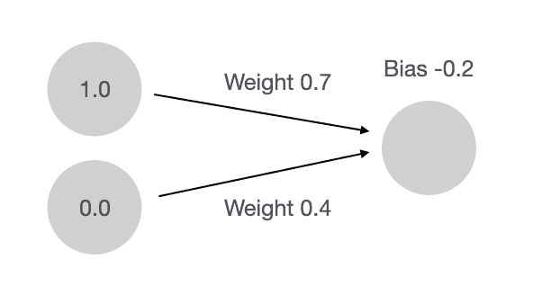
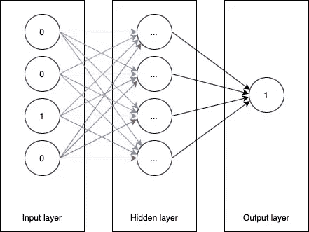

# Swift 中的神经网络

> 原文：<https://towardsdatascience.com/neural-networks-on-swift-ba181dcdfde5?source=collection_archive---------15----------------------->

## 在 Swift 中从头开始创建神经网络框架

安迪·凯利在 [Unsplash](https://unsplash.com?utm_source=medium&utm_medium=referral) 上的照片

# 介绍

我们生活在伟大的技术周围，比如自动驾驶汽车、语音助手、图像分析仪。他们中的大多数使用神经网络作为他们算法的基础。我们将使用 Swift 从头开始构建一个基本的神经网络。

# 一些理论

在开发应用程序之前，我们必须学习神经网络的理论。神经网络由*输入、输出和隐层*组成。全连接简单层由*神经元*组成。突触将神经元相互连接起来。每个突触都有自己的*权重值*。在生成神经网络的过程中，它用随机值填充权重。它们会在训练时改变(在下面的动画中，**红色**表示*高重量*，**蓝色**表示*低重量*)。

训练神经元。图片作者:Yauheni Stsefankou

训练过程分为几个时期。我们在每个时期处理数据集中的所有数据样本。我们用数据样本的输入填充输入层。然后每一层通过激活功能处理输入，并通过突触发送到下一层。当一个值通过突触时，它会将该值乘以突触权重。当计算神经元的值时，它*将所有输入值和偏差*相加。

正向传播。图片作者:Yauheni Stsefankou

这是一个神经网络的例子。它得到*一个无符号的 4 位数字*并返回*该数字是否为偶数*。注意*所有偶数的二进制表示都以 0 结尾*。这意味着**预测只取决于最后一位**(输入层的第四个神经元)。这就是为什么我强调了连接到输入层最后一个神经元的突触。输入层的其他突触没有意义，它们的权重在训练期间接近零。

神经网络示例。图片作者:Yauheni Stsefankou

# **短评**

由于缺乏非常紧密的优化和 GPU 兼容性，我们的神经网络框架不会很快。它唯一的优化是通过 DispatchQueue 的并发执行而不是循环的*多线程。*

并发执行 vs For 循环。图片作者:Yauheni Stsefankou

该实现由*密集层、sigmoid 函数、训练和预测方法*组成。

开始吧！

# 数据集结构

我们必须实现包含我们想要训练的所有样本的数据集。

这是一个数据集模型。

数据集模型。图片作者:Yauheni Stsefankou

注意*数据集由数据样本*组成。让我们在 Swift 中实现该结构。

我们的第二个观察是*数据样本包括输入和输出数据*。

并且*为了方便起见，数据块由一个体和它的大小*组成。

数据的大小*必须有宽度，可选变量是高度和深度*(取决于数据大小的类型)。这就是我们为所有数据大小类型提供初始化器的原因。

数据片可以是 *1D、2D 或 3D* 。

# 神经网络模型类

我们在神经网络中实现了一个数据集系统。现在我们需要创建一个神经网络类。它包括*层、学习率、每次训练的次数、每个训练批次的样本数*。

现在我们需要实现*层类*。每层包括几个神经元(卷积层除外)和一个针对它们的激活函数。此外，我们将为反向传播保留输出缓存。

每个神经元存储每个突触的权重和偏向。此外，我们保留一个缓存来更新权重，以支持*批处理*梯度下降类型。有 3 种梯度下降类型:*批量、随机和小批量*。使用*批量*和*小批量*梯度下降，在多次传播后更新权重。此外，我们保留 delta 用于反向传播。

神经网络使用许多激活函数如 *sigmoid，ReLU* 。我们需要将这些激活功能定义为一个协议。每个激活包含传递函数(用于正向传播)和导数函数(用于反向传播)。我们还存储 ID (rawValue)用于枚举函数。

现在，对于该协议，可以创建激活功能的结构。让我们做一个 sigmoid 函数。

# **乙状结肠功能**

来自维基百科的渲染方程

我想你已经看过了 sigmoid 函数的图表。这是:

sigmoid 函数的图形。图片来自 Qef 的维基百科

**当我们需要获得输出的概率时，sigmoid 函数**是合适的。比如偶数的概率。
**sigmoid 导函数**是输出和输出与 1 之差的乘积。

我们的 sigmoid 结构包含它的*标识符*(raw value)*传递函数和导数函数*。

此外，我们需要为我们的函数创建一个 enum 和一个从标识符中获取它们的方法。

# 层功能

每种类型的层应该有单独的传播。他们在这里:

# 训练算法

我们需要做的第一件事是*将数据集分成批次*。我们可以通过改组数据样本，然后将它们分成大小等于首选批量大小的组来实现这一点。

分成几批。图片作者:Yauheni Stsefankou

然后，对于一批中的每个样本，该算法执行向前和向后传播。在批量使用所有样本后，该算法更新所有层的权重。

# 传播正在执行

**前向传播**通过突触将神经元的输出发送到下一层。

***反向传播*** 通过使用正向传播缓存传播预测误差，并将其推向输入层。对于第一次传播，样本的期望值用作输入。

**增量权重方法**计算权重的变化，并将其存储在缓存中。它的工作方式类似于正向传播。

# 致密层

我们的神经网络中的第一层子类是**密集层**。我们在*部分考虑了密集层的一些理论*。这是神经网络最简单的一层。

好的。我们已经初始化了一个密集层，现在我们需要为它编写传播函数。我们使用 DispatchQueue 中的并发执行来代替循环。*正向传播*通过将每个神经元的权重与传递给它的输入相乘，生成每个神经元的输出。这也增加了结果的偏差。具有结果的最后一个操作是激活传递函数的使用。

*反向传播*使用正向传播的输出将误差传播到所有神经元。它使用激活导数函数传播误差。多线程在这里不是最优的，所以我们不使用它。

*增量权数法*正在使用并发执行。在建立神经网络模型时，你应该为学习率找到一个甜蜜的运动。此外，在此方法执行期间，偏差也在更新。

在使用批中的所有项目后，神经网络用传播缓存更新神经元的权重。当然，这里最好使用多线程并发执行。

神经网络的第二个重要功能是*预测*。为了预测结果，函数*接收正向传播结果*。

# **使用编写的框架实现神经网络模型**

万岁！我们已经实现了*我们的神经网络框架的基础，sigmoid 激活和它的密集层*。现在我们可以用一个简单的例子来验证这一点。

这个例子的任务是*按照奇偶性对一个数进行分类*。对于神经网络来说，这是一项不同寻常的任务，但很容易理解。

为了初始化一个新的神经网络模型，我们需要将它写入代码:

之后，我们可以更改模型的一些参数(批量大小、时期数和学习率):

实现神经网络模型时最重要的部分是建立层结构。下面是层结构示例:

之后，我们的模型就可以开始训练了。这一切都始于将数据集输入模型。

我们将输入的数字*作为它的二进制数*，得到*它是偶数的概率*。我们数据集中的第一个样本是*【0.0，0.0，0.0，1.0】*，它的期望值是 *0.0* 。这意味着输入数字的二进制表示是 *0001* 。用十进制表示，将是 *1* 。这是一个奇数。所以我们期望 *0.0* (零概率表示数是偶数)。

训练好神经网络之后，就可以开始用它来进行预测了。您可以通过将数据样本输入模型来获得预测。

用 30 个纪元训练的结果。图片作者:Yauheni Stsefankou

结果是 *0.45* ，表示答案是 55%概率的 *0(奇数)*或 45%概率的 *1(偶数】*。

用 1000 个纪元训练的结果。图片作者:Yauheni Stsefankou

当我们将历元数改为 *1000* 时，训练时间延长了三十倍，但 *1111* 的均匀度概率变为 *3.8%* 。这意味着我们的神经网络模型变得更加精确。

# 模型保存

为了保存模型，我们需要准备好所有的结构和类。它们必须与 JSON 编码的可编码协议兼容。几乎所有的类和结构都只需要在声明中添加可编码协议:

我们将该层实现为一个类，而不是一个结构。该类要求编码和解码方法符合可编码协议。编码和解码方法需要所有变量的密钥。

添加之后，我们必须将解码器中的初始化器添加到我们的密集层中。

我们需要为层写一个包装器，因为层类*不是最终的，它可以有子类*。它不仅编码层的子类，还编码子类的类型。

写完包装器后，我们需要用自己的方法替换神经网络模型的编码和解码方法。我们对层的包装进行编码，而不是像这样对层进行编码和解码，因为我们需要存储层的类型。

现在我们可以编写一个方法来保存模型。首先，我们必须初始化 JSON 编码器，并使用它来编码模型。然后，我们获取当前应用程序目录的 URL，并将编码数据写入其中。

从文件中读取模型并不比保存它更困难。现在，我们不是初始化 JSON 编码器，而是初始化 JSON 解码器。然后我们从文件中获取数据并用我们的解码器解码。我们需要做的最后一件事是从解码的模型变量初始化模型。

# 结论

我们已经创建了基本的神经网络框架，现在我们可以添加任何类型的功能和层。这里有一个 git 资源库的链接，里面有所有的源代码和一些额外的功能(丢弃、展平和卷积 2D 层，ReLU 激活):[https://github.com/stefjen07/NeuralNetwork](https://github.com/stefjen07/NeuralNetwork)。

感谢阅读。如果你有任何建议或者你在这篇文章中发现了错误，请在评论中留下你的反馈。我已经准备好改善我的读者的体验。