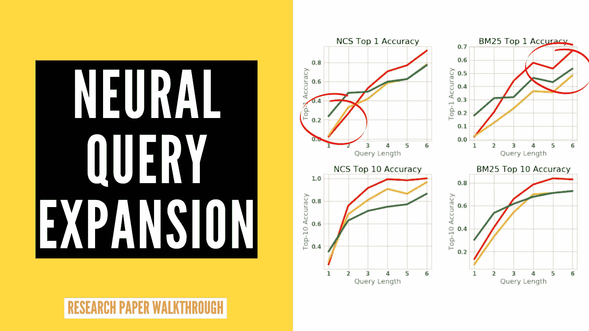
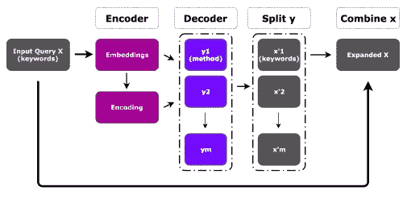
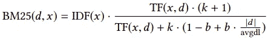
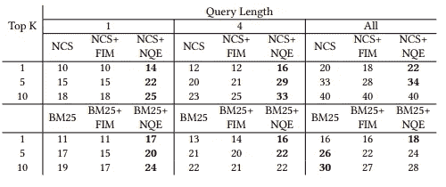

# 用于代码搜索的神经查询扩展

> 原文：<https://towardsdatascience.com/neural-query-expansion-for-code-search-3d60ebe8b751?source=collection_archive---------28----------------------->

## 研究论文摘要

作者图片—修改过的[来源](https://dl.acm.org/doi/abs/10.1145/3315508.3329975)

以自由流动的自然语言形式制作一个高效的代码搜索工具是一个有趣且具有挑战性的研究问题。这一领域的早期工作之一是脸书的[神经代码搜索](https://ai.facebook.com/blog/neural-code-search-ml-based-code-search-using-natural-language-queries/)(NCS)**接受自然语言查询并输出相关代码片段**。但本文作者发现，在用户进行简短或模糊查询的情况下，NCS 会偏离其预期性能。因此，作者提出了一个名为**神经查询扩展** (NQE)的查询扩展引擎，当它与 NCS 一起使用时，能够比单独使用 NCS 执行得更好。

在研究他们公司的搜索数据库日志时，作者发现**较长的查询往往具有较少的查询重构**(查询编辑、重新措辞等)，这强烈表明了较长查询的 NCS 的有效性。他们还注意到了对比，即**短查询导致了大量事件，如滚动、查询重构**等，这表明用户无法一次性获得相关结果。因此，像 NQE 这样将查询关键词扩展成相关短语的系统在这种简短的查询情况下会有所帮助。

# 神经查询扩展—方法

让我们先来谈谈一些符号——

**D** =语料库(所有源代码)， **di** =文档(一个代码)， **Vm** =词汇 _ M(D 中的所有方法名)， **Vk** =词汇 _MT(在 camelCase 和 snake_case 中标记的所有方法名)， **X** =来自 Vk 的一组关键字 xi， **R** =文档的排序列表(di)

因此，对于给定的查询 X，系统返回 R，并让 dx 成为预期的基本事实文档。因此，我们定义 *rank(dx，R) —* ，其中较好的搜索结果简单地由 dx 的数值较低的等级来指示。将排名视为搜索结果中的优先顺序，**排名越低，优先级越高。**因此，扩展系统的目标是确保具有扩展查询 **(E)** 的预期文档 dx 的等级应该小于原始查询 **(O)** 。

作者提出的 NQE 模型是一个**编码器-解码器模型**，它在输入端接受一个查询 x，并产生一系列方法名 Y = ⟨y1。。。,ym⟩在那里挨个咦∈ Vm。一旦我们有了方法名序列，他们就应用 camelCase 和 snake_case split 函数来获取扩展查询(Xexp)的关键字。

NQE 管道—图片来自[原文](https://dl.acm.org/doi/abs/10.1145/3315508.3329975)

正如你在上面的图中看到的，对于每个输入 X，我们通过一个可训练的嵌入层传递每个关键字 xi，以获得每个关键字的密集表示。我们在列级别对所有嵌入求和，以获得整个 x 的表示。然后，这个思想向量通过一堆水平堆叠的 [GRU 单元](https://en.wikipedia.org/wiki/Gated_recurrent_unit)，并且在每个时间步，它在方法名称上产生一个 softmax 分布，并且这种循环直到产生序列令牌的结尾。作者使用[波束搜索](https://en.wikipedia.org/wiki/Beam_search)生成具有**最大似然**的序列。它们还利用注意力来动态地识别输入序列中与产生下一个输出令牌相关的重要段。

# 搜索工具

他们使用他们提出的方法 NQE 与两个流行的搜索工具 NCS 和 BM25。

*   **神经代码搜索(NCS)——**它是一种**无监督的方法**将给定的输入查询与相关代码段进行匹配。他们使用 [fasttext](https://fasttext.cc/) 来表示查询中的单词和某个**密集语义超空间**中的代码片段。其中他们将类名、注释、方法名等视为代码中可能的词法单元，并使用 [TF-IDF](https://en.wikipedia.org/wiki/Tf%E2%80%93idf) 加权单词级嵌入平均值来获得整个代码片段的表示。对于查询，他们只是对每个单词表示进行平均。最后，他们使用**余弦相似性作为两个向量(查询和代码)接近度**的度量
*   [**BM25**](https://xapian.org/docs/bm25.html)**—**这是一种流行的 [IR](https://en.wikipedia.org/wiki/Information_retrieval) 方法，它使用下面提到的公式计算每个查询词和代码片段之间的得分—

设， **d** 为代码片段， **x** 为查询词， **TF** 为词频， **IDF** 为逆文档频率， **k** 和 **b** 为可调参数，则—

BM25 计算

这创建了一个大小为(d x 词汇 _ 单词)的**矩阵，其中单元值为 BM25 分数，给出了每个文档 d 的稀疏表示。对于每个查询向量，我们创建了大小为(1 x 词汇 _ 单词)的查询**的**一个热码表示，并在查询和文档向量之间进行余弦相似性运算，以生成相似性分数。**

# 基线

*   **频繁项集挖掘** *—* 这是一种在底层数据集中寻找**同现词汇单元**的技术，基于下面的公式 *—* 计算

FMI 公式

这里，sb 和 se 在时间 T 和 T+1 是同现词。它是两个单词一起出现的频率与 T 时刻单词单独出现的频率的比率。为支持度和置信度设置阈值以避免误报是一种常见的做法。作者使用最小支持值为 3，最小置信度为 0.5。

# 数据集和实验

作者使用公开可用的 android 相关存储库，共有 308，309 种方法，并执行某些预处理步骤来**处理低词汇**情况。下一个任务是从数据中创建 X 和 Y 对，以便可以训练编码器-解码器模型。他们从每个方法体中提取 X 和 Y，其中 **Y 是文档 d 中方法调用**的序列。他们对方法调用进行排序，并通过保留前 50%的 tf-idf 方法来限制它们的选择。然后，他们通过应用诸如标记化、删除停用词等转换，从方法名中提取关键字。下一步是从 y 中提取 X。他们提出了两种方法来实现这一点—

1.  Y 组合的所有关键字中前 75%的 TF-IDF 关键字
2.  每个 y 的前 1 个 IDF 关键字。

这两种方法都是通过从方法名中选择最有代表性的单词来捕捉潜在意图的**代理。**

在另一种方法中，他们还雇佣人类从 Y 创造 X 来验证上一段中描述的自动选择程序。

# 结果

在下面的结果表中可以看出，当查询长度较小时，NCS+NQE 比 NCS 具有更好的平均倒数排序。

Tf-IDF 用于查询选择时的 MRR 结果—图片来自[来源](https://dl.acm.org/doi/abs/10.1145/3315508.3329975)

***P.S.*** *我也在为这篇论文做多语种字幕的视频讲解。一旦发布，我会在评论中更新！*

**2021 年 2 月 15 日更新**

*视频讲解人* —

NQE 视频解说

*您还可以查看我为同一主题撰写的其他研究论文解释—* [*伯特-QE:情境化查询扩展*](https://medium.com/nerd-for-tech/bert-qe-contextualized-query-expansion-for-document-re-ranking-4f0f421840b9)

如果你仍然对某件事感到困惑，一定要看报纸。另外，向作者问好，感谢他们的贡献。

> **论文题目:**用于代码搜索的神经查询扩展
> 
> **论文链接:【https://dl.acm.org/doi/abs/10.1145/3315508.3329975】T22**
> 
> **作者:**杰森·刘，徐珠贤·金，维贾亚拉冈·穆拉利，斯瓦拉特·乔杜里，萨迪什·钱德拉
> 
> 组织:脸书莱斯大学

我希望这本书值得你花时间去读。谢谢大家！