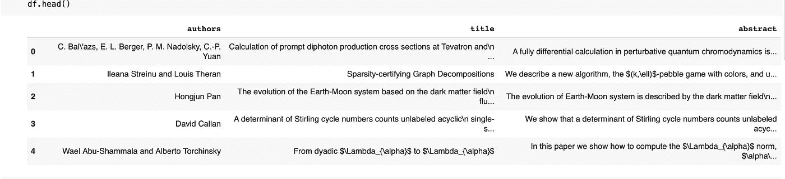
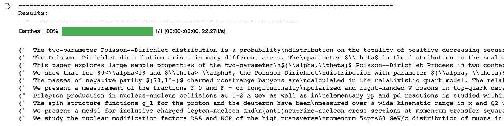

# Haystack 神经搜索——语义搜索的极致

> 原文：<https://towardsdatascience.com/neural-search-with-haystack-semantic-search-at-its-finest-5f39d07b992?source=collection_archive---------14----------------------->

## 一个快速简单的指南，用变形金刚和最少的设置建立你自己的搜索引擎


卢卡·胡特在 [Unsplash](https://unsplash.com?utm_source=medium&utm_medium=referral) 上的照片

语义搜索在我们的日常生活中相当常见，尤其是我们使用谷歌作为大多数问题(如果不是所有问题)答案的媒介的次数。直到几年前，在没有大量计算资源的情况下构建一个相当不错的搜索引擎还是一件痛苦的事情。简而言之，这太难了，需要大量的高级 NLP 概念的专业知识。

> BERT transformer 模型及其后继者的出现改变了这一点。虽然我们仍然需要一个好的 GPU 来微调这些模型，但一些令人敬畏的库，如 [Haystack](https://haystack.deepset.ai/) 现在已经可以非常容易地围绕我们选择的数据集构建生产就绪的应用程序。

在本文中，我将展示如何从公开可用的数据集(例如 Kaggle)中快速构建自己的定制搜索引擎。

我们开始吧！👇

## 但首先，干草堆到底是什么？

> 简而言之，它是一个非常棒的库，可以用来构建生产就绪的、可伸缩的搜索系统和问题回答系统。

它利用了最新的 transformer 模型，因此对研究人员和开发人员来说都是最好的 NLP 工具包之一。

它提供了用于构建此类系统的不同组件，这些组件非常易于学习和实验。我将在本文中讨论其中一些，希望能给你一个好的起点！

## 获取数据集

我们将使用来自 Kaggle 的数据集的子集[。它包含大约 170 万篇来自 STEM 的 arxiv 研究论文，每篇论文都有不同的特征，如摘要、作者、发表日期、标题等。它是 json 格式的，我编译了一个更小的版本。](https://www.kaggle.com/Cornell-University/arxiv)

> 在我的 GitHub repo 上的这里有更小的版本。继续将 **arxiv_short.csv** 下载到您的机器上。

为了简单起见，我确保只保留 50，000 个文档和三列:

*   **作者** —论文的作者
*   **摘要** —论文摘要
*   **标题** —论文标题

和熊猫一起读:

```
import pandas as pddf = pd.read_csv('arxiv_short.csv')
df.head()
```

我们来看看数据:



arxiv 数据集标题行

我们现在准备设置我们的 haystack 引擎。

## 安装干草堆

这一步只需要两行代码。首先确保你处于虚拟环境中。

```
pip install git+https://github.com/deepset-ai/haystack.gitpip install sentence-transformers
```

> 我们将使用 haystack 构建实际的搜索引擎，并使用句子转换器从我们的 ***摘要*** 文本列创建句子嵌入，我们的搜索引擎将基于该文本列。

现在，让我们继续为我们的 haystack 搜索引擎构建不同的组件！

## 初始化文档存储和检索器

> 一个**文档存储库**存储我们的可搜索文本及其元数据。

例如，这里我们的文本将是来自数据集的**抽象**列，其余两列— **标题**和**作者** —将由我们的元数据组成。

初始化和构建相当简单:

```
document_store_faiss = FAISSDocumentStore(faiss_index_factory_str="Flat", return_embedding=True)
```

[FAISS](https://github.com/facebookresearch/faiss) 是一个用于高效相似性搜索和密集向量聚类的库，因为它不需要额外的设置，所以我更喜欢在这里使用它而不是 Elasticsearch。

现在猎犬来了。

> 一个**检索器**是一个过滤器，它可以快速遍历整个文档库，并根据对给定查询相似性搜索，从中找出一组候选文档。

> 其核心是，我们正在构建一个语义搜索系统，因此从查询中获取相关文档是我们项目的核心。

初始化一个检索器也很简单:

```
retriever_faiss = EmbeddingRetriever(document_store_faiss, embedding_model='distilroberta-base-msmarco-v2',model_format='sentence_transformers')
```

在这里，**distilloberta**仅仅是一个 transformer 模型 BERT 模型的变体——我们在这里使用它来为我们的文本进行嵌入。它作为**句子变形金刚**套装的一部分提供。

现在，我们想将文档写入我们的文档存储。

## 构建文档存储

我们只需将数据帧的列传递给文档存储。

```
document_store_faiss.delete_all_documents() # a precaution document_store_faiss.write_documents(df[['authors', 'title', 'abstract']].rename(columns={ 'title':'name','author' : 'author','abstract':'text'}).to_dict(orient='records'))
```

这里需要进行一点重命名，因为 haystack 希望我们的文档以这种格式编写:

```
{ 'text': DOCUMENT_TEXT, 'meta': {'name': DOCUMENT_NAME, ...}     }, ... and so on.
```

最后，在构建完成后，我们将文档存储提供给我们的检索器。

```
document_store_faiss.update_embeddings(retriever=retriever_faiss)
```

> 数据集越大，这两个步骤需要的时间就越长。

我们快完成了！剩下唯一要做的就是创建一个函数来检索与查询匹配的文档！

## 总结——获取结果并尝试

我们定义了一个简单的函数来从我们的数据中获取 10 个相关的文档(研究论文摘要)。

```
def get_results(query, retriever, n_res = 10): return [(item.text, item.to_dict()['meta']) for item in    retriever.retrieve(q, top_k = n_res)]
```

最后我们测试一下！

```
query = 'Poisson Dirichlet distribution with two-parameters' print('Results: ')res = get_results(query, retriever_faiss)for r in res:
    print(r)
```

您可以看到这样的结果:



搜索结果

这就是你要的——一个建立在你选择的数据集上的定制语义搜索引擎！

去玩吧！调整一些参数—例如，尝试更改检索器对象中的转换器模型。

完整的代码也可以在这里的笔记本上找到:

<https://github.com/yashprakash13/haystack-search-engine>  

感谢阅读！:)

> 独自学习数据科学可能会很难，[跟我来](https://medium.com/@ipom)，让我们一起让它变得有趣。保证。😎

此外，这里是我所有数据科学故事的代码库。快乐学习！⭐️

这是我的另一篇文章，你可能想读一读:

</deploying-an-ml-model-with-fastapi-a-succinct-guide-69eceda27b21> 