# neur IPS 2021——你不应错过的 10 篇论文

> 原文：<https://towardsdatascience.com/neurips-2021-10-papers-you-shouldnt-miss-80f9c0793a3a?source=collection_archive---------0----------------------->

## 2334 篇论文，60 场研讨会，8 位主题演讲人，15，000 多名与会者。如果没有一个好的向导和地图，很难找到一个密集的景观，所以这里有一些我们的想法！

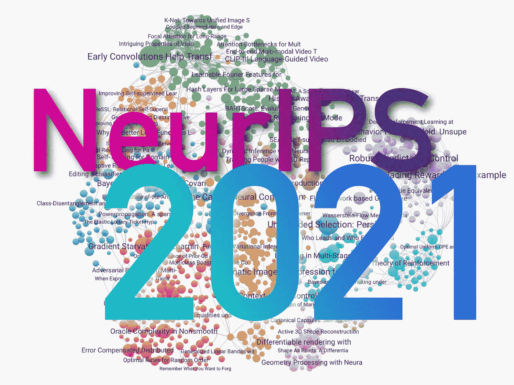

使用 [Zeta Alpha](https://www.zeta-alpha.com) 创建的图像。

人工智能领域最受欢迎的会议 2021 年版将在这里以“压轴大戏”结束这一年。会议的增长并没有停止:去年的会议——[——我们也回顾了](/neurips-2020-10-essentials-you-shouldnt-miss-845723f3add6)——有 1899 篇主流论文被接受，相比之下，今年的只有 2334 篇。

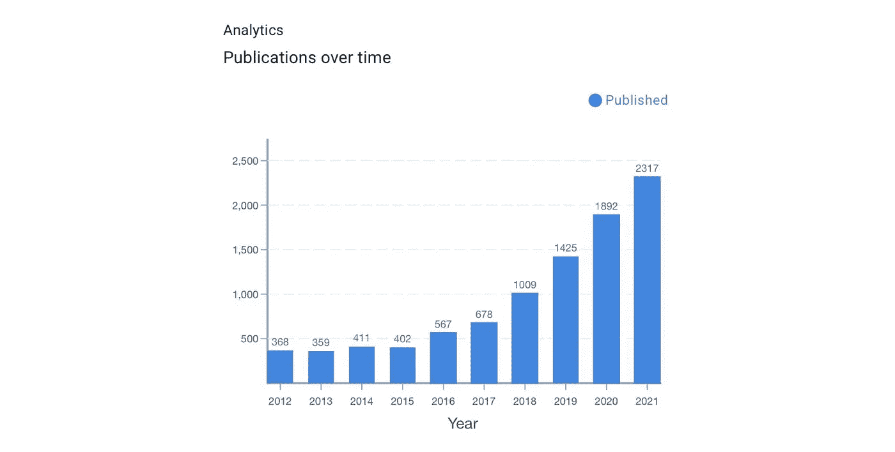

NeurIPS 过去十年主要领域的出版物数量。

一些发表的论文已经在 arxiv.org 发表了一段时间，并且已经产生了影响。例如，这里有一份甚至在会议开始前就被引用最多的 10 篇 NeurIPS 论文的列表。这是浏览程序和观看作者展示作品的第一个好的起点。

理解这一令人印象深刻的阵容并不容易，但在[人工智能研究导航员](https://search.zeta-alpha.com/?q=&doc_sources=Advances+in+Neural+Information+Processing+Systems&d=lm)在 [Zeta Alpha](https://www.zeta-alpha.com/) 的帮助下，我们通过引用[最相关的 NeurIPS 论文](https://search.zeta-alpha.com/?q=&doc_sources=Advances+in+Neural+Information+Processing+Systems&d=lm&sort_by=citations)、spotlight 演示和来自平台的一些建议，确定了一些我们想要强调的酷作品；有些已经众所周知，有些更多的是一颗*隐藏的宝石*。当然，这些精选并不旨在成为一个全面的概述——我们将错过许多主题，如 ML 理论，联合学习，元学习，公平——但我们只能在一篇博客帖子中容纳这么多！

**更新 12 月 1 日**:现在[最佳论文奖已经揭晓](https://blog.neurips.cc/2021/11/30/announcing-the-neurips-2021-award-recipients/)，这也是一个很好的起点，虽然对我们的口味来说理论有点重。

## [1。用于基于结构的药物设计的 3D 生成模型](https://papers.nips.cc/paper/2021/hash/314450613369e0ee72d0da7f6fee773c-Abstract.html) |👾[代码](https://github.com/luost26/3D-Generative-SBDD)

*作者:罗世同，关，马建柱，。*

**❓Why** → *Bio ML* 已经成为机器学习技术应用和进步最显著的领域之一。这是一个最近的例子，说明如何在基于蛋白质结合的药物设计中使用生成模型。

**💡关键见解** →掩蔽语言建模(通过掩蔽一些元素破坏一个序列并试图重建它)的想法被证明对生成分子也是有用的:掩蔽单个原子并“重建”它们应该如何被填充。通过迭代地进行该过程(例如“自回归”)，这变成了可以输出候选分子的生成模型。

相对于以前的工作，这篇论文的主要进展是分子的产生取决于特定的蛋白质结合位点，为研究人员提供了一种更好的机制来寻找候选分子，以作为特定目的的药物。

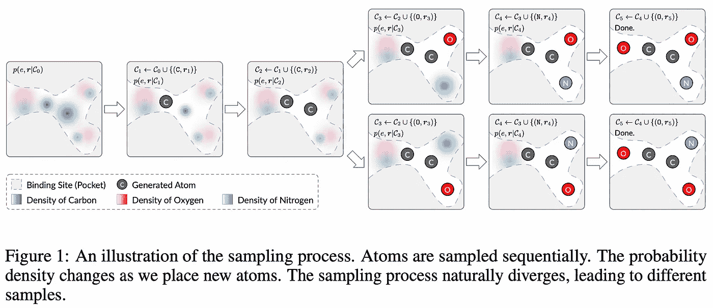

来源:[https://papers . nips . cc/paper/2021/file/314450613369 E0 ee 72d a7 f 6 fee 773 c-paper . pdf](https://papers.nips.cc/paper/2021/file/314450613369e0ee72d0da7f6fee773c-Paper.pdf)

为此，训练需要几个技巧，例如建立一个对刚性变换(平移和旋转)不变的编码器，因为分子不关心它们如何取向。这些结果并不是突破性的，该方法仍然存在一些问题，例如它经常可以输出物理上不可能的分子，但这一研究方向对于未来的药物开发来说肯定是有前途的

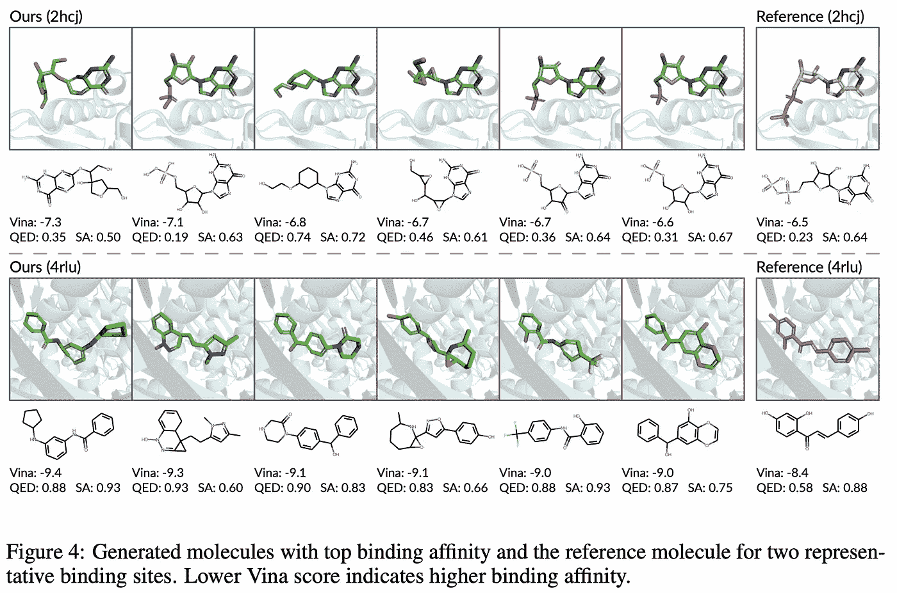

来源:[https://papers . nips . cc/paper/2021/file/314450613369 E0 ee 72d 0 da 7 f 6 fee 773 c-paper . pdf](https://papers.nips.cc/paper/2021/file/314450613369e0ee72d0da7f6fee773c-Paper.pdf)

**neur IPS 针对分子结构的 ML 的其他工作:** [蛋白质的多尺度表示学习](https://papers.nips.cc/paper/2021/hash/d494020ff8ec181ef98ed97ac3f25453-Abstract.html)，[利用探索性 RL 和基于片段的分子生成的 Hit 和 Lead 发现](https://papers.nips.cc/paper/2021/hash/41da609c519d77b29be442f8c1105647-Abstract.html)，[用于非迭代多样性候选生成的基于流网络的生成模型](https://papers.nips.cc/paper/2021/hash/e614f646836aaed9f89ce58e837e2310-Abstract.html)。

## [2。对象的出现:从视频中学习零镜头分割👾](https://papers.nips.cc/paper/2021/hash/6d9cb7de5e8ac30bd5e8734bc96a35c1-Abstract.html)[代号](https://github.com/rt219/The-Emergence-of-Objectness)

*刘润涛、、余、林。*

> **作者的 TL；DR →** 我们提出了一个适用的零镜头模型，通过从未标记的视频中学习来进行对象分割。

**❓Why →** 人类可以很容易地追踪我们从未见过也不认识的物体……机器也应该这样做！

**💡关键见解→***客体性*的概念通常被认为是人类重要的先验知识之一，它使我们能够看到并推理我们所看到的东西。这里的关键是，我们不需要知道对象是什么，就知道它是一个对象。相反，当以监督方式训练用于图像分割的神经网络时，模型将仅学习分割在训练期间看到的对象。

本文建议使用视频数据和巧妙的技巧来建立一种自我监督的训练方法，这种方法利用了对象和前景在记录中的不同行为。这让人想起了脸书的《迪诺》[1],该书揭示了在用图像进行自我监督训练后，变形金刚的注意力矩阵类似于某种原始分割。

在这种情况下，作者使用单帧重建损失(分割网络)和运动网络的组合，试图输出像素在图像中如何移动的特征图。这使得他们可以在给定重建和运动图的情况下预测未来的帧，这是端到端的自我监督。

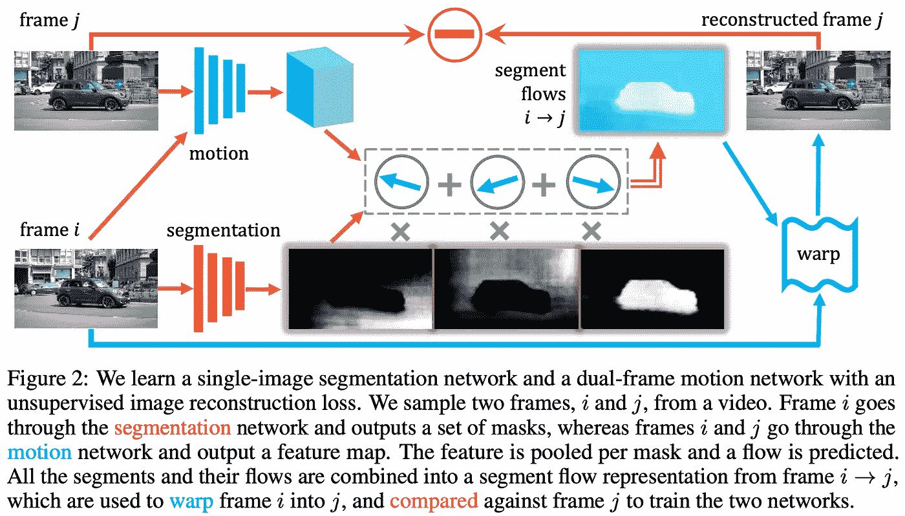

来源:[https://papers . nips . cc/paper/2021/file/6d 9 CB 7 de 5 e 8 AC 30 BD 5 e 8734 BC 96 a 35 c 1-paper . pdf](https://papers.nips.cc/paper/2021/file/6d9cb7de5e8ac30bd5e8734bc96a35c1-Paper.pdf)

要做到这一点，需要更多的技巧和考虑，结果仍然不是惊天动地的。尽管如此，利用视频将未标记的数据用于计算机视觉是机器学习未来的一个关键发展，因此这一系列工作必将产生影响。

**neur IPS 的其他有趣的计算机视觉论文:** [用专家的稀疏混合来缩放视觉](https://papers.nips.cc/paper/2021/hash/48237d9f2dea8c74c2a72126cf63d933-Abstract.html) ( [我们几个月前已经报道过了！](/best-of-arxiv-readings-for-july-2021-d09a192d7fd8) ) [关注 MLPs](https://papers.nips.cc/paper/2021/hash/4cc05b35c2f937c5bd9e7d41d3686fff-Abstract.html)([6 月还盖回来了](/best-of-arxiv-june-2021-dcd3aa48a66d))[视觉变形金刚的耐人寻味属性](https://papers.nips.cc/paper/2021/hash/c404a5adbf90e09631678b13b05d9d7a-Abstract.html)，[压缩视频对比学习](https://papers.nips.cc/paper/2021/hash/7647966b7343c29048673252e490f736-Abstract.html)，

## [3。使用冻结语言模型进行多模式少量学习](https://papers.nips.cc/paper/2021/hash/01b7575c38dac42f3cfb7d500438b875-Abstract.html) |🌐[网站](https://fh295.github.io/frozen.html)

*作者:Maria Tsimpoukelli、Jacob Menick、Serkan Cabi、S. M. Ali Eslami、Oriol Vinyals、Felix Hill。*

> **作者的 TL；博士→** 我们提出了一个简单的方法，将冻结的语言模型的能力转移到多模态设置(视觉和语言)中。

**❓Why** →提示已经存在:现在是多模式和*异步。*您能否利用预训练语言模型中的信息来完成视觉任务，而无需重新训练？嗯，有点…继续读。

**💡关键见解** →本文提出的想法相当简单:训练一个语言模型，*冻结它*使其参数保持固定，然后**训练一个图像编码器将图像编码成该语言模型**执行特定任务的提示。我喜欢将其概念化为“为模型学习一个图像条件提示(通过神经网络的图像)来执行任务”。

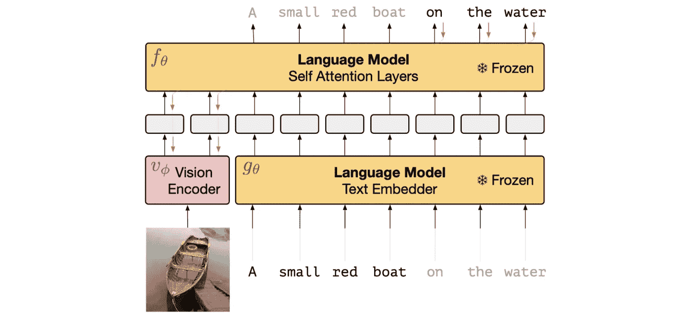

来源:[https://papers . nips . cc/paper/2021/file/01b 7575 c 38 DAC 42 F3 CFB 7d 500438 b 875-paper . pdf](https://papers.nips.cc/paper/2021/file/01b7575c38dac42f3cfb7d500438b875-Paper.pdf)

这是一个很有前途的研究方向，但结果并不令人印象深刻？)就绝对性能而言。然而，比较使用多模态数据完全微调的模型(冻结微调)和保持语言模型冻结的模型(冻结 VQA 盲)是有趣的:只有后者显示出从训练数据集(概念标题[4])到目标评估数据集(VQAv2 [5])的良好概括，仍然远离完全监督的模型。

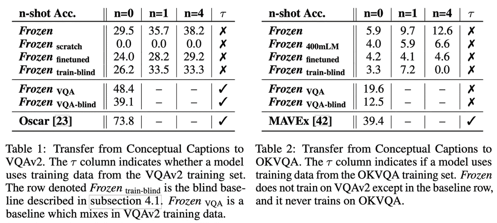

来源:[https://papers . nips . cc/paper/2021/file/01b 7575 c 38 DAC 42 F3 CFB 7d 500438 b 875-paper . pdf](https://papers.nips.cc/paper/2021/file/01b7575c38dac42f3cfb7d500438b875-Paper.pdf)

## 4.[利用负缓存高效训练检索模型](https://papers.nips.cc/paper/2021/hash/2175f8c5cd9604f6b1e576b252d4c86e-Abstract.html)

*作者:埃里克·林格伦、萨尚克·雷迪、郭瑞琪和桑基夫·库马尔。*

> **作者的 TL；DR →** 我们开发了一个流式负缓存，用于高效训练检索模型。

密集检索中的❓Why → 负采样是神经信息检索领域中最重要的课题之一！这似乎是重要的一步。

**💡关键见解→** 密集检索模型旨在将段落和查询编码成向量，以执行最近邻搜索来找到相关匹配。对于训练，经常使用对比损失，其中正对的相似性最大化，负对的相似性最小化。理想情况下，可以使用整个文档集作为“负样本”，但这将非常昂贵，因此通常使用负样本技术。

负采样技术的挑战之一是最终的模型质量在很大程度上取决于使用多少负样本-越多越好-但是使用许多负样本在计算上非常昂贵。这导致了一些流行的建议，如 ANCE [2]，其中负样本与来自异步更新指数的“硬负样本”小心地混合，以合理的计算成本改善模型性能。

在这项工作中，作者提出了一个优雅的解决方案，包括在计算时缓存文档的嵌入，并只渐进地更新它们，因此不需要在编码器中对所有负样本执行完整的前向传递，而是使用大部分缓存的文档，这要快得多。

这导致了一个更优雅和简单的方法，在经验上优于现有的方法。

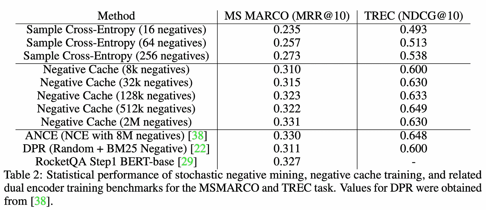

来源:[https://papers . nips . cc/paper/2021/file/2175 F8 C5 CD 9604 F6 B1 e 576 b 252d 4c 86 e-paper . pdf](https://papers.nips.cc/paper/2021/file/2175f8c5cd9604f6b1e576b252d4c86e-Paper.pdf)

**neur IPS 上你可能喜欢的其他信息检索论文:** [面向开放领域问答的多文档阅读器和检索器端到端培训](https://papers.nips.cc/paper/2021/hash/da3fde159d754a2555eaa198d2d105b2-Abstract.html)，[跨语言密集段落检索的多语种一个问答模型](https://papers.nips.cc/paper/2021/hash/3df07fdae1ab273a967aaa1d355b8bb6-Abstract.html)， [SPANN:高效亿级近似最近邻搜索](https://papers.nips.cc/paper/2021/hash/299dc35e747eb77177d9cea10a802da2-Abstract.html)。

## [5。VATT:从原始视频、音频和文本进行多模式自我监督学习的变形金刚](https://papers.nips.cc/paper/2021/hash/cb3213ada48302953cb0f166464ab356-Abstract.html)

*作者:Hassan Akbari、梁哲元、芮倩、庄伟红、张世福、尹翠和龚柏青。*

> **作者的 TL；DR →** 一个纯基于 Transformer 的管道，用于在没有监督的情况下从原始视频、音频和文本中学习语义表示。

**❓Why →** 迈向多模式未来之地的又一步。

**💡关键见解→** 大型变压器模型仍未开发的领域是多模态。这项工作旨在通过联合使用对比损失的变体对视频、音频和文本模态中的数据进行自我监督学习来构建这些模态的表示，因此这三种模态驻留在同一嵌入空间中。为此，他们使用噪声对比估计(NCE)并将匹配的音频/视频帧/文本三元组用作正样本对，将不匹配的三元组(例如，视频的非对应片段)用作负样本。

这种方法类似于以前的多模式网络，如“自监督多模式通用网络”[3]，主要区别在于它依赖于纯变压器架构。它在主要视频基准动力学中实现了 SOTA，同时避免了监督预训练(例如，使用大规模 Imagenet 标签来预训练模型)，并且仅使用自监督技术。

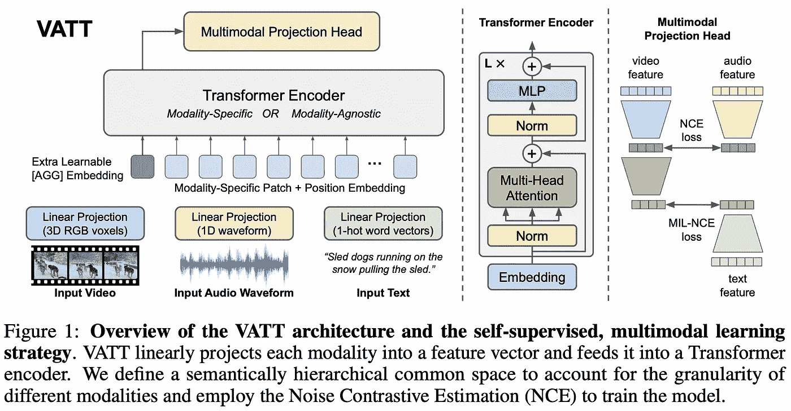

来源:[https://papers . nips . cc/paper/2021/file/CB 3213 ada 48302953 cb0f 166464 ab 356-paper . pdf](https://papers.nips.cc/paper/2021/file/cb3213ada48302953cb0f166464ab356-Paper.pdf)

## [6。鲁棒可预测控制](https://papers.nips.cc/paper/2021/hash/e9f85782949743dcc42079e629332b5f-Abstract.html) | [🌐网站](https://ben-eysenbach.github.io/rpc/)

*本·艾森巴赫、拉斯·r·萨拉胡季诺夫和谢尔盖·莱文。*

> **作者的 TL；DR →** 我们提出了一种利用压缩思想在 RL 中学习健壮且可预测的策略的方法。

**❓Why →** 优秀的鸟瞰论文，通过压缩的镜头来理解强化学习的一些基本挑战。

**💡关键见解→** 尽管环境观察通常是高维的(例如，来自图像的数百万像素)，但代理做出决策所需的信息量通常很少(例如，使用摄像机传感来保持汽车的车道)。根据这一观点，作者提出了鲁棒可预测控制(RPC)，这是一种使用少量信息学习策略的通用方法。

为了做到这一点，他们的分析基于信息论的角度，即一个模型需要多少信息来预测未来状态:一个状态越可预测，政策就越容易被压缩。这成为代理人学习大部分时间“安全行事”的一个规范化因素(例如，自动驾驶系统将倾向于避免高度不确定的情况)。

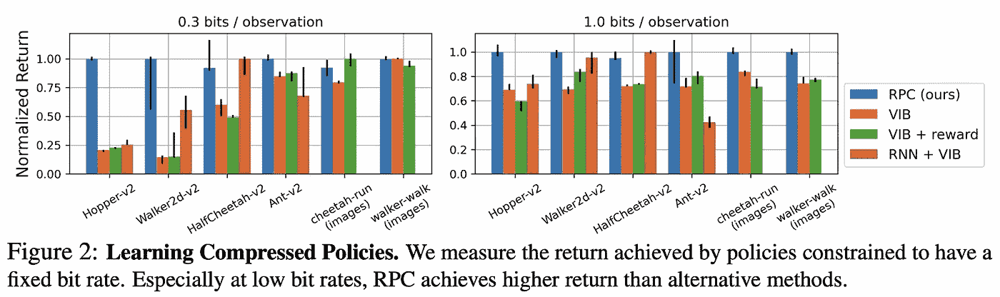

来源:[https://papers . nips . cc/paper/2021/file/e9f 85782949743 DCC 42079 e 629332 b5f-paper . pdf](https://papers.nips.cc/paper/2021/file/e9f85782949743dcc42079e629332b5f-Paper.pdf)

算法的细节要复杂得多，所以如果你想深入研究，你需要仔细阅读这篇论文。除了特定的实现和良好的经验结果之外，这似乎是一个有用的视角，可以用来思考在不确定的环境中进行权衡的问题。

更多关于 NeurIPS 的强化学习:[来自虚空的行为:无监督的主动预训练](https://papers.nips.cc/paper/2021/hash/99bf3d153d4bf67d640051a1af322505-Abstract.html)、[语义空间中的涌现离散通信](https://papers.nips.cc/paper/2021/hash/5812f92450ccaf17275500841c70924a-Abstract.html)、[通过双方差缩减的近优离线强化学习](https://papers.nips.cc/paper/2021/hash/3f24bb08a5741e4197af64e1f93a5029-Abstract.html)。

## 7 .[。FLEX:少数镜头 NLP 的统一评估](https://papers.nips.cc/paper/2021/hash/8493eeaccb772c0878f99d60a0bd2bb3-Abstract.html)📈[排行榜](https://leaderboard.allenai.org/flex/submissions/public) |👾[代号](https://github.com/allenai/flex)

乔纳森·布拉格、阿尔曼·科汉、凯尔·罗和伊兹·贝尔塔吉。

> **作者的 TL；DR →** FLEX 原则、基准和排行榜统一了评估少数镜头 NLP 的最佳实践；UniFew 是一个简单而强大的基于提示的模型，它统一了预培训和下游任务格式。

**❓Why →** 少量学习成为 NLP *酷小子*已经有一段时间了。是时候让它有自己的基准了！

**💡关键见解→** 自从 GPT-3 [4]在 2020 年 5 月凭借“提示”在 NLP 任务中令人惊讶的零镜头和少镜头性能打入市场以来，新的大型语言模型在零镜头/少镜头设置中对自己进行基准测试已经成为标准。通常，相同的任务和数据集用于微调的模型，但是在这个基准测试中，零/少数镜头设置是一等公民。

来自艾伦人工智能研究所的这个基准寻求标准化在 NLP 少数镜头文献中看到的模式，例如这个基准建立的原则是:传输类型的多样性、镜头和类别的可变数量、不平衡的训练集、文本标签、没有额外的元测试数据、有原则的样本大小设计和置信区间、标准偏差和个体结果的正确报告。希望这将有助于大型语言模型之间的比较，当评估实践有点无处不在时，这是无法保证的:魔鬼在细节中！

作者还开源了用于创建基准的 Python 工具包，以及他们自己的基准 UniFew，并将其与最近流行的方法“使预训练的语言模型成为更好的少量学习者”[5]和“具有分布签名的少量文本分类”[6]进行了比较。

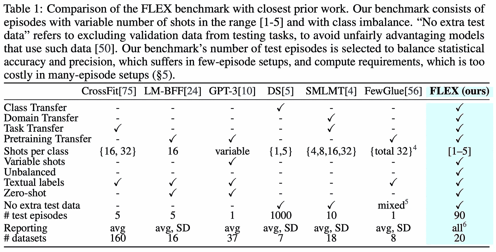

来源:[https://papers . nips . cc/paper/2021/file/8493 eeaccb 772 c 0878 f 99d 60 a 0 BD 2 bb 3-paper . pdf](https://papers.nips.cc/paper/2021/file/8493eeaccb772c0878f99d60a0bd2bb3-Paper.pdf)

**你可能会在 NeurIPS 上喜欢的其他 NLP 论文:** [COCO-LM:为语言模型预训练纠正和对比文本序列](https://papers.nips.cc/paper/2021/hash/c2c2a04512b35d13102459f8784f1a2d-Abstract.html)

## [8。分区和代码:学习如何压缩图形](https://papers.nips.cc/paper/2021/hash/9a4d6e8685bd057e4f68930bd7c8ecc0-Abstract.html)

*圣乔治·布里萨斯，安德里亚斯·洛卡斯，尼古拉·卡拉利亚斯，迈克尔·布朗斯坦。*

> **作者的 TL；DR →** 我们介绍了一个灵活的端到端机器学习框架，用于基于图划分、字典学习和熵编码的无损图压缩

**❓Why →** 压缩*常规*数据(即像 1 和 0 这样的符号序列)自香农在 1948 年引入信息论以来已经得到了广泛的研究，然而，压缩图形具有不同的特性，却不太为人所知。这里有一个关于如何从基本原理压缩图形的研究。

**💡关键见解→** 设计图形压缩算法时需要考虑 3 个特性:

*   图同构:与数据序列或数组不同，图没有固有的顶点排序，因此图的最佳压缩码字表示应该对这种同构不变。
*   评估图形的似然性:理论上最佳的编码器依赖于知道每个可能的数据配置的似然性，并分配一个代码，该代码的规模与这种似然性的对数成比例(例如，更可能的图形被压缩成更短的代码，反之亦然)。由于中大型图表的组合爆炸，计算这种可能性通常是困难的！问题需要分解…
*   如果构建一个复杂的模型来估计图形的可能性并基于此进行压缩，那么这个模型本身的大小就需要考虑在内！一般来说，模型越复杂，压缩数据的能力就越强，但是数据也会越大，因此在存储模型花费多少位和存储每个压缩图实例花费多少位之间会产生权衡。

虽然作者没有声称提出一个最佳解决方案，但他们提出了一个实际的解决方案，大致如下:将图划分为公共子图，为这些子图保留一个码字字典，其长度与每个子图可能性的对数成比例。该方法是完全可微的，因此它可以用梯度下降对任何给定的图形数据集进行优化。

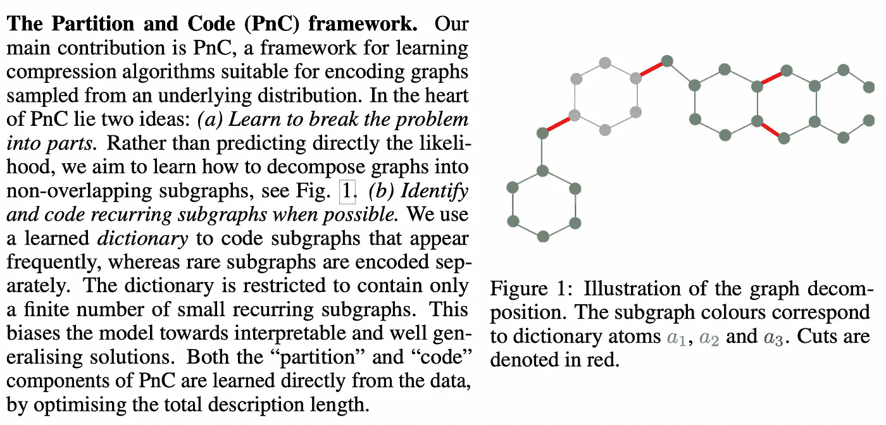

来源:[https://papers . nips . cc/paper/2021/file/9 a4d 6 e 8685 BD 057 E4 f 68930 BD 7 c8 ECC 0-paper . pdf](https://papers.nips.cc/paper/2021/file/9a4d6e8685bd057e4f68930bd7c8ecc0-Paper.pdf)

当与现有方法进行经验比较时，它优于现有方法，但是考虑到引入的复杂性，它将在多大程度上被使用仍然是一个开放的问题。不管他们的具体提议如何，这是一篇理解如何从头开始压缩事物的优秀论文。

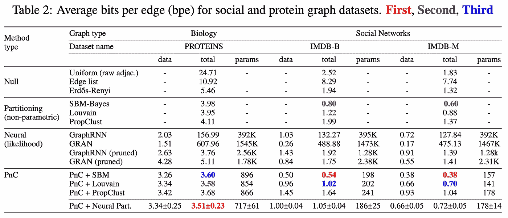

来源:[https://papers . nips . cc/paper/2021/file/9 a4d 6 e 8685 BD 057 E4 f 68930 BD 7 c8 ECC 0-paper . pdf](https://papers.nips.cc/paper/2021/file/9a4d6e8685bd057e4f68930bd7c8ecc0-Paper.pdf)

**neur IPS**的其他有趣的图形神经网络论文: [SIMONe:通过无监督视频分解实现视图不变、时间抽象的对象表示](https://papers.nips.cc/paper/2021/hash/a860a7886d7c7e2a8d3eaac96f76dc0d-Abstract.html)， [VQ-GNN:使用矢量量化放大图形神经网络的通用框架](https://papers.nips.cc/paper/2021/hash/3569df159ec477451530c4455b2a9e86-Abstract.html)， [GemNet:分子的通用方向图神经网络](https://arxiv.org/abs/2106.08903)

## [9。学习绘画:通过素描进行紧急交流](https://papers.nips.cc/paper/2021/hash/39d0a8908fbe6c18039ea8227f827023-Abstract.html) |👾[代码](https://github.com/Ddaniela13/LearningToDraw)

丹妮拉·米哈伊和黄邦贤·黑尔。

> **作者的 TL；DR →** 我们使用自我监督游戏来训练人工智能体通过绘画进行交流，然后证明在适当的诱导偏差下，人类可以成功地与预训练的绘画智能体玩同样的游戏。

❓Why → 这个很有趣。

**💡关键见解→** 两个模型学习通过绘画交流图像:发送者模型需要使用输出“笔画”的可微分光栅化器来创建图像的描述，而接收者模型需要从图像池中挑选出发送者代表的图像。

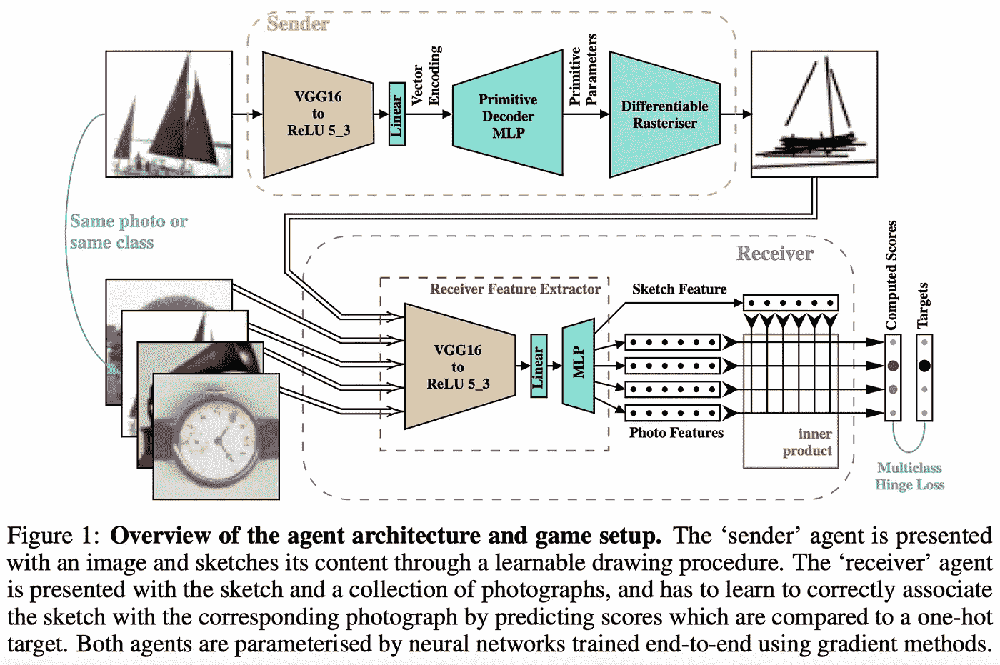

来源:[https://papers . nips . cc/paper/2021/file/39 d0a 8908 FBE 6 c 18039 ea 8227 f 827023-paper . pdf](https://papers.nips.cc/paper/2021/file/39d0a8908fbe6c18039ea8227f827023-Paper.pdf)

一个有趣的观察是，在没有进一步限制的情况下，发送者和接收者如何想出人类无法解释的绘图表示。但他们尝试了一个聪明的正则化技巧来激励人类的可解释性:在早期视觉阶段(即编码器模型的早期层)添加一个“感知损失”，以便原始图像和绘画在模型中的激活彼此相似。这是受经验观察的启发，即对于一幅给定的图片和一幅画，人类的神经元激活是相似的。

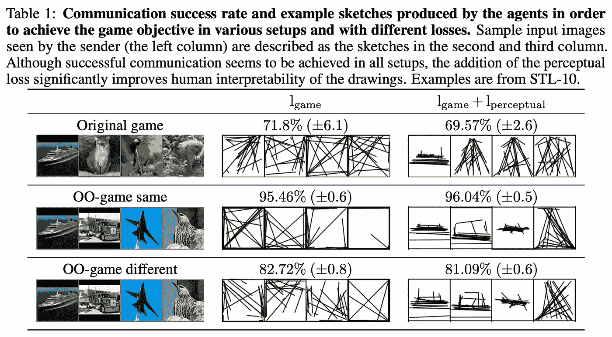

来源:[https://papers . nips . cc/paper/2021/file/39 d0a 8908 FBE 6 c 18039 ea 8227 f 827023-paper . pdf](https://papers.nips.cc/paper/2021/file/39d0a8908fbe6c18039ea8227f827023-Paper.pdf)

## [10。失败的修复:机器学习系统中弄巧成拙的改进](https://papers.nips.cc/paper/2021/hash/619427579e7b067421f6aa89d4a8990c-Abstract.html)

*作者:韩瑞·吴、、奥尼·汉南和劳伦斯·范德马腾。*

> **作者的 TL；DR →** 我们一般孤立地研究机器学习模型。但是 AI 系统由许多机器学习模型组成。改进一个模型会使系统变得更糟吗？是的。

❓Why → 组成人工智能系统的模块可以以复杂而不直观的方式进行交互。这篇发人深省的论文研究了如何使系统的子部分变得更好会使整个系统变得更差。

**💡关键见解→** 虽然本文没有提出任何特别令人印象深刻的方法，但这是一个有趣的思想食粮，可以一直记在脑海里。作者研究并形式化了一个重要的问题，即由各种 ML 子系统组成的系统在单个部分得到改进时如何以及为什么会变得更差。这在实际领域非常重要，因为许多人工智能系统都是由。

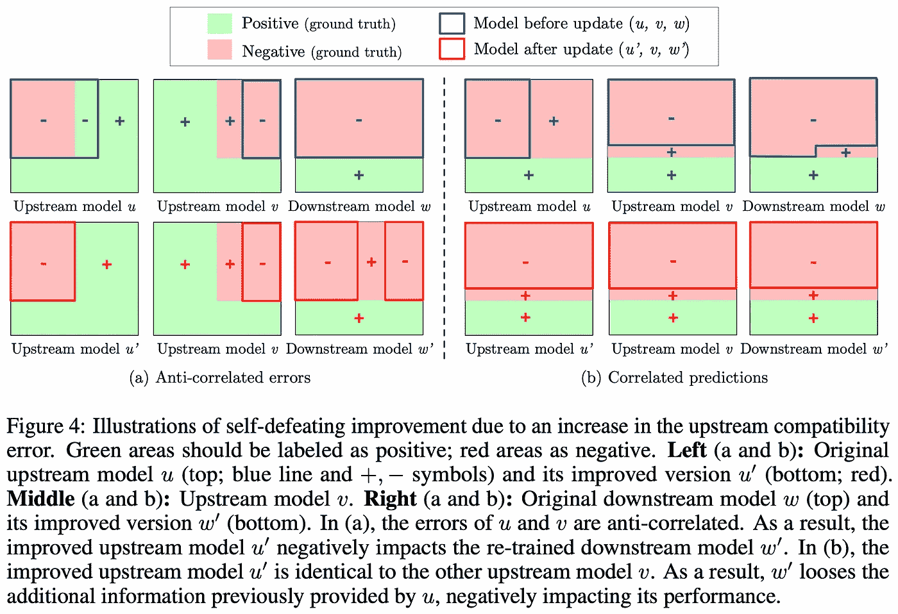

来源:[https://papers . nips . cc/paper/2021/file/619427579 e7b 067421 f 6a aa 89 D4 a 8990 c-paper . pdf](https://papers.nips.cc/paper/2021/file/619427579e7b067421f6aa89d4a8990c-Paper.pdf)

理论分析要比这深入得多，但它的主要要旨是，您可能真的可以通过改进人工智能系统的每个部分来降低其性能，所以在重新训练一个 ML 管道组件之前请三思！

我们的选择到此结束。不幸的是，我们不能包括许多绝对值得强调的有趣的作品，所以你需要进入会议论文的完整列表来找到它们。例如，你可能想看看最新的施密德胡伯的[元学习反向传播和改进它](https://papers.nips.cc/paper/2021/hash/7608de7a475c0c878f60960d72a92654-Abstract.html)，或者 resnet 不是死的[重温 resnet:改进的训练和扩展策略](https://papers.nips.cc/paper/2021/hash/bef4d169d8bddd17d68303877a3ea945-Abstract.html)，或者最新的等变 NN [E(n)等变规格化流](https://papers.nips.cc/paper/2021/hash/21b5680d80f75a616096f2e791affac6-Abstract.html)？出于对你时间的尊重，我们只能到此为止了。我们希望你喜欢它，你可以[在我们的平台](https://search.zeta-alpha.com/?q=&doc_sources=Advances+in+Neural+Information+Processing+Systems&d=lm&sort_by=date)上继续探索这个会议。

您还可以[参加我们即将于 12 月 3 日(星期五)](https://zoom.us/webinar/register/4516329472829/WN_eN_jspyBSLm8sdP0nkpoHw)举行的网络研讨会，届时我和我的同事将讨论今年的会议。该团队将通过我们公司的 Twitter feed 在 [@zetavector](https://twitter.com/ZetaVector) 现场报道有趣的见解，所以如果你不想错过任何事情，请收听。你呢？你对大会最期待的是什么？欢迎在评论中分享一些建议👇

*参考文献*

*[1]“自监督视觉变压器中的新兴特性”，Mathilde Caron 等人，2021 年。*

*【2】《面向密集文本检索的近似最近邻否定对比学习》李熊等 2020。*

*[3]“自我监督的多模式通用网络”，让·巴普蒂斯特·阿拉亚克等人，2020 年。*

*【4】《语言模型是很少出手的学习者》Tom B. Brown 等人 2020。*

*[5]“让预先训练好的语言模型成为更好的少投学习者”高天宇，亚当·菲舍尔，陈，2021。*

*[6]“基于分布式签名的少镜头文本分类”鲍、吴、常、雷吉娜巴兹莱，2019。*