# NeurIPS 会议:历史数据分析

> 原文：<https://towardsdatascience.com/neurips-conference-historical-data-analysis-e45f7641d232?source=collection_archive---------9----------------------->

## 分析从 1987 年到 2020 年的会议趋势。

闭幕式 NIPS 2017 |作者图片

会议通常提供特定年份的统计数据，呈现关于接受率、多样性、地理和主题分布等信息。通常情况下，这种情况只发生在那一年，或者几年前。

然而，为了看到一些趋势并获得潜在的有用的见解，退一步看看全局可能是值得的。

# 数据源

在这篇博客中，我将重点关注 NeurIPS 会议数据。自 1987 年第一次举办以来，所有会议实例中被接受的论文都可以在[https://papers.nips.cc/](https://papers.nips.cc/)上公开获得。从被拒绝的论文中会有额外的见解，但不幸的是这些是不可用的。我还要感谢 NeurIPS 组织者维护这个数据库，并允许下载和使用这些数据进行分析。

每篇论文始终可用的信息是:**标题**和**作者**。对于某些年份，以下元数据也是可用的:**摘要**、**全文**、**作者隶属关系**、**评论**和**补充材料**。

除此之外，我尝试了某些方法来提取更多关于论文、作者及其机构的数据，这些数据在主网站上是无法直接获得的。我用来获取数据和生成图表的所有源代码都可以在 [my GitHub](https://github.com/nemanja-rakicevic/conference_historical_data_analysis) 上找到。(所有图片由作者提供)

# 分析

## 纸质统计

先从录取论文总数说起。由于没有提交的总数，我们无法监测接受率。然而，近年来被接受的论文数量急剧增加:

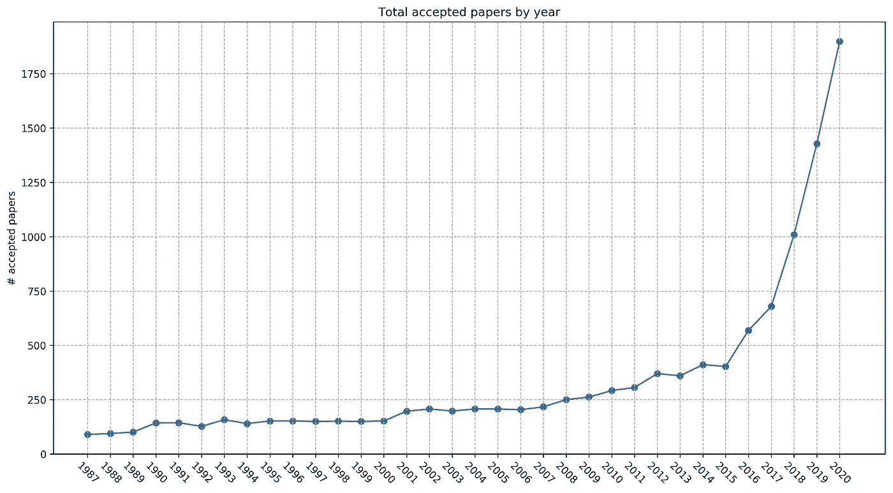

在第一次会议上，1987 年，共有 90 篇论文被接受，而 2020 年这个数字是 1898 篇 T21。历年被录取论文总数为 **11578** 。

如果我们(过度)拟合这个数据的多项式曲线，我们可以为 2021 年打个赌:

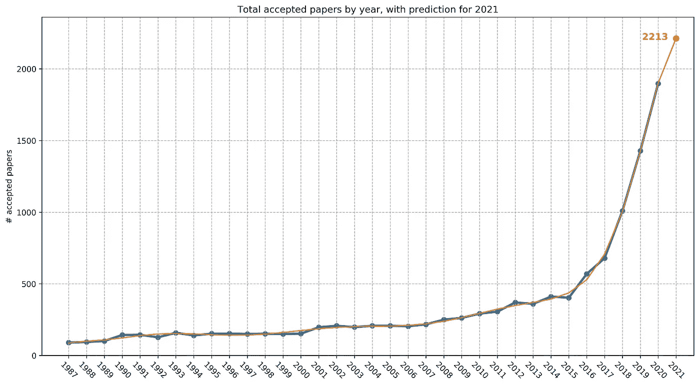

再来看纸质标题，平均标题长度略有下降:

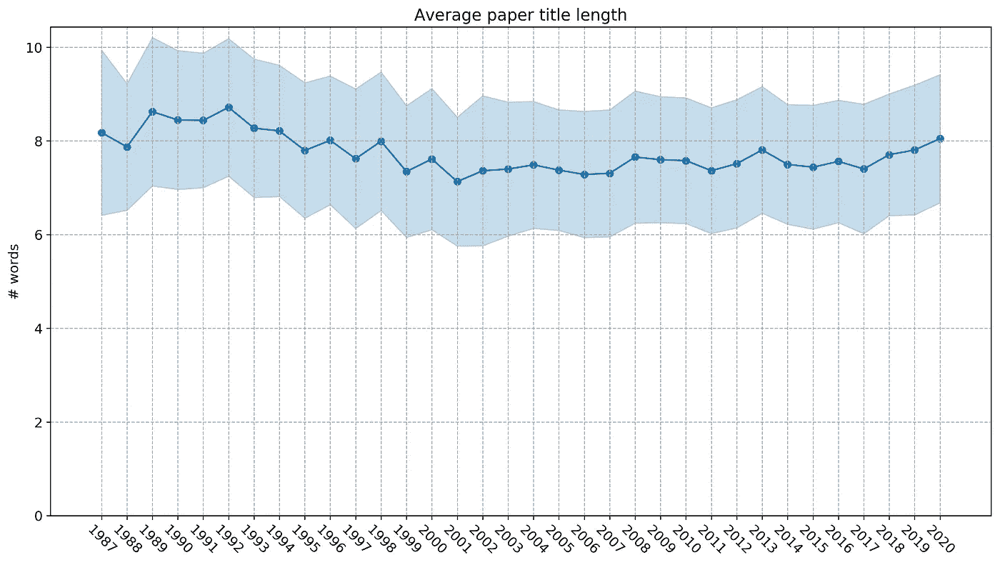

虽然在标题中使用缩写又开始流行了:

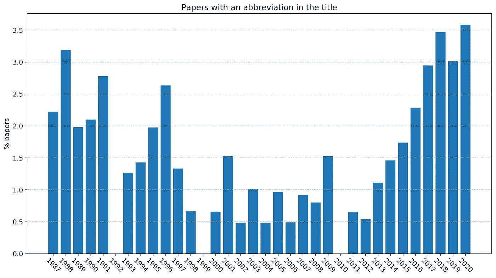

以字数衡量的摘要长度一直在稳步增长(变化显示为垂直黑线)。然而，在 2007 年之前，抽象数据并不总是可用的，因此没有该时期的信息:

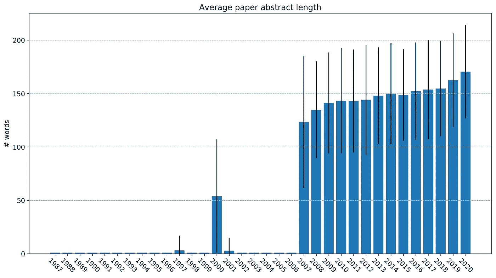

我最喜欢的情节之一(也是我开始这个分析的原因)是补充材料。自 2007 年以来，包含某种形式的补充材料的论文数量。pdf 或。zip)开始增长，如今几乎达到了 100%。

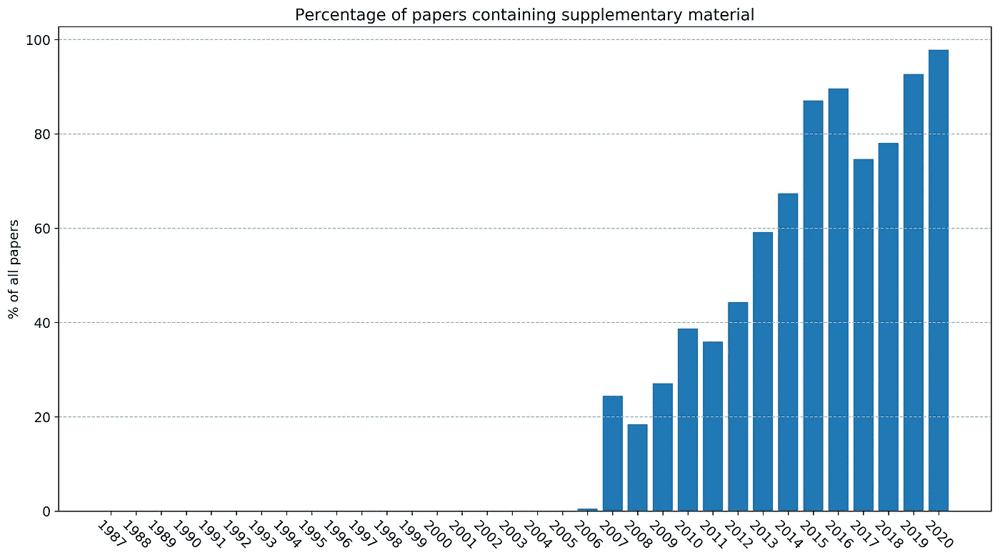

## 研究趋势

根据标题中出现的关键词粗略估计一些研究趋势就好了。通过查看标题中出现最频繁的关键词，可以发现有趣的见解，根据每年被接受的论文数量进行标准化。

前 5 个双词关键词的频率显示了短语*(蓝色条)流行的两个时期——大约在 2000 年之前和 2010 年。中间的时期显示了统计 ML 术语的增加，如 ***支持向量*** (绿色)和 ***高斯过程*** *(红色)*。 ***强化学习*** *(橙色)*，自 90 年代以来一直被提及，在 90 年代末和 2016 年之后出现了更大的峰值。*

*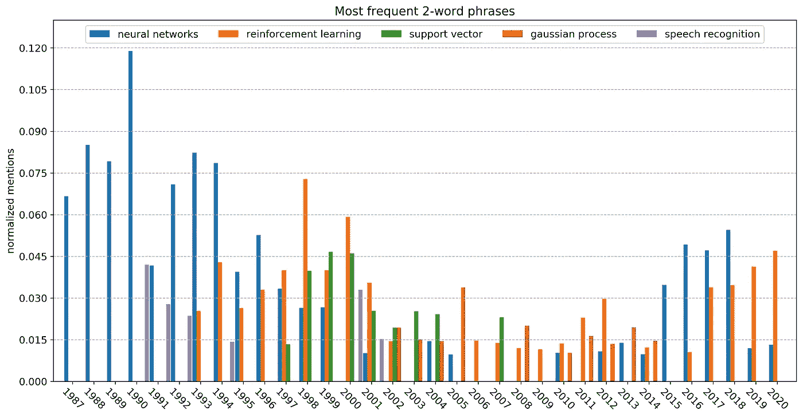*

*聚焦 top 6，三字短语，与上图类似，有两个截然不同的“神经网络”集群: ***人工神经网络*** (红色)和 ***深度神经网络*** *(绿色)*，中间有 ***支持向量机*** (蓝色)。此外，我们还可以注意到在深度学习革命之后，从 2010 年中期开始， ***递归神经网络*** (橙色)的提及再次出现。*

*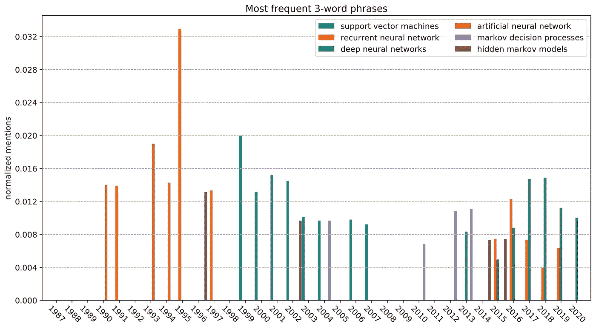*

## *作者统计*

*关于作者信息，快速免责声明，数据中的给定名称存在一些不一致，因为它们有时会被缩写(例如，“j .”、“Josh”、“Joshua”)。尽管由于大量的作者，很难手动修复所有这样的实例，但是我们仍然可以从手头的数据中获得足够好的估计，以便执行分析。*

*每年参与的独立作者总数如下所示，与被接受的论文数量密切相关:*

*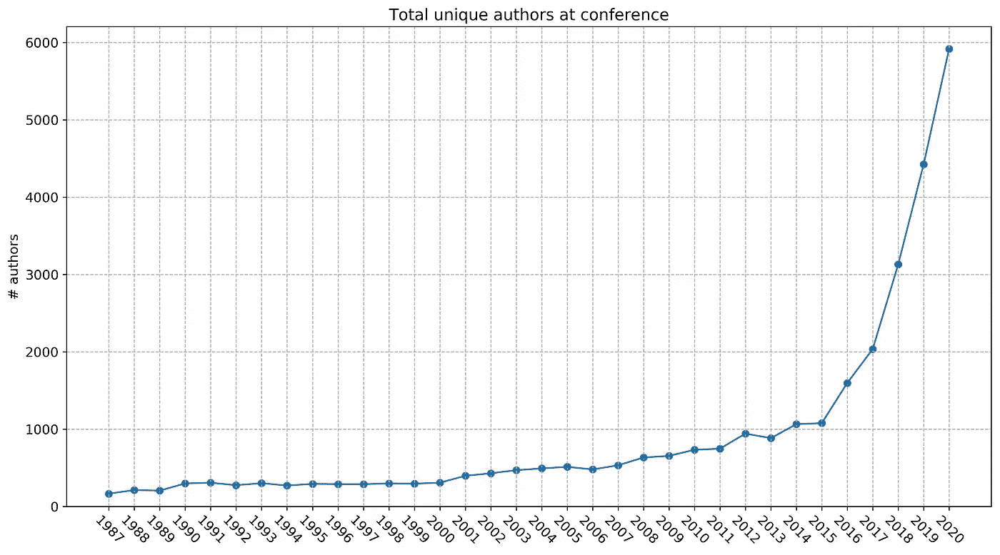*

*或者更有趣的是，根据当时的实际世界人口进行标准化:*

*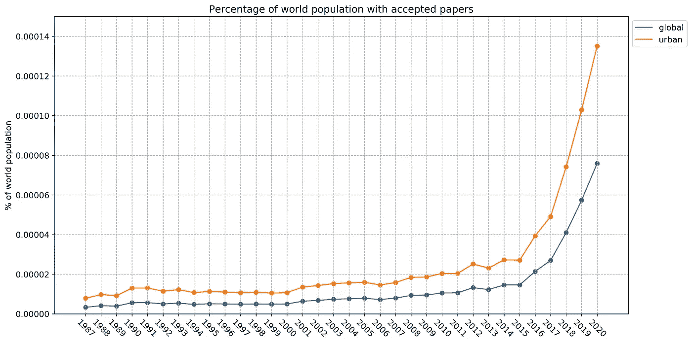*

*第一年有 **166** 位作者参加，而在上一届会议中有 **5917** 位作者，总共有 **17670** 位参与者参加了 34 次会议。*

*拥有最多被接受论文的前 50 位出版作者:*

*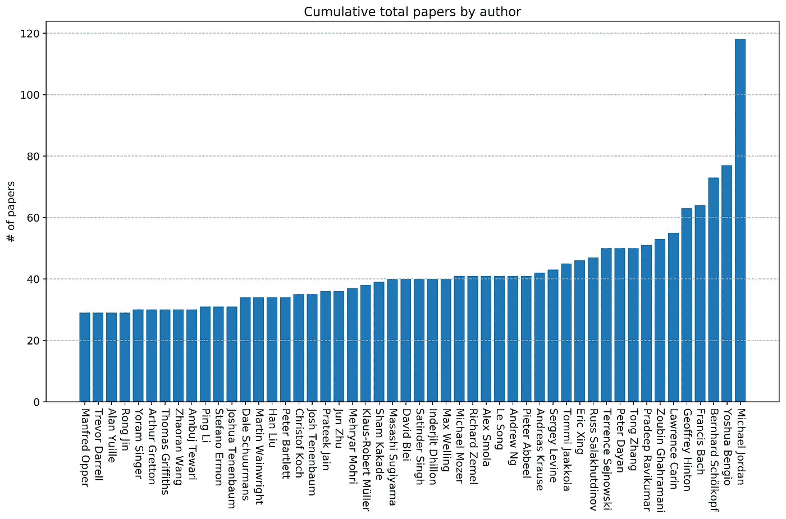*

*为了调查论文在作者中分布的实际不平等，我们可以估计基尼系数。下图中的蓝色部分显示的是累计的出版物数量，一旦我们按照作者的出版物数量对他们进行排序。如果每个作者有相同数量的出版物，蓝色区域也会覆盖橙色区域(这将是理想的平均分布)。所以，比值:(橙色面积)/(橙色+蓝色面积)就给了我们基尼系数。值为 0 表示完全平等(没有橙色区域)，而值接近 1 表示完全不平等(所有论文几乎都由一个作者发表)。*

*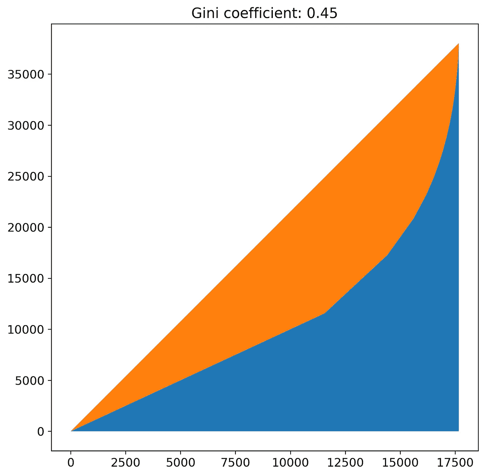*

*虽然作者多样性是一个重要的方面，但诸如作者性别多样性的信息无法从 NeurIPS 论文网站获得。使用一个 [python 库](https://pypi.org/project/gender-guesser/)可以得到一个非常粗略的估计，这个库是基于比较作者的名字和一个名字数据库(然而大多数是“西方”名字)。“未知”标签大多被分配给非西方名字，或者作者的名字被缩写的情况。*

*下面的图表显示了每个作者群发表的所有论文和最后作者论文的比例。最后一个作者通常是更资深的学者，比如组长或主管。*

*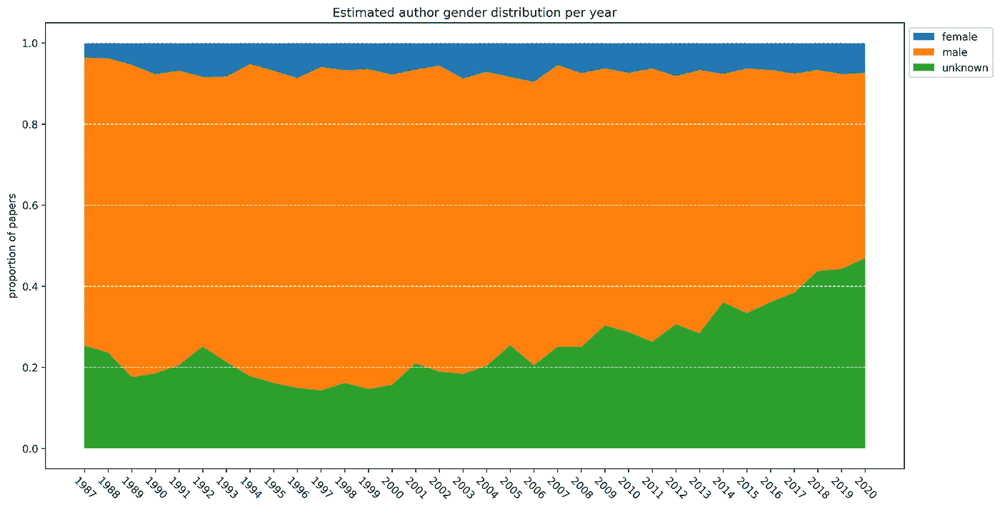*

*在这两张图表中，我们可以看到女性和男性之间的差距仍然很大。*

*如果我们认为“未知”的标签主要是分配给非西方的名字，这一标签最近的增加可能与近年来更多的非西方作者参加会议有关。然而，当查看论文的最后作者时，这种增加是缓慢的。*

*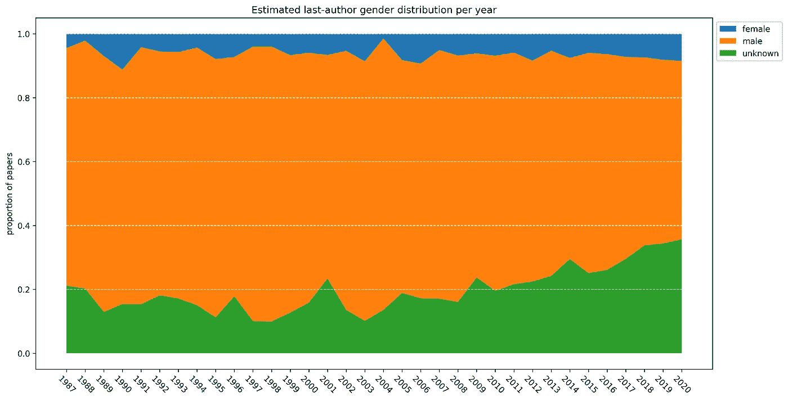*

## *“博士”作者统计*

*接下来，我感兴趣的是估计这些年来博士生发表的论文数量。即使没有可靠的方法来估计博士生的数量和哪些作者是博士生，我们可以做的是检查每个作者在本次会议上首次发表论文后的前 5 年内发表了多少篇论文。*

*无论是论文总量还是第一作者论文都大多不变，略有上升趋势。*

*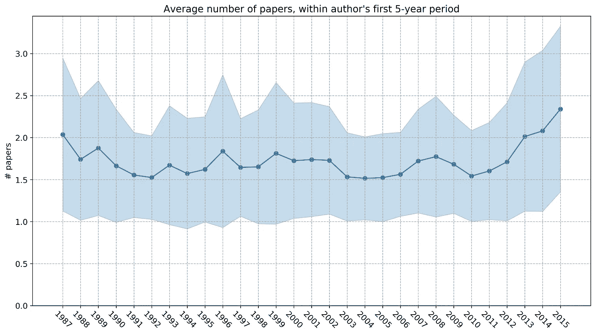**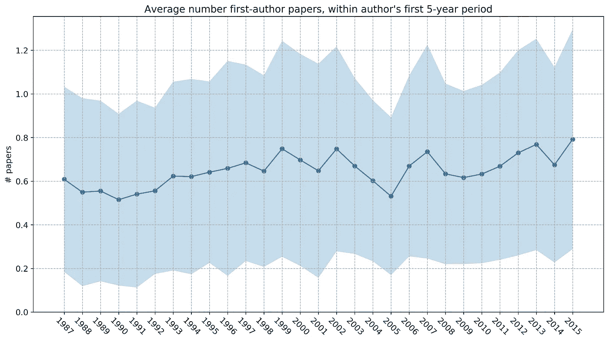*

## *机构统计*

*更有趣的见解来自作者的机构关系，以及他们多年来的参与。自 2013 年第一次提到作者关系的会议以来，共有 **2672** 个机构参与。*

*免责声明:*

*   *2013 年之前没有附属机构的信息。*
*   *实际的机构名称有时不一致(例如，“哈佛大学”(小错别字)、“哈佛大学”、“哈佛学院”、“哈佛”、“哈佛医学院”、“哈佛/麻省理工学院”等)，这可能会导致最终分析中的一些不准确之处。然而，即使这些例子被算作独立的机构，我们仍然可以得到足够好的分析估计。*

*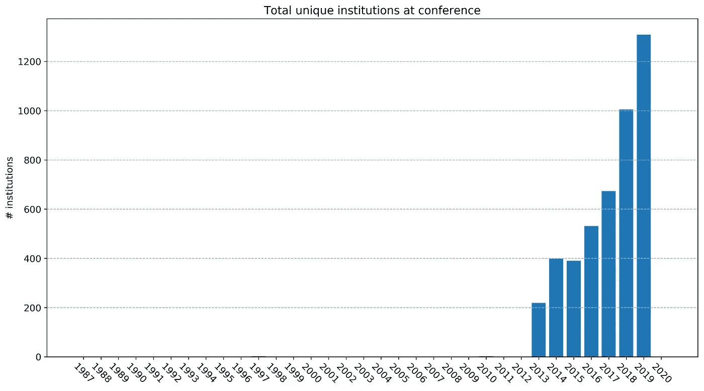*

*论文数量最多的前 50 家出版机构:*

*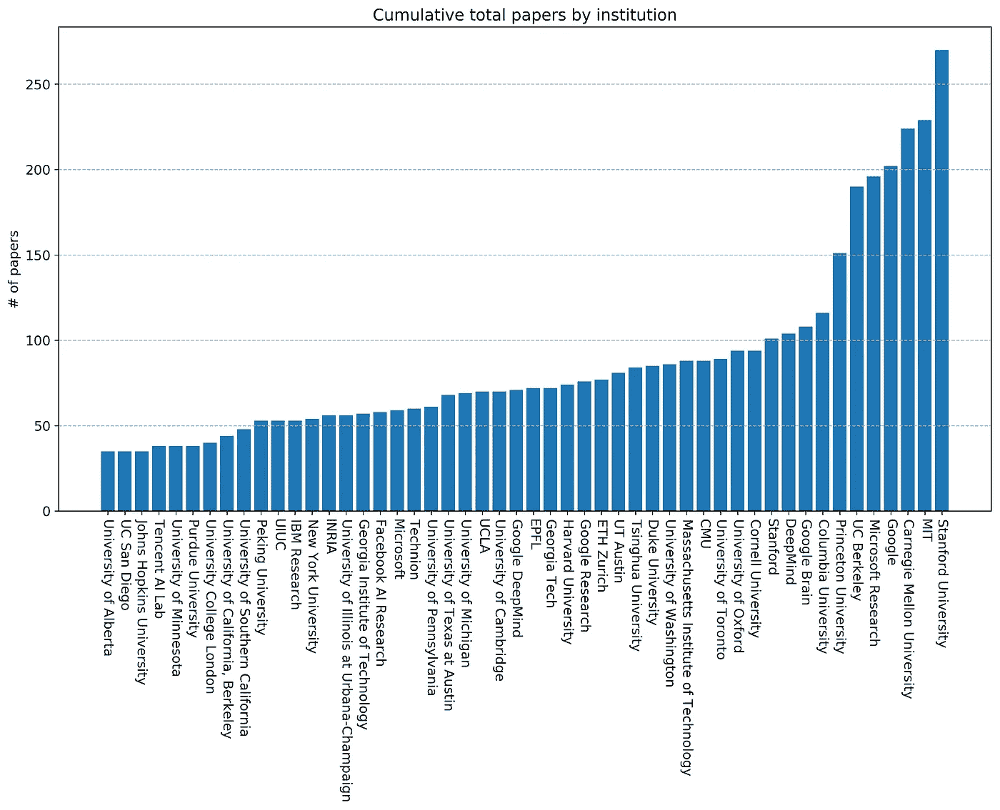*

*与之前类似，下面的估计基尼系数显示了机构间论文分布的不平等。在这种情况下，系数值 0.68 表示比单个作者高得多的不平等。*

*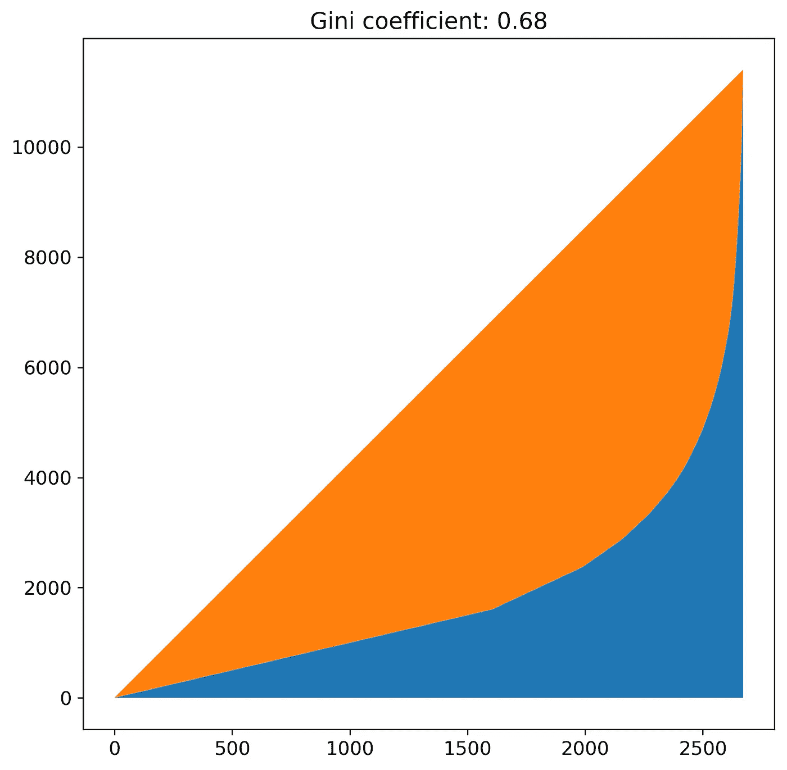*

## *协作统计*

*合作指标的代表，可以通过每篇论文的平均作者数量获得。这个数字一直在稳步增长，这可能意味着更复杂的研究项目的发表，更开放的合作，等等。*

*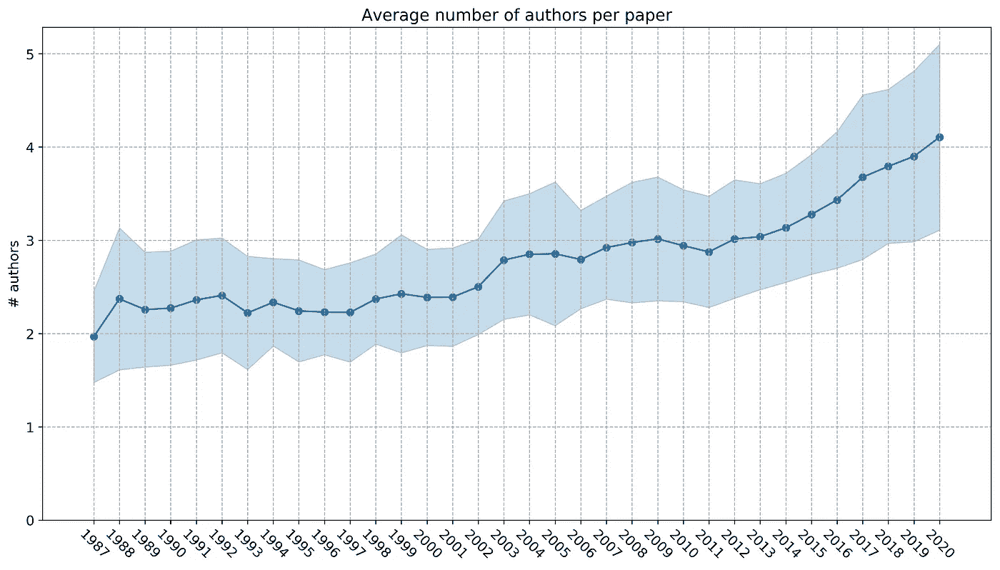*

*仅就单作者论文而言，这一趋势已经明显下降:*

*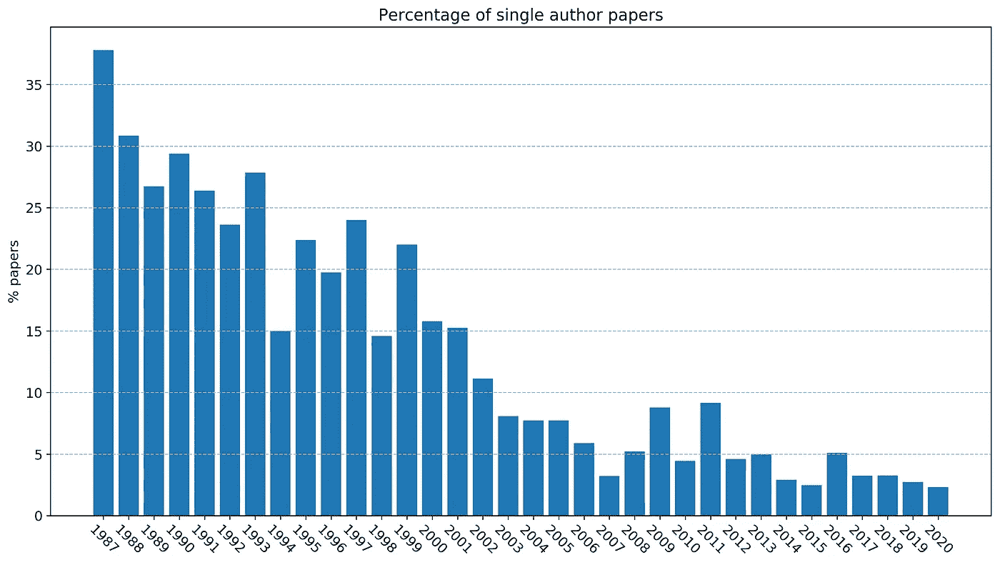*

*而每篇论文的机构数量没有显著变化:(变化显示为垂直黑线)*

*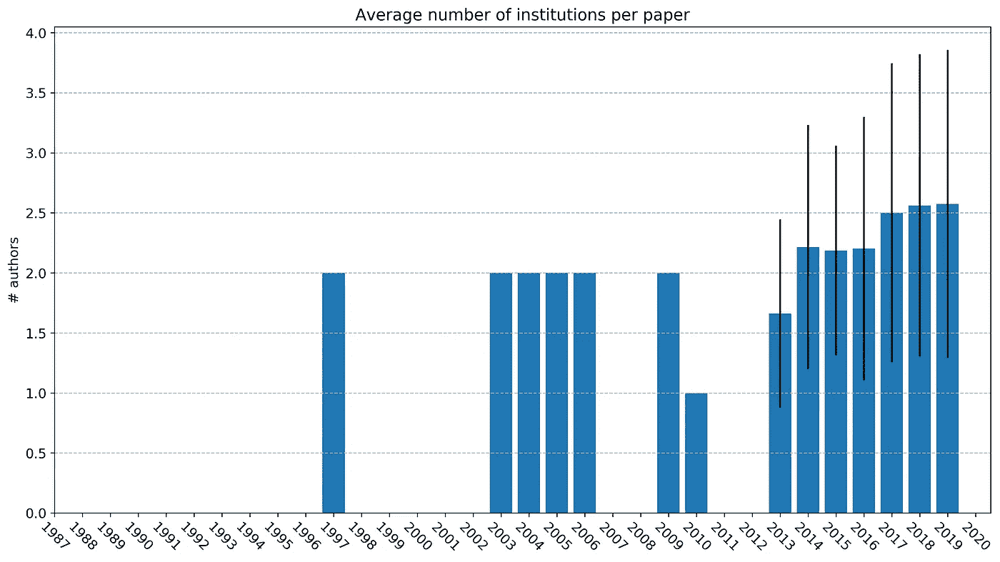*

## *资金统计*

*另一个有趣的观察是机构所在国家的 GDP 与来自这些国家的被接受的论文总数之间的关系。论文元数据中不包含国家信息，需要根据机构名称进行推断(通过抓取维基百科，成功有限)。每个国家的 GDP 数据可以从世界银行获得。*

*了解一个国家的国内生产总值如何与可用的研究资金相关联，以及随后是否与被接受的论文数量相关联，将是有趣的。*

*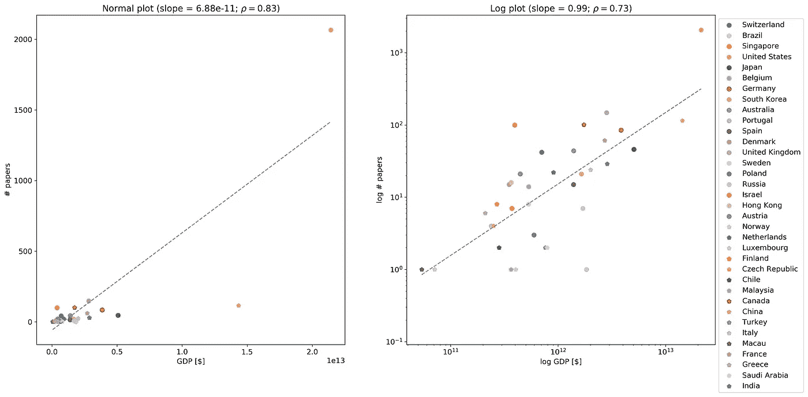*

*上面的图表显示了一个国家的 GDP 和该国机构接受的论文总数之间的相关性，包括标准图和对数图，其中美国明显领先。*

# *最后的想法*

*我希望这些图表是信息丰富的，或者至少是有趣的，因为一些结果可能是预期的，而另一些则不是。我很乐意得到反馈和对我可能错过的分析的想法，这将是有见地的。*

*有趣的见解也可以通过查看这些年的平均引用次数来获得，这是我推迟到未来的任务(因为谷歌学术 API 是有限的)，或者是否有人愿意为[库](https://github.com/nemanja-rakicevic/conference_historical_data_analysis)做贡献。*

# *承认*

*我要感谢 Robert Walecki、Linh Tran、Arash Tavakoli 和 Suzana Ili 的有益讨论和评论，它们帮助我形成了我的第一篇博文！*