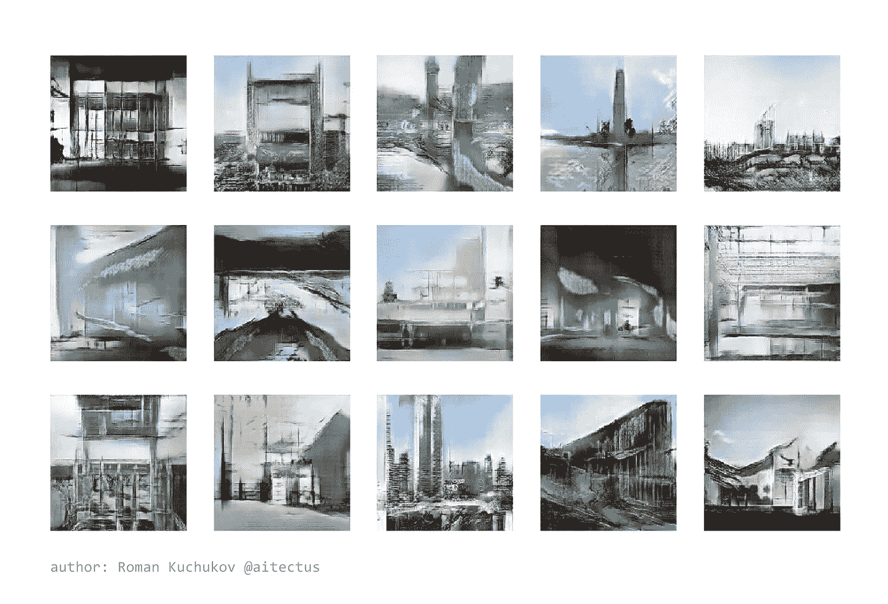
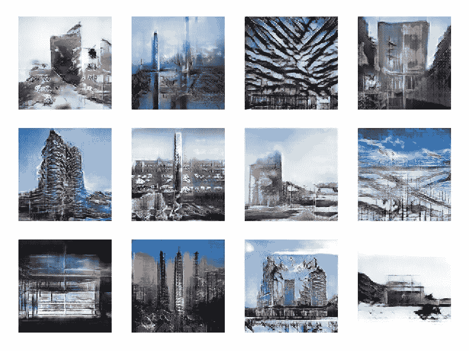
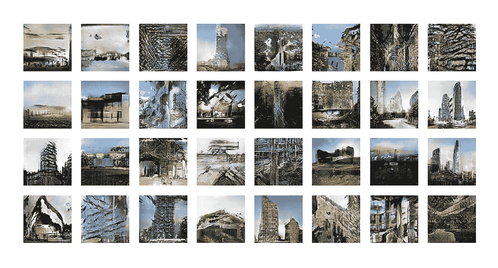
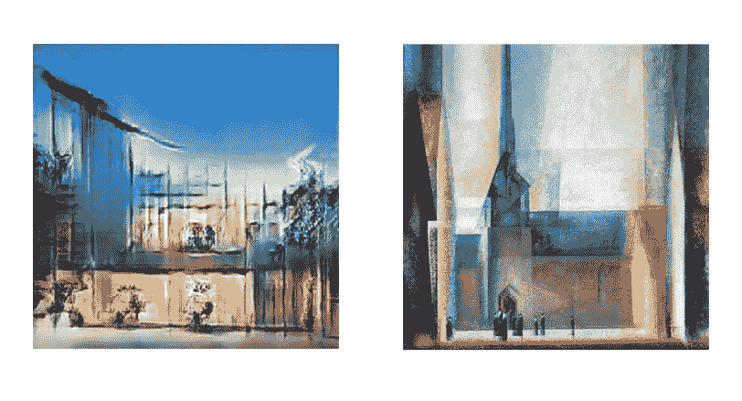

# 神经拱门:人工智能的建筑意象

> 原文：<https://towardsdatascience.com/neuroarch-ai-imagery-eng-1b9e1d11944a?source=collection_archive---------26----------------------->

## GAN 网络的思想与实际应用[ [俄文版](https://romankuchukov.medium.com/neuroarch-ai-imagery-806da89b591d)

NeuroArch 生成的图片 [@aitectus](https://www.instagram.com/aitectus/) ，图片作者

今天，我们正在目睹生活各个方面的数字化转型，也就是向信息社会的范式转变。正如我在我的 [*计划文章*](https://romankuchukov.medium.com/icar-manifesto-eng-23033d5d4da2) 中所写的，这为我们提供了一个全新的工具包，让我们重新思考现有的实践，并发明与新兴技术和概念合作的新方法。

然而，技术的未来向我们提出了关于人类的可能性和局限性的问题，包括伦理和人道主义问题。
许多思想家都在质疑人类与人工智能(AI)和虚拟世界的互动:“智能从蛋白质迁移到沙子(蛋白 VS 硅)”*【Efim ostrov sky】*。

机器学习和人工智能的爆炸式增长和渗透也影响着创造力的原则。如果早期的人工智能仅限于分类和回归任务，那么现在生成算法开始用于创建各种性质的对象和作品，以前只有人类才能使用。艺术成为技术的一部分，而技术成为艺术。在这篇文章中，我将试图涵盖更多的伦理问题，而不是技术问题。

NeuroArch 生成的图片，图片由作者提供

在数字媒体时代，视觉再现已经成为一个物体的主要品质，它的数字*图像*。这种现象的背后是一致性，因为图像变得彼此相似，这是由于相似的技术和陈词滥调被用于创建它们。视觉信息的丰富导致了它的统一化和贬值。

**NeuroArch** 研究项目的想法是，首先，探索基于现有图像生成新图像的可能性，其次，探索将生成机器学习应用于创造性任务和设计的方法，最后，给出视觉文化的批判性评估:
如果算法能够生成新图像，类似于不可分辨的程度，*难道不应该委托人工智能来创建它们吗*？

如你所知， [GAN](https://en.wikipedia.org/wiki/Generative_adversarial_network) 网络的本质是“生成器”算法逐渐学会以这样一种方式创建图像，即“评论家”算法无法区分真实图像和生成的图像。因此，您可以基于现有数组创建新的图像，就像它在同一个集合中一样。此外，可以通过改变其属性来控制所生成图像的参数。

我从 Archdaily、一些面向建筑的 Instagram 账号等热门资源中收集了约 6000+现代建筑实例的训练样本；其中既有图像也有照片。作为一个生成算法，使用了 [WP-GAN](https://github.com/davidADSP/GDL_code/blob/master/04_03_wgangp_faces_train.ipynb) 神经网络的架构，来自[知识库](https://github.com/davidADSP/GDL_code)为[大卫·福斯特的书【生成机器学习】](https://www.oreilly.com/library/view/generative-deep-learning/9781492041931/)，用于生成人脸。你会在书中找到各种 GAN 算法更详细的描述。

建筑师兼设计师迈克尔·汉斯迈尔将生成式设计定义为*“思考的不是设计对象——而是生成对象的过程。”设计师的方法变得更像是编程一种算法，它定义了创作过程的框架。*

> 最后，我们得到的不是一个特定的对象，而是一个经过训练的算法或模型，能够生成任意数量的新对象。

NeuroArch 随机样本，图片由作者提供

对样本进行数千次分析(在 NeuroArch 110，000 个学习时期中)，神经网络算法学习从样本中提取特征，形成所谓的特征空间，其中特征被分组为模型参数。这些特征然后被用于合成新的图像。特征的空间不是离散的，而是连续的；它不包含单独的图案，因此两个图像之间的平滑过渡是可能的。

因此，GAN 网络能够展示其生成新图像的能力。当然，我们说的不是一个细节图，而是一种印象或者建筑幻想，这种印象或者建筑幻想以前并不存在，而是由很多真实的原型编织而成。可以假定，生成的图像具有一种特殊的美学，这种美学使它们与诸如立体主义或表现主义等抽象艺术趋势的作品相关联。

neuro arch image VS*Gelmeroda IX，作者利奥尼·法宁格(公共领域，s* 来源:wikiart.org)

问题仍然是，作为一种创造活动的创造力和技术计算之间的界限在哪里。正如量子物理学中的纠缠原理一样，当几个物体的量子态相互依赖时，人或算法的作用很难从结果中分离出来。我相信我们正在处理一种新型的*人和机器*的合成，这需要对方法论的仔细理解和发展。

目前，我们可以说我们获得了一个强大的工具包，能够分析和归纳人类无法访问的大型数据阵列。使用它，你可以更深入地洞察事物的本质，分析事物，合成新的事物。我期望设计和艺术将获得新的发展动力，丰富它们的手段和方法。

神经弓视频[ [更多](https://www.instagram.com/aitectus/) ]，图片由作者提供

【出版物及图文资料作者】roma.kuchukov@gmail.com *【脸书:*[*https://www.facebook.com/ICARurbs*](https://www.facebook.com/ICARurbs)