# NeutonAI:介绍一个非常有效的无代码自动化平台

> 原文：<https://towardsdatascience.com/neutonai-introducing-a-remarkably-effective-no-code-automl-platform-454ca935f708?source=collection_archive---------22----------------------->

## 是的，现在连你奶奶都能建立机器学习模型了

在 [Unsplash](https://unsplash.com/?utm_source=unsplash&utm_medium=referral&utm_content=creditCopyText) 上由 [Samia Liamani](https://unsplash.com/@mialiamani?utm_source=unsplash&utm_medium=referral&utm_content=creditCopyText) 拍摄的照片

***免责声明*** *:这不是一篇赞助文章。我和内乌顿或它的创造者没有任何关系。这篇文章公正地概述了 AutoML 解决方案，旨在使数据科学工具能够为更多人所用。*

好像每天都有新的孩子来到汽车街区。 [NeutonAI](https://bit.ly/3BaIRtv) 是这样一个孩子，如果三次点击就能让你达到 90%的目标，你会想为什么要花数年时间学习数据科学。90%对我们大多数人来说已经足够了。

**书呆子警报:** NeutonAI 有一个获得专利的神经网络框架，其工作原理与 TensorFlow 完全不同。创造者宣称它的独特特征使内乌顿区别于其他 AutoML 解决方案，因为它们大多数使用众所周知的算法。你可以在这里了解更多信息[。](https://bit.ly/3gyc61z)

今天您将看到这个 AutoML 解决方案提供了什么。只需点击几下鼠标，您就可以在平台上构建和评估您的第一个机器学习模型——不需要任何先验知识。

这篇文章的结构如下:

*   NeutonAI 入门—注册和设置
*   创建新的 AutoML 项目
*   用 NeutonAI 训练机器学习模型
*   评估机器学习模型
*   做预测

# NeutonAI 入门—注册和设置

在建立机器学习模型之前，你必须在内乌顿和谷歌云上设置一个账户。这一节描述了这个过程，但是如果你遇到困难，可以随时查看他们的官方[入门文档](https://bit.ly/3mtDrpd)。

你会想去他们网站上的 [*免费试用内乌顿的*](https://bit.ly/3mx7cp6) 页面。它看起来应该有点像这样:

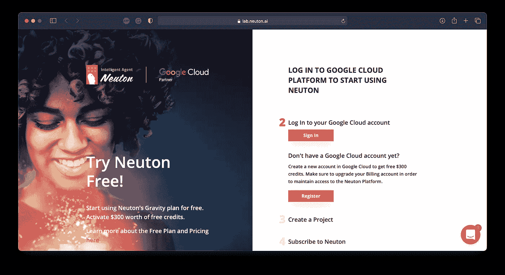

图片 1 — NeutonAI 注册页面(图片由作者提供)

你必须填写你的姓名和电话号码，然后，会出现一个连接你的谷歌云账户的选项。这是一个强制步骤，因此要么连接您的云帐户，要么创建一个新帐户。

下一步是选择一个计划，假设你已经准备好了一个谷歌云账户。重力 T2 计划是完全免费的，所以你可以从那个开始。一个新的谷歌云账户附带 300 美元的免费积分，这可能会在未来派上用场:

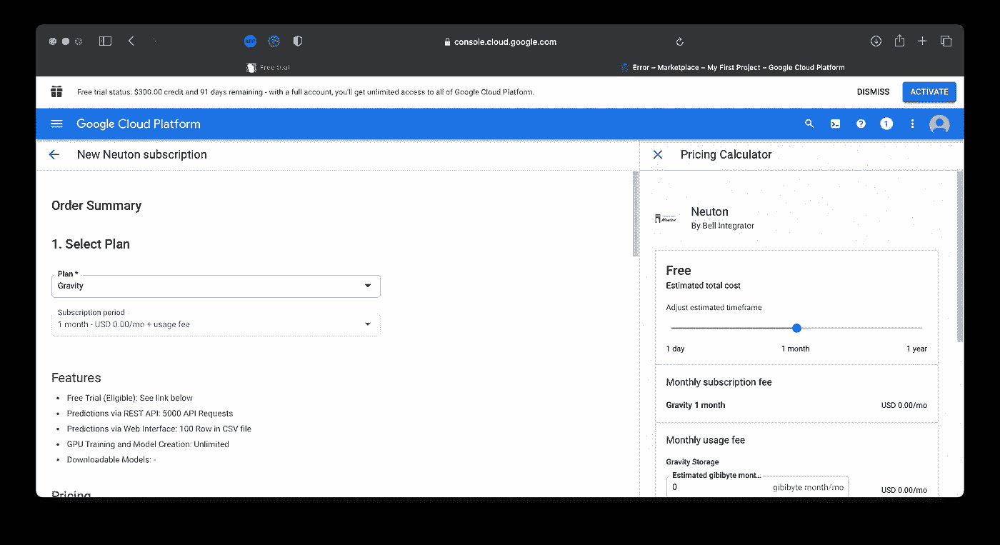

图 2——谷歌云设置(图片由作者提供)

您应该保留所有选项的默认值，并同意使用条款。这样做之后，你就可以完成 Google Cloud 项目的设置了，这会将你重定向回内乌顿页面。

假设一切顺利，您将看到一个创建新项目的按钮:

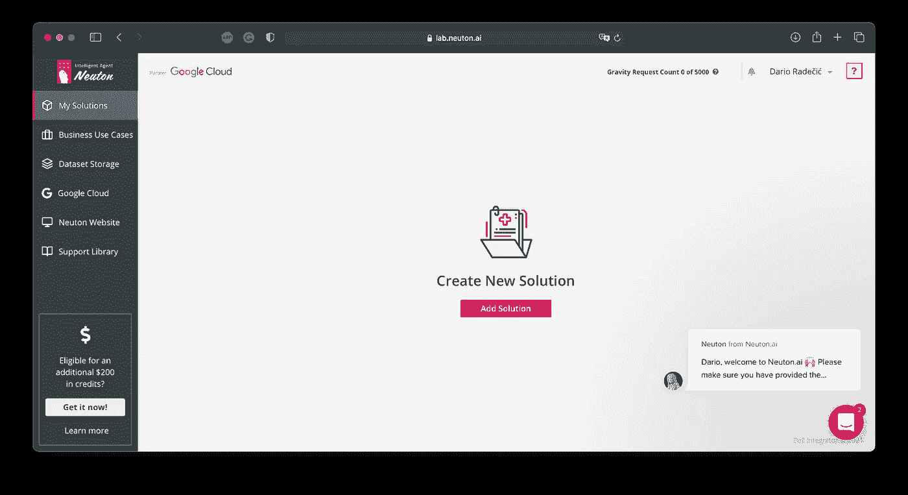

图片 3——内乌顿人工智能项目主页(图片由作者提供)

就这样——您已经准备好在这个平台上创建您的第一个 AutoML 项目了。

# 创建新的 AutoML 项目

点击*添加解决方案*按钮，将弹出一个新的模态窗口。它将要求您指定项目名称和描述。我们将围绕一个众所周知的泰坦尼克号数据集创建一个机器学习项目:

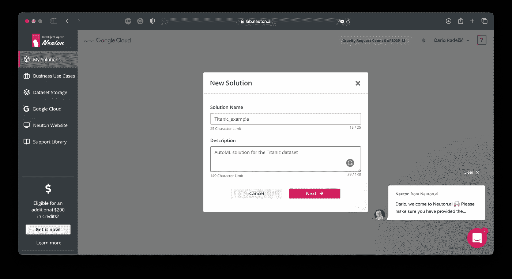

图 4 —创建新项目(1)(作者图片)

下一步是数据集。内乌顿为您提供了上传数据集或选择数据集的选项。你会在他们的图书馆里找到许多数据集，包括泰坦尼克号:

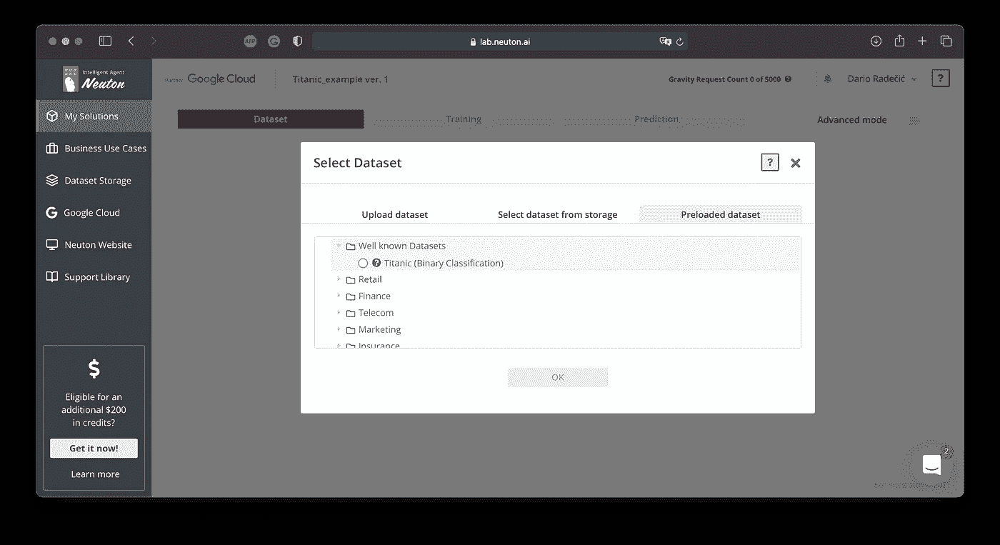

图 5 —创建新项目(2)(作者图片)

选择数据集后，您必须选择一个目标变量(您想要预测的变量)。`Survived`栏显示乘客是否在事故中幸存，所以这是您想要选择的内容:

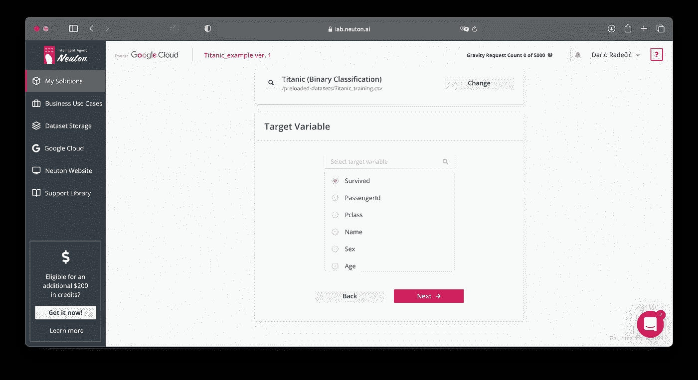

图 6 —创建新项目(3)(图片由作者提供)

最后，您可以点击*开始训练*按钮。保持其他选项不变。只有当您正在为微控制器构建模型时，才应该使用 TinyML 选项——而现在您不是这样。

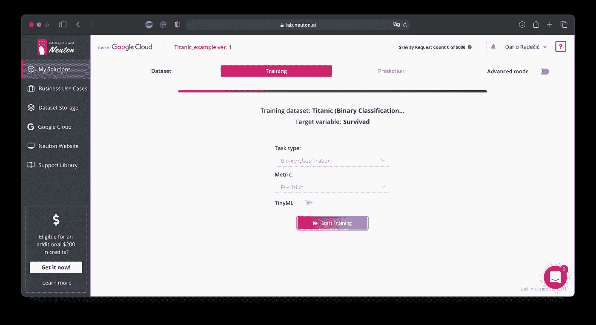

图 7 —创建新项目(4)(图片由作者提供)

训练过程现在开始——边等边给自己倒杯咖啡。

# 用 NeutonAI 训练机器学习模型

模特训练的过程并不复杂。已经开始了，所以你要做的就是坐着等:

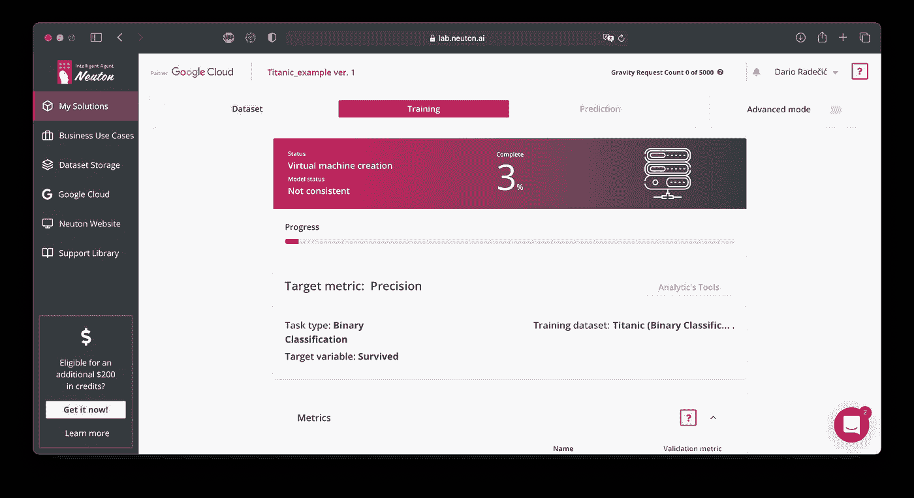

图 8-训练机器学习模型(1)(图片由作者提供)

NeutonAI 为您处理数据处理和特征工程。你不用动一根手指。没有更多的时间花在处理杂乱的数据上——只要你的数据格式合理，一切都会自动处理。

对我来说，为泰坦尼克号数据集训练一个模型花了大约 5 分钟。完成后，您应该会看到以下消息:

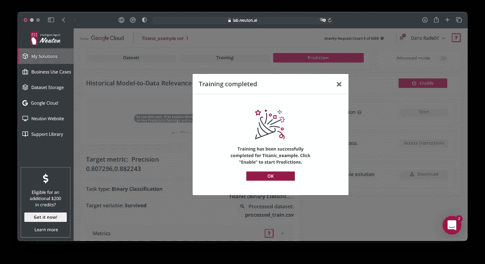

图片 9-训练机器学习模型(2)(图片由作者提供)

这就是全部内容——您现在可以评估模型并根据新数据做出预测。

# 评估机器学习模型

内乌顿又一次变得非常简单。系统会自动为您创建一个 EDA 仪表盘，这是我们首先要探索的。

点击*我的解决方案—分析工具*。应该会弹出这样的菜单:

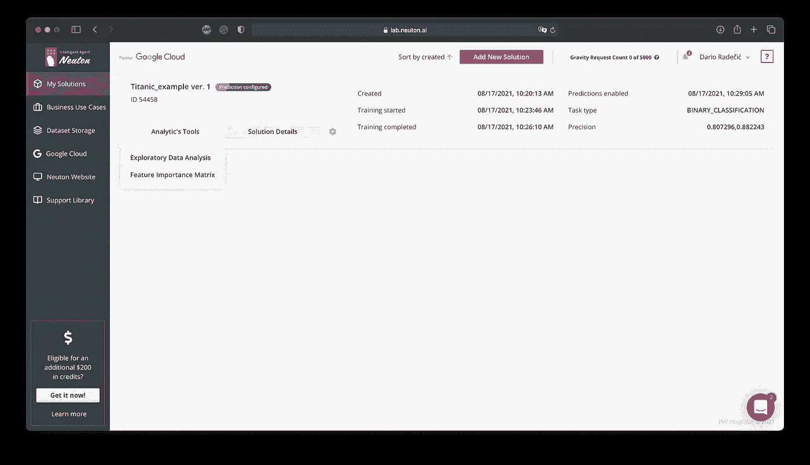

图 10 —评估机器学习模型(1)(图片由作者提供)

内乌顿点击*指数数据分析*选项后生成整个仪表板:

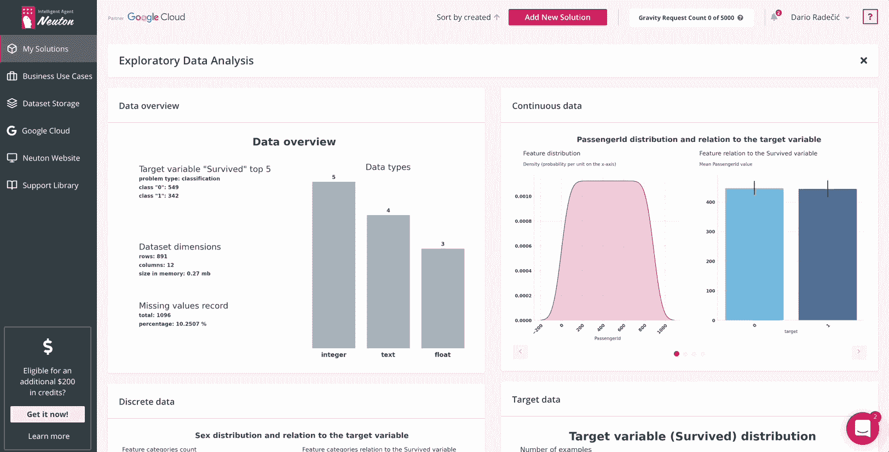

图 11 —评估机器学习模型(2)(图片由作者提供)

你也可以点击*特征重要性矩阵*选项——如下所示:

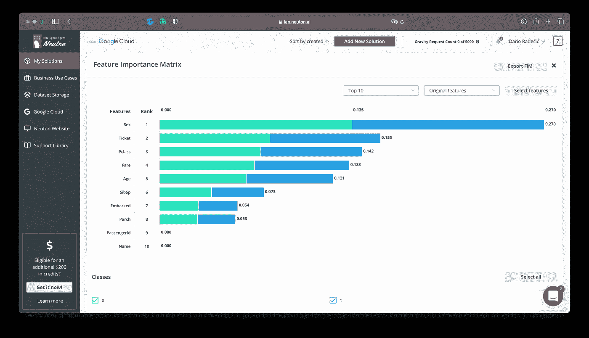

图 12 —评估机器学习模型(3)(图片由作者提供)

您还可以通过进入*培训*选项卡，获得对培训指标的更多见解。这将向您展示一个模型质量图和一个混淆矩阵:

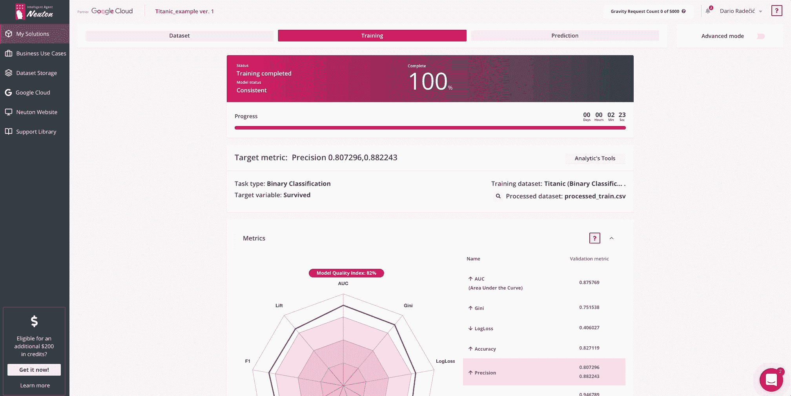

图 13 —评估机器学习模型(4)(图片由作者提供)

对于业务用户来说，有很多方便的指标可以帮助他们理解模型是否足够准确。我在这里没有看到的唯一相关指标是 MAPE，但也许它会在未来的版本中添加。你可以在这里了解更多关于模型质量图[。](https://bit.ly/2XPLjXP)

总而言之，内乌顿为评估机器学习模型提供了许多选项。当然，故事还有更多，但这是另一个时间的话题。

最后，让我们看看如何对以前看不见的数据进行预测。

# 做预测

首先，打开您的解决方案，点击粉红色按钮，显示*启用预测下的*:

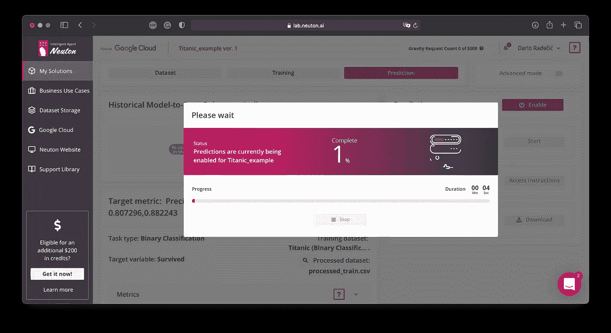

图 14 —做出预测(1)(图片由作者提供)

这样做将同时启用 web 界面和 REST API，因此您可以选择最适合您需求的方法。让我们先来看看 web 界面。

## 网络界面

当您有单独的数据集用于训练和测试时， *Web 预测*界面非常有用。例如，Titanic 数据集包括两个 CSV 文件。您已经在第一个上训练了模型，现在是时候评估第二个上的性能了。

这就是网络界面的闪光点。

唯一的问题是，免费版本仅限于预测 CSV 文件的 100 行，但是您可以将您的文件切割成多个部分，并根据需要继续使用免费版本。

点击*预测—网络预测*下的*开始*按钮:

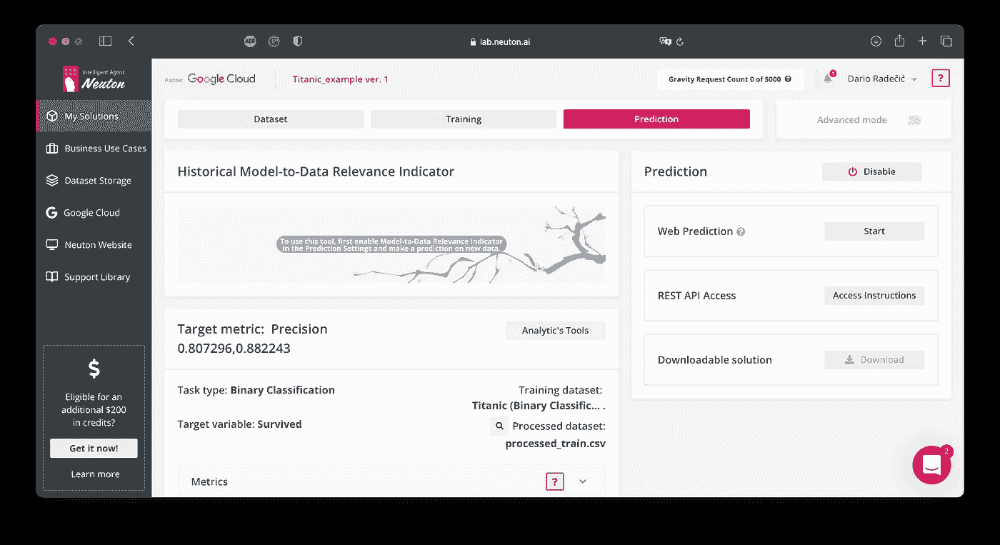

图 15 —做出预测(2)(图片由作者提供)

它会要求您选择 CSV 文件，因此选择一个由内乌顿提供的文件:

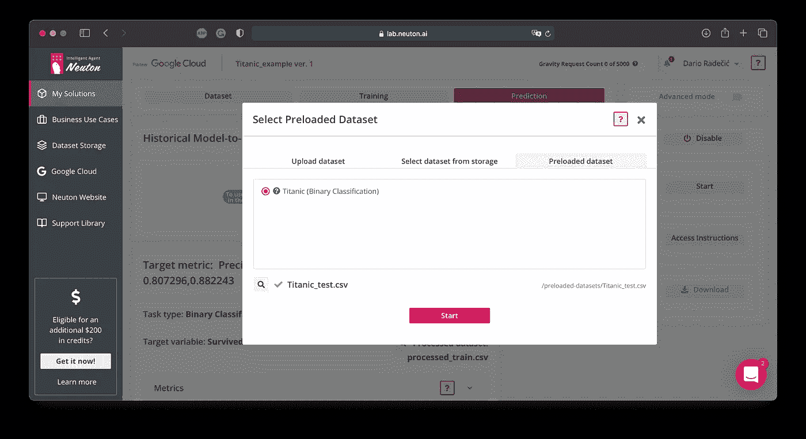

图 16 —做出预测(3)(图片由作者提供)

完成后，您可以下载预测或以表格形式在线查看:

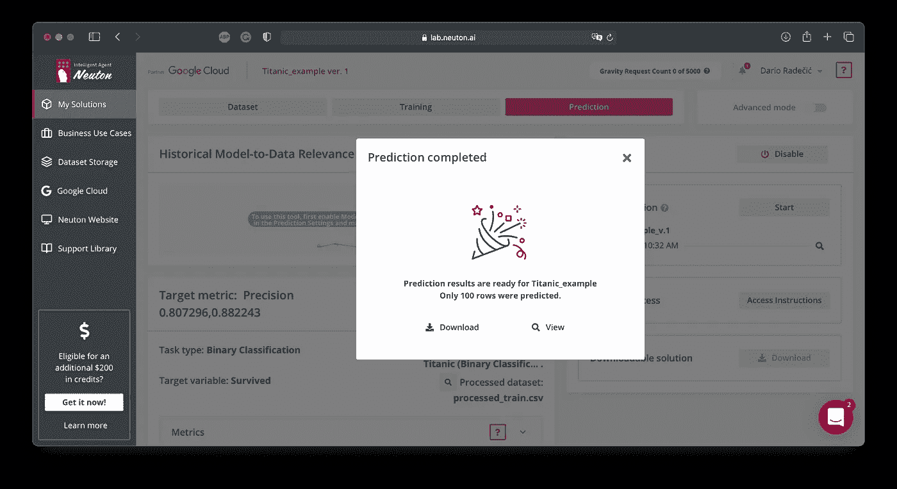

图 17 —预测(4)(图片由作者提供)

选择在线查看预测数据的选项。下面是它的样子:

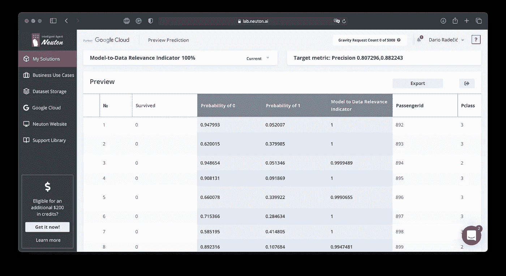

图 18 —做出预测(5)(图片由作者提供)

您还可以获得概率，这很有用，因此如果需要，您可以手动调整决策阈值。

说到调整，您可以点击任何预测行来打开*模型解释器*。它允许您更改参数，观察预测如何变化，并获得对模型背后的推理的更多见解。它看起来是这样的:

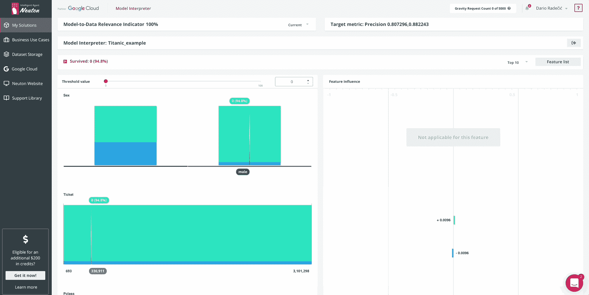

图 19 —预测(6)(图片由作者提供)

整个口译员有点难找。我希望在未来的更新中它会被放在一个更显眼的位置。你可以在这里阅读更多相关信息[。](https://neuton.ai/explainability)

接下来让我们探索 REST API 选项。

## REST API

API 或多或少是将机器学习模型投入生产的标准方法。这个想法是公开一个模型的预测功能，这样任何人都可以访问它们，甚至是没有技术知识的人。您还可以围绕 REST APIs 构建应用程序，因此很容易理解为什么它们是生产中的首选方法。

内乌顿为你做了这一切。

在免费版本中，您被限制为 5000 个 API 请求，但是对于一个小型企业或项目来说，这已经足够了。

点击*预测 REST API 访问下的*访问指令*。*你会看到所有的细节:

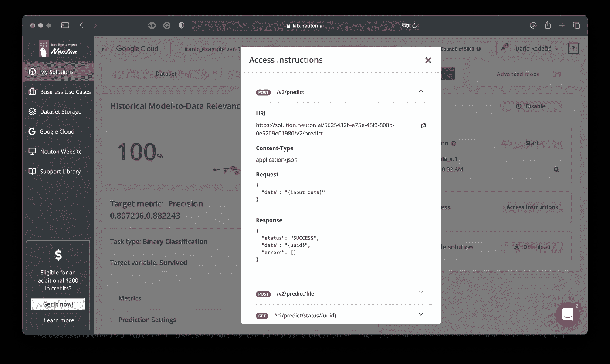

图 20 —做出预测(7)(图片由作者提供)

很简单，不是吗？如果你不需要特别的东西，这会节省你几个小时。大多数时候，你不知道。

# 判决

您现在知道如何从数据集到已部署的机器学习模型。问题依然存在—**neuton ai 是这项工作的合适工具吗？**

看情况。

如果你是一家以数据科学为先的公司，提供基于 SOTA 研究的定制解决方案，那么 NeutonAI 平台不适合你。没有自动解决方案可以满足要求。然而，NeutonAI 作为基线可能会让你感兴趣，因为它在引擎盖下有一个获得专利的神经框架，可以根据创作者自动构建最佳模型。

另一方面，如果你是一个商业用户，不需要什么特别的东西，内乌顿可能就是你要找的。即使是最高级的版本，花费也不到一个中级数据科学家的月薪，而且它肯定能做更多。

*你有什么想法？你试过*[*NeutonAI*](https://bit.ly/3BaIRtv)*吗？*欢迎在评论区留下你的想法。

*喜欢这篇文章吗？成为* [*中等会员*](https://medium.com/@radecicdario/membership) *继续无限制学习。如果你使用下面的链接，我会收到你的一部分会员费，不需要你额外付费:*

<https://medium.com/@radecicdario/membership>  

# 保持联系

*   关注我的媒体，了解更多类似的故事
*   注册我的[简讯](https://mailchi.mp/46a3d2989d9b/bdssubscribe)
*   在 [LinkedIn](https://www.linkedin.com/in/darioradecic/) 上连接