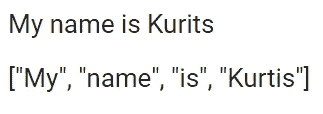
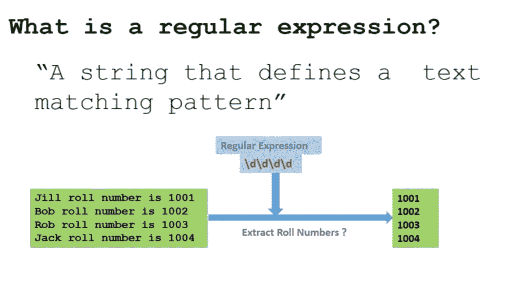

# 永远不要忘记这 8 个 NLP 术语

> 原文：<https://towardsdatascience.com/never-forget-these-8-nlp-terms-a9716b4cccda?source=collection_archive---------23----------------------->

## [自然语言处理笔记](https://towardsdatascience.com/tagged/nlpnotes)

## 所有 NLP 爱好者都应该知道术语


由[凯利·西克玛](https://unsplash.com/@kellysikkema?utm_source=medium&utm_medium=referral)在 [Unsplash](https://unsplash.com?utm_source=medium&utm_medium=referral) 上拍摄的照片

自然语言处理(NLP)是语言学、计算机科学和人工智能的一个子领域，涉及计算机和人类语言之间的交互，特别是如何对计算机进行编程，以处理和分析大量自然语言数据[ **来源** : [维基百科](https://en.wikipedia.org/wiki/Natural_language_processing) ]。

如果你已经决定 NLP 是你希望专攻的数据科学的子领域，下一步是确定你需要了解的关键领域以推进你的职业生涯。问题是，你在网上找到的许多资源都假定你已经熟悉各种术语，因此你才会登陆他们的页面，但事实并非如此。

</the-specialized-data-scientist-will-win-in-the-long-run-22c47342aa00>  

到本文结束时，您将对在与自然语言处理(NLP)相关的各种文章中可能遇到的一些关键术语有一个清晰的认识。

## #1 语料库

由于自然语言处理是语言学的一个分支，语言学中的许多关键术语已经被该领域所采用。语料库翻译成拉丁语的意思是身体。身体构成了人或动物的身体结构，包括骨骼、肌肉和器官，因此我们可以说身体是由其他部分的集合构成的。

同理，我们说语料库是其他部分的集合，但这方面的其他部分是其他文档。例如，您可能有由不同宗教书籍组成的语料库(语料库的复数),其中每本书都被称为一个文档，书籍的集合就是语料库。

## #2 标记化

标记化是 NLP 过程中的一个清理步骤。标记化的目标是将短语、句子或整个文本文档拆分成更小的单元，例如单词或术语。每个更小的单元被称为令牌。



符号化示例—作者的图像

## #3 词干

在语言形态学和信息检索中，词干提取是将屈折词简化为词干、词根或词根形式的过程——通常是书面形式[来源:维基百科]

使用 NLTK 在 Python 中进行词干提取的示例:

```
**import** nltk
**from** nltk.stem.porter **import** PorterStemmerwords = ["walk", "walking", "walked", "walks", "ran", "run", "running", "runs"]

*# example of stemming*
stemmer = PorterStemmer()for word in words: 
    **print**(word + " ---> " + stemmer.stem(word))**>>>> walk ---> walk
     walking ---> walk
     walked ---> walk
     walks ---> walk
     ran ---> ran
     run ---> run
     running ---> run
     runs ---> run** 
```

## #4 词汇化

语言学中的词汇化是将一个单词的词尾变化形式组合在一起的过程，这样它们就可以作为一个单独的项目进行分析，通过该单词的词汇或字典形式来识别[ **来源** : [维基百科](https://en.wikipedia.org/wiki/Lemmatisation)。

尽管 sounding 有相同的词干化目标，但词汇化和词干化是完全不同的。以下是方法:

*   词干分析只是在考虑了屈折词中常见的前缀和后缀列表后，试图切断单词的结尾或开头。
*   词汇化执行类似的过程，但是，这种技术考虑单词的形态分析。

使用 NLTK 的 Python 中的词汇化示例:

```
**import** nltk
**from** nltk.stem **import** WordNetLemmatizerwords = ["walk", "walking", "walked", "walks", "ran", "run", "running", "runs"]
*# example of lemmatization* lemmatizer = WordNetLemmatizer()for word in words:
    **print**(word + " ---> " + lemmatizer.lemmatize(word))**>>>> walk ---> walk 
     walking ---> walking 
     walked ---> walked 
     walks ---> walk 
     ran ---> ran 
     run ---> run 
     running ---> running 
     runs ---> run**
```

## #5 停用词

在每一种语言中，都有许多单词在语言中频繁使用，但往往不会给文本增添多少意义，这些单词被称为停用词。然而，仅仅因为它们没有增加太多的意义，并不意味着你应该盲目地从你的文档中删除它们，因为这可能会损害你的分类器在一些分类任务中的结果。

以下是 NLTK 库中的英语停用词列表:

```
**import** nltk
**from** nltk.corpus **import** stopwords
nltk.download("stopwords")**print**(set(stopwords.words("english"))**>>>> {'a',  'about',  'above',  'after',  'again',  'against',  'ain',  'all',  'am',  'an',  'and',  'any',  'are',  'aren',  "aren't",  'as',  'at',  'be',  'because',  'been',  'before',  'being',  'below',  'between',  'both',  'but',  'by',  'can',  'couldn',  "couldn't",  'd',  'did',  'didn',  "didn't",  'do',  'does',  'doesn',  "doesn't",  'doing',  'don',  "don't",  'down',  'during',  'each',  'few',  'for',  'from',  'further',  'had',  'hadn',  "hadn't",  'has',  'hasn',  "hasn't",  'have',  'haven',  "haven't",  'having',  'he',  'her',  'here',  'hers',  'herself',  'him',  'himself',  'his',  'how',  'i',  'if',  'in',  'into',  'is',  'isn',  "isn't",  'it',  "it's",  'its',  'itself',  'just',  'll',  'm',  'ma',  'me',  'mightn',  "mightn't",  'more',  'most',  'mustn',  "mustn't",  'my',  'myself',  'needn',  "needn't",  'no',  'nor',  'not',  'now',  'o',  'of',  'off',  'on',  'once',  'only',  'or',  'other',  'our',  'ours',  'ourselves',  'out',  'over',  'own',  're',  's',  'same',  'shan',  "shan't",  'she',  "she's",  'should',  "should've",  'shouldn',  "shouldn't",  'so',  'some',  'such',  't',  'than',  'that',  "that'll",  'the',  'their',  'theirs',  'them',  'themselves',  'then',  'there',  'these',  'they',  'this',  'those',  'through',  'to',  'too',  'under',  'until',  'up',  've',  'very',  'was',  'wasn',  "wasn't",  'we',  'were',  'weren',  "weren't",  'what',  'when',  'where',  'which',  'while',  'who',  'whom',  'why',  'will',  'with',  'won',  "won't",  'wouldn',  "wouldn't",  'y',  'you',  "you'd",  "you'll",  "you're",  "you've",  'your',  'yours',  'yourself',  'yourselves'}**
```

## #6 N-grams

在计算语言学和概率领域，n 元语法是来自给定文本或语音样本的 n 个项目的连续序列。根据应用，这些项目可以是音素、音节、字母、单词或碱基对。n 元语法通常是从文本或语音语料库中收集的[ **来源** : [维基百科](https://en.wikipedia.org/wiki/N-gram) ]。

```
**from** nltk **import** ngrams# example sentence
sentence = "If you find this article useful then make sure you don't forget to clap"# defining the ngrams
unigrams = ngrams(sentence.split(), 1)
bigrams = ngrams(sentence.split(), 2)
trigrams = ngrams(sentence.split(), 3)# create list to loop
n_grams = [unigrams, bigrams, trigrams]**for** idx, ngram **in** enumerate(n_grams):
    **print**(f"\nN-grams: {idx +1}")
    **for** gram **in** ngram:
        **print**(gram)**>>>> N-grams: 1
('If',) ('you',) ('find',) ('this',) ('article',) ('useful',) ('then',) ('make',) ('sure',) ('you',) ("don't",) ('forget',) ('to',) ('clap',)****N-grams: 2
('If', 'you') ('you', 'find') ('find', 'this') ('this', 'article') ('article', 'useful') ('useful', 'then') ('then', 'make') ('make', 'sure') ('sure', 'you') ('you', "don't") ("don't", 'forget') ('forget', 'to') ('to', 'clap')****N-grams: 3
('If', 'you', 'find') ('you', 'find', 'this') ('find', 'this', 'article') ('this', 'article', 'useful') ('article', 'useful', 'then') ('useful', 'then', 'make') ('then', 'make', 'sure') ('make', 'sure', 'you') ('sure', 'you', "don't") ('you', "don't", 'forget') ("don't", 'forget', 'to') ('forget', 'to', 'clap')**
```

## **#7 正则表达式**

单词“ *Regex* ”是正则表达式的简称。从本质上讲，正则表达式是一个字符串，它定义了一个文本模式，以允许您匹配、定位和管理文本。



正则表达式的例子[ **来源**:[comidoc.com](https://comidoc.com/master-regular-expressions-python-examples/)

## #8 标准化

**文本规范化**是将**文本**转换成以前可能没有的单一规范形式的过程。**在存储或处理之前规范化文本**它允许关注点分离，因为在对其执行操作之前保证输入是一致的[ **来源** : [维基百科](https://en.wikipedia.org/wiki/Text_normalization#:~:text=Text%20normalization%20is%20the%20process,operations%20are%20performed%20on%20it.)

标准化技术的例子包括:

*   堵塞物
*   词汇化
*   标记化
*   等等。

## 包裹

当处理自然语言时，有许多东西要学，但是许多术语在数据科学家和 NLP 工程师中是重复的。了解和理解本文中的术语将为您提供一个健康的基础，以便开始学习构成自然语言的其他领域，如自然语言理解(NLU)和自然语言生成(NLG)。确保你把它们记在心里，永远记得学习新的东西。

感谢阅读！在 [LinkedIn](https://www.linkedin.com/in/kurtispykes/) 和 [Twitter](https://twitter.com/KurtisPykes) 上与我联系，了解我关于人工智能、数据科学和自由职业的最新帖子。

## 相关文章

</a-glance-at-text-similarity-52e607bfe920>  </a-guide-to-encoding-text-in-python-ef783e50f09e>  </a-guide-to-cleaning-text-in-python-943356ac86ca> 