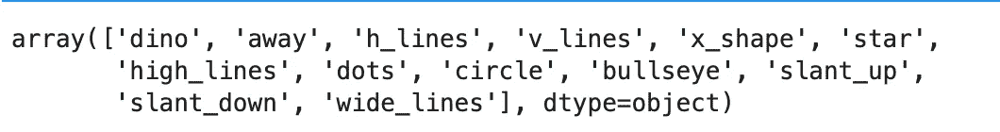
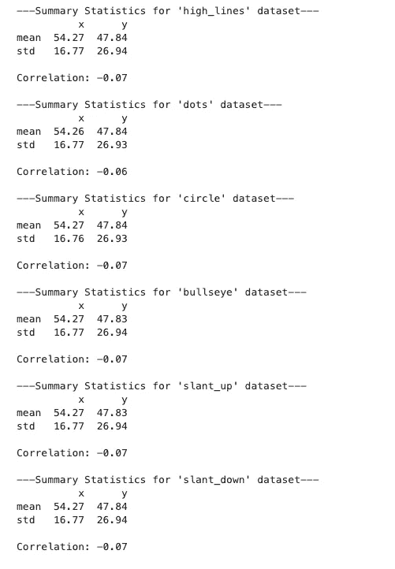
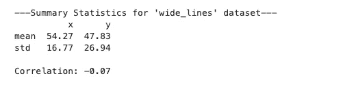
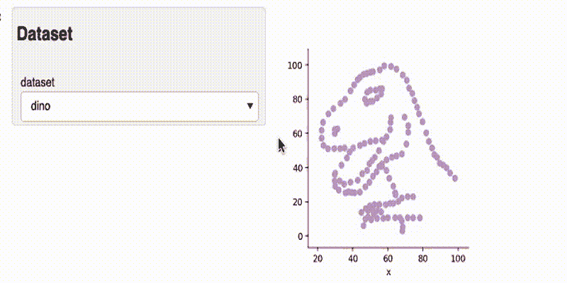

# 在你的探索性数据分析(EDA)中千万不要跳过这一步！

> 原文：<https://towardsdatascience.com/never-skip-this-step-in-your-exploratory-data-analysis-eda-60034da9f0f0?source=collection_archive---------17----------------------->

## 数据科学。统计学。埃达。PYTHON。

## 描述性统计如何误导你


卢卡斯·桑基在 [Unsplash](https://unsplash.com?utm_source=medium&utm_medium=referral) 上的照片

# 介绍

如果您是数据科学的新手，并且已经上过初步数据分析的课程，那么进行探索性数据分析(EDA)的第一步可能就是查看摘要/描述性统计数据。但是这一步我们真正想要完成的是什么呢？

汇总统计很重要，因为它们告诉您对数据建模很重要的两件事:位置和比例参数。在统计学中，位置参数是指平均值。这让您知道您的数据是否正常，以及是否有潜在的偏态，以帮助建模决策。

例如，如果数据集是正常的，像*普通最小二乘(OLS)* 这样的建模技术对于预测结果可能是足够的和强大的。除此之外，我们进行初始数据清理的方式，例如丢失数据的处理，可能取决于数据是否表现出正常的行为。

标度参数指的是我们在数据中的离差量(如标准差和方差)。这个参数越大，我们的分布就越分散。

因此，查看描述性统计数据是必不可少的，特别是对于建模和研究设计目的。然而，认为描述性统计足够用于 EDA 可能是数据专业人员可能犯的最昂贵的假设之一。

为了了解这一点，让我们通过一个流行的数据集 datasaurus dataset 进行一个可视化练习。

# DATASAURUS 数据集

人们普遍认为，只有当我们报告或交流数据/见解/结果时，可视化才会占据中心位置。

然而，当查看由 Alberto Cairo 创建的 datasaurus 数据集时，不要错过 EDA 的可视化部分的重要性变得显而易见。数据集可以在这个[链接](http://www.thefunctionalart.com/2016/08/download-datasaurus-never-trust-summary.html)中找到。

来自 Justin Matejka 和 Autodesk 的增强数据集，以及可以从 R 的 datasauRus 包下载的数据集，提出了 13 个*几乎相似的*数据集来进一步说明这一点。(*使用数据的许可来源于发给文章作者的个人电子邮件*)

让我们继续生成数据集的描述性统计数据。

# 描述统计学

```
# Preliminariesimport pandas as pd
import numpy as npdf.dataset.unique()
```



这些是 datasaurus 十几数据集内的 13 个子数据集。

```
unique = df.dataset.unique()for i in unique:
    temp = df[df.dataset==i]
    print(f'---Summary Statistics for \'{i}\' dataset---')
    print(np.round(temp.describe().loc[['mean', 'std'],],2))
    print(f"\nCorrelation: {np.round(temp.corr().iloc[0,1],2)} \n")
```


作者图片



作者图片



作者图片

为我们的 12 个数据集生成描述性统计数据，特别是位置和比例参数，包括相关系数，会产生几乎相同的值。

> 因此，单独运行描述性统计会使我们得出结论，它们实际上是相同的数据集，可以相似地建模。

但是，让我们想象一下，看看这个想法有多准确。

# 可视化数据集

我们开发了一个简单的应用程序，使用 panel 交互式地查看 13 个数据集:

```
import panel as pn
import holoviews as hv
pn.extension()def visualize_scatter(dataset):
    temp = df[df['dataset']==dataset]
    scatter =  hv.Scatter(temp, 'x', 'y')
    scatter.opts(color='#cb99c9', s=50)
    return scatterpn.extension(comms='default')select = pn.widgets.Select(name='dataset', options=list(unique))dmap = hv.DynamicMap(pn.bind(visualize_scatter, dataset=select))app = pn.Row(pn.WidgetBox('## Dataset', select), 
             dmap.opts(framewise=True)).servable()
app
```



作者对 Datasaurus 数据集的交互式可视化

太神奇了！这 13 个数据集虽然具有相似的描述性统计数据，但视觉效果却大相径庭。因此，用一种方式对它们进行建模是危险的，可能会对决策产生危险的影响。

# 结束语

现在我们看到了数据可视化的重要性，它不仅仅是流程的报告部分，让我们将它纳入我们的 EDA 中。

虽然这篇文章并没有阻止我们生成和使用描述性统计，但采用这种习惯实际上可能是好的:**在做描述性统计之前先想象一下**。虽然不是常规的，但可视化数据集首先允许数据科学家就如何批准正在解决的问题产生一些初步的方向。

对于我的其他可视化文章，请查看:

*   [显著提高您的探索性数据分析(EDA)](/dramatically-improve-your-exploratory-data-analysis-eda-a2fc8c851124?source=your_stories_page-------------------------------------)
*   [提升你的视觉效果:条形图竞赛](https://medium.com/swlh/step-up-your-visualization-bar-chart-race-bc7f9922bc9d?source=your_stories_page-------------------------------------)
*   [使用 GeoPandas 可视化菲律宾的人口密度](/psvisualizing-the-philippines-population-density-using-geopandas-ab8190f52ed1?source=your_stories_page-------------------------------------)
*   [使用卫星图像可视化建筑区](/visualizing-built-up-areas-using-satellite-images-18d43f34f0b3?source=your_stories_page-------------------------------------)
*   [使用 Google Places API 和 leavy 绘制您在菲律宾最喜欢的咖啡店地图](/mapping-your-favorite-coffee-shop-in-the-philippines-using-google-places-api-and-folium-2f9d5ad697bf?source=your_stories_page-------------------------------------)

我的 [Github 页面](https://github.com/francisadrianviernes/Visualization/blob/master/Visualize%20Your%20Data%20First.ipynb)上的全部代码。

让我知道你的想法！

# 参考

贾斯汀·马特伊卡和乔治·菲兹莫里斯。2017.相同的统计，不同的图形:通过模拟退火生成具有不同外观和相同统计的数据集。2017 CHI 计算系统中人的因素会议论文集。计算机械协会，纽约，纽约州，美国，1290-1294。土井:[](https://doi.org/10.1145/3025453.3025912)