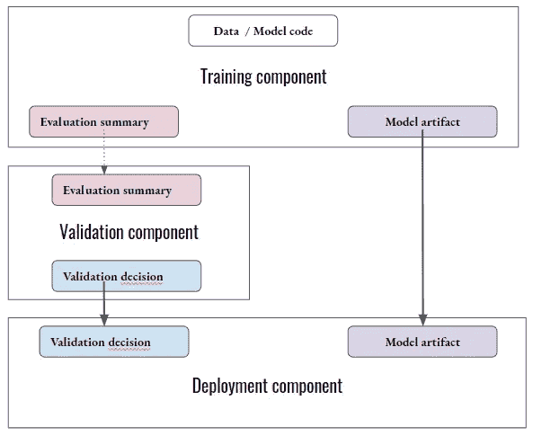

# 再也不用为在 Kubeflow 管道组件之间共享数据而烦恼了

> 原文：<https://towardsdatascience.com/never-struggle-again-to-share-data-between-your-kubeflow-pipelines-components-b750ab8bcd7c?source=collection_archive---------16----------------------->

## [实践教程](https://towardsdatascience.com/tagged/hands-on-tutorials)

## 了解如何使用 Kubeflow 管道实现经济高效的自动化模型再培训解决方案——第 2 部分

约翰·汤纳在 [Unsplash](https://unsplash.com?utm_source=medium&utm_medium=referral) 上的照片

这是 3 部分系列的第 2 部分，我将解释如何使用 Kubeflow Pipelines 作为 ML 系统编排器来构建一个具有成本效益的自动化 ML 再培训系统。在第一部分现成的[这里](/automate-your-ml-model-retraining-with-kubeflow-316f35afe19f)，我重点介绍:

1.  设置 Kubeflow 管道和云 SQL
2.  建筑管道组件
3.  编写条件组件和外部触发的管道

现在让我们转向一个稍微高级一点的话题。本文涵盖了如何在管道组件之间共享数据。

# 掌握数据共享至关重要

当我们给 Kubeflow 管道分配一些工作时，通常可以将这些工作分成多个小的工作。这就是管道组件发挥作用的地方。每个组件负责管道工作的一部分。将管道工作分成许多更小的单元有许多好处。

## 易于编写、测试、调试和维护

以应用程序代码库中的函数为例。管道代表应用程序，组件代表应用程序代码库中的功能。SoC(关注点分离)原则教导将应用程序代码分解成模块，并将模块分解成功能。然后，每个功能都致力于完成一个更小更简单的工作，随着时间的推移，这使得编写、单元测试、调试和维护单个功能和整个应用程序变得更加容易。

## 复用性

除了更小、更简单之外，拆分管道后得到的组件也各不相同，专门用于执行它们所负责的任何工作。因此，您通常有能力在许多管道中共享和重用它们。例如，考虑一个负责从远程存储器下载文件的组件。

## 协作的容易程度

当与具有不同专业知识的人在一个团队中工作时，将管道分成不同的组件可以通过团队协作加快管道的构建。例如，考虑 ML 流水线。数据工程师可以处理数据转换组件，而数据科学家可以处理 ML 培训组件。同时。

## 可重复性的容易程度

假设有人建议您将管道分割成小块，并遵循这个建议。假设管道的某一段在第 5 个组件处出现故障。Kubeflow Pipelines 允许您从失败的组件开始重试管道，从而节省时间和资源。

让我们更实际地将管道分成组件，并在这些组件之间共享数据。在本文第 1 部分的[ML pipeline I 演示中，*出租车费用预测器*管道负责培训、验证和部署新的模型版本(如果相关)。下图显示了 ML 管道的简化版本。](/automate-your-ml-model-retraining-with-kubeflow-316f35afe19f)

*   第一个组件，*训练组件*，使用训练和测试数据以及模型代码库作为输入来训练 ML 模型，并将评估摘要写入云 SQL 数据库。请注意，这些输入不是由另一个组件传递给该组件的。相反，训练组件直接从管道接收输入。
*   第二个组件*验证组件*从数据库中读取由*训练组件*创建的评估摘要。然后，它决定部署模型是否相关。这个决定也是组件的唯一输出。请注意，评估数据是如何通过外部系统(SQL 数据库)在这两个组件之间共享的，而不是直接共享的。
*   第三个组件，*部署组件*，读取由*验证组件做出的部署决定。*如果决定是有利的，组件还读取它从*训练组件*接收的模型工件，并部署模型的新版本*。*否则，它不会部署新版本的模型。

好了，在这一点上，您已经感觉到在创建管道时掌握数据共享是多么重要。接下来，让我们讨论在管道内部共享数据时要遵循的最佳实践。

# 数据共享食谱

让我们来分析一下在两个组件之间进行数据交换时到底发生了什么:

*   *生产者*’(产生数据的组件)
*   *消费者*’(消费数据的组件)。

*【生产者】*和*【消费者】*之间的数据交换可以总结为 8 个步骤:

1.  *生产商*集装箱开工
2.  ***生产者生产*数据**
3.  Kubeflow Pipelines 将数据复制到其存储系统中
4.  *生产商*集装箱退场
5.  *消费者*容器启动
6.  Kubeflow 管道将数据从其系统复制到消费者容器的本地文件系统
7.  ***消费*消费数据**
8.  *消费者*集装箱出口

你知道第 3 步和第 6 步吗？就我个人而言，我没有。实际上，从我发现有一些步骤是由 Kubeflow 系统本身处理的那天起，我就开始理解 Kubeflow 管道的数据共享是如何工作的。

现在，您还记得有 3 种方法可以构建管道组件吗？事实上，您可以:

*   编写一个 python 自包含函数，并从中构建一个组件
*   使用“containerOp”工厂方法从容器映像构建组件
*   将组件规范写成一个 yaml 文件，并加载它来创建组件

在 Kubeflow 管道组件之间共享数据时，您始终要遵循两条黄金法则:

*   **当产生一些要共享的数据时，让 Kubeflow Pipelines 系统决定在容器文件系统上存储数据的位置，而不是自己选择一个位置。**

虽然我不确定 Kubeflow 为什么建议这样做，但我相信遵循这条规则可以防止当 Kubeflow 试图将数据从容器复制到其存储系统时可能出现的任何问题(如权限问题)。然而，请注意，当使用*“container op”*工厂来构建组件时，这目前是不可能的(根据我的发现)。

*   **无论组件是如何创建的，小数据都是按值消耗，大数据是按文件(按路径)消耗。**

理解并应用这第二条规则对于正确共享数据以及让管道在执行时没有错误或意外的高资源请求是至关重要的。

看一下前面提到的 2 条规则，了解共享数据的大小对于决定如何实现数据共享是很重要的。似乎也不太推荐使用 *"containerOp"* 工厂，因为它要求管道作者选择容器文件系统上产生的数据应该写入的位置。因此，这种选择不包括在本文中。

因此，在接下来的段落中，我将演示如何使用 python 自包含的基于函数的组件和基于 yaml 规范的组件来生成和消费大小数据。

## 用基于功能的组件产生小数据

如果组件产生的数据很小，例如一个代表文件路径的字符串，只需让函数返回这个数据。如果您需要输出许多这样的小数据，您会想要使用' *NamedTuple'* 类。

但是，请注意，Kubeflow 管道将把这些数据写到一个文件上，并把这个文件复制到它的存储系统中，以便它接下来可以把这些数据提供给它的消费者。

## 使用基于函数的组件消费小数据

这很简单。只需将函数定义为普通的 python 函数。然后，当实例化组件时，使用生产任务的“输出”方法。

使用由上述基于功能的组件( *get_model_location* )产生的位置数据如下:

由于包含数据的文件已经由 Kubeflow 在生产容器的出口处持久化，因此 Kubeflow 管道实际上读取该文件，并将其内容的字符串表示传递给消费组件。

## 用基于功能的组件产生大数据

还记得适用于生产供下游组件使用的大数据的黄金法则吗？你总是想让 Kubeflow pipelines 系统为你选择一个位置，并把数据写到那个位置。

这通过以下方式实现:

*   在函数的签名中声明一个' *OutputPath()'* 参数
*   处理该路径的父文件夹可能不存在于容器中的事实(即如果需要，创建父文件夹)
*   将数据写入类型为 *'OutputPath()'* 的参数所引用的路径

## 使用基于功能的组件消费大量数据

我们总是希望通过路径来消耗大量数据或文件。如果我们指示 Kubeflow 我们只需要数据的路径，它就不会费心为我们读取数据。相反，Kubeflow 只会将文件复制到容器的本地文件系统，并向消费函数提供该文件的路径。

使用消费函数签名中的一个 *'InputPath()'* 参数向 Kubeflow 请求文件路径而不是文件内容。当消费组件被实例化时，此参数将接收生产组件的输出。

## 用基于规范的组件产生小数据

当组件从 yaml 规范构建时，规则不会改变:让 Kubeflow 挑选一个位置并把它给你。你必须:

*   在规范的*‘输出’*部分中指定由您的组件产生的数据
*   使用规范的*‘实现’*部分中的*‘输出路径’*关键字，通过容器参数引用此输出
*   处理 Kubeflow 生成路径的父文件夹可能不在容器中的事实
*   在路径位置写入数据

[这里的](https://www.kubeflow.org/docs/pipelines/reference/component-spec/)是关于编写库巴流管道规范的官方文件。

## 使用基于规范的组件消费小数据

正如本文前面所讨论的，小数据可以被价值直接消费。要在 yaml 规范组件的上下文中做到这一点:

*   在您的规范的*“输入”*部分指定您的组件所消耗的数据
*   使用规范的*‘实现’*部分中的*‘输入值’*关键字，通过容器参数引用此输入
*   在实例化组件时，使用生产组件的*‘outputs’*方法来请求数据

## 用基于规范的组件产生大量数据

与基于功能的组件相反，无论您是使用 yaml 规范生成小数据还是大数据，过程都是完全相同的。您可以在规范的实现部分使用*‘output path’*关键字，让 Kubeflow 选择并给出写入生成数据的位置。

## 使用基于规范的组件消费大量数据

我不能经常强调:大数据是要被路径消费的。使用基于规范的组件实现这一点的方法是:

*   在规格的*【输入】*部分指定您的组件所消耗的数据
*   使用规范的*‘实现’*部分中的*‘输入路径’*关键字，通过容器参数引用此输入
*   实例化组件时，使用生产组件的*‘outputs’*方法请求数据
*   使用提供的路径读取消费组件容器源代码中的数据

# 结束注释

如果让我从这篇文章中选择两个最重要的观点，我会引用组件间数据共享的两条黄金法则:

1.  为下游任务生成数据时，让 Kubeflow 为您选择一个位置
2.  始终按值消耗小数据，按路径消耗大数据

在研究这些内容时，我发现*“container op”*工厂在共享数据方面不如基于功能的组件和基于规范的组件灵活。

此外，回想一下当您共享数据时，在幕后发生的数据传输。如果您的组件容器可以访问分布式存储，如谷歌云存储或亚马逊 S3，请考虑将您的大数据写入其中，并通过值来消费到它的路径。

请继续关注本系列的下一篇文章，讨论如何将秘密传递给组件，以及如何设计管道和组件输入。