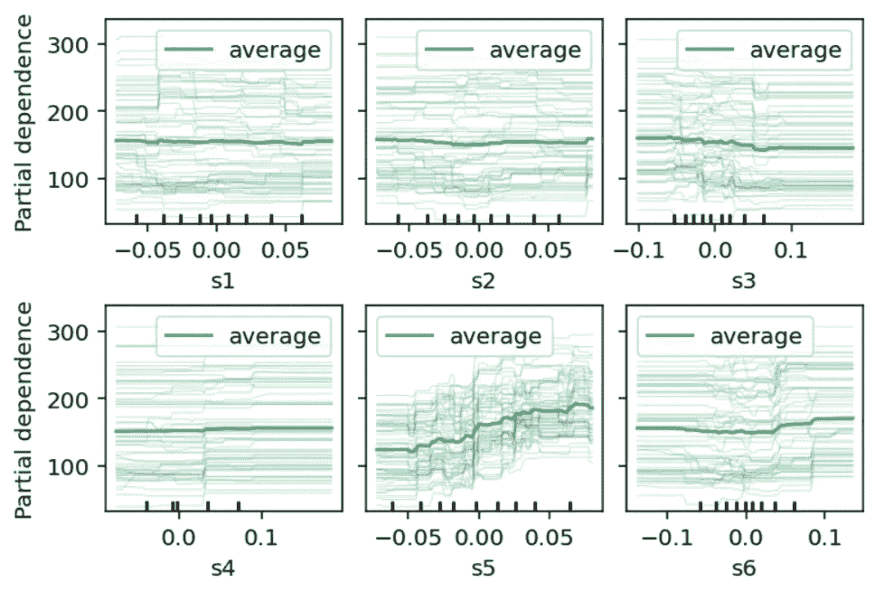
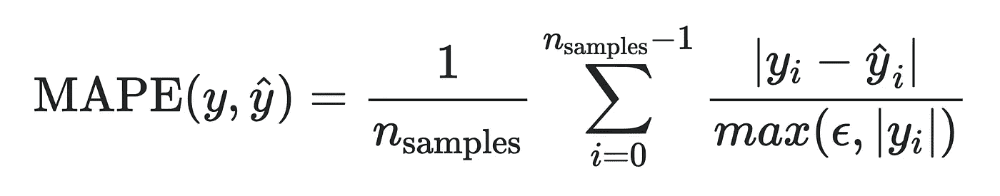

# Scikit-Learn 的新功能

> 原文：<https://towardsdatascience.com/new-features-of-scikit-learn-fbbfe7652bfb?source=collection_archive---------4----------------------->


照片由[米 PHAM](https://unsplash.com/@phammi?utm_source=medium&utm_medium=referral) 在 [Unsplash](https://unsplash.com?utm_source=medium&utm_medium=referral)

## 0.24 版中最重要功能的概述

> Python 的机器学习库 Scikit-learn 刚刚变得更好。现在是更新的最好时机。

R **最近，2020 年 12 月，scikit-learn 发布了 0.24 版本的重大更新。这是版本 0 的最后一个稳定版本。下一个版本应该是 1.0 版本，目前正在开发中。**

我将概述 0.24 版本中引入的一些重要特性。考虑到大量突出的特性，我强烈建议升级您的 scikit-learn 库。

## 内容:

*   **升级到 0.24 版本**
*   **主要特点**
*   **其他有趣的功能**

# 升级到版本 0.24

我正在使用 Python 环境，所以，首先我激活了我想要的环境，然后通过`pip`升级了 **scikit-learn** 版本。

```
# Activate the environment
>>> source activate py38# Upgrade scikit-learn 
>>> pip install — upgrade scikit-learn...
...
**Successfully installed scikit-learn-0.24.0**
```

# 主要特点


\照片由[托尔加·乌尔坎](https://unsplash.com/@tolga__?utm_source=medium&utm_medium=referral)在 [Unsplash](https://unsplash.com?utm_source=medium&utm_medium=referral) 上拍摄

## 1)顺序特征选择器(SFS)

这是一种贪婪地从高维空间中选择最重要特征的方式。该[变换器](https://scikit-learn.org/stable/modules/feature_selection.html#sequential-feature-selection)使用模型估计器的交叉验证来*迭代地*通过分别经由前向和后向选择添加或移除特征来找到最佳特征子集。

正向选择从较少的特征开始，并逐渐添加最佳的新特征，直到获得所需数量的特征。向后选择从更多的特征开始，并逐个移除它们，直到选择了所需数量的特征。

它是“**SelectFromModel”(SFM)**[变压器](https://scikit-learn.org/stable/modules/generated/sklearn.feature_selection.SelectFromModel.html#sklearn-feature-selection-selectfrommodel)的替代产品。SFS 相对于 SFM 的优势在于，SFS 中使用的估计量(模型)在拟合后不需要具有`feature_importances_`或`coef_`属性，这与 SFM 不同。SFS 的缺点是，由于其迭代性质和 *k* 倍 CV 评分，它比 SFM 相对较慢。下面是一个例子。尝试使用不同的分类器来处理代码。

```
from sklearn.datasets import load_wine
from sklearn.neighbors import KNeighborsClassifier
from sklearn.feature_selection import SequentialFeatureSelectorX, y = load_wine(return_X_y=True, as_frame=True)
n_features = 3model = KNeighborsClassifier(n_neighbors=3)
sfs = SequentialFeatureSelector(model, 
                                n_features_to_select = n_features, 
                                direction='forward') #Try 'backward'
sfs.fit(X, y)print("Top {} features selected by forward sequential selection:{}"\
      .format(n_features, list(X.columns[sfs.get_support()])))**# Top 3 features selected by forward sequential selection: 
# ['alcohol', 'flavanoids', 'color_intensity']**
```


照片由[马库斯·温克勒](https://unsplash.com/@markuswinkler?utm_source=medium&utm_medium=referral)在 [Unsplash](https://unsplash.com?utm_source=medium&utm_medium=referral) 拍摄

## 2)个体条件期望(ICE)图

[ICE 图](https://scikit-learn.org/stable/modules/partial_dependence.html#individual-conditional-expectation-ice-plot)是一种新型的**部分相关图**，它显示了数据集中给定样本的预测如何依赖于某个特征。如果你有 100 个样本(录音)和 6 个特征(自变量)，那么你将得到 6 个支线剧情，其中每个剧情将包含 100 行(你可以指定这个数字)。所有子情节中的 *y* 轴将覆盖目标变量(预测)的范围，而 *x* 轴将覆盖相应特征的范围。

以下代码生成如下所示的 ICE 图。

```
from sklearn.datasets import load_diabetes
from sklearn.ensemble import RandomForestRegressorX, y = load_diabetes(return_X_y=True, as_frame=True)
features = ['s1', 's2', 's3', 's4', 's5', 's6'] # features to plotmodel = RandomForestRegressor(n_estimators=10)
model.fit(X, y)ax = plot_partial_dependence(
       model, X, features, kind="both", subsample=60, 
       line_kw={'color':'mediumseagreen'})ax.figure_.subplots_adjust(hspace=0.4, wspace=0.1) # adjust spacing
```



使用随机森林回归方程显示糖尿病进展对六种血清特征的依赖性的 ICE 图。


塔曼娜·茹米在 [Unsplash](https://unsplash.com?utm_source=medium&utm_medium=referral) 上拍摄的照片

## 3)逐次减半估计量

引入了两种新的超参数调整估计器，即[**halvinggridsearccv**](https://scikit-learn.org/stable/modules/generated/sklearn.model_selection.HalvingGridSearchCV.html#sklearn-model-selection-halvinggridsearchcv)和[**HalvingRandomSearchCV**](https://scikit-learn.org/stable/modules/generated/sklearn.model_selection.HalvingRandomSearchCV.html#sklearn-model-selection-halvingrandomsearchcv)。它们可以分别作为 scikit-learn 迄今为止内置的超参数调优方法 **GridSearchCV** 和 **RandomizedSearchCV、**的替代方法。

基本思想是，对最佳超参数**的搜索从具有大量参数**的几个样本开始。在下一次迭代中，样本数量增加(增加因子 *n* ，但参数数量减半/减少(**减半不仅意味着因子 1/2 (n=2)，还可以是 1/3 (n=3)、1/4 (n=4)，以此类推**)。这个**减半过程**持续到最后一次迭代。最后，参数的最佳子集是在最后一次迭代中得分最高的那个。

类似于现有的两种方法，可以随机地(HavingRandomSearchCV)或者穷举地(HavingGridSearchCV)执行“连续减半”。下面的示例演示了 HavingRandomSearchCV 的用例(您可以类似地使用 HavingGridSearchCV)。关于如何选择最佳参数的全面说明，请参考此处的[和](https://scikit-learn.org/stable/modules/grid_search.html#searching-for-optimal-parameters-with-successive-halving)。

```
from sklearn.datasets import load_iris
from sklearn.ensemble import RandomForestClassifier
from sklearn.model_selection import HalvingRandomSearchCVX, y = load_iris(return_X_y=True, as_frame=True)
model = RandomForestClassifier(random_state=123, n_jobs=-1)param_grid = {"n_estimators": [20, 50, 100],
              "bootstrap": [True, False],
              "criterion": ["gini", "entropy"],
              "max_depth": [1, 2, 3],
              "max_features": randint(1, 5),
              "min_samples_split": randint(2, 9)
              }grid = HalvingRandomSearchCV(estimator=model,
                             param_distributions=param_grid,
                             factor=2, random_state=123,)
grid.fit(X, y)
print(grid.best_params_)**# Output
{'bootstrap': True, 'criterion': 'gini', 'max_depth': 2, 'max_features': 4, 'min_samples_split': 8, 'n_estimators': 50}**
```


照片由[罗迪·洛佩兹](https://unsplash.com/@20164rhodi?utm_source=medium&utm_medium=referral)在 [Unsplash](https://unsplash.com?utm_source=medium&utm_medium=referral) 上拍摄

## 4)半监督自训练分类器

Scikit-learn 有几个用于监督学习的分类器。现在，这些监督分类器可以执行半监督分类，即，使模型能够从未标记的数据中学习。只有那些预测目标变量的类概率的分类器可以用作半监督分类器。官方示例[这里](https://scikit-learn.org/stable/auto_examples/semi_supervised/plot_semi_supervised_versus_svm_iris.html#sphx-glr-auto-examples-semi-supervised-plot-semi-supervised-versus-svm-iris-py)提供了对 Iris 数据集的监督分类和半监督分类的比较。

以下文章很好地解释了半监督学习的概念:

*   [**监督学习比半监督学习好很多**](/supervised-learning-but-a-lot-better-semi-supervised-learning-a42dff534781)
*   [**半监督学习和伪标注的简单说明**](/simple-explanation-of-semi-supervised-learning-and-pseudo-labeling-c2218e8c769b)


照片由 [Anastasia Zhenina](https://unsplash.com/@disguise_truth?utm_source=medium&utm_medium=referral) 在 [Unsplash](https://unsplash.com?utm_source=medium&utm_medium=referral) 上拍摄

## 5)历史梯度推进中的自然范畴特征

“HistGradientBoostingRegressor”和“histgradientsboostingclassifier”现在都可以支持无序的分类特征。通常，必须使用诸如一键编码、顺序标记等方案对分类特征进行编码。有了新的本地特性，用户可以直接指定分类列(特性),而不需要对它们进行编码。

最好的部分是**丢失的值可以作为一个单独的类别**。典型地，独热编码被应用于训练集。对于给定的特征(列)，假设训练集有六个类别，测试集有七个类别。在这种情况下，在六个附加列上训练的模型(由于一键编码转换，每个类别值有一个额外的特征)将在测试集的验证期间由于未知的第 7 个类别而抛出错误。本机功能可以通过将这第 7 个未知类别视为缺失值来规避这个问题。

参考[这个](https://scikit-learn.org/stable/auto_examples/ensemble/plot_gradient_boosting_categorical.html#categorical-feature-support-in-gradient-boosting)比较不同编码方案的官方例子。

## 6)不要用 scikit 做什么-了解

添加了新的[文档](https://scikit-learn.org/stable/common_pitfalls.html#common-pitfalls)，该文档关注使用 scikit-learn 进行机器学习时的常见陷阱。除了强调常见的错误，它还解释了做某些事情的推荐方法。本文档中涵盖的一些示例包括:

*   **数据转换的最佳实践**(例如，标准化)
*   线性模型**系数**的**正确解释**
*   **通过正确处理训练和测试数据集，避免数据泄露**
*   **推荐使用随机状态**来控制随机性，例如在 *k* 折叠 CV 期间

## 附加文档

通常， **GridSearchCV** 用于为我们的模型寻找超参数的最佳子集。基于我们预定义的绩效评分参数(如`'accuracy'`或`'recall'`或`'precision'`等)。)，我们选择最佳超参数子集。本文件提供了一个示例，展示了根据**统计显著性**比较不同模型的正确方法。

# 其他有趣的功能

## **1)回归的新评估指标**

**平均绝对百分比误差(MAPE)是针对**回归问题**引入的**新评估指标**。该指标**对目标变量**的全局缩放不敏感。在数据范围超过几个数量级的情况下，通过计算误差与真值的相对百分比，这是一种合理的误差测量方法。更多详情请参见[这一](https://scikit-learn.org/stable/modules/model_evaluation.html#mean-absolute-percentage-error)页。**

****

**平均绝对百分比误差。ϵ是一个任意小的正数，例如 1e-6。变量 y 和 y_hat 代表真实值和预测值。**

## **2)独热编码器将缺失值视为类别**

**[一键编码器](https://scikit-learn.org/dev/modules/preprocessing.html#encoding-categorical-features)现在可以将分类特征中的缺失值视为附加类别。如果特定分类特征中的缺失值是`'None'`和`'np.nan'`，它们将被编码为两个独立的类别。**

## **3)使用普通编码器对未知类别进行编码**

**[OrdinalEncoder](https://scikit-learn.org/stable/modules/generated/sklearn.preprocessing.OrdinalEncoder.html#sklearn-preprocessing-ordinalencoder) 现在允许在转换到用户指定值的过程中对未知类别进行编码。**

## **4)决策树回归器的泊松分裂准则**

**DecisionTreeRegressor 现在支持一个名为 `**'poisson'**`的**新分裂标准，该标准基于泊松偏差的减少来分裂一个节点。这有助于对目标变量代表计数或频率的情况进行建模。参见[这篇](/an-illustrated-guide-to-the-poisson-regression-model-50cccba15958)文章，了解更多关于泊松分布的信息。****

## **5)可选颜色条在`confusion matrix plot`**

**绘制混淆矩阵时，颜色条现在是可选的。要做到这一点，你必须通过关键字`colorbar=False`。**

```
plot_confusion_matrix(estimator, X, y, colorbar=False)
```

# **结论**

**这篇文章列出了最新 scikit-learn 更新(v0.24)中的一些突出变化。完整的变更列表可在[此处](https://scikit-learn.org/stable/whats_new/v0.24.html#changes-0-24)获得。这是版本 0 的最后一次更新。下一个版本将是 1.0。如果你有兴趣了解上一版本(v0.23)中的亮点特性，可以看看我之前的帖子:**

**[](/new-features-in-scikit-learn-f0ceb7e9d2ad) [## scikit 中的新功能-了解

### 0.23 版最新发展概述

towardsdatascience.com](/new-features-in-scikit-learn-f0ceb7e9d2ad)**