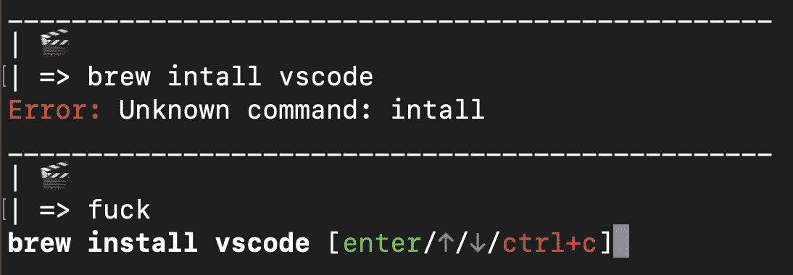

# 为数据科学设置新的 M1 MacBook

> 原文：<https://towardsdatascience.com/new-m1-who-dis-677e085baffd?source=collection_archive---------1----------------------->

## 一个 Python/熊猫的家伙在苹果芯片上开店

形象唤起工艺！

2021 年 4 月，我有幸打开了一台全新的 2020 M1 苹果 MacBook Air。

# TL；博士；医生

如果你希望在你的新 M1 MacBook 上原生运行 Python 库(即没有 Rosetta 2 翻译),省下很多麻烦:[使用 miniforge](https://github.com/conda-forge/miniforge/) 。它就像 miniconda，但默认支持苹果 M1。

# 为什么是麦克？

我会考虑安装 Ubuntu，但我对一些商业化的 mac/win 专用应用程序如 Adobe Lightroom 情有独钟。我考虑过切换到 Windows(并使用 WSL2):这样，我仍然可以拥有我愚蠢的 GUI 应用程序和 Linuxy 开发环境，然后在硬件上挥霍。但是 MacBooks 的工业设计有一点很特别！我喜欢把 MacBook air 放在背包里随身携带的轻松感觉。我已经在 macOS 上扎下了根。

我知道苹果芯片的一些[问题](/top-3-reasons-why-i-sold-my-m1-macbook-pro-as-a-data-scientist-abad1226f52a):新的 arm64 处理器架构对数据科学库兼容性提出了挑战。基本上，这是**太新**——我不习惯有这个问题。尽管如此，新的苹果芯片还是<https://www.youtube.com/watch?v=cAjarAgf0nI&ab_channel=TheDevDoctor>****快，开发者社区正在努力弥合这一差距。****

****它也不是你能以这个价格买到的最强大的笔记本电脑。也就是说，在一个生产 ML 的重担越来越多地在云服务器上执行的世界里，UX 对我来说可能比我本地日常机器上的原始计算能力更重要。我已经掌握了 AWS 的基础知识，并且正在上 Docker、Kubernetes、Terraform 等课程。必要时，我仍然可以在运行 plaidML 的旧 x86 Hackintosh 桌面上运行 shell。****

# ****为什么是新的？****

****我一直在易贝上购买二手的 2016-2018 款 MacBooks(小心翼翼地避免蝴蝶键盘)，以取代我的 2012 款(不再支持最新的 macOS)，但后来我的雇主介入，提出直接给我买一台新的苹果机器，所以我接受了他们的提议。谢谢雇主！我相信，随着时间的推移，与所有流行的数据科学库的完全兼容将会到来，并且这台计算机将比旧计算机运行得更快，寿命更长。****

****所以现在我有了一台闪亮的新 MacBook。由于缺少花哨的管理设置脚本，我按照以下顺序安装了新硬件:****

# ****大苏尔上的前几个按键****

*   ****微风吹过欢迎屏幕:没有 Siri，只有英语****
*   ****隐藏码头。为什么要让 dock 保持可见，尤其是在笔记本电脑上，因为屏幕空间非常宝贵？****
*   ****Dock:切换卡通“精灵”最小化动画到更高级的“比例”****
*   ****连接到我手机的 WiFi 热点，以登录 LastPass****
*   ****从 LastPass 复制我的家庭 wifi 密码(许多随机字符)****
*   ****使用复制的密码从移动热点切换到家庭 WiFi****
*   ****下载 Chrome，使其成为默认浏览器****
*   ****登录 chrome 上的 Google 账户，安装我的各种扩展:LastPass，RegEx search，Privacy Badger，AdBlock，Grammarly，JSONview，Wikiwand，打开当前旁边的标签，等等。****
*   ****将触控板灵敏度设定为最大。****
*   ****操作系统附带的一些应用程序:Garageband、Keynote、iMovie、Pages、Numbers。我更喜欢谷歌的云应用程序作为 MS Office 的替代品，以及用于视频和音频编辑的免费 **DaVinci Resolve** 和 **Reaper** 。****
*   ****关闭大部分 iCloud 的东西。仅保留“查找我的 Mac”和“钥匙串”。我用 dropbox + google 来管理文件、日历、联系人等等****

# ****开发相关设置****

*   ****前往 https://brew.sh/[安装自制软件。虽然这是下载 xcode 工具和诸如此类的东西…](https://brew.sh/)****
*   ****从我的私人 rc GitHub repo: `.zshrc`、`.vimrc`和 iTerm prefs 文件中下拉个人配置文件****
*   ****Brew 完成下载。按照说明[将 brew 二进制文件添加到 PATH](https://stackoverflow.com/questions/35677031/adding-home-brew-to-path) 环境变量中。brew 最新版本中的说明可能与堆栈链接中的不同，但它很好地解释了正在发生的事情。****
*   ****`% brew install awscli`对于云开发的事情。经受`% aws configure`。****

## ****一些更有生活质量的东西****

*   ****`% brew install flycut spectacle` —我不知道没有这些剪贴板历史和屏幕空间管理工具，我将如何完成任何事情。****
*   ****哎呀，奇观没有 [**rosetta**](https://developer.apple.com/documentation/apple-silicon/about-the-rosetta-translation-environment) **就跑不了。我猜这是不可避免的。是时候安装大家最喜欢的新翻译环境了。希望每个人都能很快移植到 arm64 上。******
*   ****打开 FlyCut 粘性挡板。不知道没有这个怎么用 FlyCut。****
*   ****因为我喜欢一眼就能看出我的电脑有多忙:****

********

****通过参数计方便的 CPU 温度和利用率统计****

*   ****`% brew install dropbox`因为云存储是关键****
*   ****`% brew install whatsapp slack android-messages`用于通讯。****
*   ****因为没有音乐我在做什么****

## ****回到开发的事情****

*   ****`% brew install pyenv git-open thefuck`因为我需要能够[管理我的本地 python 版本](https://github.com/pyenv/pyenv)，所以我喜欢能够[从终端](https://github.com/paulirish/git-open)打开 GitHub repo 网页，并且[这个插件](https://github.com/nvbn/thefuck)是一件有趣/令人愉快的事情:****

********

****“thefuck”的常见乐趣。这个木桶实际上叫做 visual studio 代码 btw****

*   ****设置 [vundle](https://github.com/VundleVim/Vundle.vim) ，主要用于 vim 中的航空公司和相关行号。我应该和 vim 一起变好…****
*   ****`% brew install visual-studio-code`因为不，我不只是用 vim****
*   ****同步 vscode 设置并确保扩展准备就绪。我喜欢 Python Docstring 生成器、SonarLint、Vim 模拟器等等****
*   ****因为我需要我的终端文本在每次打开一个新的会话时变大一点。我做了一个额外的 iTerm2 应用程序的副本，选中了“使用 Rosetta 打开”。我可能会更多地利用 iTerm2 的特性。****

# ****麻烦开始了****

*   ****因为这正是我最近一直在用的****

****我的 python 3.8.6 构建失败了，我认为是因为它与新芯片不兼容。现在怎么办？****

*   ****因为我们最终都要拥抱未来。它在苹果芯片上开箱即用。****
*   ****`% pyenv global 3.9.4`因为我说`python`的时候就是想要这个****
*   ****试着在 venv 中安装各种大的令人讨厌的 python 库，比如`opencv`。注意红色错误信息墙。我将回到这一点。****
*   ****尝试从源代码安装 opencv。这是痛苦的，感觉草图，导致绝望当它在第一次尝试时对我不起作用。乐叹。****

****这是我预料中的路障。我知道并不是每个人都已经将他们的 Python 数据科学库移植到苹果 M1 芯片上。我希望避免过多地依赖 Rosetta 翻译器，所以我会坚持尝试从源代码中构建一些东西或找到解决方法。****

*   ****成功[直接从最新的源 repo](https://github.com/numpy/numpy/issues/17807#issuecomment-733863375) 安装 NumPy **。这给了我希望，我可以让事情在 arm64 架构上自然地工作。******
*   ****运行`% pip install scikit-learn`是一个**禁忌**，即使 NumPy 是从源代码构建的。相反，我将尝试使用与安装 NumPy】相同的[方法:克隆 sklearn 的主 git repo，并在本地安装 pip(使用一些标志绕过挑剔的 PEP 标准)。](https://github.com/numpy/numpy/issues/17807#issuecomment-733863375)****
*   ****这不起作用，因为没有安装依赖关系`scipy`。我将尝试以同样的方式安装每个依赖项…这导致了失望之路****
*   ****从源代码构建东西是令人沮丧的。没有递归依赖解析。我是不是就应该洞穴 [**成为康达人**](/new-apple-silicon-m1-macbook-air-the-dream-laptop-for-machine-learning-engineers-a1590fbd170f?gi=c57f36beaf82) ？****

# ****就用 MiniForge****

*   ****我彻底屈服了，跑了`% brew install miniforge`。这就行了。****
*   ****似乎不错。试试`% conda create -n .venv python=3.9.2`。新环境工程。****
*   ****假设我想安装一些晦涩的 Python 包，它们存在于 PyPi 上，但不存在于 conda forge 上。我可以尝试:`% pip install [obscure_library_name]`，看看它在哪个依赖项上失败了，然后递归地运行:`% conda install [dependency]`，直到我可以完全安装我想要的晦涩的库。它并不漂亮，但目前为止还能用。**还是不用 Rosetta！******
*   ****上面的方法对 OpenCV 不起作用，所以我按照这个人的[指南再次尝试从源代码](https://sayak.dev/install-opencv-m1/)构建 OpenCV。这一次，我喝了更多的咖啡因，并愿意按照指示去开球。它非常有效。****

# ****最后****

****这是我在新的 M1 MacBook Air 上开店的理由和过程。****

****起初，我尝试使用 pyenv 以一种非常普通的方式管理 python venvs，但是效果不是很好。****

****我最终只是通过 brew 安装了 MiniForge(类似于 MiniConda ),这对于管理 venvs 很有效。当我们在苹果芯片和开源数据科学(和其他)库之间架起桥梁时，MiniForge 的“强调支持各种 CPU 架构”就派上了用场。****