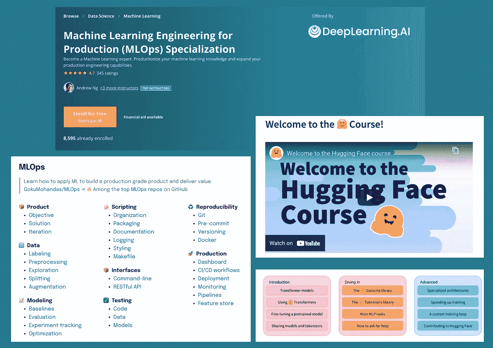

# 面向高级从业者的新机器学习专业

> 原文：<https://towardsdatascience.com/new-machine-learning-specialisations-for-advanced-practitioners-862e1b3d28d?source=collection_archive---------39----------------------->

## 特别关注 MLOps 或 ML 工程

作者图片

今天，你不需要去大学或学院追求机器学习或任何数据驱动领域的职业生涯，但你需要一个计划和一个路线图来指导自己。

一旦你心中有了自己的学习路线图，下一步就是筛选适合你的路线图的课程，然后开始围绕这些课程建立你的基础。

本周，我想分享一些高级专业和课程，它们在我的清单上，可以帮助你寻找正确的课程或正确的职业道路。

所以，给你:

# [吴恩达《生产专业化中的机器学习》](https://www.deeplearning.ai/program/machine-learning-engineering-for-production-mlops/)

关于 ML 工程和 MLOps 等主题的讨论为标准化实践的发展提供了动力，以工具和技术的形式生产 ML 模型。机器学习领域中的这些新颖的工程方法没有被很好地记录和教授。

通过这种专业化，通过该领域的一些先驱，您可以训练自己能够编写生产就绪的、ML 支持的应用程序。该专业声称可以帮助您:

*   设计一个端到端的 ML 生产系统
*   通过收集、清理和验证数据集来构建数据管道。
*   建立模型基线，持续改进生产化的 ML 应用。
*   应用最佳实践和渐进式交付技术来维护和监控持续运行的生产系统。

这是一个为期 5 个月的专业，有 4 门课程针对 ML 工程的每个阶段。

你可以去 [Coursera](https://www.coursera.org/specializations/machine-learning-engineering-for-production-mlops?) 上的个人课程，并对其进行审核，以便免费使用。

Andrew 在为每个人普及机器学习方面做了出色的工作，这种专业化可能也能为 ML 工程做同样的事情。

一旦我完成了这个专业，我会写一篇详细的评论。如果你在我之前完成它，让我知道你如何找到它。

# [从拥抱脸看变形金刚课程🤗](https://huggingface.co/course/chapter1)

对于所有深度学习爱好者，拥抱脸发布了一个关于变形金刚的新课程。这看起来很有希望，因为我真的很喜欢看同一位作者(Sylvian Gugger)写的[程序员实用深度学习。](https://course.fast.ai/)

任何想要深入学习训练 NLP 模型的人都应该去看看这个课程。

课程包括:

*   变压器介绍，微调预训练模型，以及共享模型和记号化器。
*   使用数据集和 tokenizers 库。
*   如何开发专门的架构，加速训练，以及编写定制的训练循环。

令人惊奇的是，这门课程完全免费。按照你自己的步调去做，试着构建一个完整的应用程序，而不仅仅是一个训练有素的模型。

学习的最好方法是在你自己的项目中使用它来解决你自己的问题。

# [由悟空莫汉达斯用 ML 制作的 MLOps 系列](https://madewithml.com/#mlops)

一个月前我发现了小悟空的内容，我对他在 [MLOps](/what-is-mlops-everything-you-must-know-to-get-started-523f2d0b8bd8) 上开发这个课程所付出的努力感到惊讶。实际磨练 MLOps 每个阶段的技能需要大量的工作，因为与模型相比，实际产品中有如此多的活动部件。

他将整个课程分成了许多子领域:

*   产品
*   数据
*   建模
*   脚本
*   API 和接口
*   测试和再现性
*   生产系统

我强烈推荐学习他的课程，这是绝对免费的，作为社区的一部分，你可以与类似的人交流。

**注:**初学者(包括我自己)常犯的一个错误是，他们不停地从一门课程跳到另一门课程，却没有真正完成任何一门课程的交付内容。如果你是在探索，这没问题，但当你把目光投向一门课程时，试着从中建立一些东西，而不是简单地跟着讲课和做填鸭式练习。

# [本周有趣的阅读——一个自己的项目](http://paulgraham.com/own.html)

上周，我读了保罗·格拉厄姆(通常被称为 Ycombinator 的联合创始人)写的一篇名为**一个属于自己的项目**的文章，这篇文章不仅证实了而且强化了我自愿参与项目的想法，即使这只是一份兼职。

一篇关于自愿参与雄心勃勃的项目的重要性的优秀文章。

在完全控制和自愿行动的情况下做自己的项目让你感受到自由，并激发好奇心去更深入地探索。

它教给你的东西比别人让你做的任何工作都要多。

如果您有任何问题、建议或想法，请随时联系我们！

# 和我联系！

如果你喜欢这些内容，可以考虑订阅[我的时事通讯](https://dswharshit.substack.com/)，我会每周向你的收件箱发送说明性教程、职业见解/机会或项目想法。

如果您有任何问题或想法，请随时回复本博客。你可以在 [Twitter](https://twitter.com/tyagi_harshit24) 或 [LinkedIn](https://harshit-tyagi.medium.com/) 上与我联系，了解更多关于工作更新和一些有趣的事情！