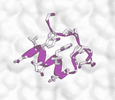
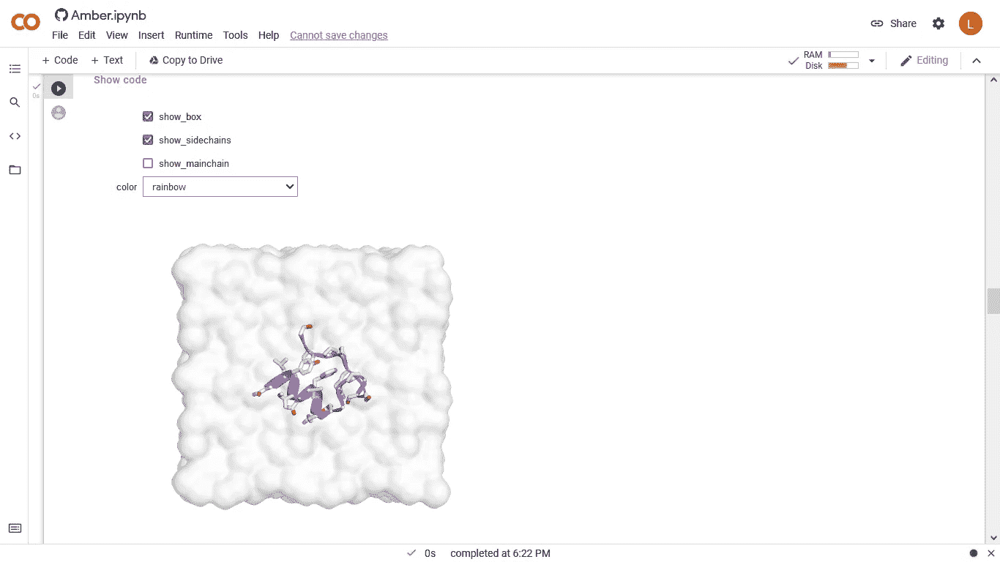
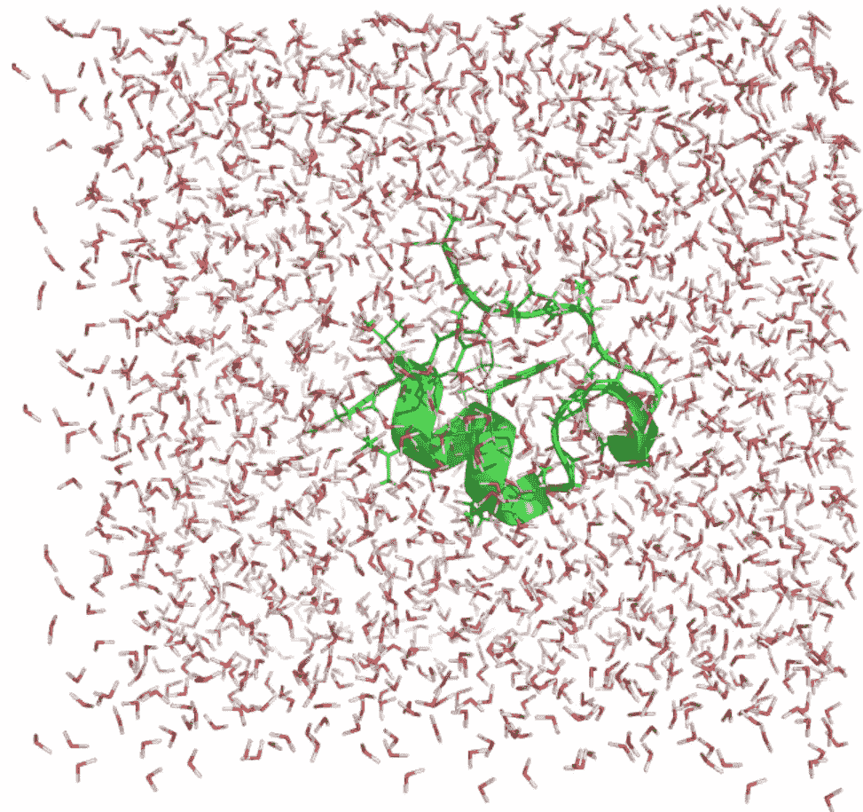
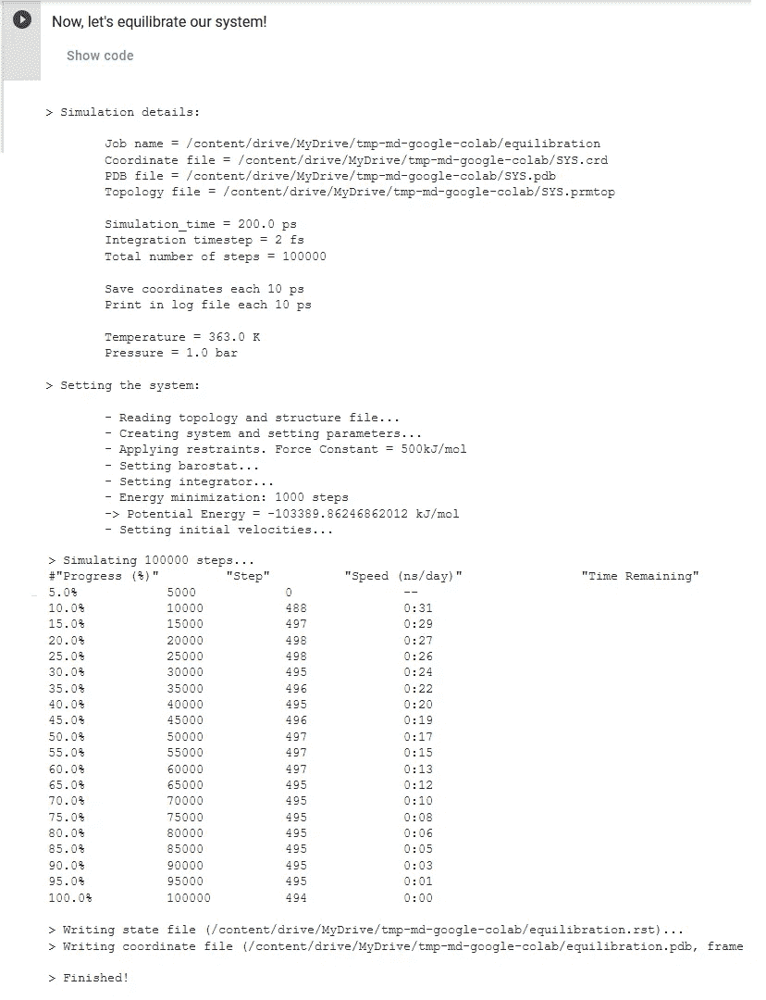
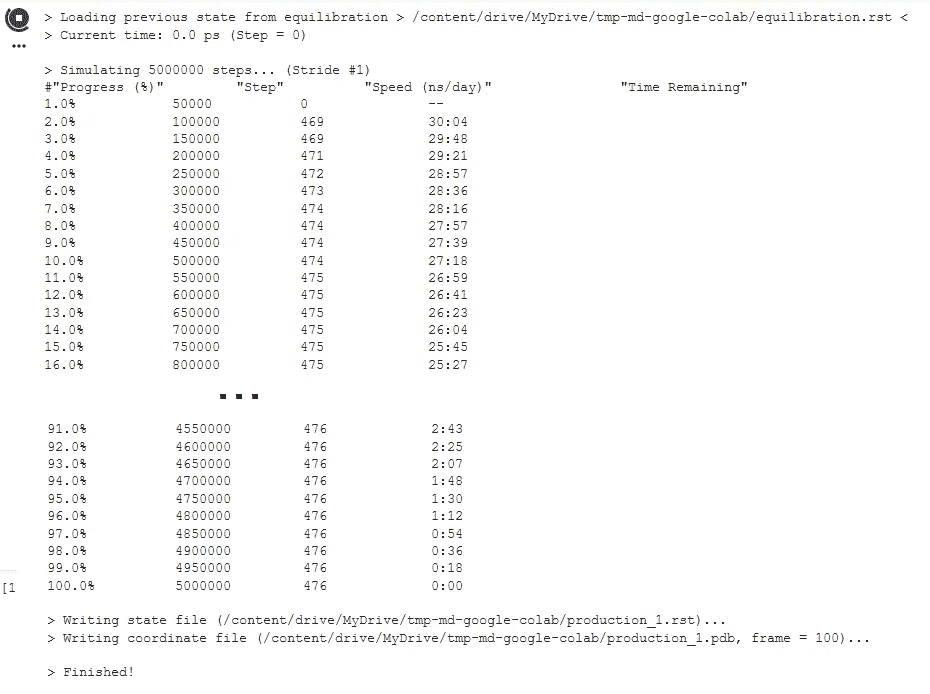
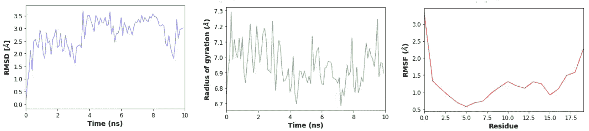
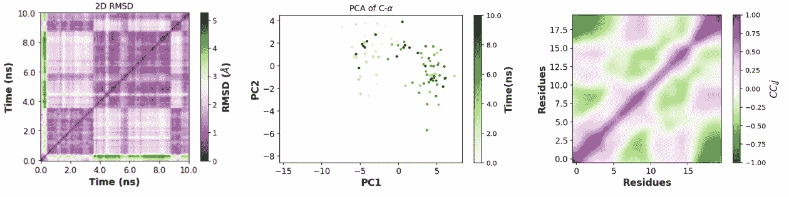

# 新论文描述了谷歌 Colab 笔记本电脑有效地运行蛋白质的分子动力学模拟

> 原文：<https://towardsdatascience.com/new-preprint-describes-google-colab-notebook-to-efficiently-run-molecular-dynamics-simulations-of-9b317f0e428c?source=collection_archive---------12----------------------->

## 继 AlphaFold 在 Google Colab 上取得成功之后，这项新工作将用于分子动力学模拟的 OpenMD 包带到了在线笔记本电脑上，供每个人免费运行非常强大的 GPU。我尝试了一下，并在这里展示了它是如何工作的，讨论了它在教育和研究中的潜在用途。

一种蛋白质在 Google Colab 笔记本中水合并参数化，准备开始分子动力学模拟。图片作者。

你最近肯定听说过在 AlphaFold、CASP 等的背景下“预测蛋白质的结构”。如果不是，但这是你感兴趣的，那么不要错过我在 [TDS](https://medium.com/u/7e12c71dfa81?source=post_page-----9b317f0e428c--------------------------------) : [deep dive 到 AF](/google-colab-notebooks-are-already-running-deepminds-alphafold-v-2-92b4531ec127) 中的三个故事，在 Google Colab 笔记本上运行， [Deepmind 与 EBI](/alphafold-based-databases-and-fully-fledged-easy-to-use-alphafold-interfaces-poised-to-baf865c6d75e) 合作预测所有蛋白质的结构，以及一个[我自己基于最近的学术预印本运行的实际例子](/the-hype-on-alphafold-keeps-growing-with-this-new-preprint-a8c1f21d15c8)。嗯，所有这些关于预测蛋白质结构的事情都属于一个更大的学科领域，这个学科试图用计算机模拟物理、化学和分子生物学。根据科学的确切领域，有些称之为分子建模，有些称之为结构生物信息学，有些称之为计算结构生物学，有些称之为化学信息学，等等。你明白了。我们在这里称之为分子建模，我们将把蛋白质作为研究系统。

我们科学家正在经历的 AlphaFold 宣传中最酷的事情之一与谷歌 Colab 笔记本实现的非常广泛的可访问性有关。你甚至可以在手机上运行蛋白质结构预测，因为计算本身是在谷歌免费提供的在线图形处理器上进行的。正如我在我的故事中讨论的，这极大地民主化了访问，现在很多人都在全职运行这些笔记本，正如 twits 所示。

现在，来自美国加州大学河滨分校的研究人员推出了一套新的谷歌 Colab 笔记本电脑，便于运行另一种对蛋白质分子建模至关重要的关键任务:分子动力学模拟。

*   [**简介**](#a71f)
*   [***造雨*蛋白质分子动力学模拟笔记本**](#bb05)
*   [**动手操作:在水中建立蛋白质系统并参数化**](#d7d2)
*   [**最小化和平衡**](#6252)
*   [**运行 10 ns 的生产 MD**](#4240)
*   [**将制作好的模拟画面可视化在笔记本内**](#401e)
*   [**内置分析**](#db66)
*   [**吞吐量和潜在用例**](#c349)
*   [**链接并读取**](#1f90)

**简介*——如果你已经了解 MD 模拟，继续下一个标题***

分子动力学模拟(简称 MD)是在给定尺度下模拟物质行为的一系列计算方法。与本故事最相关的 MD 模拟类型是，分子系统由所有原子描述，将每个原子视为通过弹簧连接到其他原子的球体，并经历与系统中所有其他原子的各种相互作用。对于蛋白质的模拟，“分子系统”最有可能是被水包围的蛋白质，但它也可以包括其他分子，如核酸、结合蛋白质的药物，甚至生物膜或膜模拟物的碎片。

总结一下整个物理过程本身，在 MD 模拟中，在温度槽和给定压力的振动下，原子的位置随着时间的推移随着[电势(“力场”)](https://www.sciencedirect.com/science/article/pii/S2001037021001628)而演变，该电势确定所有可能的相互作用的强度和平衡位置。原子位置的这种演变产生了一种叫做轨迹的电影，它有望代表分子系统能够经历的真实运动。

分子运动的轨迹或电影建立得非常慢，因为在每个时间点，程序需要计算所有原子上的力，然后随着时间传播这些力，但是由于一些力相当强，因此运动积分的时间间隔(“时间步长”)非常非常小。举一些数字来说，时间步长通常在 1-2 飞秒(1E-15s)的数量级，但我们感兴趣的是纳秒、微秒甚至毫秒时间尺度内发生的运动。这意味着我们需要整合这些步骤(即计算力并相应地传播原子的位置)数百万到数十亿次。

你可以想象，随着这些年来更强大的处理器的出现，MD 模拟运行得越来越快，然而今天具有全原子描述的正常 MD 模拟最多达到 10-100 微秒左右。大约 10 年来，GPU 提供了用于运行这些 MD 模拟的大部分计算机能力。尽管运行它们并不是非常困难，至少在研究环境中不是如此，但来自加州的这组研究人员开发了一个 Colab 笔记本电脑，在谷歌的 GPU 上运行 MD 模拟，这是一件好事，因为在许多不发达国家，一个 GPU 可以相当于几个月的博士工资。甚至对于富裕国家来说，在 Google Colab 笔记本中运行 MD 模拟的可能性使这一重要工具在教育层面上变得容易使用。

**用于蛋白质分子动力学模拟的*造雨*笔记本**

在 moto *为大家准备的基于云的分子模拟*下，软件*造雨*(这里有，不知道为什么取这个名字)包括三个笔记本:

*   AMBER:用(目前)两个可用的 AMBER 力场之一来参数化一个分子系统，并运行它的 MD 模拟。
*   CHARMM:用 CHARMM-GUI 的 solution builder(本身就是一个极好的工具)参数化一个分子系统，然后运行它的 MD 模拟。
*   AlphaFold2+MD:使用 MMseqs2 运行 alpha fold 2([见本故事](/the-hype-on-alphafold-keeps-growing-with-this-new-preprint-a8c1f21d15c8))并立即用 AMBER 参数化并运行 MD 模拟。

一份关于*造雨* ( [同行评审论文此处](https://pubs.acs.org/doi/abs/10.1021/acs.jcim.1c00998))的[预印本解释说，该软件背后的两个关键动机是，通过在课程中使用这种方便、简单、廉价的现代技术，为学生提供一种了解更多蛋白质的方法，以及使低收入研究能够进行接近当前标准要求的分子动力学模拟。根据我所做的测试，我认为他们已经很好地完成了他们的主要目标，至少对于小型系统来说是这样。在接下来的部分中，我将指导您完成我所做的测试。](https://zenodo.org/record/5196783#.YRqNNn6xXIU)

但在此之前，关于这些笔记本的一些细节(参见[预印本](https://zenodo.org/record/5196783#.YRqNNn6xXIU)-现在的[论文](https://pubs.acs.org/doi/abs/10.1021/acs.jcim.1c00998) -和 [github](https://github.com/pablo-arantes/Making-it-rain/tree/v1.01) 页面了解所有细节):

*   首先，分子动力学模拟使用 OpenMM 软件进行分子模拟，该软件在社区中已经很成熟。
*   第二，笔记本包括常规 MD 模拟的所有常规任务的步骤，从开始时最小化势能，到将系统平衡到所需温度，然后运行实际的所谓“生产”模拟。
*   第三，笔记本将输出轨迹、日志文件和重启文件写入用户的 Google Drive。当然，这有助于方便地存储文件，直到它们被下载，但这样做的主要优点是，它允许用户在谷歌提供的 12 或 24 小时连续运行时间到期后重新启动模拟。没有这一点，生产模拟将非常局限于他们的第一部分。但是，通过使用重启文件，用户可以创建长轨迹，就像他们在任何常规 HPC 系统中所做的那样，这些系统也有时间限制。
*   第四，笔记本包括创建的系统和产生的轨迹的浏览器内可视化。我从下面的实际测试中向你展示了这一点。
*   最后，笔记本电脑包括一套非常丰富的分析，用户可以在下载数据进行更多的特别测量之前对轨迹进行分析。在我动手操作的例子快结束时，我向你们展示了其中的一些分析。

**动手操作:在水中建立蛋白质系统并将其参数化**

我想尝试一种小蛋白，以适应几个小时内的大量生产。我可能会用更大的蛋白质，因为它跑得比预期的要快！

我使用了 PDB 1L2Y，这是一种色氨酸笼小蛋白的实验确定的结构。利用琥珀笔记本，我建立了一个系统，将蛋白质嵌入到一个足够大的水分子盒中，然后用 ff19 力场参数化蛋白质，用 OPC 力场参数化水分子(要了解更多力场的艺术状态，请参见我今年发表的这篇[开放访问论文](https://www.sciencedirect.com/science/article/pii/S2001037021001628))。

准备就绪后，笔记本会向您显示准备就绪的系统:

将蛋白质 1L2Y 置于水箱中并用 AMBER19 力场参数化的造雨笔记本，准备开始模拟。作者截图。

请注意，在上图中，水分子没有单独显示，而是显示为一个便于可视化的斑点。请记住，每个水分子实际上是用它的所有原子来描述的，所以有成千上万个原子。你可以在 SYS.pdb 中看到这个，我在这里下载并在 pymol 中打开了它:

启动系统，下载到我的电脑上，用 pymol 可视化。作者截图。

**最小化和平衡**

运行 MD 模拟之前的一个关键阶段是消除来自结构和/或力场缺陷的任何能量。这叫做最小化，由笔记本直接处理。

在最小化之后，系统必须缓慢地平衡到将进行模拟的温度。这叫做平衡。

笔记本在一个模块中进行最小化和平衡。我让程序把系统温度调到 363 K，也就是 90 摄氏度左右；这是相当高的，但我想促进议案，即使不是很现实。在这个例子中，最小化+平衡的这个阶段花费了大约 10 分钟；在我看来，这太苛刻了，对于更大的蛋白质来说肯定也太苛刻了；但是用户可以在运行模块之前修改所有这些参数。

最小化加平衡程序的日志文件，该程序花费了大约 10 分钟，并带有一个用于演示目的的快速协议。作者图。

**运行 10 ns 的生产模拟**

一旦系统达到平衡，就可以开始生产模拟。这里我要求笔记本只运行 10 纳秒，即 2 fs 的 500 万时间步长。我告诉它每 50000 步记录一次数据，这导致我的轨迹有 100 帧。

笔记本显示模拟运行时的主日志，直到模拟结束(或分配的时间到期，在这种情况下，您必须重新连接并从最后一组重新启动文件重新启动):

我在 Colab 笔记本上运行的 10 ns 长的模拟花了大约 30 分钟才完成。每天约 475 ns 的通量非常符合小蛋白的当前标准，因为 10 微秒的模拟需要 21 天才能完成，即 42 x 12 小时的跨度。作者图。

**在笔记本电脑内可视化生成的模拟结果**

现在是有趣的部分。*造雨*的笔记本整合了 [3dmol](https://3dmol.csb.pitt.edu/) ，一个直接在浏览器中运行的分子图形插件。只需点击一下，你就可以将轨迹加载到 3dmol 中，然后像播放电影一样播放。在高温下，色氨酸笼试图打开:

检查这个视频，看看模拟产生了什么:一个 MD“轨迹”，这是一种基于现实物理学的电影，由选定的力场建模，蛋白质可能经历的运动。请注意，这一模拟只有 10 ns 长，仅用于演示目的，而对于这种大小的蛋白质，当前标准的范围是 5 到 10 微秒。作者制作的视频。

**内置分析**

继续有趣的部分，正如我所料，笔记本带来了一套内置的分析，一些非常基本(但对初始分析非常有用)，如这些图，测量随着时间的推移与初始结构和回转半径的偏差，或残差波动:

线性类型的分析:起始结构的 RMSD 对时间(左，由于高温快速增加)，回转半径对时间(中间，注意尽管 RMSD 增加，蛋白质仍然保持紧密)，RMSF 对蛋白质残基(右，注意末端增加了灵活性，而核心仍然保持非常紧密)。请注意，这些图是在 10 ns 长的轨迹上，仅用于演示目的，但是这个模拟长度对于当前标准来说太短了，对于这个大小的蛋白质，在几天的模拟之后，当前标准为大约 5-10 微秒。作者创作的图形。

然后还包括一些更复杂的分析。一种是跟踪轨迹的所有帧之间的 RMSD，这有助于识别可能相互转换的不同状态。第二，对齐轨迹的前两个主要部分，这提供了一种方式来查看运动如何耦合到结构的更大规模的变化中。第三，原子波动的交叉相关性，用于识别机械偶联的蛋白质区域:

2D 类型的分析:每一帧和所有其他帧之间的 RMSD(左)，主成分投影(中心，其中每个点是轨迹的一帧)，以及原子波动的交叉相关(右，其中绿色点表示以反相关方式移动的残基，品红色点表示以相关方式移动的残基)。请注意，这些图位于 10 ns 长的轨迹上，仅用于演示目的，但对于当前标准来说，该模拟长度太短，对于这种大小的蛋白质，经过几天的模拟后，其长度约为 5-10 微秒。作者创作的图形。

**吞吐量和潜在用例**

这个系统很小，只有 11000 个原子，因为我研究的蛋白质很小。它每天运行大约 475 ns，这与您在私有 GPU 上所能获得的一致。如果您想模拟这个系统总共 10 微秒，您将需要 21 天来完成，这意味着 42 x 12 小时长的作业。这完全符合当前的标准和生产能力。

对于更大的系统，笔记本的一个缺点是不能并行运行多个 GPU。小型系统无法从并行化中获益，但大型系统可以。确切的限制取决于代码和架构。从这些结果中，我可以猜测，在 20 到 50，000 个原子之间，运行将是正常的，并且在笔记本电脑之外的单个 GPU 上也是有效的。但是很有可能，大于 10 万个原子的系统，也可能是范围从 5 万到 10 万个原子的系统，将遭受这个问题；也就是说，它们可以在笔记本电脑之外运行，使用 2 个、4 个或更多的 GPU 来提高速度，但这在笔记本电脑上是不可能的。

总之，我想象了一个完全可行的场景，资金有限的实验室成员可以在小型系统上运行高效的 MD 模拟，每个人都使用自己的 Google 帐户。对于更大的系统，在将计算提交给本地 GPU 或 HPC 资源之前，笔记本电脑可能仍然足以实现平衡和短期测试。

同样重要的是要记住*造雨*的笔记本也作为概念证明，表明 MD 模拟在云中是可能的。这些笔记本完全有可能发展成更先进的版本，例如支持先进的采样方法，允许更快地探索分子运动。

最后，对于学习 MD 模拟的学生来说，这些笔记本是极好的。我记得 20 年前，为了运行一个模拟程序，我饱受 Linux 命令和糟糕界面的折磨。笔记本电脑提供了简单性，但在完全控制的情况下，不会损害学习的潜力，因为所有的代码和脚本都是可见的，甚至可以修改。

总之，我当然希望作者继续开发*造雨*。它有潜力成为真正的教育工具，至少在某些研究领域是如此。

**链接和阅读**

*造雨:基于云的每个人的分子模拟*，[https://zenodo.org/record/5196783#.YRqNNn6xXIU](https://zenodo.org/record/5196783#.YRqNNn6xXIU)

被接受的造雨论文:[https://pubs.acs.org/doi/abs/10.1021/acs.jcim.1c00998](https://pubs.acs.org/doi/abs/10.1021/acs.jcim.1c00998)

关联的 Google Colab 笔记本:[https://Colab . research . Google . com/github/pablo-arantes/Making-it-rain/blob/main/](https://colab.research.google.com/github/pablo-arantes/Making-it-rain/blob/main/)

为了了解更多关于分子动力学模拟的知识，我向你推荐这个故事以及媒体用户 Ankit Agrawal 的其他故事。这里还有一个更广泛的介绍。用户[卡梅隆·麦克尔弗雷什](https://medium.com/u/3fcfd41954b0?source=post_page-----9b317f0e428c--------------------------------)也有一些很棒的笔记。

要了解 AlphaFold2 的更多信息，请查看[这个故事](/google-colab-notebooks-are-already-running-deepminds-alphafold-v-2-92b4531ec127)，然后是[这个故事](/alphafold-based-databases-and-fully-fledged-easy-to-use-alphafold-interfaces-poised-to-baf865c6d75e)和[这个故事](/the-hype-on-alphafold-keeps-growing-with-this-new-preprint-a8c1f21d15c8)，每一个故事都涵盖了它的不同方面。

喜欢这篇文章，想给我提示？[[**Paypal**](https://www.paypal.me/LAbriata)]-谢谢！

我是一个自然、科学、技术、编程和 DIY 爱好者。生物技术专家和化学家，在潮湿的实验室和计算机里。我写我广泛兴趣范围内的一切。查看我的 [*列表*](https://lucianosphere.medium.com/lists) *了解更多故事。* [*成为媒介会员*](https://lucianosphere.medium.com/membership) *访问我和其他作家的所有故事，* [*订阅通过邮件获取我的新故事*](https://lucianosphere.medium.com/subscribe) *(平台原创附属链接)。*