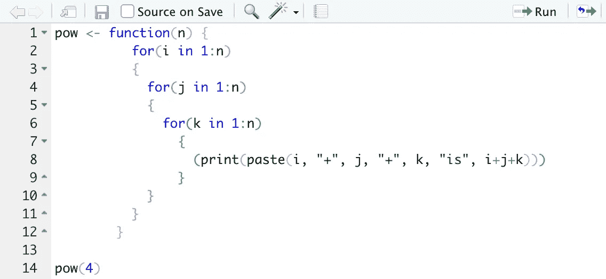
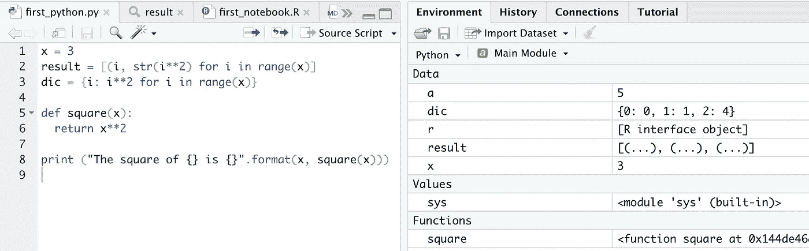
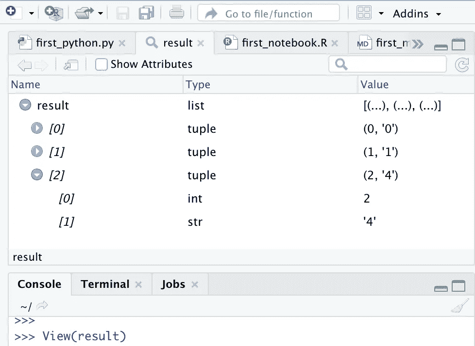
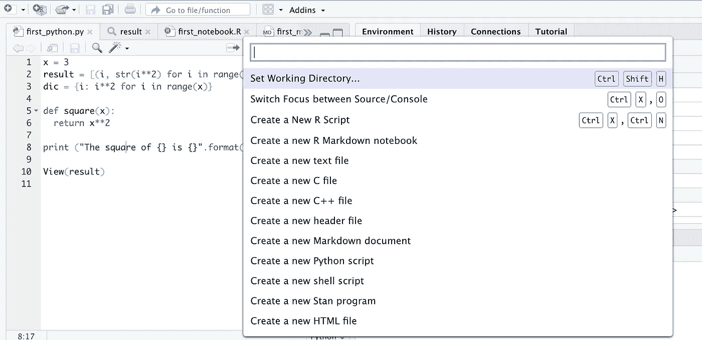
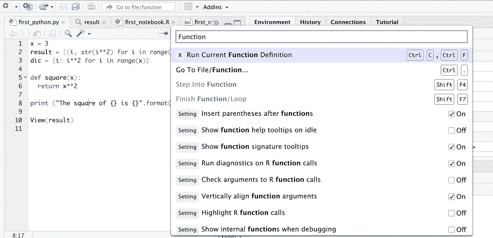
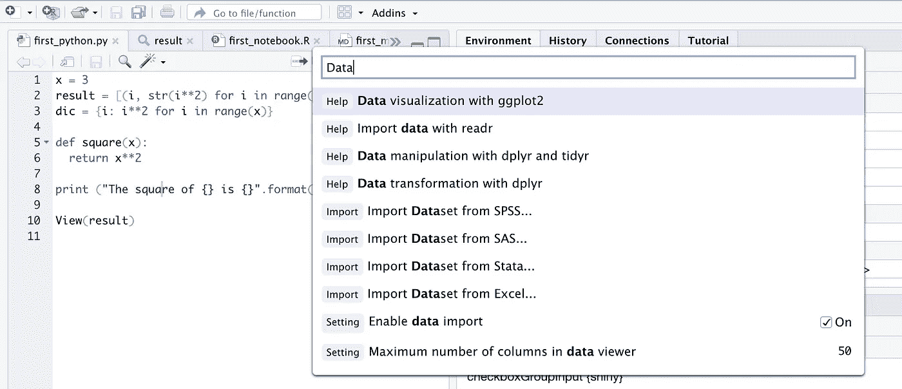
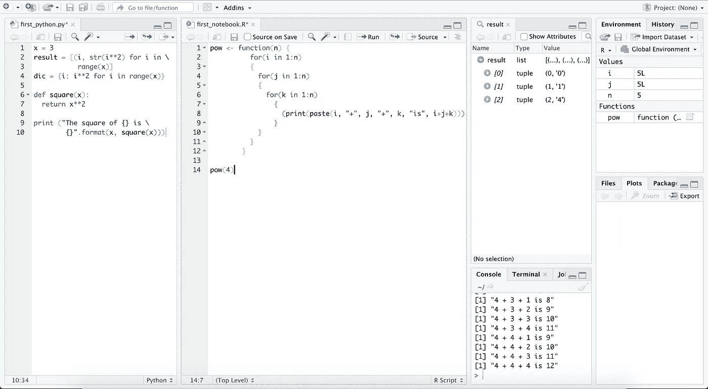
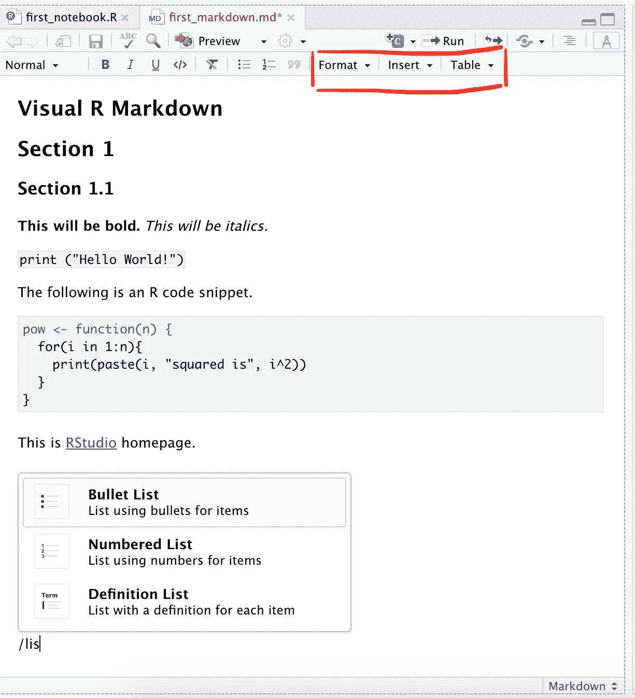

# RStudio 的新版本

> 原文：<https://towardsdatascience.com/new-release-of-rstudio-de999fc7559c?source=collection_archive---------12----------------------->

布鲁斯·马斯在 [Unsplash](https://unsplash.com?utm_source=medium&utm_medium=referral) 上的照片

## 概述 *RStudio* 1.4 最有趣的特性

R 编程使用最广泛的 IDE R studio 刚刚变得更好。你应该现在更新它。

本周为 R 用户带来了一个好消息——R studio*预览版发布了* a **major，新版本 1.4** 。从 1.2 版本开始，RStudio 就以一种花的名字来命名它的版本。**1.4 版本叫“蜡海棠。”**它带来了一些非常酷的特性，比如**代码可读性、文档编写和 Python 对象的集成**。

## 装置

*   **新用户:**你可以在这里下载一个免费的 RStudio 桌面版[用于 Windows、macOS 和几个 Linux 发行版。](https://rstudio.com/products/rstudio/download/)
*   **现有用户:**启动 RStudio，导航到顶部的“帮助”菜单，然后“检查更新”您需要重新启动 RStudio。

> 让我们来看看一些亮点功能。

托德·克雷文在 [Unsplash](https://unsplash.com?utm_source=medium&utm_medium=referral) 上拍摄的照片

# 1)彩虹括号

通常在编写大块代码时，您会忘记嵌套的括号。有时，当您的代码有十对括号，并且您得到一个“不匹配的括号”错误，您经常求助于多个缩进来调试您的代码。RStudio 最后介绍了**“彩虹括号。”就代码可读性增强而言，我认为这是这个版本中最好的特性。**

现在，**匹配对将以相同的颜色**突出显示，如下图所示。随着您添加更多括号，**括号甚至会动态改变颜色**。[该](https://blog.rstudio.com/2020/11/04/rstudio-1-4-preview-rainbow-parentheses/)页面显示了如何激活该功能。

显示 RStudio 1.4 的彩虹括号选项的示例代码

如果你讨厌彩虹，对默认的配色方案不满意，你可以按照[这篇](https://rstudio.github.io/rstudio-extensions/rstudio-theme-creation.html)文章来创建你的自定义主题。

照片由[大卫·克洛德](https://unsplash.com/@davidclode?utm_source=medium&utm_medium=referral)在 [Unsplash](https://unsplash.com?utm_source=medium&utm_medium=referral) 上拍摄

# 2)改进的 Python 集成

数据科学领域主要分为 Python 和 R，前者是多元化的领导者。我有 Python 背景，喜欢 Jupyter。我花了相当长的时间来熟悉 R 数据帧的分析和可视化。我也嫉妒 RStudio 查看数据帧的便捷性(可以方便地排序和过滤)。

## RStudio 1.4 为 Python 支持引入了几个新增功能:

## I)选择 Python 解释器

现在，您可以从系统上安装的解释器中选择默认的 Python 解释器来编译在 RStudio 中编写的 Python 代码。然而，关于如何做到这一点的文档并不充分。我遇到了这个问题。

## ii)环境窗格中的 Python 支持

与 R 类似，环境窗格现在可以显示 Python 变量、对象和函数的内容。下面，你可以看到显示变量内容的环境窗格(常量、列表、字典等。)、python 模块和用户定义的函数(如“square”)。

显示 RStudio 1.4 中 Python 对象的环境窗格。

## iii)查看 Python 对象(也包括熊猫数据帧)

在 R 中，你可以查看对象(列表、向量、数据帧等。)使用`View(object)`。同样，现在**也可以查看 Python 对象**。愿意使用 RStudio 进行数据分析/科学研究的 Python 用户可以欣喜地发现，他们现在还可以在 RStudio 中可视化熊猫数据帧。下图显示了`View(result)`的输出，其中“**结果”**是上面创建的列表。还显示了变量的数据类型(tuple、list、int、str 等。).

在 RStudio 1.4 中查看 Python 对象。

## iv)渲染 Matplotlib 和 Seaborn 图

> 对于像我这样的顽固分子来说，这是个好消息。

您现在可以在 RStudio 中可视化 Matplotlib 生成的绘图(目前仅支持非交互式绘图)。人们还可以**可视化 Seaborn 生成的图** *(Seaborn 是一个数据可视化库，它在 Matplotlib 之上提供了一个 API)。*

不幸的是，由于这个问题，我暂时无法在 RStudio 中加载这些模块。你可以在这里查看样本代码和图[。](https://blog.rstudio.com/2020/10/07/rstudio-v1-4-preview-python-support/)

[斯蒂夫·约翰森](https://unsplash.com/@steve_j?utm_source=medium&utm_medium=referral)在 [Unsplash](https://unsplash.com?utm_source=medium&utm_medium=referral) 上拍照

# 3)新的命令面板

引入了一个名为 [**命令面板**](https://blog.rstudio.com/2020/10/14/rstudio-v1-4-preview-command-palette/) 的新功能，旨在**快速改进命令、选项、帮助、设置、**等的键盘可访问性**。**

它的名字来源于一位艺术家基于其多用途性质的调色板。可以使用组合键 **ctrl + shift + P** 弹出。默认选项如下图所示。您可以看到它们主要与创建新的空白文件有关。

## 如何在默认结果之外进行搜索？

您可以键入查询(由空格分隔的一个或多个单词)。假设你需要函数方面的帮助。下面显示了您在键入“Function”作为搜索关键字时得到的选项。几个“设置”弹出，你可以切换“开”或“关”这是一个非常方便的功能，不需要通过工具或菜单选项毫无头绪地搜索。

在命令调板中搜索关键字“函数”的结果。

下图显示了搜索关键字“数据”的结果被标记为“帮助”的搜索结果会在浏览器中被点击打开，带你到相应的帮助页面(大部分是 pdf 格式)。

在命令调板中搜索关键字“数据”的结果。

照片由[埃里克·普劳泽](https://unsplash.com/@eprouzet?utm_source=medium&utm_medium=referral)在 [Unsplash](https://unsplash.com?utm_source=medium&utm_medium=referral) 上拍摄

# IDE 工作台中的多个源列

Terminal 和 iTerm2 用户可能已经使用了在单独的窗口中垂直分割工作区的特性。它避免了不断切换标签，允许比较几个相邻的文件，代码，数据等。

现在，RStudio 允许您类似地[配置您的工作区](https://blog.rstudio.com/2020/10/21/rstudio-1-4-preview-multiple-source-columns/)窗口，最多有**三个额外的源列**(您可以在那里打开脚本)。**在比较两个或多个代码或引用另一个代码时，它非常有用。**下面我展示了 RStudio 工作区在添加了**两个额外的列后的样子。**

**注意:**您将**只有一个控制台**，它将显示您选择(在里面单击)并执行的列的输出。所选列(包含下图中的`first_notebook.R`)用一条细的蓝色虚线突出显示。图像中的原始列包含“结果”窗口。任何额外的列都可以通过关闭其中的所有文件标签来关闭。

RStudio 工作区有两个额外的列，分别包含 Python 和 R 脚本。

图片由 [Taras Shypka](https://unsplash.com/@bugsster?utm_source=medium&utm_medium=referral) 在 [Unsplash](https://unsplash.com?utm_source=medium&utm_medium=referral) 上拍摄

# 5)新的可视化降价编辑模式

这是一个巨大的特点，应该有一个专门的职位。对于在 RStudio 工作区中创建格式良好的文档和文章来说，它非常方便。新的编辑模式引入了几个新功能，包括:

*   **实时拼写检查**
*   **插入表格、超链接、代码块、**等。**文档中的**
*   **引用/参考支持**来自 Zotero、Crossref、PubMed、enabled-search 使用 DOI、titles 等多个书目源。
*   能够编写 **LaTeX 方程式**、脚注、LaTeX 式**交叉引用**到图、方程式、节、小节等。在减价文件中

点击查看全新视觉降价[的全面亮点。](https://rstudio.github.io/visual-markdown-editing/#/)

在 RStudio 1.4 的 markdown 编辑器中准备的示例文档。

# 结论

RStudio 版是预览版。对于院士和其他经常准备科学和技术报告的人来说，新的可视化 markdown 编辑模式是一个福音。Matplotlib 和 Seaborn 的集成提高了数据可视化能力，这为主要使用 Python 进行数据可视化的数据分析师增加了 RStudio 流形的有用性。这个版本可能会吸引许多像我一样经常从事数据分析和建模工作的 Python 爱好者。发布说明的完整列表可从[这里](https://rstudio.com/products/rstudio/release-notes/)获得。