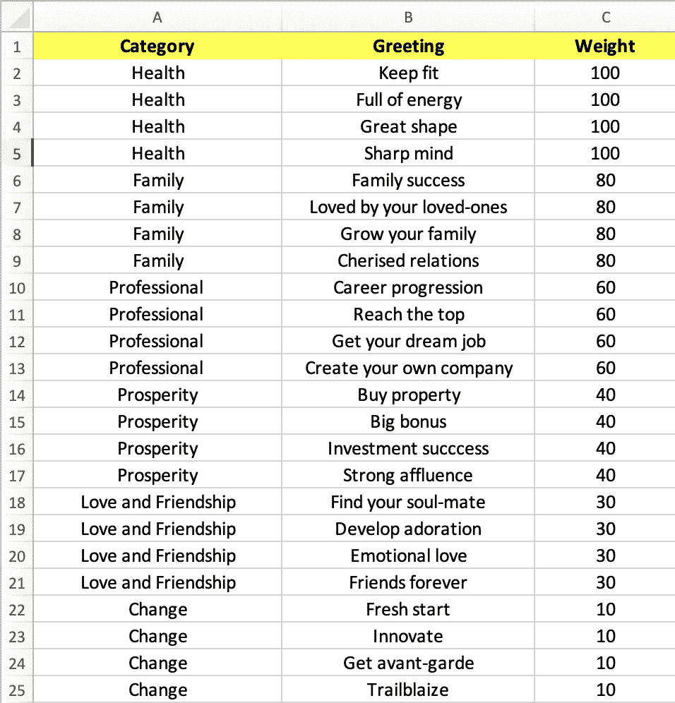
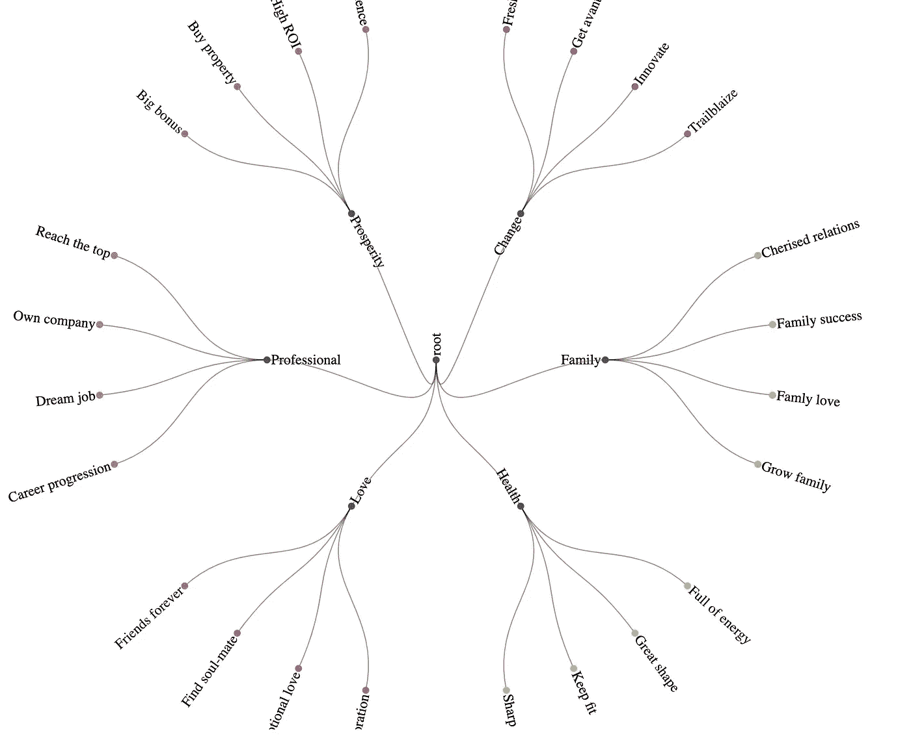
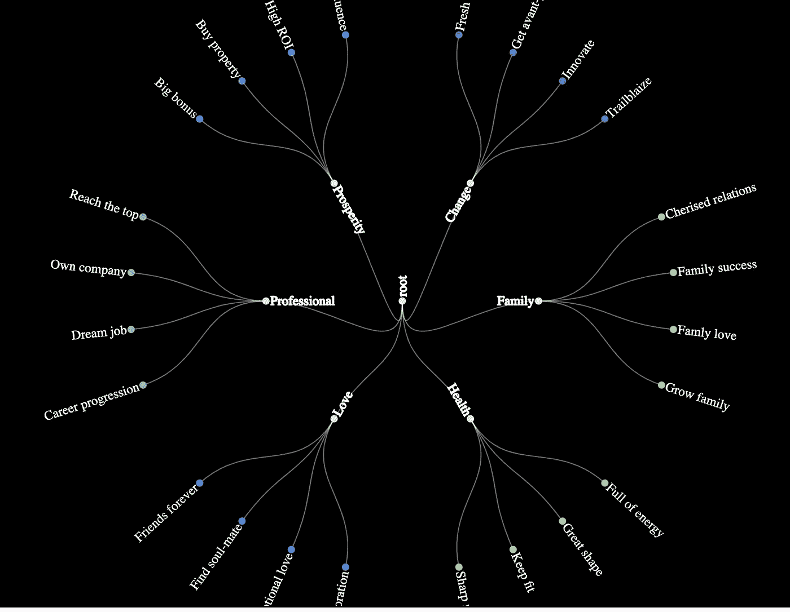
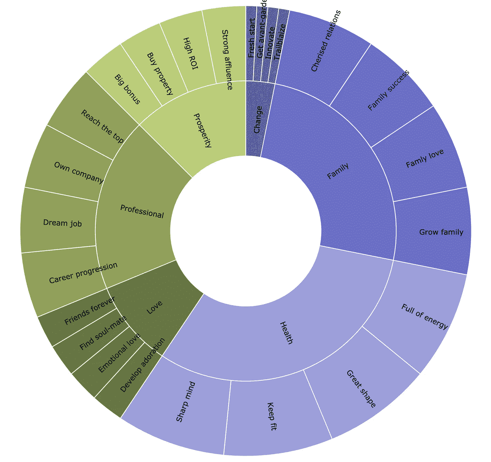
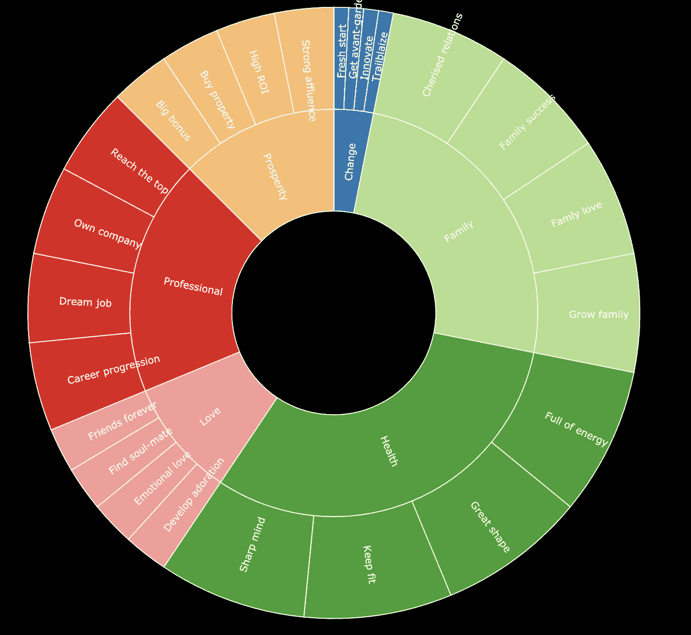
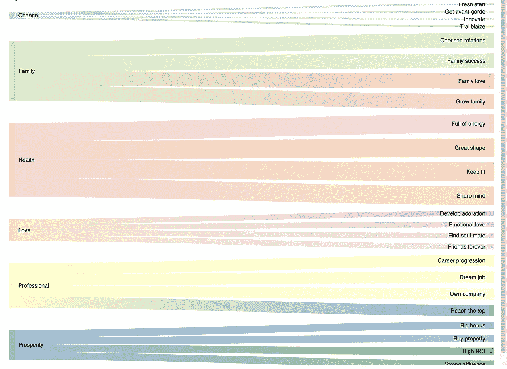

# 使用数据可视化的新年祝福

> 原文：<https://towardsdatascience.com/new-year-greetings-using-data-visualization-b0e25f2cb143?source=collection_archive---------41----------------------->

## 从 1 月 1 日开始变得兴奋

这篇文章是我给你的新年祝福。我有更简单的选择，用简单的短信和漂亮的话语祝你新年快乐，或者复制粘贴新年祝福图片。

然而，我想带着乐观和愉快的心情开始新的一年。所以这就是我是怎么走过来的

# 收集与新年愿望相关的数据

首先，我搜索了所有与新年愿望相关的关键词。我想出了这里显示的列表。

问候数据-作者图片

它的组织如下

*   第一列是类别列，例如健康、家庭、专业、繁荣等。
*   第二列包含相关类别中的问候语
*   第三列是对应于每个问候的重要性的权重。这纯粹是主观的，但这是我观察到的总体趋势

现在，这里是我使用分析和一些惊人的数据可视化的问候。

# 使用辐射状树形图问候

让我们从辐射状树形图开始。这种类型的可视化的主要优点是它在形状上是放射状或圆形的。这允许压缩可视化中的大量信息。如你所见，我们的数据有大约 50 条文本。径向树将以圆形或放射状的方式很好地显示所有文本。

因此，这里是我对你的问候使用径向树可视化。所有的问候都安排得很好。看起来比标准的问候更好。

使用径向树的问候—作者图片

这看起来很棒，但我想让它更上一层楼。所以这是我的一个黑暗主题的问候。而且看起来优雅多了！！！

黑暗主题中使用辐射状树的问候——作者图片

太酷了。但是我意识到我没有使用体重栏中的数据。让我用一张旭日图来说明。

# 使用旭日图问候

当您想要利用圆形布局来显示大量文本，以及表示文本的重量或重要性时，旭日视觉效果非常有用

这是我用旭日可视化表达的问候。正如你所看到的，所有的问候都安排得很好，每个部分的厚度(也称为 burst)都与权重列相对应。所以健康的厚度或重要性最大，变化的厚度最小。当然，正如我刚才所说，这取决于每个人，但这是大势所趋。

使用旭日图问候—图片作者

正如我喜欢黑暗的主题，这里是旭日也在黑暗的主题。

黑暗主题中使用旭日图的问候—作者图片

直到现在都很好。我觉得我真的是真心祝福你。但是后来我意识到如果你不是垂直布局的粉丝会怎么样。所以这里是我的尝试，希望你在一个水平的可视化使用桑基图

# 使用桑基图问候

通常，桑基图用于表示流程。但是，如果您在数据中看到任何流动，您可以创新地使用它。在问候的数据中，你可以想到类别和问候之间的流程

这是我用桑基图表表达的问候。正如你将看到的，你不需要转动你的头来阅读它

使用桑基图问候—作者图片

所以，我的朋友们，这就是我以一篇文章的形式表达的问候。可视化有助于将大约 50 个单词的问候信息打包成好看的图像。如果没有这些视觉化的东西，就不可能用一种漂亮简洁的方式传达如此多的问候。

我认为我们带着乐观和愉快的心情开始了新的一年

# 额外资源

# 网站(全球资讯网的主机站)

你可以访问我的网站进行零编码分析。[https://experiencedatascience.com](https://experiencedatascience.com)

请**订阅**每当我发布一个新的故事时，请及时通知我。

<https://pranay-dave9.medium.com/subscribe>  

你也可以通过我的推荐链接加入 Medium。

<https://pranay-dave9.medium.com/membership>  

https://www.youtube.com/c/DataScienceDemonstrated 的 YouTube 频道
这里是我的 Youtube 频道
[的链接](https://www.youtube.com/c/DataScienceDemonstrated)