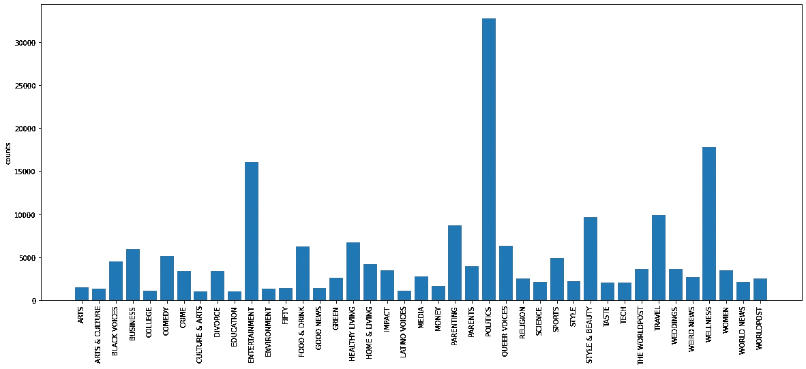
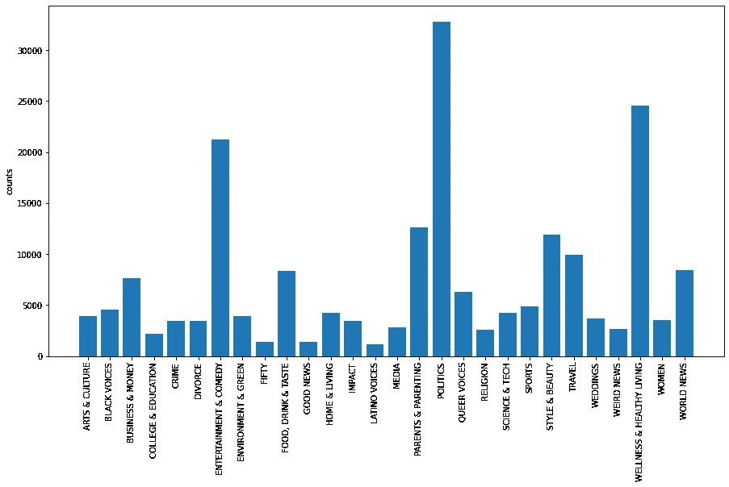
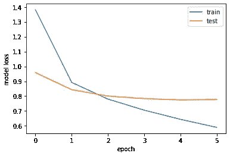
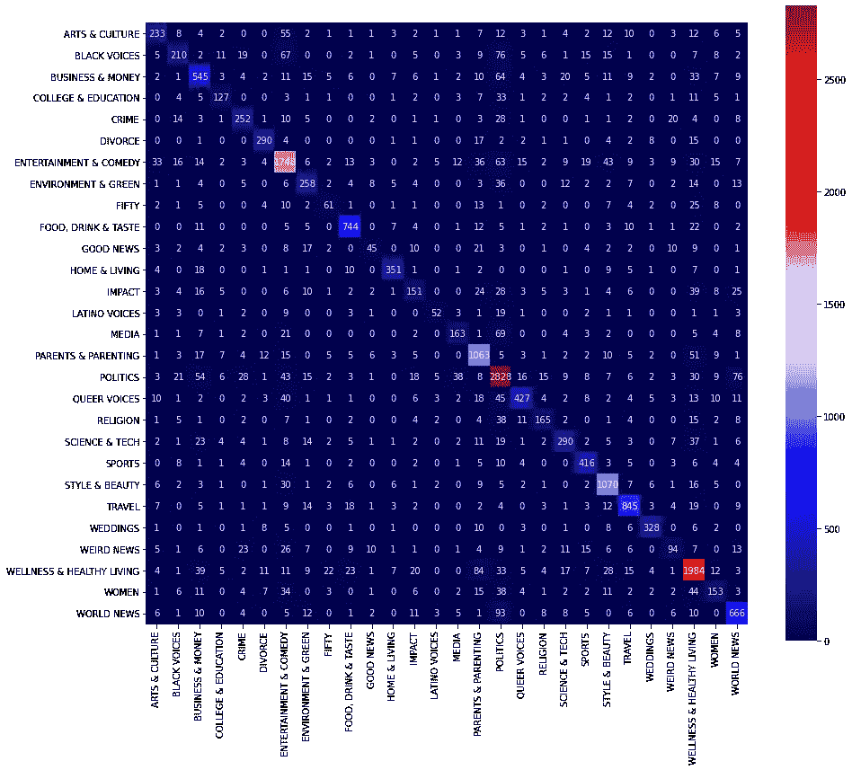

# 新闻分类:用 TensorFlow 在 TPUs 上微调 RoBERTa

> 原文：<https://towardsdatascience.com/news-category-classification-fine-tuning-roberta-on-tpus-with-tensorflow-f057c37b093?source=collection_archive---------6----------------------->

## 使用拥抱脸变形器的多类文本分类教程。


[绝对视觉](https://unsplash.com/@freegraphictoday?utm_source=medium&utm_medium=referral)在 [Unsplash](https://unsplash.com?utm_source=medium&utm_medium=referral) 上拍摄的照片

在下游任务上微调大型预训练模型是自然语言处理中的常见做法。在本教程中，我们将使用预训练的 RoBERTa 模型来完成多类分类任务。

[RoBERTa:由脸书 AI 开发的稳健优化的 BERT 预训练方法](https://arxiv.org/abs/1907.11692)，通过修改关键超参数和在更大的语料库上进行预训练，对流行的 BERT 模型进行了改进。与普通的 BERT 相比，这提高了性能。

Hugging Face 的 [transformers](https://huggingface.co/transformers) 库允许使用几行代码轻松部署各种 NLP 任务的预训练模型。有各种各样的 Auto Model 类，它们包装了预先训练好的模型，自动实现了常见下游任务所需的必要架构更改。此外，这些模型可以被转换为 Keras 模型，从而可以通过 Keras API 进行简单的训练。

在本教程中，我们将对托管在 Kaggle 上的[新闻类别数据集](https://www.kaggle.com/rmisra/news-category-dataset)上的 RoBERTa 进行微调，根据它们的标题和简短描述来预测新闻的类别。该数据集包含从 2012 年到 2018 年获得的 20 万条新闻标题。

以下公开 [Colab 笔记本](https://colab.research.google.com/drive/1DxJZwZZvt1BiDZMRV2Ce_LXRfBE_sDVK?usp=sharing)中有完整代码。

## 0.安装和导入依赖项

我们首先要安装变形金刚库，这可以通过`pip install transformers`轻松完成。

接下来，我们导入本教程剩余部分所需的库。

## 1.实例化 TPU

该模型已经使用 Colab free TPUs 进行了训练。TPUs 将允许我们更快地训练我们的模型，并且还允许我们使用更大的批量。要在 Colab 上启用 TPU，请点击“编辑”->“笔记本设置”，然后在“硬件加速器”字段中选择“TPU”。为了实例化 TPU 以便与 TensorFlow 一起使用，我们需要运行以下代码

为了充分利用 TPU 的潜力，我们设置了一个批量大小，它是集群中 TPU 数量的倍数。然后我们只需要在`tpu_strategy.scope()`下实例化我们的模型。

## 2.数据探索

让我们加载数据。我们将把标题和描述连接成一个单一的输入文本，稍后我们将把它发送到我们的网络。

新闻标题被分为 41 类，让我们形象化地看看它们是如何分布的。



类别分布

我们看到我们有许多条目很少的类别。此外，一些类别可能涉及密切相关或重叠的概念。因为有大量的类别需要预测，所以让我们将引用相似概念的类别聚集起来。这将使分类任务稍微容易一些。

因此，我们剩下 28 个汇总类别，分布如下



## 3.数据预处理

我们现在必须以 Tensorflow Keras 模型可以使用的方式预处理我们的数据。作为第一步，我们需要将类标签转换成索引。我们不需要一次性编码，因为我们将使用张量流稀疏分类损失。

接下来，我们需要对文本进行标记，也就是说，我们需要将我们的字符串转换成可以输入到模型中的索引列表。transformers 库为我们提供了 AutoTokenizer 类，该类允许加载用于 RoBERTa 的预先训练的 Tokenizer。

RoBERTa 使用字节级 BPE 标记器来执行子词标记化，即未知的罕见词被分割成词汇表中存在的常见子词。我们将在示例中看到这意味着什么。

这里标志`padding=True`将把句子填充到批处理中传递的最大长度。另一方面，`truncation=True`会将句子截断到模型可以接受的最大令牌数(RoBERTa 为 512，BERT 为 512)。

让我们想象一下文本是如何被标记的。

```
Input: Twitter Users Just Say No To Kellyanne Conway's Drug Abuse Cure 
Subword tokenization: ['Twitter', 'ĠUsers', 'ĠJust', 'ĠSay', 'ĠNo', 'ĠTo', 'ĠKell', 'yan', 'ne', 'ĠConway', "'s", 'ĠDrug', 'ĠAbuse', 'ĠCure'] 
Indices: [0, 22838, 16034, 1801, 9867, 440, 598, 12702, 7010, 858, 13896, 18, 8006, 23827, 32641, 2, 1, 1, 1] Input: Target's Wedding Dresses Are Nicer Than You Might Think (VIDEO) 
Subword tokenization: ['Target', "'s", 'ĠWedding', 'ĠD', 'resses', 'ĠAre', 'ĠNic', 'er', 'ĠThan', 'ĠYou', 'ĠMight', 'ĠThink', 'Ġ(', 'VIDEO', ')'] 
Indices: [0, 41858, 18, 21238, 211, 13937, 3945, 13608, 254, 15446, 370, 30532, 9387, 36, 36662, 43, 2, 1, 1] Input: Televisa Reinstates Fired Hosts, Is Investigating Sexual Harassment Claims 
Subword tokenization: ['Te', 'lev', 'isa', 'ĠRe', 'inst', 'ates', 'ĠFired', 'ĠHost', 's', ',', 'ĠIs', 'ĠInvestig', 'ating', 'ĠSexual', 'ĠHar', 'assment', 'ĠClaims'] 
Indices: [0, 16215, 9525, 6619, 1223, 16063, 1626, 41969, 10664, 29, 6, 1534, 34850, 1295, 18600, 2482, 34145, 28128, 2]
```

出现在子词标记化中的字符`Ġ`表示一个新词的开始，缺少它的标记只是一个更大的词被拆分的一部分。RoBERTa tokenizer 使用 0 作为句子标记的开头，1 作为填充标记，2 作为句子标记的结尾。

作为数据预处理的最后一步，我们从数据中创建一个 TensorFlow 数据集，并使用前 10%的数据进行验证。

## 3.加载模型和培训

既然我们已经预处理了数据，我们需要实例化模型。我们将使用拥抱脸 TensorFlow 自动类进行序列分类。使用方法`from_pretrained`，设置`num_labels`等于我们数据集中的类的数量，这个类将为我们处理所有的脏工作。它将下载预先训练好的 RoBERTa 权重，并实例化一个顶部带有分类头的 Keras 模型。因此，我们可以使用所有常用的 Keras 方法，如`compile`、`fit`和`save_weights`。我们用小的学习速率`1e-5`和`clipnorm=1.`对我们的模型进行 6 个时期的微调，以限制可能破坏预训练期间学习的特征的潜在大梯度。

我们看到验证损失很快饱和，而培训损失继续降低。事实上，该模型非常强大，如果训练时间更长，就会开始过度拟合。



## 4.估价

在总共 28 个类别的验证集上，该模型达到了大约 77%的前 1 准确率和大约 93%的前 3 准确率。

让我们在验证集上可视化混淆矩阵



让我们计算模型的(加权)精度、召回率和 f1 指标。对于这些指标的快速概述，你可以看看漂亮的帖子[多类指标变得简单，第一部分:精度和召回](/multi-class-metrics-made-simple-part-i-precision-and-recall-9250280bddc2)和[多类指标变得简单，第二部分:F1 分数](/multi-class-metrics-made-simple-part-ii-the-f1-score-ebe8b2c2ca1)。

```
Precision:0.769
Recall:0.775
F1 score:0.769
```

让我们根据验证集中的一些示例的概率来可视化前 3 个预测。每个预测的概率用圆括号表示。

```
HEADLINE: Homemade Gift Ideas: Tart-Cherry and Dark Chocolate Bar Wrappers 
SHORT DESCRIPTION: This DIY gift only LOOKS professional. 
TRUE LABEL: HOME & LIVING 
Prediction 1:HOME & LIVING (77.5%); 
Prediction 2:FOOD, DRINK & TASTE (19.8%); 
Prediction 3:STYLE & BEAUTY (0.7%); HEADLINE: Small Parties Claim Their Share In Upcoming Greek Elections 
SHORT DESCRIPTION: Some of the country's lesser-known political players believe they've spotted their chance. 
TRUE LABEL: WORLD NEWS 
Prediction 1:WORLD NEWS (99.2%); 
Prediction 2:POLITICS (0.4%); 
Prediction 3:ENVIRONMENT & GREEN (0.1%); HEADLINE: 46 Tons Of Beads Found In New Orleans' Storm Drains 
SHORT DESCRIPTION: The Big Easy is also the big messy. 
TRUE LABEL: WEIRD NEWS 
Prediction 1:WEIRD NEWS (55.0%); 
Prediction 2:ENVIRONMENT & GREEN (14.4%); 
Prediction 3:SCIENCE & TECH (10.0%);
```

## 结论

我们已经看到了如何将拥抱脸变形器库与 TensorFlow 一起使用，以在多类分类任务中使用 TPU 来微调大型预训练模型。

由于 transformers 库中有大量的 Auto 类，其他常见的 NLP 下游任务只需对提供的代码稍加修改就可以执行。

我希望这个教程是有用的，感谢阅读！