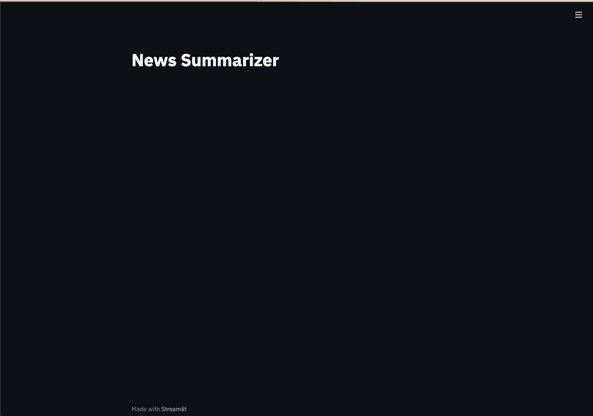
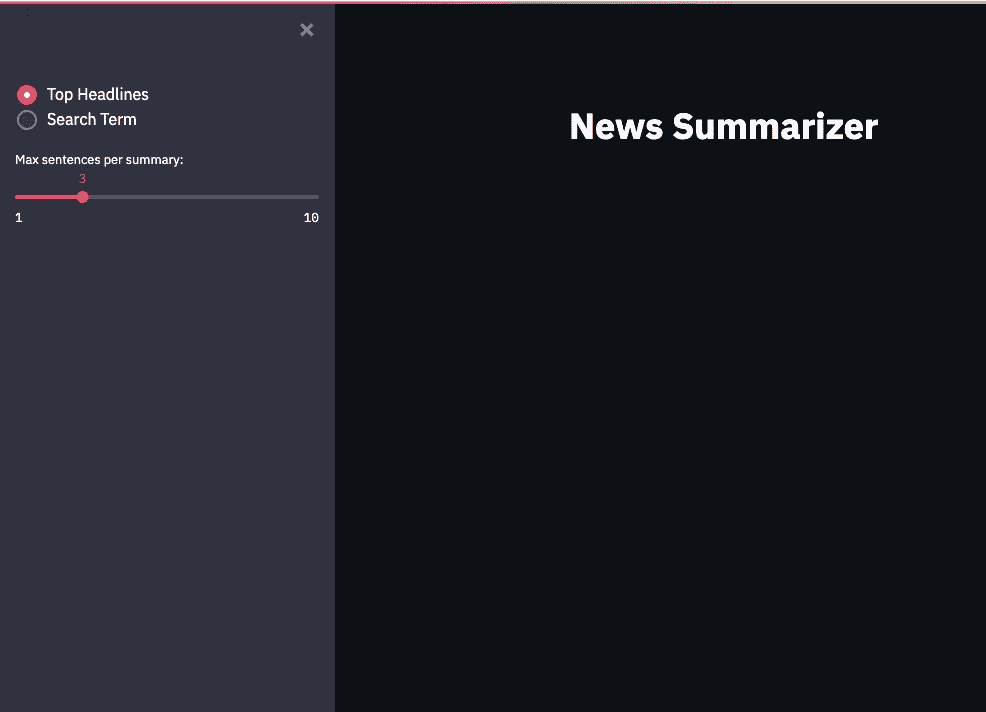
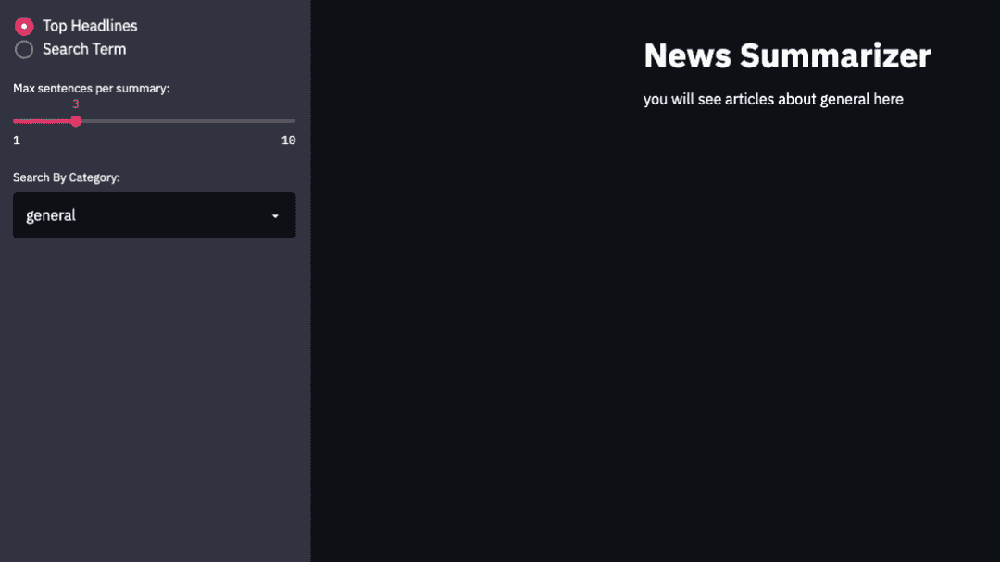

# 使用 Python 的新闻摘要应用程序

> 原文：<https://towardsdatascience.com/news-summary-app-with-python-2b1993cf64dd?source=collection_archive---------17----------------------->

## 使用 Streamlit、sumy 和 News API 构建一个纯 Python 应用程序

照片由[罗马卡夫](https://unsplash.com/@romankraft?utm_source=medium&utm_medium=referral)在 [Unsplash](https://unsplash.com?utm_source=medium&utm_medium=referral) 上拍摄

外面新闻很多，很难跟上。由于我不是一个速读者，我很好奇是否能找到一个纯 Python 的解决方案来帮助我保持消息灵通。我过去使用过 News API，并且在数据科学项目中大量使用 Streamlit。快速搜索了一下，找到了 sumy ( [Github](https://github.com/miso-belica/sumy) )，对于问题的文本摘要元素，它竟然是一个很好的解决方案。

# 假设

本文假设您对 Python、终端和 API 有一定的了解。即使你对这些话题中的任何一个都不熟悉，我想你也会发现其中的大部分都很容易处理而且很有趣。

# **安装库**

`pip install sumy`

`pip install streamlit`

Sumy 使用 NLTK，需要下载额外的数据，你可以在这里找到详细说明[。](https://www.nltk.org/data.html)

**我在 macOS 上是这样做的:**

在 Python 会话中运行以下代码:

这将启动 NLTK 下载程序。对于集中安装，将下载目录文本字段更改为:**/usr/local/share/nltk _ data**。如果集中安装导致权限错误，可以将数据安装到其他地方，但是您需要设置环境变量。

要使用 zsh 添加环境变量，您可以在终端中运行以下命令:

`echo "export NLTK_DATA=<PATH-TO-YOUR-DATA> >> ~.zshenv"`

# **开始使用 sumy**

以下是运行代码所需的导入语句:

下面的函数是 sumy Github 页面上的例子的修改版本。该函数只是对文本中的句子进行排序，并返回一个包含最重要句子的`str`。`sentences_count`参数指定了`summary`中句子的最大数量。虽然 sumy 可以用于纯文本文件，但本教程将只讨论 HTML 输入。

下面是一个使用维基百科条目对 sumy Github 页面进行自动摘要的例子:

输出显示了文章中前 10 个最重要的句子，作为摘要。

# **开始使用新闻 API**

首先，你需要注册并获得一个 API 密钥，这很容易做到[这里](https://newsapi.org)。注册后，API 密匙会自动生成并显示在下一个屏幕上。虽然有 Python 客户端库，但我选择创建自己的函数，因为它是一个直接的 API。

本文将涵盖 API 的两个端点:

1.  **/v2/everything:** 从故事档案中检索文章([文档](https://newsapi.org/docs/endpoints/everything))
2.  **/v2/头条新闻:**检索头条新闻和突发事件([文档](https://newsapi.org/docs/endpoints/top-headlines))

`news_api_request`函数只是使用提供的端点和关键字参数发送一个 GET 请求。返回值是一个`list`，其中每个元素是一个`dict`，包含关于一篇文章的信息，它将被传递给`summarize_news_api`。

`summarize_news_api`函数遍历每篇文章，并将文章的 URL 传递给`summarize_html`函数。`articles`中的每个`dict`都用摘要的新元素更新。

下面的代码片段是一个同时使用`news_api_request`和`summarize_news`的例子，用来总结来自 **/v2/top-headlines** 端点的响应中的文章。

如果您运行上面的代码，您将打印一个代表第一篇文章的`dict`，带有如下所示格式的键/值对:

# 应用规格

既然你已经学会了如何从新闻 API 中提取数据，并总结文本，那么是时候构建一个满足以下标准的应用程序了:

1.  让用户能够按类别搜索头条新闻。这将使用来自新闻 API 的 **/v2/top-headlines** 端点。用户将能够从新闻 API 文档中指定的类别列表中进行选择。
2.  让用户能够通过搜索词搜索所有文章，用户将通过文本输入的方式提供。这将使用来自新闻 API 的 **/v2/everything** 端点
3.  让用户能够指定摘要的最大长度

# **开始使用 Streamlit**

Streamlit 对于 Python 用户来说是一个超级直观的前端解决方案。它非常适合创建原型和简单的工具，这就是为什么我认为它对这个项目非常有用。

Streamlit 将通过构建上一节中指定的应用程序的前端来引入。

## 创建标题

运行应用程序:

1.  将文件另存为 news_app.py
2.  导航到“终端”中的文件夹
3.  在终端运行:`streamlit run news_app.py`

应该会弹出一个浏览器窗口，如下所示:

## 添加一些用户输入功能

第 6 行创建单选按钮，允许用户选择要搜索的端点。第一个参数是单选按钮簇的标签，我留为空白`str`,因为比率按钮对这个应用程序来说已经足够描述了。第二个参数让您将单选按钮的选项作为一个`list`传递。用户输入然后作为`str`保存到`search_choice`，这使得在整个应用程序中使用起来很简单。在本例中，列表的第一个元素是默认值。

第 9 行创建了一个滑块输入小部件，让用户能够指定摘要的长度。同样，第一个参数是小部件的标签。其余参数定义滑块的范围和默认值。用户输入作为`int`保存到`sentences_count`。

当您运行该应用程序时，您应该会看到类似这样的内容:

如您所见，小部件出现在可折叠的侧边栏上。如果将`st.sidebar.radio`替换为`st.radio`，小部件将出现在标题下。

## 基于用户输入添加条件要素

接下来的功能将取决于用户选择“头条”还是“搜索词”。如果“头条新闻”被选中，用户需要有选择类别的选项。如果选择“搜索术语”，用户将需要能够输入一个搜索术语。

如您所见，应用程序的流程是由第 14 行和第 27 行的条件中使用的`search_choice`的值定义的。如果用户选择“头条”，将出现一个下拉菜单，其中包含类别选项。传递给`st.sidebar.selectbox`的选项来自 NewsAPI 文档。`index`参数指定了列表中的哪个元素作为默认元素，我认为“general”是有意义的。

如果用户选择“搜索术语”，将出现一个文本框，接受用户输入。我添加了一个条件语句，在文本输入框为空时提示用户输入。这有助于在添加 API 调用时避免错误。

运行应用程序时，您应该会看到类似这样的内容:

新闻摘要的实时预览

这向您展示了应用程序的原始外壳，它似乎符合上面设置的标准。现在，您只需要整合前面的函数来点击新闻 API 并总结文本。

## 创建单独的文件来存储函数

我喜欢为函数使用单独的文件，以便 Streamlit 应用程序保持整洁。下面的代码片段显示了该应用程序所需的五个功能。前三个函数，`summarize_html`、`news_api_request`和`summarize_news_api`与我们上面使用的相同。我添加了两个新函数，`search_articles`和`get_top_headlines`，它们都将硬编码的端点传递给`news_api_request`函数，以帮助简化代码。

## 完成简化应用程序

在上面的代码中，第 2 行从 **app_function.py** 导入函数。第 23 行调用`get_top_headlines`，它调用 **/v2/everything** 端点。这对应于用户为`search_choice`选择“头条”。

在第 36 行，调用了`search_articles`，它调用了 **/v2/everything** 端点。这对应于用户为`search_choice`选择“搜索术语”。

在第 40 行，应用程序将循环通过`summaries`，并写出应用程序需要显示的选定信息。在本例中，应用程序将显示标题、出版日期/时间、来源名称以及我们在前面步骤中生成的摘要。

最后，您可以运行完成的应用程序:

`streamlit run news_summarizer_app.py`

# 未来的增强

我认为这个应用是一个很好的开始，但还有很多方法可以让它变得更好。以下是我想到的一些改进:

1.  寻找文本摘要的替代方法
2.  整合情感分析
3.  在应用程序中创建更多的用户输入字段，以便用户可以更好地定制查询
4.  合并几个 API 以获得更多文章

# 结论

您刚刚学习了如何使用 Streamlit、News API 和 sumy 用 Python 构建一个基本的新闻摘要应用程序。我希望这能给你一些新项目的想法。感谢阅读。

# 参考

[1][https://github.com/miso-belica/sumy](https://github.com/miso-belica/sumy)

[https://www.nltk.org/data.html](https://www.nltk.org/data.html)

[https://newsapi.org](https://newsapi.org)

[https://streamlit.io/](https://streamlit.io/)