# 使用 Elasticsearch 的新一代数据存储和分析

> 原文：<https://towardsdatascience.com/next-gen-data-storage-and-analytics-with-elasticsearch-a833ca7ca54a?source=collection_archive---------13----------------------->

## 对 Elastic 的简单代码介绍


卢克·切瑟在 [Unsplash](https://unsplash.com?utm_source=medium&utm_medium=referral) 上的照片

Elasticsearch 是一个非常受欢迎的服务，它提供了一个强大的无模式文档数据库支持的令人难以置信的搜索引擎和分析工具。

它提供了一个可伸缩的、高度可用的、快如闪电的搜索引擎。数据库本身分布在多个节点上，这些节点可以进一步分成多个碎片，默认情况下，这些碎片会被复制以防止数据丢失。

除了 Logstash、Kibana 和 Beats，我们还开发了世界级的数据收集、转换、分析和可视化平台。

这些被称为弹性(或 ELK)堆栈，是任何处理数据的人的强大工具。Elasticsearch 是这个堆栈的核心。

在本文中，我们将涵盖开始使用 Elasticsearch 所需了解的一切，包括:

```
**> Elasticsearch****> Getting Free Access to Elastic Cloud****> Key Points of Interest**
  - Deployment Details
  - Kibana Dashboard
  - Console**> API Requests**
  - Request Structure
  - Connecting Remotely**> Adding and Querying Data**
  - Index Creation
  - Adding Data
  - Querying
```

# 弹性搜索

在我们开始设置我们的第一个 Elasticsearch 集群之前，有必要对这些集群的结构有一个高层次的了解。

我们不会深入探讨——相反，我们只需要涉及基础知识。

集群是我们部署的顶层，是包含所有其他内容的容器。

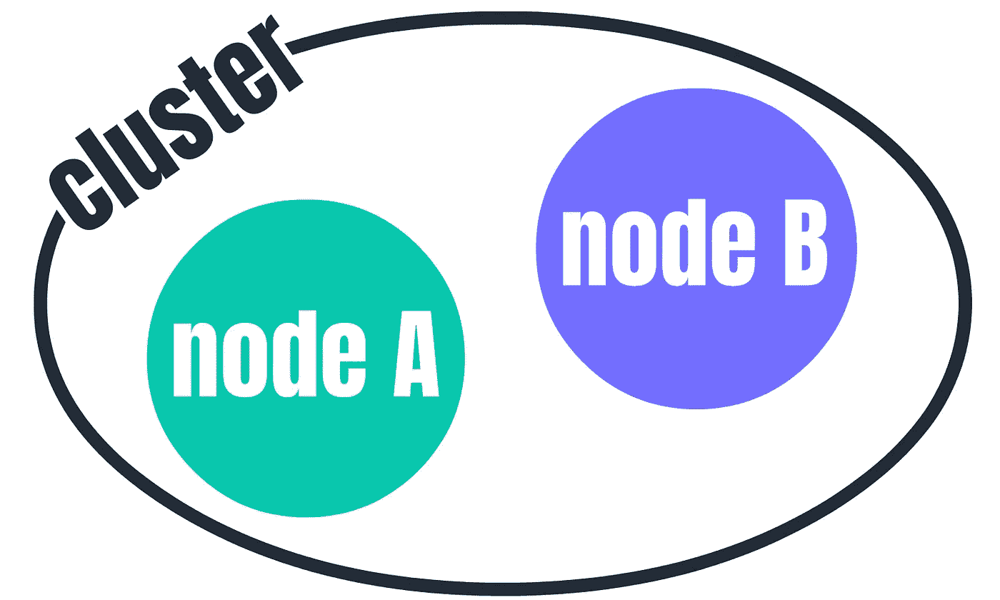

节点包含在集群中

在我们的集群中，我们有节点。我们可以将这些视为独立的处理单元，通常我们会尝试将每个节点放在单独的硬件上，这样做是为了提供容错能力，如果一个组件出现故障，一个节点出现故障，我们可以用其他节点来代替它。


我们的索引包含一组文档——我们的无模式数据点

下一层是我们的指数。单个索引就像一个数据集。在这些索引中，我们将数据存储为无模式的“文档”。

无模式指的是缺乏一个通用的数据结构。这与基于模式的 SQL 数据库相反，在基于模式的 SQL 数据库中，每个条目都被分配一组值，这些值对应于表模式定义的一组严格的字段。

我们的索引不是遵循严格的模式，而是由“文档”构成，其中每个条目可以包含一组完全不同的字段。这些文档存储为 JSON 对象，如下所示:

```
{
    'id': 'abc',
    'project': 'homegrown cucumbers',
    'codename': 'X',
    'cool-factor': '10'
}
```

同一索引中的另一个文档可能如下所示:

```
{
    'id': 'def',
    'project': 'making faster lawnmowers',
    'codename': 'go-fast',
    'notes': 'adding stripes do not work',
    'ideas': 'rockets'
}
```

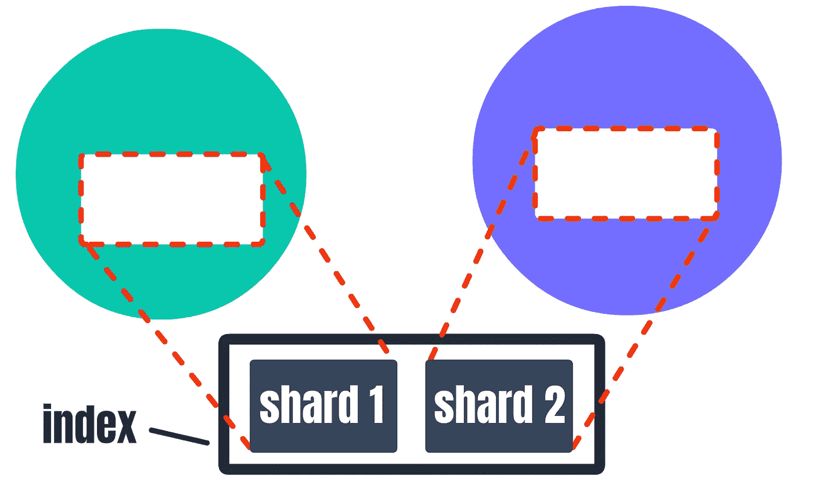

索引可以进一步分解成更小的子集，称为碎片——这些碎片也可以跨多个节点存储

索引可以被分割成碎片——然后可以分布在我们的节点上。对于本文来说，这种详细程度不是必需的，但是知道这一点还是有好处的。

# 免费访问弹性云

Elasticsearch 有几个安装选项。到目前为止，最容易上手的是弹性云。

弹性云是一项高级服务，然而，它提供了 14 天的免费试用——这足以让你熟悉这项服务。

要注册免费试用，我们只需[点击这里](https://www.elastic.co/cloud/elasticsearch-service/signup)并点击**开始免费试用**。之后，注册并验证您的电子邮件地址。

接下来，我们导航到[弹性云主页](https://cloud.elastic.co/home)，点击**开始免费试用**。

在下一页，我们可以选择我们的服务配置—我们将使用**弹性堆栈**。从这里，我们简单地使用所有的默认配置设置，最后，点击**创建部署**。

这里您需要注意的唯一部分是显示我们的部署凭据的地方——这里只需单击下载并将凭据 CSV 存储在安全且容易记住的地方——我们很快会再次需要这些凭据。

# 感兴趣的要点

我们从我们的[弹性云主页](https://cloud.elastic.co/home)开始，在那里我们应该能够看到我们的部署列表、文档链接、新闻等等。

## 部署详细信息

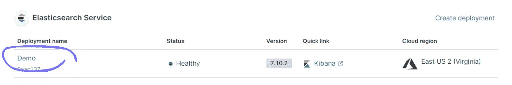

通过点击弹性云主页上的部署名称来访问部署详细信息

首先，我们单击我们的部署—这将带我们进入部署详细信息页面。

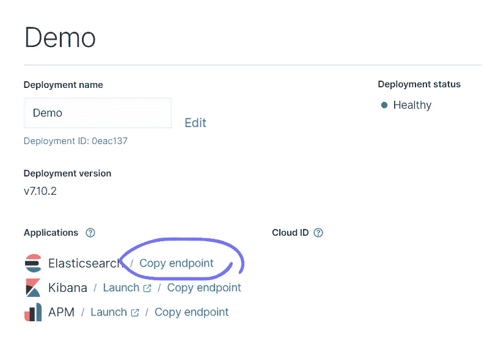

Elasticsearch 端点是我们稍后将引导 API 请求的地方

这里我们会发现**复制端点**按钮——这给了我们 Elasticsearch API 的 URL 地址。我们可以将其粘贴到浏览器地址栏中，并使用凭据 CSV 中提供的用户名和密码登录。

登录后，我们应该会得到一个 JSON 响应对象:

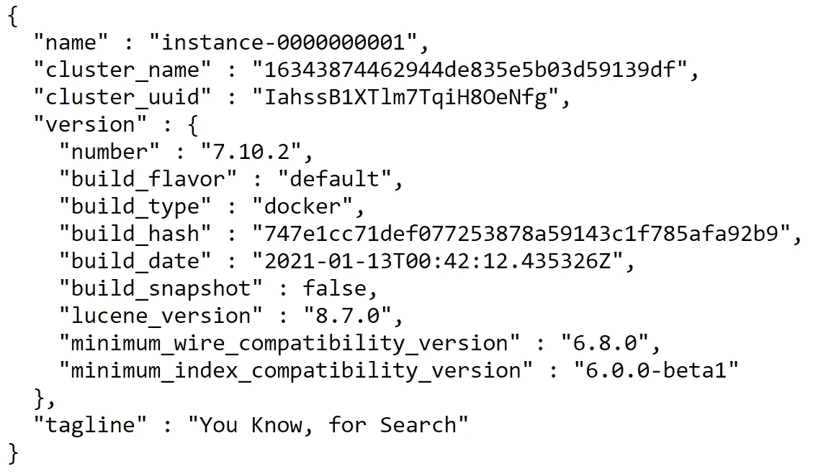

来自访问我们的 Elasticsearch 端点的 JSON 响应——这证实了一切(到目前为止)都在按预期工作

太好了！将这个端点地址保存在手边，因为我们稍后在向集群发出 API 请求时会用到它。

## 基巴纳仪表板

Kibana 是我们的弹性堆栈的可视界面。在本文中，我们不会详细讨论我们能做的每一件事，但是我们将讨论一些有用的组件。

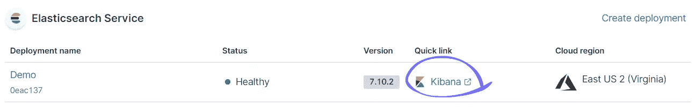

我们从弹性云主页访问 Kibana

要打开我们的 Kibana 仪表板，请返回到我们的弹性云主页，并单击 Kibana 进行部署。

## 安慰

我们现在看到的屏幕是我们集群部署的 Kibana 的首页。

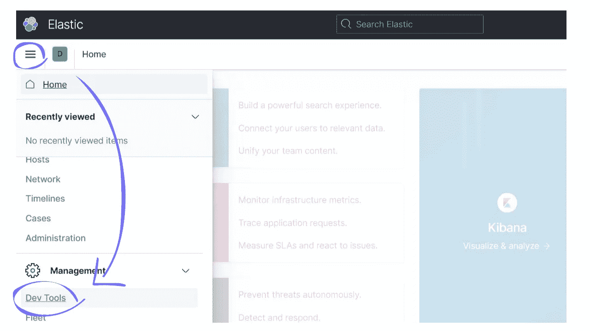

在 Kibana 界面中，我们可以点击菜单图标，然后点击**开发工具**来访问控制台

Kibana 包括一个控制台，允许我们轻松地与 es 交互。我们可以通过点击左上角的菜单图标并选择**开发工具**来访问它。


**开发工具控制台**界面

这里我们将看到一个控制台界面，在这里我们可以向 Elasticsearch 实例发送 HTTP 请求。

或者，我们可以轻松地使用 cURL、Postman 或失眠症来发出这些请求——开发工具控制台只是为请求提供了另一个接口。

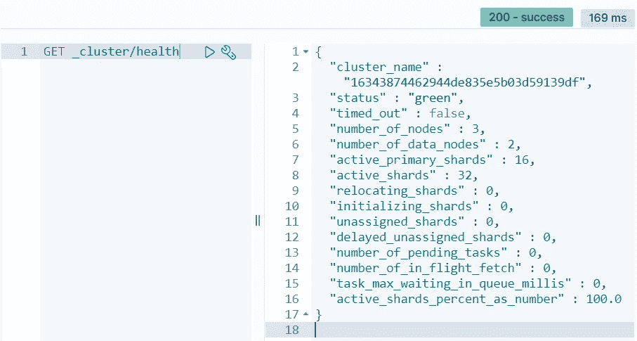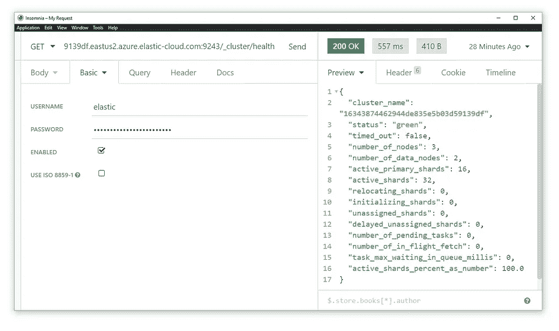

下面是在开发工具控制台(左)和远程使用失眠症(右)发出的相同 API 请求的比较——稍后将详细介绍

在上面的两个例子中，我们使用函数`health`查询 ES API `_cluster`来返回集群的健康状态。对于这两个接口，请求结构几乎是相同的。

使用开发工具控制台的请求有一个小的不同。默认情况下，控制台被配置为使用我们的集群端点——因此与普通请求不同，我们不需要指定集群的完整地址。

# API 请求

在介绍控制台时，我们简单地提到了这一点。现在，让我们更深入地了解一下 Elasticsearch API 是如何构建的，以及我们可以用它做什么。

## 请求结构

我们的请求结构遵循`METHOD URL/<API>/<function>`的模式——如果我们从开发工具控制台发出请求，我们可以排除`URL`部分。

在我们之前的例子中，我们查询了`_cluster` API 并执行了`health`函数。根据我们想要看到的内容，我们可以用许多不同的函数替换函数`health`:

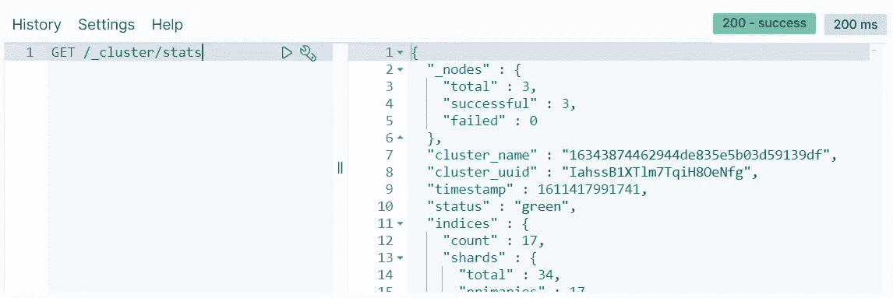

使用 **GET /_cluster/stats** 检查集群统计数据

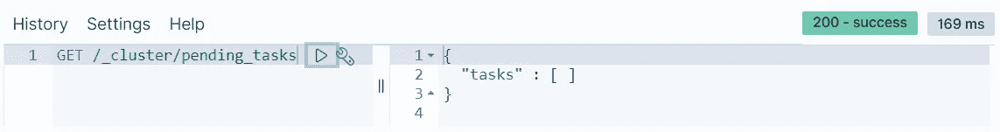

我们可以使用**GET/_ cluster/pending _ tasks**来检查任何未完成的任务

或者我们可以通过从`_cluster`切换来使用完全不同的 API，就像这样:

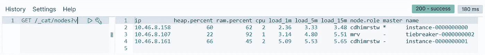

**GET /_cat/nodes？v** 返回关于节点的关键信息——添加 **v** 参数告诉 API 在响应中包含列标题

在这里，`[cat_](https://www.elastic.co/guide/en/elasticsearch/reference/current/cat-nodes.html)`允许我们查看关于集群节点的*【人类可读】*信息——比如它的 RAM 使用量`ram.percent`、负载`load_1m`、角色(权限)`node.role`和`name`。

我们也用`v`添加了第一个参数——这告诉 API 在响应中包含列标题。让我们添加另一个参数`h`来指定我们希望看到哪些列:

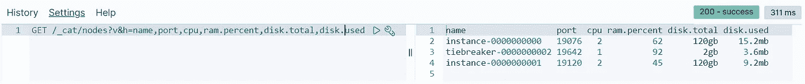

在这里，我们指定了希望看到带有 **v** 的列标题，并指定了带有 **h** 的列

这些都是简单的信息请求，但是正是使用这种完全相同的方法，我们可以开始在 Elasticsearch 中添加和查询数据——我们将在后面介绍。

## 远程连接


我们需要我们的 Elasticsearch 端点将我们的 API 请求指向

如果我们想从开发工具控制台之外与 Elastic 通信，我们需要集群端点。我们之前从我们的部署详细信息页面(如上所示)中发现了这一点。它应该是这样的:

```
https://012324de56789df.eastus2.azure.elastic-cloud.com:9243
```

让我们把这个加上`/_cluster/health`来创建我们完整的请求 URL。

为此，你需要一种提出请求的方式——我将使用[失眠症](https://insomnia.rest/download/core/?),但还有很多其他方法和工具可用，所以你可以随意使用任何你喜欢的方法和工具。

接下来，我们需要向我们的 API 添加基本授权。就像之前我们通过浏览器访问 API 一样，我们需要提供从我们的凭证 CSV 中收到的用户名和密码。

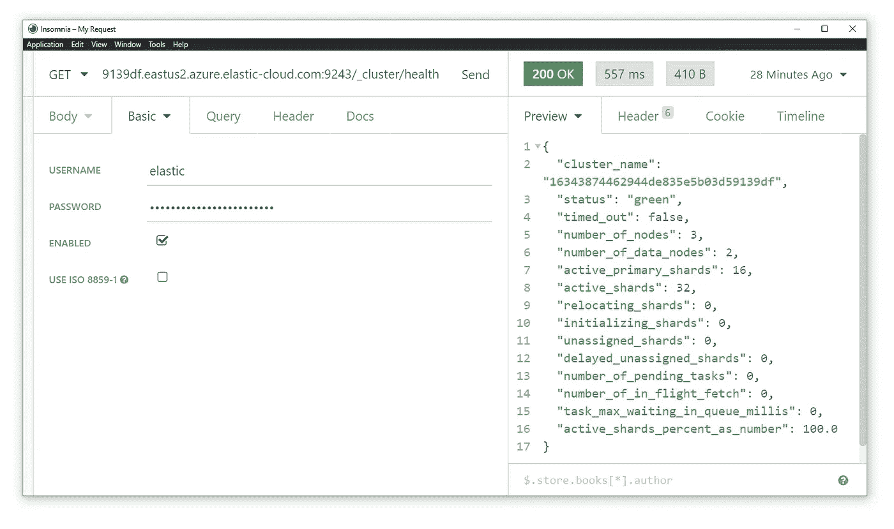

现在，我们可以从任何地方向我们的弹性云集群发出 API 请求

在失眠症中，我们可以很容易地输入所有这些细节——只需点击 Auth 下拉菜单并选择 Basic——我们在那里输入我们的凭证。然后，我们可以点击 **Send** ，我们将看到对我们的 API 请求的响应，就像我们在开发工具控制台中所做的一样。

# 添加和查询数据

现在我们知道了要点，我们可以开始添加数据，以便开始查询我们的集群。这个过程有几个步骤:

*   索引创建
*   添加文档
*   进行查询

现在，让我们逐一解决这些问题。

## 索引创建

向集群添加索引非常容易——我们所做的就是发送一个包含索引名称的`PUT`请求。因此，如果我们想创建一个名为`people`的索引，我们可以在控制台中使用`PUT /people`来实现——或者像这样在失眠中:

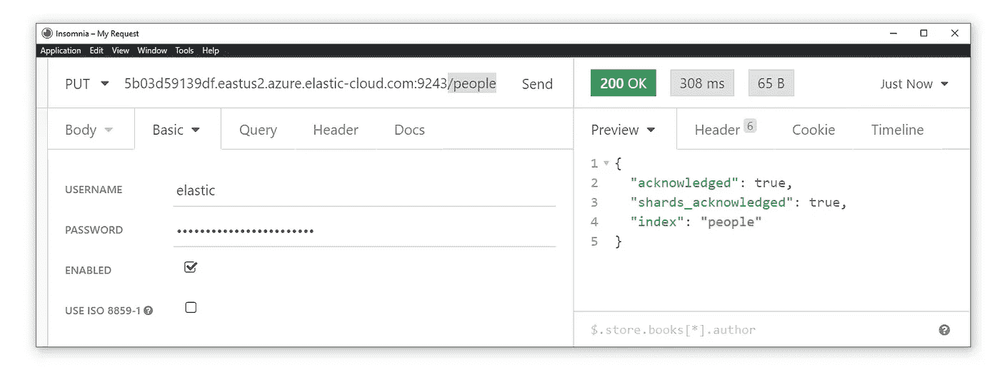

发送一个 **PUT** 请求来创建一个名为 **people** 的新索引

我们应该会收到成功创建新索引的确认。

让我们使用`GET /_cat/indices?h=health,index,pri,rep,store.size`检查一下我们是否已经成功添加了新的索引:

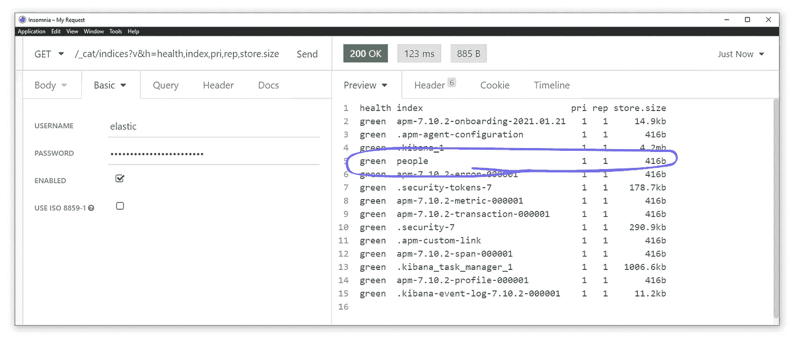

我们可以在回复中看到我们的**人**指数

这就是我们新创建的`people`索引！我们还有其他一些有用的信息:

*   `health` —我们的指标状态，绿色表示良好
*   `index` —我们指数的名称
*   `pri` —我们的索引被分成的主碎片的数量
*   `rep` —相应复制品碎片的数量
*   `store.size` —总索引大小(包括所有副本碎片)

您不需要理解主碎片和副本碎片到底是什么，但是从高层次上来说，副本碎片就像主碎片的备份(但不仅仅用于数据恢复)。

## 添加文档

好极了。我们已经有了索引，现在我们准备开始添加一些数据。

数据作为文档存储在 Elasticsearch 中。本质上是 JSON 对象。

因此，在向索引中添加数据时，我们使用 JSON 格式。您可以使用自己的数据，或者上面的虚拟数据集。

我们需要做的就是`POST /people/_doc`并将 JSON 格式的文档添加到请求中:


**POST /people/_doc** 允许我们创建一个包含存储在 JSON 主体中的信息的新文档

在失眠症中，我们可以点击**正文**下拉菜单，并选择 **JSON** 开始输入我们的文档数据。

现在我们有了第一份文件！注意`_id`值——我们可以用它来更新条目。让我们使用`PUT /people/_doc/<ID HERE>`将 Joe 的位置更新到纽约:

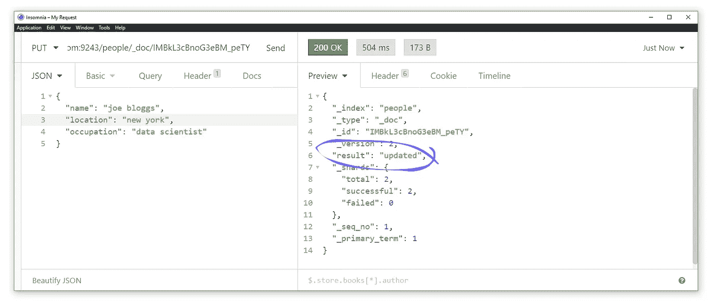

我们可以通过使用 **PUT** 方法并在请求中指定文档 ID 来更新文档

我们将在返回的`"result"`中看到，我们现在有了`"updated"`，这意味着我们成功地更新了 Joe 的文档。

让我们添加剩余的文档:

## 查询索引

让我们使用`GET /people/_search?q=*`对索引中的*所有内容*进行简单搜索，以确认我们已经正确插入了所有文档:

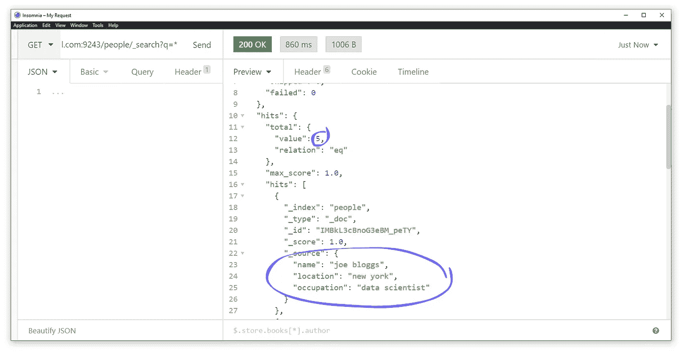

我们使用 **q=*** 查询索引中的所有内容

我们的响应将显示我们的`people`索引中的所有文档——我们可以看到我们有五次点击，向下滚动将允许我们查看五个文档中的每一个！

这里的查询参数用代表“查询”的`q`指定——我们通过键入`*`来搜索所有内容。

我们可以使用`q=field:value`在给定的字段中搜索特定的值。如果我们想返回每一个`occupation`是`data scientist`的人，我们就写`GET /people/_search?q=occupation:data%20scientist` ( `%20`是 keyspace 的意思)。

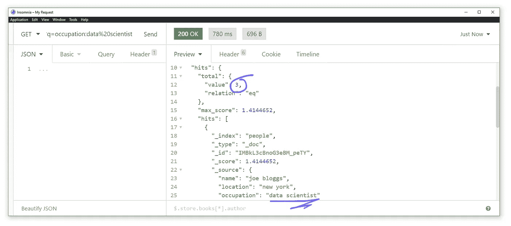

使用 **q=field:value** 可以很容易地查询特定的字段

从这个查询中，我们返回三个命中结果——每个都对应于我们的文档，其中职业值是`"data scientist"`！

这就是本文的全部内容，我们已经从设置一个弹性云实例一直到查询我们的数据，涵盖了:

*   访问弹性云
*   Elasticsearch 和 Kibana 控制台概述
*   我们如何发出 API 请求
*   远程发出这些请求
*   创建索引
*   添加文档
*   如何查询！

这实际上只是触及了 Elasticsearch 的皮毛，当然还有很多东西要写——但这些是你需要开始的最基本的东西。

我希望你喜欢这篇文章！如果你有任何问题，请通过 [Twitter](https://twitter.com/jamescalam) 或在下面的评论中告诉我。如果你想要更多这样的内容，我也会在 YouTube 上发布。

感谢阅读！

[🤖《变形金刚》课程 NLP 的 70%折扣](https://bit.ly/nlp-transformers)

**所有图片均由作者提供，除非另有说明*