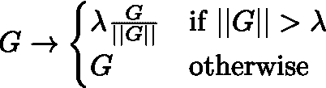

# NFNets 解释——deep mind 最新的最先进的图像分类器

> 原文：<https://towardsdatascience.com/nfnets-explained-deepminds-new-state-of-the-art-image-classifier-10430c8599ee?source=collection_archive---------15----------------------->

约书亚·戈尔德在 [Unsplash](https://unsplash.com?utm_source=medium&utm_medium=referral) 上拍摄的照片

## [思想与理论](https://towardsdatascience.com/tagged/thoughts-and-theory)

## 这是批量正常化结束的开始吗？

# 介绍

DeepMind 最近发布了一个新的图像分类器家族，在 ImageNet 数据集上实现了新的最先进的准确性。这种新的图像分类器家族被命名为 [**NFNets**](https://arxiv.org/abs/2102.06171) (无归一化器网络的缩写)，达到了与 EfficientNet-B7 相当的准确性，同时训练时间快了 8.7 倍。

NFNet-F1 的训练速度比 EfficientNet-B7 快 8.7 倍，但精度相当。NFNet-F5 实现了一流的精度，超越了之前 EfficientNet 系列的精度。

这种训练速度的提高部分是通过用其他技术代替批量标准化来实现的。这代表了图像分类器世界中的一个重要的范式转变，它在很大程度上依赖于作为关键组成部分的批量标准化。

# 批量标准化——好处

首先，我们来了解一下批量规范化带来的好处。有了这些知识，我们就可以设计替代方法来恢复这些益处。

## 批处理规范化缩减剩余分支

在类 ResNet 架构(即 ResNet、ResNeXt、SE-ResNeXt 等)中，通常在剩余分支中应用批处理规范化，这具有减少剩余分支上的激活规模的效果(与跳过分支相比)。这在训练的早期稳定了梯度，使得能够训练明显更深的网络。

## 批量标准化消除了均值漂移

当使用反对称激活函数(如 ReLUs)时，激活的平均值是非零的，导致激活通常较大且为正。这导致网络在训练早期为所有训练样本预测相同的标签，导致训练不稳定。这种现象被称为均值漂移。批次标准化通过确保每个批次的平均激活度为零，消除了均值漂移。

## 批处理规范化具有正则化效果

随着批量标准化的引入，研究人员发现退出不再是必要的，因为应用批量标准化有助于规范网络。批次规范化通过防止对有噪声的批次统计数据过度拟合来规范网络。

## 批量标准化允许高效的大批量训练

通过平滑损失情况，批量标准化允许我们使用更大的批量和训练率，而不会过度拟合。

# 批量标准化——坏处

尽管近年来批量归一化已经使得图像分类器取得了实质性的进展，但是它确实具有许多负面的后果。

## 批量标准化成本很高

计算批处理级别的统计数据是一项开销很大的操作。通过消除批量标准化，我们可以更快地训练网络。

## 批量规范化打破了数据独立性的假设

批量级统计的计算打破了小批量中训练样本之间的独立性。这是许多实现错误的根本原因，尤其是在分布式培训中。事实上，由于批量标准化导致的问题，机器学习研究中的几个众所周知的结果无法精确复制。

为此，许多研究人员试图创建无规格化器的网络，同时仍然享受批量规格化带来的好处。到目前为止，他们中的大多数都没能创造出这种具有竞争精度的无归一化因子的网络。

# NFNets——最先进的无归一化器网络

NFNets 是一系列经过修改的 ResNets，无需批量标准化即可实现竞争精度。为此，它应用了 3 种不同的技术:

*   加权标准化的修正剩余分支和卷积
*   自适应渐变裁剪
*   架构优化可提高精确度和训练速度

这 3 种技术本身是复杂的主题，所以我们将在下面的章节中逐一介绍。

## 修正的剩余分支和卷积

为了在没有归一化的情况下训练深度结果，抑制剩余分支上的激活规模是至关重要的。为了实现这一点，NFNets 使用 2 个定标器(α和β)来定标剩余分支开始和结束时的激活。

α设置为小常数 0.2，而每个模块的β定义为:

在哪里，

并且 *h* 指的是块的输入。

此外，NFNets 使用比例权重标准化来防止均值漂移。缩放权重标准化将 NFNets 中卷积层的权重归一化，使得:

其中μ和σ分别指权重的均值和标准差， *N* 指卷积层的扇入。

## 自适应渐变裁剪

自适应梯度裁剪也被用来训练具有较大批量和学习速率的神经网络。传统上，渐变裁剪用于限制渐变幅度并防止渐变爆炸。

其中 *G* 是指梯度，λ是任意阈值。然而，作者发现神经网络的训练稳定性对λ的选择极其敏感。因此，作者提出了*自适应梯度裁剪*，一种梯度裁剪的改进形式。

自适应梯度裁剪背后的直觉是，梯度对权重的比率提供了一个简单的度量，即单个梯度下降步骤将改变原始权重。我们预计，当这个比率很大时，训练将变得不稳定，因此，当这个比率超过某个阈值时，我们应该修剪梯度。

在自适应梯度裁剪中，梯度是按单元裁剪的(即矩阵中的行),根据:

注意，ϵ常数用于防止零初始化参数的梯度被削波为零，这有助于在训练早期稳定梯度。

## 架构优化可提高精确度和训练速度

即使使用自适应梯度裁剪、修正的剩余分支和卷积，无规格化器的网络仍然不能超过 EfficientNet 的精确度。

因此，作者着眼于优化现有的基于 ResNet 的模型的架构，以提高模型的准确性。作者使用阿瑟-雷斯 NeXt-D 模型作为基线，并做了以下修改。

首先，每个瓶颈块中 3×3 卷积的组宽度固定为 128。组宽度是指瓶颈块的 3×3 卷积中的滤波器数量÷基数(即分组卷积中的组数量)。

接下来，深度缩放模式也被修改。在原始 SE-ResNeXt-D 模型中，第一和最后阶段中的重复块的数量固定为 3，而第二和第三阶段中的重复块的数量是非均匀缩放的。例如，SE-ResNeXt-50 的缩放模式为[3，4，6，3]，而 SE-ResNeXt-152 的缩放模式为[3，8，36，3]。

作者认为，这种扩展策略是次优的，因为早期和后期阶段的层都没有足够的容量。相反，作者提出了一个更简单的缩放模式。最小的型号 NFNet-F0 的缩放模式为[1，2，6，3]，而 NFNet-F1(下一个更大的型号)的缩放模式为 F0 的 2 倍，缩放模式为[2，4，12，6]。

第三，作者修改了原始 SE-ResNeXt-D 模型的默认宽度模式，其中第一阶段有 256 个通道，在每个后续阶段都加倍，从而产生宽度模式(256，512，1024，2048)。相反，NFNets 修改第三和第四级的宽度，产生(256，512，1536，1536)的宽度模式。作者发现，根据经验，在第三阶段增加宽度，而在第四阶段减少宽度可以提高模型性能，同时保持训练速度。

下表总结了阿瑟-ResNeXt-50 型号和 NFNet-F0 型号之间的架构差异。

SE-ResNeXt-50 和 NFNet-F0 在架构上的区别。注意，在阿瑟-ResNeXt-50 中，批量归一化应用于每个连续的卷积块之间，而 NFNets 是无归一化器的。NFNets 中使用的卷积层的权重也使用缩放权重标准化进行缩放。

# 实施国家森林网络

DeepMind 在其 GitHub 库中发布了 NFNets 的代码。然而，代码是用 JAX 的[和 T2 的](https://deepmind.com/blog/article/using-jax-to-accelerate-our-research)[写成的。](https://deepmind.com/blog/article/using-jax-to-accelerate-our-research)

<https://github.com/deepmind/deepmind-research/tree/master/nfnets>  

在流行的`timm`库中也可以找到 NFNets 的 PyTorch 实现。

<https://github.com/rwightman/pytorch-image-models>  

# 结论

这篇论文读起来很有趣，它是创建竞争性无规范网络的一个重要里程碑。尽管在深度网络中采取了重要的步骤来替代批量规范化，但是 NFNets 中的性能提升很大一部分来自于现有 SE-ResNeXt 架构的优化。

尽管如此，我相信在不久的将来会发现更多先进的无归一化器网络，提供更快的训练速度和更高的精度。