# NHL 等效性和前景预测模型:建立 NHL 等效性模型(第 2 部分)

> 原文：<https://towardsdatascience.com/nhl-equivalency-and-prospect-projection-models-building-the-nhl-equivalency-model-part-2-6f275a45e22?source=collection_archive---------4----------------------->

## 对已建立的框架进行一些小的更新

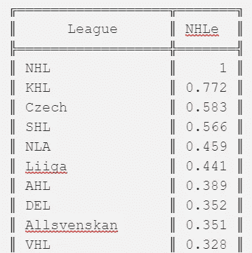

在 NHL 等效性和前景预测模型的第 1 部分中，我提到了一些 NHL 之外的评分。如果所有的潜在客户都在同一个联盟，这将是一件容易衡量的事情。如果他们都在为数不多的几个联盟中打球，并且这些联盟足够相似，可以比较他们中的球员，比如组成 CHL 的 3 个联盟，那就更好了。我之前提到的分析比较了所有 3 个 CHL 联赛中防守球员的得分，并将这些得分率视为相等，我对此没有太大的问题，因为它们都相当相似。

然而，并不是所有的前景都来自 CHL 或直接可比的联盟。以先于米尔科·穆勒一年的圣何塞首轮选秀权托马斯·赫特尔为例:赫特尔在捷克顶级男足联赛捷克 Extraliga 度过了整个选秀年，38 场比赛得到 25 分(0.66 P/GP)。一个前锋如果在选秀之年的任何一个 CHL 联赛中以这样的速度得分，可能会在选秀中被完全忽略，或者至少要等到下一轮才能听到自己的名字被叫到。但是赫特尔被选为第 17 名。与穆勒不同的是，选择赫特尔让圣何塞看起来非常聪明；他在 NHL 职业生涯中的表现在战争中排名第二，在选秀班中排名第三，在重新选秀中他肯定会比第 17 名高得多。

赫特的高选举人和随后在 NHL 级别的成功不应该让任何人感到惊讶，因为**他在选秀年的得分率实际上比他的选秀队友中的任何人都好。**他的原始得分率并没有反映出来，因为他在一个很难得分的联盟中打球。

我怎么知道赫塔尔在一个更难得分的联赛中打球？仅仅是他和成年人而不是青少年比赛的事实还不足以证实这一点。毕竟，我的啤酒联盟里都是成年人，但一支由 OHL 最糟糕的青少年组成的球队，如果他们正面交锋，仍然会击败我们最好的球队。虽然常识可能足以告诉我们，捷克的 Extraliga 比任何 CHL 联赛都更好*，并且 Hertl 的选秀年得分比 CHL 前锋的得分更好，但在没有衡量捷克 Extraliga 和其他联赛有多好的情况下，我们无法准确地说它有多好，或者与其他联赛中得分不同的球员相比。*

*这强调了需要一个等价模型:一个决定世界上任何一个特定联赛中一分的价值的模型。我建立了一个 NHL 等值(NHLe)模型，以 1 个 NHL 点为尺度，这意味着如果一个联盟的 NHLe 值为 0.5，那么该联盟中的一个点相当于 0.5 个 NHL 点。*

*“经典”NHLe 模型通过直接比较一组球员在一个联盟中的得分与这些球员在 NHL 中的得分来计算一个联盟中的分数，通常是在同一年或紧接着的一年。在关于这一主题的最早出版作品之一的“[联赛等值](http://hockeyanalytics.com/Research_files/League_Equivalencies.pdf)”中，Gabriel Desjardins 阐述了他的方法:*

> *为了确定 AHL(或任何其他联盟)的质量，我们可以简单地看看第一年在小联盟和第二年在 NHL 的每个球员，并比较他们的 PPG 平均水平。换句话说，相对于 NHL 的联赛质量是:*

*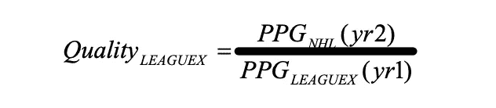*

*图片来自 Gabriel Desjardins 的等效联赛*

*这种方法本身非常有效，但是有三个问题:*

1.  *球员在第一年和第二年之间经历的发展被有效地“固化”到模型中，这有利于有更年轻球员的联盟。如果甲 A 在各方面与乙 B 完全相同，只是甲 A 充满了更年轻的球员，那么从甲 A 引进的 NHL 在第 1 年和第 2 年之间将比乙 B 经历更多的发展，因此，在第 2 年得分更多。这将导致该模型错误地指出，甲 A 联赛更难得分，而实际上只有年轻球员在他们看到 NHL 之前发展得更好。*
2.  *使用每个联盟中每场比赛的平均得分会使数据更容易受到极端值的影响，并且没有考虑样本大小。一个只在甲 A 和 NHL 打一场比赛的球员和一个在两个联赛都打了 82 场比赛的球员拥有相同的体重。*
3.  *这个方法只对下赛季直接产生 NHLers 的联赛有效。使用这种方法来计算像 GTHL U16 这样的联赛的 NHLe 值是不可能的，因为在接下来的赛季中，球员实际上不能参加 NHL。此外，虽然少数联盟在接下来的赛季中确实生产 NHLers，但其中许多联盟生产的数量如此之少，以至于任何一个方向上的一个异常值都可能严重影响最终的估计。*

*当 CJ·图尔托罗发表了[网络 NHLe](https://cj-turtoro.shinyapps.io/NNHLe-writeup/) 时，所有这三个问题都在一个地方得到了补救，这是一篇优秀的文章，我推荐你阅读。(**顺便说一句，我对 CJ 为出版他的第一部作品所付出的努力以及他为我的作品提供的帮助感激不尽。像 CJ 这样的人不仅拥有帮助他人的智慧和领域知识，还拥有这样做所需的善良和真诚的热情，这使得曲棍球分析社区成为一个不可阻挡的书呆子大军，减少了犯错的频率。)***

*CJ 处理第一个问题的方法是只使用同一年在两个联盟打球的球员之间的转换。(我也是这么做的，从来没有认真考虑过使用多年过渡。)*

*他处理第二个问题的方法是用联赛总积分除以比赛总积分。*

*第三个问题——我认为是三个问题中最大的一个——他用网络方法处理，使用联盟之间的间接路径来确定每个联盟的相对实力。以下示例使用带有精确整数的虚构数据来解释如何计算间接路径:*

*   *100 名球员在同一年参加过甲 B 联赛。他们在甲 A 的 1000 场比赛中共得 1000 分(1.0 P/GP)，在乙 A 的 1000 场比赛中共得 500 分(0.5 P/GP)。为了确定甲 A 的“乙 B 等值”，我们将乙 B 的场均积分除以甲 A 的场均积分，算出来就是`0.5/1.0 = 0.5`。*
*   *500 名球员在同一年参加过 B 联赛和 NHL 联赛。他们在乙级联赛的 1000 场比赛中共得 1000 分(1.0 P/GP)，在 NHL 的 1000 场比赛中共得 200 分(0.2 P/GP)。我们遵循上述相同的方法来计算 B 联赛的 NHL 当量:`0.2/1.0 = 0.2`。*
*   *我们知道甲 A 的“乙 B 等效值”为 0.5，乙 B 的 NHL 等效值为 0.2。为了确定甲 A 联赛的 NHL 等值，我们简单地将这两个数值相乘:`0.5*0.2 = 0.1`。**这条路径写明了甲 A 一分抵 0.1 NHL 分。***

*没有球员需要在同一个赛季参加过甲 A 联赛和 NHL 联赛，这种方法才能奏效。只要在两者之间有一个连接联盟，就可以为联盟 a 计算 NHLe 值。*

*以下是一个真实路径的示例，该路径从 KHL 开始，并使用 AHL 作为连接符:*

*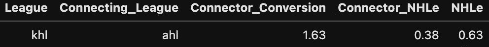*

*在这种情况下，同一年在 KHL 和 AHL 打球的球员在 AHL 的总得分是在 KHL 的 1.63 倍。这意味着 KHL 的“AHL 当量”系数为 1.63。与此同时，同年参加 NHL 的 AHL 球员在 NHL 的得分率是他们在 AHL 得分率的 0.38 倍。将这两个值相乘得到值 0.63，这是该特定路径的 KHL 的“NHLe”。*

*然而，并不是所有的道路都只有一个连接联盟。有些路径没有任何功能，但仍然完全有效，例如 KHL 直接到 NHL 的路径:*

*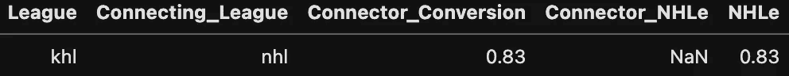*

*有些，像从 J18 Allsvenskan 到 NHL 的道路，有不止一个连接联盟:*

*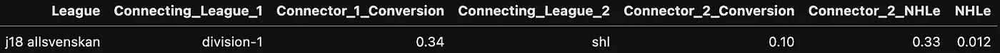*

*具有多个连接器的联盟的方法保持不变:计算每个联盟到下一个联盟的转换因子，然后将这些值彼此相乘。在这种情况下，J18 Allsvenskan 和 Division-1(现在称为 HockeyEttan)之间的换算系数为 0.34，Division-1 和 SHL 之间的换算系数为 0.1，SHL 和 NHL 之间的换算系数为 0.33。通过执行`0.34*0.1*0.33 = 0.012`将这 3 个值相乘，结果表明 J18 Allsvenskan 中一个点的值在 NHL 中约为 0.012 点。(请注意，这些值是四舍五入的，如果您用四舍五入的值手动执行这些计算，您将得到稍微不同的结果。)*

*我到目前为止展示的只是计算*一个* 路径的方法论。但是与经典 NHLe 不同，在经典 NHLe 中，唯一的路径是一条没有连接器的路径，而网络 NHLe 可以有几十条甚至几百条路径！这引发了更多的问题:*

*   *我们如何确定要使用的最佳路径？*
*   *一旦我们确定了最佳路径，我们应该只使用那一条，还是应该使用多条？如果更多，那么有多少？*
*   *所有的路径都是有效的吗，或者我们应该排除过渡玩家的样本量很小的路径？*
*   *我们是对从每条路径获得的不同等价分数赋予不同的权重，还是对它们进行平均？*

*这些问题的答案是我的 NHLe 与 Turtoro 不同的地方，tur toro 对每个问题都提供了以下答案:*

*   *最上面的路径是连接最少的联盟(他称之为边)。*
*   *大约会使用前 5 条路径。*
*   *一条路径必须包含至少 10 个过渡玩家的实例才有效。*
*   *路径按以下公式加权:*

```
*Weight = 1/2^(Connections) * MinimumInstances*
```

*其中**连接数**是组成路径的连接数(包括到 NHL 的最终连接),而**最小实例数**是组成路径中实例的最小转换玩家数。*

*这可能看起来有点棘手，因此这里有一个为 KHL 加权的三条路径的示例:*

*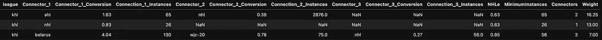*

1.  *这里的第一条路径是 KHL->AHL->NHL。此路径有两个连接。KHL->AHL 连接有 65 个转换实例，而 AHL->NHL 连接有 2，876 个。这意味着该路径的任何连接中的最少实例是 65，并且该路径的权重的计算是`1/2^(2) * 65 = 16.25`。*
2.  *第二条道路是 KHL-> NHL。这个路径有一个与 26 个转换实例的连接，计算是`1/2^(1) * 26 = 13`。*
3.  *第三条路径是 KHL->白俄罗斯->WJC-20->NHL。这条路有三个连接点。KHL->白俄罗斯连接有 130 个实例，白俄罗斯->WJC-20 连接有 75 个，WJC-20->NHL 连接有 56 个，这意味着此路径的最小实例是 56 个。这条路径的权重的计算是`1/2^(3) * 56 = 7`。*

*有了每条路径的 NHLe 值和权重，计算联盟最终值的过程就变得非常简单:将每个 NHLe 值乘以其路径的权重，取这些输出的总和，然后除以权重的总和。在这种情况下，计算是`((0.63*16.25)+(0.83*13)+(0.85*7))/(16.25 + 13 + 7) = 26.98/36.25 = 0.74`。如果我们只使用这三条路径，KHL 的最终 NHLe 将是 0.74。*

*我认为 CJ 对这些问题的每一个回答都有坚实的理论基础。如果我是从零开始，我可能会以不同的方式回答这些问题，但我在这里的目标不仅仅是复制 CJ 的流程，并做出一些武断的决定来改变我不喜欢的东西。我的目标是将这些对我来说都有意义的问题的一组潜在答案放在一起，然后将这些答案中的每一个与另一个和 CJ 的答案进行测试，希望为建立网络 NHLe 模型确定一组最佳的建模参数。以下是我决定测试的不同参数集，作为每个问题的答案:*

## *用于确定最佳路径:*

*   *根据上面列出的加权等式，选择具有最高权重的路径。*
*   *选择具有最少连接联盟的路径，根据加权等式使用最高权重作为平局决胜。*
*   *在所有连接中选择实例数量最少的路径。*

## *要确定要使用的路径数量:*

*   *通过选择最多前 15 条最佳路径，测试仅选择一条最佳路径。*

## *根据样本大小排除路径:*

*   *通过选择至少 15 个实例的路径，测试选择至少 1 个实例的路径。*

## *为了对每条路径进行加权:*

*   *我只是坚持使用 CJ 的加权公式。我简单地尝试了几种不同的方法，但是他的方法在初步测试中表现得更好，而且太有意义了。*

*此外，我选择测试 3 个其他参数:*

1.  *包括 U20 和 U18 世界青年锦标赛。*
2.  *改变两个联赛之间转换系数的计算方法。我测试了 CJ 使用各联赛得分全额总和的方法，Desjardins 使用各联赛场均分均值的方法，以及我自己使用各联赛场均分中位数的方法(CJ 建议)。*
3.  *在为一个联盟创建新路径之前，删除该联盟中的第一个连接联盟。例如，如果使用了 KHL->AHL->NHL 路径，则从该点开始，KHL 的所有其他路径都不能使用 AHL 作为第一个连接。(这条规则的最初实施实际上是由于我误解了 CJ 的方法论而造成的意外，但我最终将它作为一个测试参数，因为我认为对于一个给定的联盟来说，不要过于看重任何一种直接关系可能更好。)*

*有了一组我认为适合构建最终模型的参数，是时候测试每一个参数并确定最佳参数了。我决定我的测试的目标将是最小化所有转换联盟的玩家的每场预测点数和每场实际点数之间的平均绝对误差。基于每个联盟的 NHLe 值和两个联盟的第一个中的每场比赛的点数来计算每场比赛的预测点数，其中 NHLe 值是在用给定的一组参数建立模型之后获得的那些。*

*我知道我只是向你扔了一个单词沙拉，但是测试过程其实挺简单的；我将使用 Melker Karlsson 在 2010 年的例子来分解它:*

*   *本赛季，梅尔克在 superelit 的 27 场比赛得到 35 分(1.3 P/GP)，在 SHL 的 36 场比赛得到 2 分(0.06 P/GP)。*
*   *如果从一组给定的试验参数中获得的 NHLe 模型表明 SHL 的 NHLe 值为 0.53，superelit 的值为 0.08，那么我们可以通过执行`0.08/0.53 = 0.15`获得从 superelit 到 SHL 的转换系数。*
*   *然后，我们将转换系数乘以他在 superelit 中的得分率，并执行`0.15*1.3 = 0.2`，这将给出他在 SHL 中的预计得分率。他在 SHL 中的实际得分率是 0.06，0.06 和他的预计得分率 0.2 之间的差的绝对值是 0.14，这将是该特定过渡获得的误差。*
*   *然后，我们将使用他在 SHL 中的得分重复这一过程，以预测他在 super lit 中的得分，执行`0.53/0.08 = 6.625`以获得从 SHL 到 super lit 的转换系数，然后执行`6.625 * 0.06 = 0.4`以获得他在 super lit 中的预测得分率。*
*   *由于他在 superelit 的实际得分率是 1.3 P/GP，这个值和他预测的得分率 0.4 之间的误差将是 0.9。总之，这一个转换会给我们两个误差值:0.14 和 0.9。*
*   *给定 NHLe 模型的平均绝对误差是从过渡联盟的玩家获得的每个误差值的平均值。*

*我用来运行这些测试和建立我的模型的数据集是所有在我从 2005-2006 年到 2019-2020 年的任何一个赛季中使用的 124 个联赛中的任何两个或更多个联赛中至少打了 5 场比赛的运动员，2012-2013 年除外。(2012-2013 年被完全删除，因为 NHL 停摆导致全球竞争质量发生了变化。)我不能简单地在我的整个数据集上使用这些参数集训练我的 NHLe 模型一次，然后在相同的数据上测试它，但是，因为我的目标不是找到能够最好地预测已经发生的事情的确切参数集；我的目标是建立一个模型，它能最好地预测样本外的得分。训练它这样做的方法是“练习”预测样本外得分。我通过将我的数据集随机分成五份并进行五重交叉验证来做到这一点。*

*五重交叉验证可能听起来令人生畏，但也没那么可怕。首先，训练集由数据集中 4/5 的联盟对组成，测试集包含另外 1/5 的球员对。对于输入的每一组参数，NHLe 模型都是在训练集上建立的，然后在测试集上进行测试。然后，使用其他组的训练集和测试集再重复这个过程四次，从而为每组参数产生五个不同的测试值。(注意，测试/训练集没有重叠；每个单个玩家配对在一个测试集中出现一次，而在其他四个测试集中没有出现，并且相同的玩家配对在其他四个训练集中出现一次，而在相应的测试集中没有出现。)下面是一个有五个假玩家的交叉折叠验证的例子，其中红色突出显示引用测试集，绿色突出显示引用训练集:*

*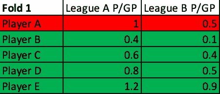**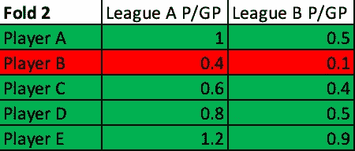**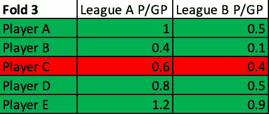**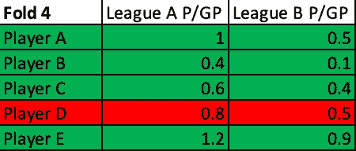**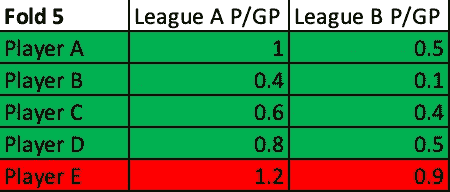*

*使用每一组可能的参数对每个折叠进行交叉验证，以在训练集上建立模型，并在测试集上对其进行测试。在完成所有 5 个折叠的交叉验证后，获得每组参数的平均测试值。具有最佳平均测试值(在这种情况下，最低平均绝对误差)的参数集被认为是构建 NHLe 模型的最佳参数集。*

*我的 5 重交叉验证的结果确定了以下一组最佳参数:*

*   *可用的顶部路径将是具有最少边的路径，如果两条路径具有相同数量的边，则总权重被用作平局决胜符。*
*   *联盟将使用最多前 11 条路径。*
*   *至少有 8 个过渡玩家实例的路径是有效的；所有其他的都将被丢弃。*
*   *世界青年队(U18 和 U20)都将被使用。*
*   *积分总和将除以每个联赛的比赛总和，以确定两个联赛之间的转换系数。*
*   *在创建任何进一步的路径之前，第一个连接联盟将被永久删除。*

*这五次折叠的平均绝对误差的平均值为 0.33。(我也计算了 R，也是 0.33，但选择不将其作为训练的目标参数。)*

*设置好这些参数后，这一次是时候使用整个数据集构建模型了。以下是最终 NHLe 模型的每个联赛的同等分数:*

```
*╔══════════════════╦═══════╗
║      League      ║ NHLe  ║
╠══════════════════╬═══════╣
║ NHL              ║     1 ║
║ KHL              ║ 0.772 ║
║ Czech            ║ 0.583 ║
║ SHL              ║ 0.566 ║
║ NLA              ║ 0.459 ║
║ Liiga            ║ 0.441 ║
║ AHL              ║ 0.389 ║
║ DEL              ║ 0.352 ║
║ Allsvenskan      ║ 0.351 ║
║ VHL              ║ 0.328 ║
║ Slovakia         ║ 0.295 ║
║ EBEL             ║ 0.269 ║
║ WJC-20           ║ 0.269 ║
║ France           ║ 0.250 ║
║ Belarus          ║ 0.242 ║
║ Czech2           ║ 0.240 ║
║ EIHL             ║ 0.235 ║
║ LNAH             ║ 0.232 ║
║ DEL2             ║ 0.205 ║
║ Kazakhstan       ║ 0.201 ║
║ NCAA             ║ 0.194 ║
║ Denmark          ║ 0.190 ║
║ Mestis           ║ 0.178 ║
║ NLB              ║ 0.176 ║
║ Italy            ║ 0.176 ║
║ Norway           ║ 0.173 ║
║ ECHL             ║ 0.147 ║
║ OHL              ║ 0.144 ║
║ MHL              ║ 0.143 ║
║ USHL             ║ 0.143 ║
║ WHL              ║ 0.141 ║
║ Poland           ║ 0.135 ║
║ WJC-18           ║ 0.135 ║
║ Russia3          ║ 0.135 ║
║ Usports          ║ 0.125 ║
║ USDP             ║ 0.121 ║
║ QMJHL            ║ 0.113 ║
║ Division-1       ║ 0.109 ║
║ Czech3           ║ 0.104 ║
║ Erste-Liga       ║ 0.103 ║
║ Slovakia2        ║ 0.102 ║
║ Romania          ║ 0.099 ║
║ Superelit        ║ 0.091 ║
║ NAHL             ║ 0.087 ║
║ Germany3         ║ 0.085 ║
║ ALPSHL           ║ 0.084 ║
║ U20 SM-Liiga     ║ 0.083 ║
║ BCHL             ║ 0.080 ║
║ NMHL             ║ 0.076 ║
║ Czech-U20        ║ 0.074 ║
║ AJHL             ║ 0.062 ║
║ EJHL             ║ 0.060 ║
║ Czech U19        ║ 0.059 ║
║ SwissDiv1        ║ 0.054 ║
║ Belarus-Vysshaya ║ 0.052 ║
║ SJHL             ║ 0.052 ║
║ U20-Elit         ║ 0.049 ║
║ CCHL             ║ 0.048 ║
║ MJHL             ║ 0.046 ║
║ USPHL-Premier    ║ 0.046 ║
║ Slovakia-U20     ║ 0.044 ║
║ Russia-U17       ║ 0.044 ║
║ USPHL-18U        ║ 0.041 ║
║ U18 SM-Sarja     ║ 0.040 ║
║ NAPHL-18U        ║ 0.039 ║
║ Czech U18        ║ 0.038 ║
║ J18 Allsvenskan  ║ 0.038 ║
║ Division-2       ║ 0.038 ║
║ MJAHL            ║ 0.037 ║
║ QJAAAHL          ║ 0.036 ║
║ MPHL             ║ 0.035 ║
║ OJHL             ║ 0.034 ║
║ HPHL-16U         ║ 0.034 ║
║ Slovenia         ║ 0.033 ║
║ Russia-U18       ║ 0.032 ║
║ 16U-AAA          ║ 0.031 ║
║ J18-Elit         ║ 0.029 ║
║ USHS-Prep        ║ 0.028 ║
║ QMAAA            ║ 0.028 ║
║ CISAA            ║ 0.027 ║
║ Norway2          ║ 0.027 ║
║ USPHL-16U        ║ 0.027 ║
║ GOJHL            ║ 0.027 ║
║ AYHL-16U         ║ 0.026 ║
║ Russia-U16       ║ 0.025 ║
║ J20-Elit         ║ 0.024 ║
║ USHS-MN          ║ 0.024 ║
║ DNL              ║ 0.024 ║
║ Denmark2         ║ 0.023 ║
║ VIJHL            ║ 0.021 ║
║ NOJHL            ║ 0.021 ║
║ Slovakia-U18     ║ 0.020 ║
║ CAHS             ║ 0.020 ║
║ AMHL             ║ 0.020 ║
║ PIJHL            ║ 0.020 ║
║ KIJHL            ║ 0.020 ║
║ U17-Elit         ║ 0.018 ║
║ II-DivisioonA    ║ 0.018 ║
║ U20-Top          ║ 0.017 ║
║ BCMML            ║ 0.016 ║
║ U16 SM-Sarja     ║ 0.015 ║
║ NSMMHL           ║ 0.015 ║
║ Czech U16        ║ 0.014 ║
║ Denmark-U20      ║ 0.013 ║
║ MMHL             ║ 0.013 ║
║ U16 SM-Sarja-Q   ║ 0.012 ║
║ GTHL-U16         ║ 0.012 ║
║ J20-Div.1        ║ 0.011 ║
║ U16-SM           ║ 0.011 ║
║ U16-ELIT         ║ 0.010 ║
║ Alliance-U16     ║ 0.009 ║
║ GTHL-U18         ║ 0.008 ║
║ J18-Div.1        ║ 0.008 ║
║ Division-4       ║ 0.008 ║
║ QMEAA            ║ 0.007 ║
║ J20-Div.2        ║ 0.007 ║
║ Denmark-U17      ║ 0.006 ║
║ U16-Div.1        ║ 0.005 ║
║ J18-Div.2        ║ 0.005 ║
║ ETAHL U18        ║ 0.005 ║
║ AMMHL            ║ 0.005 ║
║ QBAAA            ║ 0.004 ║
║ AMBHL            ║ 0.002 ║
║ U16-Div.2        ║ 0.002 ║
╚══════════════════╩═══════╝*
```

*请注意，其中一些联盟与其他联盟合并。例如，在 KHL 出现之前，在 EliteProspects 数据库中有一个名为“俄国”的联盟，实际上就是 KHL；我只是把这两个合并成了 KHL。“俄罗斯 2”和 VHL 以及另外一两个联赛也是如此。*

*当我提到 2013 年鲨鱼队选中米尔科·穆勒时，我从未看过他打球时，我暗示了这一点，但让我非常明确地说:**我是** **而不是一个有前景的人**。我一生都是鲨鱼队的球迷，十多年来我一直密切关注 NHL，但我从来没有密切关注过任何其他联盟，这意味着我不太清楚 T4 应该是什么样子。我缺乏潜在客户领域的专业知识，这带来了一些好处和坏处:*

*   *我对某些联赛没有任何先入为主的想法，所以在建立模型的时候我不会去确认任何偏见。*
*   *不利因素:如果不知道事情应该是怎样的，我就很难识别代码中的 bug 和错误，然后在我成功的时候排除并修复它们。这个问题主要与我花费的时间有关，因为据我所知，最终的模型是没有错误的。*
*   ***赞成:**我知道这个模型不仅可能非常糟糕，而且如果是这样的话，我将无法用肉眼识别，这促使我采取高度稳健的数学方法来确保这个模型是合理的好模型。*
*   ***反对意见:**我很难理解和表达我工作的局限性，尤其是从实践的角度来看。例如，我可以查看我的战争模型的输出，并说“这高估了米科·兰塔宁，低估了内森·麦金农，因为它通常高估了像这样的双人组的终结者，我已经看了足够多的比赛，知道麦金农远远更胜一筹。”我很难表达(甚至理解)为什么我的 NHLe 模型高估了欧洲男子联赛，低估了青年联赛，尽管这是我的总体印象。*

*最后，我在这里做了大量的工作，只是对 CJ 的 NHLe 模型做了一些我认为是微不足道的升级，他自己说“比原始版本(经典 NHLe)精确得可以忽略不计。”我对此很满意，因为我在这个过程中学到了很多，在确认 CJ 已经做了几乎所有正确的事情后，我现在对这个模型更有信心了。虽然还可以做更多的事情来改进这项工作，并建立一个更好的模型，但我认为公平地说，我们很可能已经达到了收益递减的点。*

*我对以后重新访问 NHLe 框架持开放态度，我建议任何对如何改进我的工作有想法的人都来试试。但现在，我对我建立的模型很满意，我有信心用它来比较不同联盟的两个潜在客户的得分率。*

*下一步，我将在第 3 部分中介绍，使用这些得分率来预测未来在 NHL 级别的成功。*