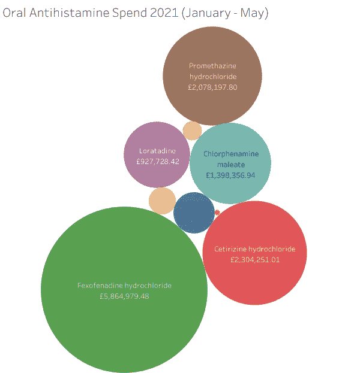
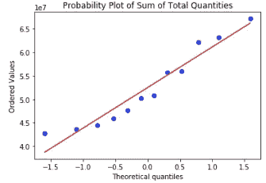
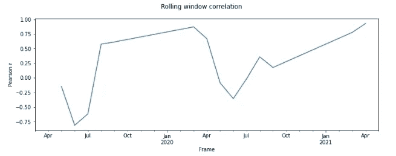
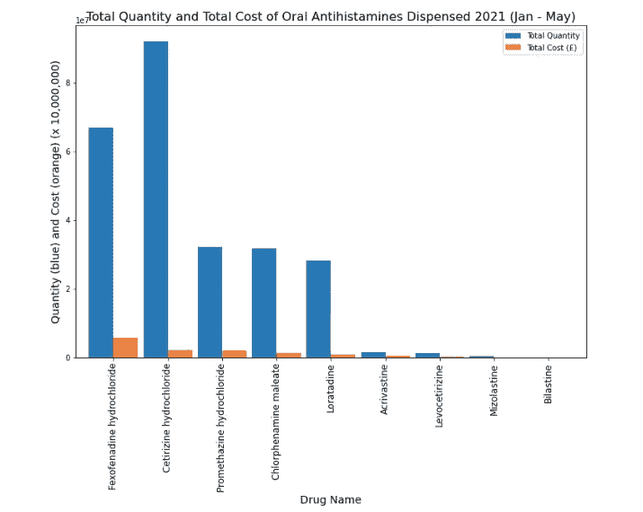
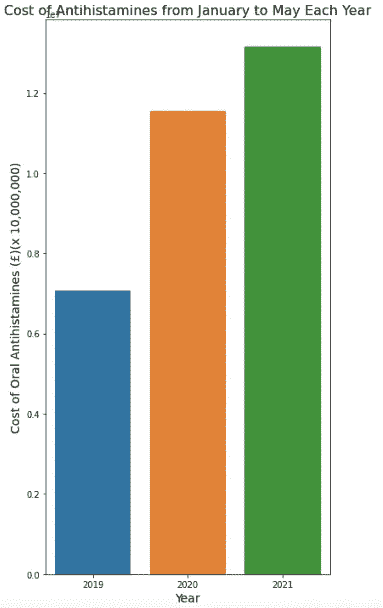
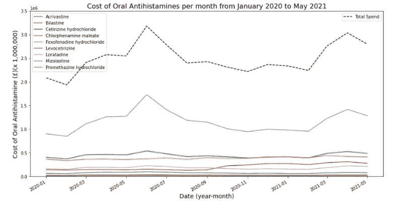
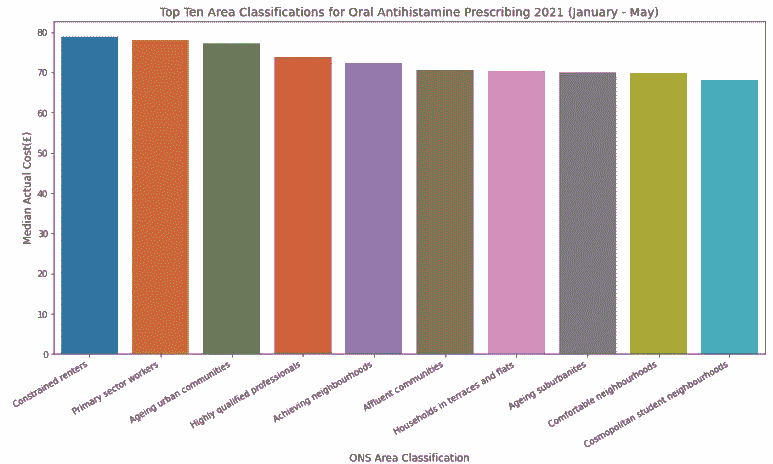
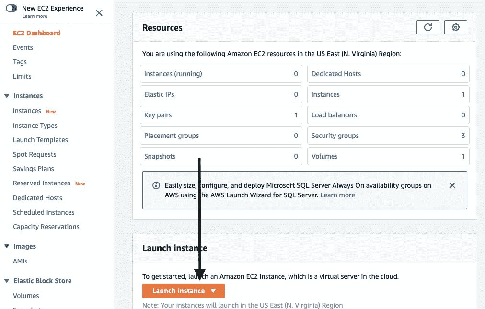

# 使用 Python 进行 NHS 英文处方数据(EPD)分析(第 2 部分)

> 原文：<https://towardsdatascience.com/nhs-english-prescibing-data-epd-analysis-using-python-part-2-aa990e4e47dd?source=collection_archive---------34----------------------->

## 浏览数据并连接到远程服务器

> “英国处方数据集包含在英格兰、威尔士、苏格兰、根西岛、奥尔德尼岛、泽西岛和马恩岛开具的处方的详细信息。”— [NHSBSA](https://www.nhsbsa.nhs.uk/prescription-data/prescribing-data/english-prescribing-data-epd)



这个可视化是在 tableau 公开，更多细节可以查看[这里](https://public.tableau.com/app/profile/adenrele.komolafe/viz/OralAntihistaminesEPD/Packedbubble)。每个气泡的大小与 2021 年(1 月至 5 月)分发的所有单位药物的总成本(以英镑计)成比例。

在本系列的第一部分中，通过使用请求获取 URL 并使用 Pandas 读取数据帧，提取两个数据集需要 25 分钟，指定数据需要两个月。对于一个需要一年的开发和训练样本数据的项目来说，这显然是低效的。

这里的目标是提高时间效率，探索数据并连接到远程服务器，为计算量大的任务做准备。

## **内容概要**:

使用 SQL 从 CKAN(开放数据门户)API 提取数据。

探索性数据分析的要点(国家抗组胺药支出、正态性检验、量化相关性、按 ONS 区域分类开处方等)。

如何使用免费的 AWS EC2 云计算服务分配任务？

# 使用 SQL 从 CKAN API 提取数据

正如 Adam Ivison 在 Github 知识库[这里](https://gitlab.com/nhsbsa/insight/shared/coffee-and-coding/-/tree/master/2021-05-19%20Get%20to%20grips%20with%20R%20and%20Python%20on%20our%20Open%20Data%20Portal)中所分享的，可以使用 SQL 提取数据。根据我对仅用于管理花粉热的口服抗组胺药数据的需求，对该代码进行了修改。

值得注意的是，NHS 组织结构的变化导致了从地区团队到 STP(可持续转型伙伴关系)的变化。当使用此方法选择区域团队或 STP 时，试图在一个查询中提取 2020 年 4 月之前和之后的数据会导致错误，因为这是试图选择在指定时间范围内不存在的列。

包含随时间保持一致的地理数据的列是邮政编码列。提取后，包含邮政编码、地区分类和地区名称的 ONS 数据集被合并到该数据集。

使用此方法提取数据所需的时间记录如下。在第一部分中，提取两个数据集需要 25 分钟。在这里，要求不到 30 秒。这要快 50 多倍。


# 探索性数据分析(EDA)的亮点

## 分配


从上面可以看出，每年口服抗组胺药的数量似乎遵循正态分布。每天各种花粉的最高花粉计数和口服抗组胺药的供应量之间似乎也有某种关系。必须确认和/或量化这种关系和分布。

为了检查 2019 年的数据是否呈正态分布，数据将被传递到概率图中，并使用夏皮罗-威尔克检验进行调查。



该测试得出的 p 值为 0.27，远远高于 0.05 的显著性水平。不能拒绝数据正态分布的零假设。该信息将通知进一步的测试，例如统计显著性差异的测试。

## 相互关系

测量花粉计数和口服抗组胺药剂量之间相关性的方法选择了全局和滚动皮尔逊 r。这种方法受到假设关系是线性的限制。它也容易受到离群值的影响。

此外，花粉计数数据仅由英国气象局每年 3 月至 8 月收集。皮尔逊的 r 只能用等长的列表来计算。在本例中，缺失值没有用零或任何平均值填充，计算仅限于这些月份。

**滚动关联**



**全球关联**

r 值为 0.22(全局)表示相关性非常弱，在给定 p 值的情况下，这种相关性不具有统计学意义。然而，滚动值提供了不同的图像，在某些点 r 接近 1。这个测试非常简单；更复杂的方法是可用的，将需要探索。

## 药物



到目前为止，在 2021 年(1 月至 5 月)，分发量最大的口服抗组胺药是西替利嗪(92，103，775 单位，2，304，251.01)，然而，非索非那定(66，969，119 单位，5，864，979.48)的价格更高。对于所有抗组胺药，总数为 13，170，473.0。

从 2019 年(24，246，297.41 英镑)到 2020 年(29，235，249.51 英镑)，抗组胺药处方的成本增加了 21%。我们目前正在进行类似的支出增加，但是，这需要在本系列的另一部分中建立的模型的确认。



2019 年、2020 年和 2021 年 1 月至 5 月抗组胺药处方费用比较。

2020 年 12 月，MHRA 宣布将用于治疗花粉热的非索非那定(Allevia)从仅处方药物(POM)重新分类为仅药房(P)和普通销售清单(GSL ),强度分别为 180mg 和 120mg。这一变化应该会为卫生服务带来节约，然而，这还没有发生……还没有。值得注意的是，截至 2021 年 7 月 1 日，120 毫克产品尚未在英国上市。



花费数百万在口服抗组胺药上。这里可以清楚地看到非索非那定处方的影响。

## ONS 地区分类

使用邮政编码作为关键字，来自国家统计局的数据被加入到 EPD 数据框架中。这允许探索按国家统计局地区分类开处方。每个地区口服抗组胺药处方的平均成本如下所示。



由于该数据是正态分布的，但是具有不相等的总体规模，所以 Welch 的 t 检验是可以用来检验显著差异的检验的一个例子。下面测试了前两个区域类。

p 值超过了所选的显著性水平 0.05。因此，不能拒绝零假设；平均值之间没有统计学上的显著差异。

# 限制

包括但不限于:

*   抗组胺药用于多种适应症。该分析没有考虑非索非那定是否用于治疗花粉热或荨麻疹。
*   每个项目的患者数量不包括在数据集中。在[open prescriming](https://openprescribing.net)平台上可以获得与 GP surgerys 记录中每个患者的项目相关的数据。
*   该数据集不包括在医院或初级保健之外的其他场所开出的药物。

# 使用免费的 AWS EC2 云计算服务分发任务

在这一点上，在任何分析或可视化完成之前，我的大部分时间都花在了提取数据上。型号选择，如果我想节省时间，就需要比我的 2017 款 MacbookAir 更强大的机器。

购买另一台机器不是一个选项，但是，作为在萨里大学教授数据科学课程的结果，我能够使用 XML-RPC 编写非常简单的分布式程序。下面描述了这样做的步骤。

## 启动实例

1.  在 EC2 仪表板中，**启动一个实例**。尽管作为学生我有免费学分，但我还是选择了免费等级选项。额外的计算能力也许有一天会派上用场。



2.**配置安全组。**组内的详细信息将由连接方法、选择的端口和您希望授予权限的机器决定。我选择了端口 9999 和下面的设置。

**入库规则**


**出库规则**


3.**确保密钥对(。pem 文件)被下载**(如果你还没有的话)。我还将它存储在与这个项目相关的所有文档相同的位置/文件路径中。这将使过程变得容易得多。

## 连接到实例

1.  在终端(Mac)中，导航到存放与项目相关的所有文件的位置，包括。pem 文件。 *ls* 和 *cd* 命令分别对查看目录中的文件和更改目录最有帮助。用于自动完成目录/文件名的**选项卡**键有助于避免错误。对我来说，文件夹/目录的导航显示为:

```
cd Documents/Personal\ Projects/Prescribing\ data/Part\ 2/
```

2.一旦在 EC2 仪表板中选择了实例，就可以找到该实例的公共 IP 地址。在目录中，输入:

```
Enter ssh -i [pem-file-name].pem ec2-user@[public-IP]
```

成功的连接会提示在终端中出现以下消息。


与实例建立连接后出现在终端中的消息图像。

## 创建一个(或多个)分布式程序

1.  在. py 文件中编写服务器(实例)的说明。

2.发送到实例的根目录。

```
scp -i [pem-file-name].pem [file-name].py ec2-user@[Public IP]:~/
```

3.在本地机器/客户端中，运行该函数以完成所需的任务。

请看 GitHub 库[这里](https://github.com/Adenrele/Hayfever-NHS-Prescribing-Data-)。

我希望这有所帮助。欢迎在这里、Twitter 或 LinkedIn 上留下反馈。

有助于这一过程的文章有:

Jin Hyun Seun，量化时间序列数据间同步性的四种方法(2019)，[https://towardsdatascience . com/Four-ways-to-quantify-synchronous-between-time-series-data-b 99136 C4 a9 c 9](/four-ways-to-quantify-synchrony-between-time-series-data-b99136c4a9c9)