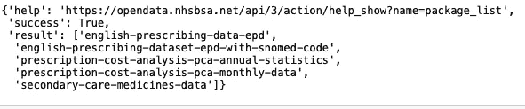
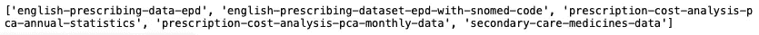
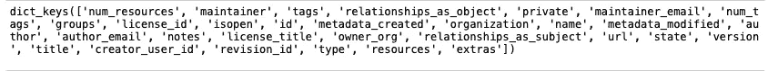
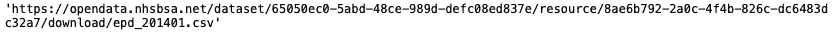
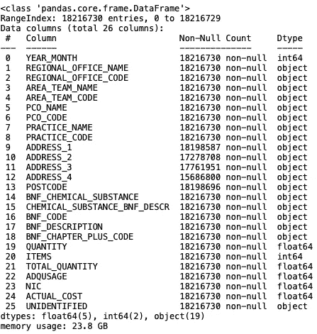
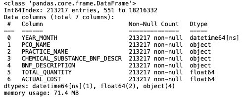
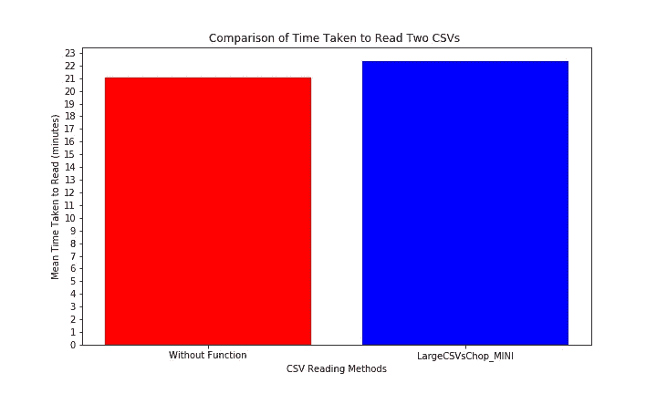

# 使用 Python 进行 NHS 英语处方数据分析(第 1 部分)

> 原文：<https://towardsdatascience.com/nhs-english-prescribing-data-analysis-using-python-9d86ec610880?source=collection_archive---------23----------------------->

## 提取和转换

# 共享的方法:

使用请求从 CKAN API 提取数据(存储效率)。

使用 Pandas 读取数据(内存效率)。

# 目的


玛格达·波吕祖克在 [Unsplash](https://unsplash.com?utm_source=medium&utm_medium=referral) 上拍摄的照片

在一个相对凉爽的夜晚打喷嚏和咳嗽时，我决定探索季节性过敏性鼻炎(花粉热)的处方数据。更远的目标是利用花粉计数数据和处方数据建立一个模型。

在这个持续的过程中，我面临着多重挑战。在这里，我描述了在 2017 款 Macbook Air (8GB 内存、22GB 可用存储空间、i5 双核处理器)的限制下提取数据的方法

# 从 CKAN API 中提取数据

第一步需要获得足够的数据，以分成开发、训练和测试样本。使用一整年的数据来开发我的未来模型似乎是合理的，因为整个季节都会被考虑在内。

第一个问题，存储。 [NHSBA 网站](https://www.nhsbsa.nhs.uk/prescription-data/prescribing-data/english-prescribing-data-epd)(一个月)上的一个 CSV 文件大小至少为 6GB。这占了剩余可用存储空间的近 30%。

解决办法？通过 NHSBSA 使用的 [API](https://docs.ckan.org/en/2.8/api/) 将 CSV 读入内存中的 Pandas 数据帧。代码如下。

```
#Import the requests module. import requests#The url, described within the API documentation, is used to view the datasets available.url = “[http://opendata.nhsbsa.net/api/3/action/package_list](http://opendata.nhsbsa.net/api/3/action/package_list)"#Request to obtain data from a url.
response = requests.get(url)#Status code 200 means the request was successful.response.status_code#Display the response as a dictionary.
response.json()
```



```
#Print the values in the ‘result’ key.
#The ‘result’ key contains the names of datasets which are available.
print(response.json()[‘result’])
```



```
#Using the API documentation, the url containing the medicines data #was deduced and tested.url2 = "[http://opendata.nhsbsa.net/api/3/action/package_show?id=english-prescribing-data-epd](http://opendata.nhsbsa.net/api/3/action/package_show?id=english-prescribing-data-epd)"
response2 = requests.get(url2)
response2_json = response2.json() 
response2.status_code#The keys within the output of the results were investigated.
response2_json['result'].keys()
```



```
#Each dataset for medicines in secondary care is stored within csv files downloadable through a url.response2_json[‘result’][‘resources’][0][‘url’]
```



```
#Each url is passed into a list.datasets =[]
for num in range(len(response2_json['result']['resources'])):
    datasets.append(response2_json['result']['resources'][num]['url'])
datasets
```

# **读取数据**

试图阅读上面列表中的每个 CSV 会导致浪费数小时的等待时间，然后 Jupyter 笔记本崩溃。首先，我调查了一个数据帧的内存使用情况。

```
#Here, an entire CSV (one month) is read to memory. import pandas as pd
test_df = pd.read_csv(datasets[60], sep =",") #The info() function outputs information about the data frame. #Additional arguments such as 'memory_usage' and 'null_counts' can #be used to determine the amount of information returned at the cost #of computational power.test_df.info(memory_usage='deep', null_counts=True, verbose=True)
```



23.8GB，惊人！在进一步研究数据以确定最合适的特征、记录和数据类型之后，创建了下面的函数。它节省内存和时间；仅读取所需的列，在适当的情况下将数据类型更改为使用较少内存的类型，并根据需要过滤记录。

```
from datetime import datetimedef LargeCSVsChop(listofCSV_URLs):

    dfs = []
    for num in range(len(listofCSV_URLs)):feats = ['YEAR_MONTH', 'PCO_NAME', 'PRACTICE_NAME', 'CHEMICAL_SUBSTANCE_BNF_DESCR', 
                'BNF_DESCRIPTION', 'TOTAL_QUANTITY', 'ACTUAL_COST']

        custom_date_parser = lambda x: datetime.strptime(x, "%Y%m")

        df = pd.read_csv(listofCSV_URLs[num], sep =",", usecols = feats, date_parser=custom_date_parser,
                                                                         parse_dates=['YEAR_MONTH'])

        """"
        'feats' is a list of the columns/features from the CSV that I want Pandas to read to memory.

        types = {'TOTAL_QUANTITY': int, 'ACTUAL_COST':float}

        Types is a dictionary of columns and the datatypes they should be read as using dtypes = types in the read_csv function. 

        The types are optimal so no changes will be made but the dictionary can be used in future.    

        'custom_data_parser' will be used to convert the dtype of the YEAR_MONTH feature to date format.The dataframe will read only feats and convert the dtype of the YEAR_MONTH feature.

        'df' is used as a variable again for the filtered dataframe to prompt the deallocation of the unfiltered
        #dataframe object from memory by dropping the reference count to zero and prompting garbage collection algorithms.

        Oral antihistamines will be the focus of this analysis. 'CHEMICAL_SUBSTANCE_BNF_DESCR' is used to ensure all
        forms and brands of the drugs are captured. Further work is done using 'BNF_DESCRIPTION' to remove unwanted products.

        """

        df = df[ 
               (df['CHEMICAL_SUBSTANCE_BNF_DESCR']=='Cetirizine hydrochloride')                              | 
               (df['CHEMICAL_SUBSTANCE_BNF_DESCR']=='Loratadine')                                            |
               (df['CHEMICAL_SUBSTANCE_BNF_DESCR']=='Desloratadine')                                         |
               (df['CHEMICAL_SUBSTANCE_BNF_DESCR']=='Fexofenadine hydrochloride')                            |
               (df['CHEMICAL_SUBSTANCE_BNF_DESCR']=='Acrivastine')                                           |
               (df['CHEMICAL_SUBSTANCE_BNF_DESCR']=='Bilastine')                                             |
               (df['CHEMICAL_SUBSTANCE_BNF_DESCR']=='Levocetirizine')                                        |
               (df['CHEMICAL_SUBSTANCE_BNF_DESCR']=='Mizolastine')                                           |
               (df['CHEMICAL_SUBSTANCE_BNF_DESCR']=='Chlorphenamine maleate')                                & 
               (df['BNF_DESCRIPTION']!='Chlorphenamine 10mg/1ml solution for injection ampoules')            |
               (df['CHEMICAL_SUBSTANCE_BNF_DESCR']=='Promethazine hydrochloride')                            &
               (df['BNF_DESCRIPTION']!='Promethazine 25mg/1ml solution for injection ampoules')              &
               (df['BNF_DESCRIPTION']!='Phenergan 25mg/1ml solution for injection ampoules')                   
             ]

        dfs.append(df)

    df_large = pd.concat(dfs)

    return df_large
```

结果数据框的大小如下所示。一个巨大的差异。

```
Jan_2019_df = LargeCSVsChop(datasets[60:61])Jan_2019_df.info(memory_usage='deep', null_counts=True, verbose=True)
```



# 时间

不幸的是，我发现读取 CSV 所花费的时间仍然相似。我假设，这是由于文档是从 URL 读取的，因此依赖于带宽。

因此，在本系列的第 2 部分中，我将通过 AWS 提供给学生的虚拟机来运行这个特定的任务。这应该释放我的机器，而 EDA 正在进行。

下面的函数是我在算法数据科学模块中学到的，可以用来测量使用/不使用该函数读取 CSV 所需的时间。

```
import time
import numpy as npdef timefunc(function, arg, repeats = 20):

    alltime = []

    while  repeats > 0:

        """
        Unless specified, the number of repitions will be 20.

        """

        starttime= time.time() # record the start timeresult = function(arg) # run the function and store in the variable 'result' in case result is needed.endtime = time.time() # Record end time.timetaken = endtime - starttime 

        alltime.append(timetaken) 

        repeats -=1  

    mean = np.mean(alltime) 
    std = np.std(alltime) 
    error=std/(len(alltime)**0.5)   

    return (mean)Without_ncols = timefunc(FuncReadCSV, datasets[60:62], repeats = 1)
With_ncols = timefunc(LargeCSVsChop_MINI, datasets[60:62], repeats = 1)#LargeCSVsChop_MINI reads the CSV and parses the YEAR_MONTH column #but filtering of the dataframe is not included. This is to #facilitate like for like comparisons.import matplotlib.pyplot as plt
%matplotlib inlinefig,ax1=plt.subplots(figsize=(10,6))plt.xlabel(‘CSV Reading Methods’)
plt.ylabel(‘Mean Time Taken to Read (minutes)’)
plt.title(‘Comparison of Time Taken to Read Two CSVs')plt.yticks(range(100))

plt.bar(height=Without_ncols/60,x = 'Without Function', color = 'red')
plt.bar(height=With_ncols/60,x='LargeCSVsChop_MINI', color = 'blue')
plt.savefig('Time taken')
```



我希望你已经发现这是有用的。我将感谢对我的代码的反馈。我的 GitHub 库的链接是这里的。

有助于这一过程的文章有:

[1] Vincent Teyssier，针对低内存环境优化熊猫数据帧的大小(2018)，[https://Vincent Teyssier . medium . com/Optimizing-the-size-of-a-pandas-data frame-for-low-memory-environment-5f 07 db 3d 72e](https://vincentteyssier.medium.com/optimizing-the-size-of-a-pandas-dataframe-for-low-memory-environment-5f07db3d72e)

[2] B.Chen，用 Pandas read_csv() (2020，[https://towards data science . com/4-tricks-you-should-know-to-parse-date-columns-with-Pandas-read-CSV-27355 bb 2 ad 0e](/4-tricks-you-should-know-to-parse-date-columns-with-pandas-read-csv-27355bb2ad0e)

[3] B.Chen，为低内存环境优化熊猫数据帧的大小，(2020)，[https://vincentteyssier . medium . com/Optimizing-the-size-of-a-pandas-data frame-for-low-memory-environment-5f 07 db 3d 72e](https://vincentteyssier.medium.com/optimizing-the-size-of-a-pandas-dataframe-for-low-memory-environment-5f07db3d72e)