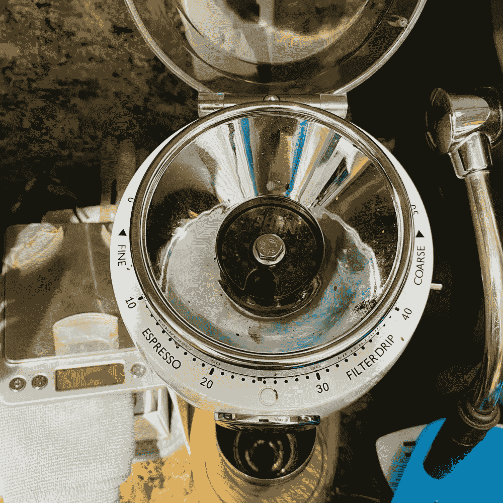
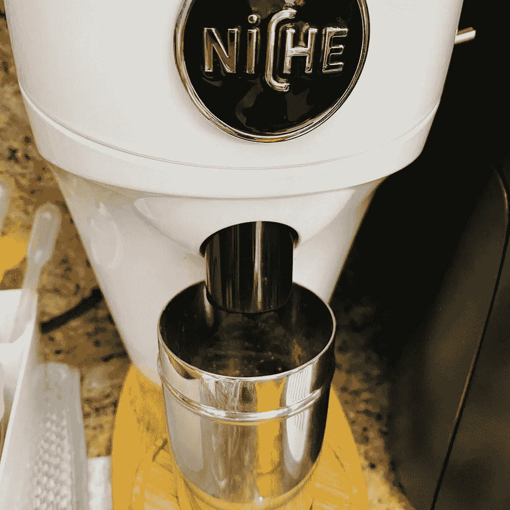
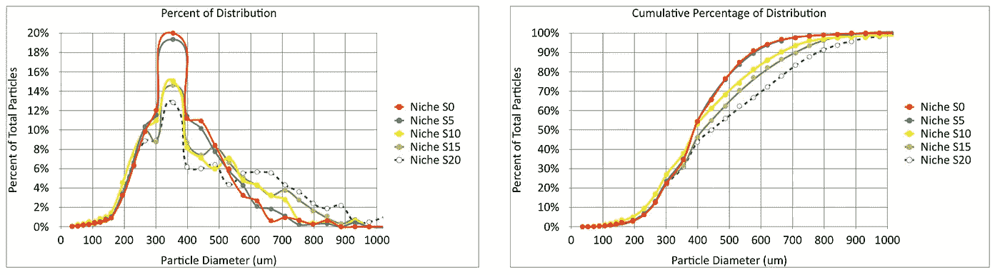
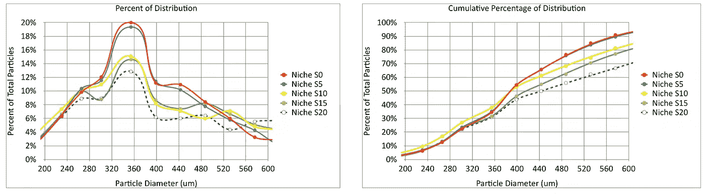
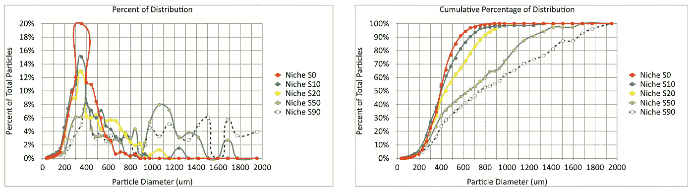
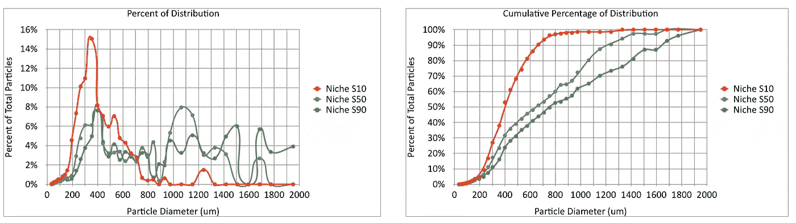
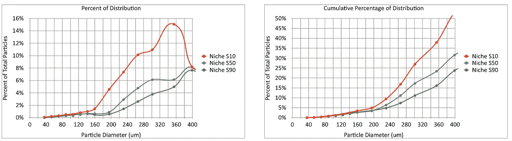

# 研磨环境中的利基咖啡分销

> 原文：<https://towardsdatascience.com/niche-coffee-distribution-across-grind-settings-c198b06bac1b?source=collection_archive---------25----------------------->

## 咖啡数据科学

## 调整设置，直到它变得奇怪

当我买了一个利基市场时，我没有想到我会陷入如此深的困境，但我们现在就在这里。我一直在设计一些通过电动研磨机变得更容易的[分层镜头](https://rmckeon.medium.com/a-summary-of-the-staccato-lifestyle-dd1dc6d4b861)，我想更好地了解研磨设置如何影响[粒子分布](https://medium.com/nerd-for-tech/measuring-coffee-grind-distribution-d37a39ffc215)。

通常，这些类型的曲线将在一个设置下比较研磨机。然而，我想在一个设置之外描述研磨机的性能。我将从浓缩咖啡的 5 个非常接近的设置开始，然后我将看一下更粗糙的设置。

所有图片由作者提供。我的小生磨挤在我的超级自动和工具箱之间。

设置 10 至 20 适用于浓缩咖啡。设置 30 至 40 用于滴注。除此之外，没有太多的指导。

# 5 关闭浓缩咖啡或更精细咖啡的设置

我将从 5 个设置开始，根据烘焙的不同，这里的某个地方是浓缩咖啡的最佳研磨点。

我们可以放大，大部分分布都是一样的，直到粒子直径达到 360um。然后他们开始分歧。这就讲了一个在镜头里拨号的有趣故事。

> 在浓缩咖啡中拨号是对非精细颗粒的调整。

# 粗糙研磨设置

然后，我将设置 50 和设置 90 与一些浓缩咖啡的设置进行了比较。设置 90 是当你把转盘转到底，逆时针转到 0。我估计，如果刻度线继续均匀分布的话，它大概在 90 的位置。

对于 S90 来说，事情真的变得很奇怪。所以我把所有的都去掉了，除了设置 10，这对于浓缩咖啡来说还是很好的

特别有趣的是小于 400 微米的颗粒。好像有很多。让我们放大一下:

从这些照片中，160 微米以下的细颗粒似乎以相似的百分比排列。这些罚款似乎是不可避免的，并且指向了咖啡豆本身之外的[潜在根源。对于设置 50 和 10，它们趋向于稍微超过 200um。](https://link.medium.com/W0es1q9EIeb)

当我经历这些不同的研磨设置时，我非常享受粒子分布的怪异。我们喜欢认为这些分布是平滑的，但实际上，咖啡研磨过程是混乱的。很有可能我们在建造研磨机的时候做了很多幸运的猜测，但是我没有感觉到有人真正理解它们是如何基本工作的。我的意思是，已经做了一些工作来获得足够的理解来建造机器，但还没有深入的理解来预测为什么一个设置会产生良好的提取而另一个类似的设置不会。

如果你愿意，可以在 Twitter 和 YouTube 上关注我，我会在那里发布不同机器上的浓缩咖啡视频和浓缩咖啡相关的东西。你也可以在 [LinkedIn](https://www.linkedin.com/in/robert-mckeon-aloe-01581595?source=post_page---------------------------) 上找到我。也可以关注我[中](https://towardsdatascience.com/@rmckeon/follow)。

# [我的进一步阅读](https://rmckeon.medium.com/story-collection-splash-page-e15025710347):

[浓缩咖啡系列文章](https://rmckeon.medium.com/a-collection-of-espresso-articles-de8a3abf9917?postPublishedType=repub)

[工作和学校故事集](https://rmckeon.medium.com/a-collection-of-work-and-school-stories-6b7ca5a58318?source=your_stories_page-------------------------------------)

[个人故事和关注点](https://rmckeon.medium.com/personal-stories-and-concerns-51bd8b3e63e6?source=your_stories_page-------------------------------------)

[乐高故事启动页面](https://rmckeon.medium.com/lego-story-splash-page-b91ba4f56bc7?source=your_stories_page-------------------------------------)

[摄影启动页面](https://rmckeon.medium.com/photography-splash-page-fe93297abc06?source=your_stories_page-------------------------------------)

[使用图像处理测量咖啡研磨颗粒分布](/measuring-coffee-grind-particle-distribution-using-image-processing-84882e6dd4fd?source=your_stories_page-------------------------------------)

[使用筛子改进咖啡研磨测量](/improving-coffee-grind-measurement-using-a-sifter-7b358f9c8331?source=your_stories_page-------------------------------------)

[使用先进的图像处理技术测量咖啡渣中的粉末](/measuring-fines-in-coffee-grounds-using-advanced-image-processing-148f048bdb7?source=your_stories_page-------------------------------------)

[使用自适应阈值改善咖啡粉分布](/improving-coffee-grind-distribution-using-adaptive-thresholds-194e001f301?source=your_stories_page-------------------------------------)

[拍摄咖啡渣进行研磨分布分析](https://medium.com/nerd-for-tech/photographing-coffee-grounds-for-grind-distribution-analysis-d3494e980c28?source=your_stories_page-------------------------------------)