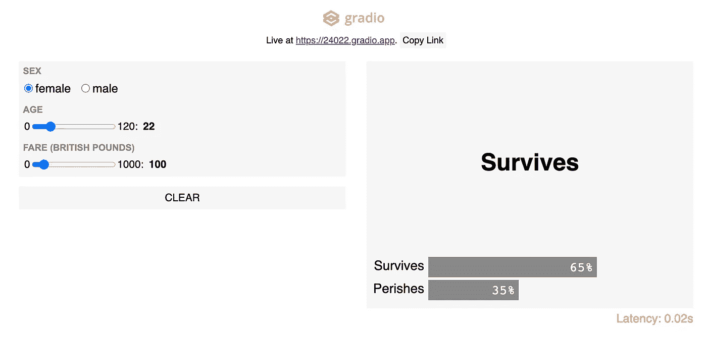

# 2022 年你应该添加到数据科学工具包中的九个新兴 Python 库

> 原文：<https://towardsdatascience.com/nine-emerging-python-libraries-you-should-add-to-your-data-science-toolkit-in-2021-85ce3d239846?source=collection_archive---------2----------------------->


道格拉斯·桑切斯在 [Unsplash](https://unsplash.com/s/photos/futuristic?utm_source=unsplash&utm_medium=referral&utm_content=creditCopyText) 上的照片

> ***一定要*** [***订阅***](https://terenceshin.medium.com/membership) ***千万不要错过另一篇关于数据科学指南、诀窍和技巧、生活经验等的文章！***

随着数据科学的不断发展，新工具的出现是再自然不过的事情了，尤其是考虑到数据科学在过去有一些重大的准入门槛。

在这篇文章中，我想回顾一下我在过去一年中遇到的九个改变游戏规则的库。这些库在我的数据科学之旅中非常有用，我想与您分享它们，希望对您的旅程也有帮助！

以下库分为三类:

1.  模型部署
2.  数据建模
3.  探索性数据分析

# 1.模型部署

## 凯德罗

鉴于数据科学非常依赖计算机科学，数据科学继续越来越多地与软件工程实践融合也就不足为奇了。随着数据科学的不断发展，许多解决方案正在形成，以帮助简化数据科学解决方案的生产。

这些解决方案之一包括 Kedro。

Kedro 是一个用于数据科学管道开发的工作流工具，它鼓励生产就绪的代码，并允许您为数据构建可移植的管道。总的来说，它应用软件工程原理来帮助您使您的代码更加标准化、可复制和模块化。

点击下面的链接，了解更多关于 Kedro 的信息:

[](/kedro-prepare-to-pimp-your-pipeline-f8f68c263466) [## 准备给你的管道拉皮条

### 用于生产就绪数据管道的新 Python 库

towardsdatascience.com](/kedro-prepare-to-pimp-your-pipeline-f8f68c263466) [](https://github.com/quantumblacklabs/kedro) [## quantumblacklabs/kedro

### Kedro 是一个开源 Python 框架，用于创建可复制、可维护和模块化的数据科学代码。它…

github.com](https://github.com/quantumblacklabs/kedro) 

## 格拉迪欧

[Gradio](https://www.gradio.app/) 让你只需三行代码就能为你的机器学习模型构建和部署 web 应用。它的用途与 Streamlit 或 Flask 相同，但我发现它更快、更容易部署模型。



图片由 Gradio 经许可拍摄

Gradio 非常有用，原因如下:

1.  它允许进一步的模型验证。具体来说，它允许您交互式地测试模型的不同输入。
2.  这是进行演示的好方法。
3.  它很容易实现和分发，因为任何人都可以通过公共链接访问 web 应用程序。

*点击以下链接，了解更多关于 Gradio 的信息:*

[](https://github.com/gradio-app/gradio) [## gradio-app/gradio

### 围绕您的模型快速创建可定制的 UI 组件。Gradio 让您可以轻松“玩耍”您的…

github.com](https://github.com/gradio-app/gradio) [](/gradio-vs-streamlit-vs-dash-vs-flask-d3defb1209a2) [## Gradio vs Streamlit vs Dash vs Flask

### 比较几种数据科学的 web UI 工具！

towardsdatascience.com](/gradio-vs-streamlit-vs-dash-vs-flask-d3defb1209a2) 

## 细流

构建机器学习和数据科学应用程序和程序可能是一个困难且往往过于复杂的过程。

Streamlit 是另一个用于创建用户界面的流行工具。它是一个开源 Python 库，用于为数据科学和机器学习构建强大的定制 web 应用程序。Streamlit 兼容几个主要的库和框架，如 Latex、OpenCV、Vega-Lite、seaborn、PyTorch、NumPy、Altair 等。

*点击下面的链接，了解更多关于 Streamlit 的信息:*

[](/quickly-build-and-deploy-an-application-with-streamlit-988ca08c7e83) [## 借助 Streamlit 快速构建和部署应用

### 将您的 Streamlit 应用程序部署到 Heroku，展示您的数据解决方案

towardsdatascience.com](/quickly-build-and-deploy-an-application-with-streamlit-988ca08c7e83) [](https://docs.streamlit.io/en/stable/getting_started.html) [## 开始-简化 0.79.0 文档

### 学习如何使用 Streamlit 的最简单方法是自己尝试。当您通读本指南时，请逐一测试…

docs.streamlit.io](https://docs.streamlit.io/en/stable/getting_started.html) 

# 2.数据建模

## **PyCaret**

在数据科学的机器学习方面，有许多任务我们希望快速完成并立即得到答案，但如果冗长的代码让我们陷入困境，就无法完成。

PyCaret 是一个**低代码**机器学习库，允许你通过快速创建模型直接从想法跳到答案。这也意味着您可以比传统方式更快地进行实验、估算缺失值、编码分类数据和特征工程。

*查看以下链接，了解更多关于 PyCaret 的信息:*

[](https://github.com/pycaret/pycaret) [## pycaret/pycaret

### PyCaret 是一个用 Python 编写的开源、低代码的机器学习库，可以自动化机器学习工作流。这是…

github.com](https://github.com/pycaret/pycaret) [](/how-to-use-pycaret-the-library-for-lazy-data-scientists-91343f960bd2) [## 如何使用 py caret——低代码 ML 的库

### 用最少的代码训练、可视化、评估、解释和部署模型。

towardsdatascience.com](/how-to-use-pycaret-the-library-for-lazy-data-scientists-91343f960bd2) 

## **先知**

时间序列是数据科学中的一个重要概念，每天都被用来对一系列场景进行有用的预测，例如，零售店的收入或城市的犯罪率。Prophet 是 Python 的一个库，允许您创建时间序列模型并将您的数据应用于这些模型，以获得自动更新的预测。

Prophet 是由脸书开发的，是一个非常强大的工具，特别是用于时间序列分析。

*点击下面的链接，了解更多关于先知的信息:*

[](https://facebook.github.io/prophet/) [## 先知

### Prophet 是一个用 R 和 Python 实现的预测程序。它速度很快，并提供完全自动化的预测…

facebook.github.io](https://facebook.github.io/prophet/) [](https://machinelearningmastery.com/time-series-forecasting-with-prophet-in-python/) [## Python -机器学习掌握中的 Prophet 时间序列预测

### 时间序列预测可能具有挑战性，因为有许多不同的方法可以使用，并且有许多不同的…

machinelearningmastery.com](https://machinelearningmastery.com/time-series-forecasting-with-prophet-in-python/) 

> ***一定要*** [***订阅***](https://terenceshin.medium.com/membership) ***千万不要错过另一篇关于数据科学的文章，包括指南、诀窍和技巧、生活经验等！***

# 3.探索性数据分析

## **熊猫简介**

Pandas Profiling 是一个 Python 库，它用一行代码完成了标准 EDA。它本质上计算几个分析，并以报告的形式显示它们，向您显示数据集的特征、变量属性、变量的相关性、缺失值、数据的分布等等。

这就像实现以下内容一样简单:

```
from pandas_profiling import ProfileReport
profile = ProfileReport(df, title="Pandas Profiling Report")
profile
```

*点击下面的链接，了解更多关于熊猫档案的信息:*

[](https://github.com/pandas-profiling/pandas-profiling) [## 熊猫简介/熊猫简介

### 文档|松弛|堆栈溢出从 pandas 数据帧生成配置文件报告。熊猫 df.describe()…

github.com](https://github.com/pandas-profiling/pandas-profiling) [](/exploratory-data-analysis-with-pandas-profiling-de3aae2ddff3) [## 探索性数据分析与熊猫概况

### 熊猫概况，探索性数据分析的完美工具。

towardsdatascience.com](/exploratory-data-analysis-with-pandas-profiling-de3aae2ddff3) 

## **童话故事**

如果你是一个 Excel 向导，那么你会喜欢 D-Tale。

D-Tale 是一个 Python 库，它可视化了熊猫的数据框架，但更具体地说，它以高度交互的数据透视表的形式来可视化它！

D-Tale 的卖点是它有许多类似于 Pandas Profiling 的特性，而且还提供了与 excel 数据透视表相关的特性，如条件格式、数据排序、数据过滤等。

*点击下面的链接，了解更多关于 D-Tale 的信息:*

[](/introduction-to-d-tale-5eddd81abe3f) [## D-Tale 简介

### 用于交互式数据探索的 D-Tale 简介

towardsdatascience.com](/introduction-to-d-tale-5eddd81abe3f) 

## **Autoviz**

如果 Pandas Profiling 和 D-Tale 不足以自动化你的 EDA 和可视化，那么 Autoviz(自动化可视化)是最好的。顾名思义，Autoviz 用很少几行代码就能把你的数据变成令人惊叹的演示。

Autoviz 可以快速找到数据中的重要特征，并通过一行代码将它们展现在你面前。这使得处理大型数据集和了解正在发生的事情变得容易，这样您就可以在对数据的整洁性印象深刻的同时做出更快的更改。

*点击下面的链接，了解更多关于 Autoviz 的信息:*

 [## AutoViz -欢迎

### AutoViz 是一个一键式可视化引擎:你只需要上传你的数据到上面的框中，然后告诉我们你的目标…

autoviz.io](https://autoviz.io/) [](/autoviz-automatically-visualize-any-dataset-ba2691a8b55a) [## Autoviz:自动可视化任何数据集

### 只需一行代码即可可视化任意大小的数据集

towardsdatascience.com](/autoviz-automatically-visualize-any-dataset-ba2691a8b55a) 

## **阴谋地**

不言而喻，图表和演示是数据科学不可或缺的一部分。图形不仅可以让您立即看到什么时候出了问题，还可以让您直观地感受到代码更改对数据的影响。

Plotly 绝对是构建可视化的必备工具，因为它非常强大，易于使用，并且具有能够与可视化交互的巨大优势。

与 Plotly 一起的还有 Dash，这是一个允许您使用 Plotly 可视化来构建动态仪表板的工具。Dash 是一个基于 web 的 python 接口，它消除了这些类型的分析 web 应用程序中对 JavaScript 的需求，并允许您在线和离线运行这些图。

*点击下面的链接，了解更多关于 Plotly 的信息:*

[](/interactive-visualizations-with-plotly-ea3f8feb87d1) [## 使用 Plotly 进行交互式可视化

### plotly.py 库简介

towardsdatascience.com](/interactive-visualizations-with-plotly-ea3f8feb87d1) [](/the-next-level-of-data-visualization-in-python-dd6e99039d5e) [## Python 中数据可视化的下一个层次

### 如何用一行 Python 代码制作出好看的、完全交互式的情节

towardsdatascience.com](/the-next-level-of-data-visualization-in-python-dd6e99039d5e) 

# 感谢阅读！

> ***一定要*** [***订阅***](https://terenceshin.medium.com/membership) ***千万不要错过另一篇关于数据科学的指南、诀窍和技巧、生活经验等文章！***

## 特伦斯·申

*   ***如果你喜欢这个，*** [***跟我上媒***](https://medium.com/@terenceshin) ***了解更多***
*   ***有兴趣合作吗？让我们连线上***[***LinkedIn***](https://www.linkedin.com/in/terenceshin/)
*   ***报名我的邮箱列表*** [***这里***](https://forms.gle/tprRyQxDC5UjhXpN6) ***！***