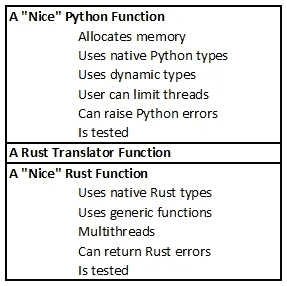
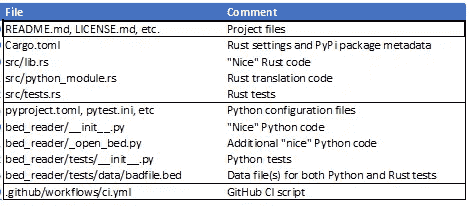

# 用 Rust 编写 Python 扩展的九条规则

> 原文：<https://towardsdatascience.com/nine-rules-for-writing-python-extensions-in-rust-d35ea3a4ec29?source=collection_archive---------2----------------------->

## Python 生物信息学包 Bed-Reader 升级的实践经验


戴维·克洛德在 [Unsplash](https://unsplash.com?utm_source=medium&utm_medium=referral) 上的照片

一年前，我受够了我们软件包的 C++扩展。我用铁锈重写了它。最终的扩展与 C/C++一样快，但是具有更好的兼容性和安全性。在这个过程中，我学到了九条规则，可以帮助您创建更好的扩展代码:

1.  创建一个包含 Rust 和 Python 项目的存储库
2.  使用 maturin & PyO3 在 Rust 中创建 Python 可调用的翻译函数
3.  让 Rust 翻译函数调用“好的”Rust 函数
4.  Python 中的预分配内存
5.  将漂亮的 Rust 错误处理转换成漂亮的 Python 错误处理
6.  用 Rayon 和 ndarray::parallel 多线程，返回任何错误
7.  允许用户控制并行线程的数量
8.  将漂亮的动态类型 Python 函数转换成漂亮的 Rust 通用函数
9.  创建 Rust 和 Python 测试

这里的“好”是指用最佳实践和本地类型创建的。换句话说，一般的策略是这样的:在顶部，编写好的 Python 代码。中间用 Rust 写一层薄薄的翻译器代码。在底部，写好 Rust 代码。



三层

这一策略看似显而易见，但遵循它可能会很棘手。本文给出了如何遵循每条规则的实用建议和示例。

[Bed-Reader](https://pypi.org/project/bed-reader/) 是一个用于读写 PLINK Bed 文件的 Python 包，PLINK Bed 文件是生物信息学中用来存储 DNA 数据的二进制格式。Bed 格式的文件可能有 1tb 那么大。Bed-Reader 让用户可以快速、随机地访问大量数据。它以用户选择的 int8、float32 或 float64 返回一个 NumPy 数组。

我希望床头阅读器扩展代码是:

*   比 Python 快
*   与 NumPy 兼容
*   完全数据并行多线程
*   兼容所有其他进行数据并行多线程的包
*   安全的

我们最初的 C++扩展给了我速度、NumPy 兼容性，以及数据并行多线程。遗憾的是，OpenMP 需要一个运行时库，而不同的 Python 包可能依赖于不同的、不兼容的运行时库版本。

Rust 给了我 C++提供的一切。除此之外，它通过在没有运行时库的情况下提供数据并行多线程解决了运行时兼容性问题。而且 Rust 编译器*保证了*线程安全。(它甚至发现了原始算法中的一个竞争条件。在 Rust 中，"[线程安全不仅仅是文档；这是法律](https://blog.rust-lang.org/2015/04/10/Fearless-Concurrency.html)”。)

在 Rust 中创建 Python 扩展需要许多设计决策。根据我在读床者上的经验，以下是我推荐的决定。为了避免含糊不清，我将把这些建议表述为规则。

## 规则 1:创建一个包含 Rust 和 Python 项目的存储库

下表显示了如何布局文件。



使用 Rust 的[常用的‘cargo new](https://doc.rust-lang.org/cargo/guide/creating-a-new-project.html)’命令创建文件`[Cargo.toml](https://github.com/fastlmm/bed-reader/blob/rust/Cargo.toml)`和`[src/lib.rs](https://github.com/fastlmm/bed-reader/blob/rust/src/lib.rs)`。Python 没有`setup.py`文件。相反，`[Cargo.toml](https://github.com/fastlmm/bed-reader/blob/rust/Cargo.toml)`包含 PyPi 包信息，比如包的名称、版本号、自述文件的位置等。没有`setup.py`的作品，`[pyproject.toml](https://github.com/fastlmm/bed-reader/blob/rust/pyproject.toml)`必须包含:

```
[build-system]
requires = ["maturin==0.12.5"]
build-backend = "maturin"
```

我们将讨论规则#2 中的“maturin”和文件`[src/python_module.rs](https://github.com/fastlmm/bed-reader/blob/rust/src/python_module.rs)`。我们将在规则 9 中讨论测试(`[src/tests.rs](https://github.com/fastlmm/bed-reader/blob/rust/src/tests.rs)`和`[bed_reader/tests](https://github.com/fastlmm/bed-reader/tree/rust/bed_reader/tests)`)。

Python 设置尽可能放在`[pyproject.toml](https://github.com/fastlmm/bed-reader/blob/rust/pyproject.toml)`中(不放在文件中，如`pytest.ini`)。Python 代码放在自己的子文件夹中，这里是`[bed_reader](https://github.com/fastlmm/bed-reader/tree/rust/bed_reader)`。

最后，我们使用 GitHub 动作来构建、测试和准备部署。那个剧本住在`[.github/workflows/ci.yml](https://github.com/fastlmm/bed-reader/blob/rust/.github/workflows/ci.yml)`里。

## 规则 2:使用 maturin & PyO3 在 Rust 中创建 Python 可调用的翻译函数

Maturin 是一个 PyPi 包，用于通过 PyO3 构建和发布 Python 扩展。PyO3 是一个 Rust crate，用于用 Rust 编写 Python 扩展。

在`[Cargo.toml](https://github.com/fastlmm/bed-reader/blob/rust/Cargo.toml)`中，包含这些 Rust 依赖项:

```
[dependencies]
thiserror = "1.0.30"
ndarray-npy = { version = "0.8.1", default-features = false }
rayon = "1.5.1"
numpy = "0.15.0"
ndarray = { version = "0.15.4", features = ["approx", "rayon"] }
pyo3 = { version = "0.15.1", features = ["extension-module"] }[dev-dependencies]
temp_testdir = "0.2.3"
```

在`[src/lib.rs](https://github.com/fastlmm/bed-reader/blob/rust/src/lib.rs)`的底部，包含这两行:

```
mod python_module;
mod tests;
```

## 规则 3:让 Rust 翻译函数调用“好的”Rust 函数

在`[src/lib.rs](https://github.com/fastlmm/bed-reader/blob/rust/src/lib.rs)`中定义“好的”Rust 函数。这些函数将完成您的包的核心工作。他们将输入和输出标准 Rust 类型，并尝试遵循 Rust 最佳实践。例如，对于 Bed-Reader 包，`read_no_alloc`是一个很好的 Rust 函数，用于从 PLINK Bed 文件中读取和返回值。

然而，Python 不能直接调用这些函数。因此，在文件`[src/python_module.rs](https://github.com/fastlmm/bed-reader/blob/rust/src/python_module.rs)`中定义 Python 可以调用的 Rust translator 函数。下面是一个翻译函数示例:

```
#[pyfn(m)]
#[pyo3(name = "read_f64")]
fn read_f64_py(
    filename: &str,
    iid_count: usize,
    sid_count: usize,
    count_a1: bool,
    iid_index: &PyArray1<usize>,
    sid_index: &PyArray1<usize>,
    val: &PyArray2<f64>,
    num_threads: usize,
) -> Result<(), PyErr> {
    let iid_index = iid_index.readonly();
    let sid_index = sid_index.readonly();
    let mut val = unsafe { val.as_array_mut() };
    let ii = &iid_index.as_slice()?;
    let si = &sid_index.as_slice()?;
    create_pool(num_threads)?.install(|| {
        read_no_alloc(
            filename,
            iid_count,
            sid_count,
            count_a1,
            ii,
            si,
            f64::NAN,
            &mut val,
       )
    })?; Ok(())
}
```

这个函数接受一个文件名、一些与文件大小相关的整数和两个一维 NumPy 数组作为输入，这两个数组告诉我们要读取哪个数据子集。该函数从文件中读取值并填充到`val`，一个预分配的 2d NumPy 数组。

请注意，该函数:

*   通过
    `let iid_index = iid_index.readonly();
    let ii = &iid_index.as_slice()?;`将 Python NumPy 1-D 数组转换成 Rust 切片，即标准的 Rust 1-D 数据结构
*   将 Python NumPy 二维数组转换成二维 Rust ndarray 对象，通过:
    `let mut val = unsafe { val.as_array_mut() };`
*   调用`read_no_alloc`，这是`[src/lib.rs](https://github.com/fastlmm/bed-reader/blob/rust/src/lib.rs)`中一个很好的 Rust 函数，它完成核心工作。
*   (后面的规则将涵盖预分配、`f64`、`PyErr,`和`create_pool(num_threads)`)

在标准 Rust 类型上定义的 Rust 函数中做核心工作，让我们可以使用 Rust 最佳实践来测试、泛型、错误等。这也给了我们一条以后提供我们软件包的 Rust 版本的途径。

## **规则 4:** 在 Python 中预分配内存

在 Python 中为我们的结果预分配内存简化了 Rust 代码。在 Python 方面，在[bed _ reader/_ open _ bed . py](https://github.com/fastlmm/bed-reader/blob/rust/bed_reader/_open_bed.py)中，我们导入了 Rust translator 函数:

```
from .bed_reader import [...] read_f64 [...]
```

然后，我们定义一个很好的 Python 函数来分配内存，调用 Rust translator 函数，并返回结果。

```
def read([...]):
    [...]
    val = np.zeros((len(iid_index), len(sid_index)), order=order, dtype=dtype)
    [...]
    reader = read_f64
    [...]
    reader(
        str(self.filepath),
        iid_count=self.iid_count,
        sid_count=self.sid_count,
        count_a1=self.count_A1,
        iid_index=iid_index,
        sid_index=sid_index,
        val=val,
        num_threads=num_threads,
    )
    [...]
    return val
```

(后面的规则会解释`reader = read_f64`和`num_threads=num_threads`。)

## 规则 5:将好的 Rust 错误处理转换成好的 Python 错误处理

为了了解如何处理错误，让我们在`read_no_alloc`(我们在`[src/lib.rs](https://github.com/fastlmm/bed-reader/blob/rust/src/lib.rs)`中的 Rust 函数)中追踪两个可能的错误。

**示例错误 1:来自标准函数的错误**—Rust 的标准`File::open`函数找不到文件或者打不开怎么办？在这种情况下，这一行中的问号:

```
let mut buf_reader = BufReader::new(File::open(filename)?);
```

将导致函数返回某个`std::io::Error`值。为了定义一个可以返回这些值的函数，我们给这个函数一个返回类型`Result<(), BedErrorPlus>`。我们将`BedErrorPlus`定义为包含所有的`std::io::Error`，如下所示:

```
use thiserror::Error;
...
/// BedErrorPlus enumerates all possible errors
/// returned by this library.
/// Based on [https://nick.groenen.me/posts/rust-error-handling/#the-library-error-type](https://nick.groenen.me/posts/rust-error-handling/#the-library-error-type)
#[derive(Error, Debug)]
pub enum BedErrorPlus {
    #[error(transparent)]
    IOError(#[from] std::io::Error), #[error(transparent)]
    BedError(#[from] BedError), #[error(transparent)]
    ThreadPoolError(#[from] ThreadPoolBuildError),
}
```

这是很好的 Rust 错误处理，但是 Python 不理解它。所以，在`[src/python_module.rs](https://github.com/fastlmm/bed-reader/blob/rust/src/python_module.rs)`中，我们翻译。首先，我们定义我们的翻译函数`read_f64_py`来返回`PyErr`。其次，我们实现了一个从`BedErrorPlus`到`PyErr`的转换器。转换器使用正确的错误消息创建正确的 Python 错误类(`IOError`、`ValueError`或`IndexError`)。看起来像是:

```
impl std::convert::From<BedErrorPlus> for PyErr {
   fn from(err: BedErrorPlus) -> PyErr {
        match err {
            BedErrorPlus::IOError(_) => PyIOError::new_err(err.to_string()),
            BedErrorPlus::ThreadPoolError(_) => PyValueError::new_err(err.to_string()),
            BedErrorPlus::BedError(BedError::IidIndexTooBig(_))
            | BedErrorPlus::BedError(BedError::SidIndexTooBig(_))
            | BedErrorPlus::BedError(BedError::IndexMismatch(_, _, _, _))
            | BedErrorPlus::BedError(BedError::IndexesTooBigForFiles(_, _))
            | BedErrorPlus::BedError(BedError::SubsetMismatch(_, _, _, _)) => {
                PyIndexError::new_err(err.to_string())
            }
            _ => PyValueError::new_err(err.to_string()),
        }
    }
}
```

**示例错误 2:特定于我们的函数**的错误—如果我们的函数`read_no_alloc`可以打开文件，但随后发现文件的格式是错误的，该怎么办？它应该产生一个自定义错误，如下所示:

```
if (BED_FILE_MAGIC1 != bytes_vector[0]) || (BED_FILE_MAGIC2 != bytes_vector[1]) {
    return Err(BedError::IllFormed(filename.to_string()).into());
}
```

`BedError::IllFormed`类型的自定义误差在`[src/lib.rs](https://github.com/fastlmm/bed-reader/blob/rust/src/lib.rs):`中定义

```
use thiserror::Error;
[...]
// [https://docs.rs/thiserror/1.0.23/thiserror/](https://docs.rs/thiserror/1.0.23/thiserror/)
#[derive(Error, Debug, Clone)]
pub enum BedError {
   #[error("Ill-formed BED file. BED file header is incorrect or length is wrong. '{0}'")]
   IllFormed(String),
[...]
}
```

其余的错误处理与示例错误#1 中的相同。

最后，对于 Rust 和 Python，对于标准错误和定制错误，结果都是带有信息性错误消息的特定错误类型。

## 规则 6:用 Rayon 和 ndarray::parallel 多线程，返回任何错误

Rust Rayon 机箱提供了简单、轻量级的数据并行多线程。ndarray::parallel 模块将 Rayon 应用于数组。通常的模式是跨一个或多个二维数组的列(或行)进行并行化。一个挑战是从并行线程返回任何错误消息。我将重点介绍两种并行处理带有错误处理的数组操作的方法。两个例子都出现在 Bed-Reader 的`[src/lib.rs](https://github.com/fastlmm/bed-reader/blob/rust/src/lib.rs)`文件中。

**方法 1:** `**par_bridge().try_for_each**`

Rayon 的`[**par_bridge**](https://doc.servo.org/rayon/iter/par_bridge/struct.IterBridge.html)`把顺序迭代器变成了并行迭代器。如果遇到错误，它的`[**try_for_each**](https://doc.servo.org/rayon/iter/trait.ParallelIterator.html#method.try_for_each)`方法将尽快停止所有处理。

在这个例子中，我们迭代两件压缩在一起的东西:

*   DNA 位置的二进制数据和
*   输出数组的列。

我们按顺序读取二进制数据，但是并行处理每一列的数据。我们停止任何错误。

```
[... not shown, read bytes for DNA location's data ...]
// Zip in the column of the output array
.zip(out_val.axis_iter_mut(nd::Axis(1)))
// In parallel, decompress the iid info and put it in its column
.par_bridge() // This seems faster that parallel zip
.try_for_each(|(bytes_vector_result, mut col)| {
    match bytes_vector_result {
        Err(e) => Err(e),
        Ok(bytes_vector) => {
           for out_iid_i in 0..out_iid_count {
              let in_iid_i = iid_index[out_iid_i];
              let i_div_4 = in_iid_i / 4;
              let i_mod_4 = in_iid_i % 4;
              let genotype_byte: u8 = (bytes_vector[i_div_4] >> (i_mod_4 * 2)) & 0x03;
              col[out_iid_i] = from_two_bits_to_value[genotype_byte as usize];
            }
            Ok(())
         }
      }
})?;
```

**方法二:** `par_azip!`

ndarray 包的`[par_azip](https://docs.rs/ndarray/0.15.4/ndarray/macro.par_azip.html)!`宏允许并行遍历一个或多个压缩在一起的数组(或数组片段)。在我看来，它非常具有可读性。但是，它不直接支持错误处理。我们可以通过将任何错误保存到结果列表中来添加错误处理。

这是一个效用函数的例子。完整的实用函数计算三个计数和求和数组的统计数据(平均值和方差)。它是并行工作的。如果在数据中发现错误，它会在结果列表中记录该错误。在所有处理之后，它检查结果列表中的错误。

```
[...]
let mut result_list: Vec<Result<(), BedError>> = vec![Ok(()); sid_count];
nd::par_azip!((mut stats_row in stats.axis_iter_mut(nd::Axis(0)),
     &n_observed in &n_observed_array,
     &sum_s in &sum_s_array,
     &sum2_s in &sum2_s_array,
     result_ptr in &mut result_list)
{
  [...some code not shown...]
});
// Check the result list for errors
result_list.par_iter().try_for_each(|x| (*x).clone())?;
[...]
```

Rayon 和 ndarray::parallel 提供了许多其他好的数据并行处理方法。请随意使用它们，只是要确保收集并返回任何错误。(不要随便用 Rust 的“慌”。)

## 规则 7:允许用户控制并行线程的数量

为了很好地处理用户的其他代码，用户必须能够控制每个函数将使用的并行线程的数量。

在 Python 的`read`函数中，我们给了用户一个可选的`num_threads`参数。如果他们没有设置它，Python 通过这个函数设置它:

```
def get_num_threads(num_threads=None):
    if num_threads is not None:
        return num_threads
    if "PST_NUM_THREADS" in os.environ:
        return int(os.environ["PST_NUM_THREADS"])
    if "NUM_THREADS" in os.environ:
        return int(os.environ["NUM_THREADS"])
    if "MKL_NUM_THREADS" in os.environ:
        return int(os.environ["MKL_NUM_THREADS"])
    return multiprocessing.cpu_count()
```

接下来，在生锈方面，我们定义`create_pool`。这个辅助函数从`num_threads`构造一个人造丝线程池对象。

```
pub fn create_pool(num_threads: usize) -> Result<rayon::ThreadPool, BedErrorPlus> {
   match rayon::ThreadPoolBuilder::new()
      .num_threads(num_threads)
      .build()
   {
      Err(e) => Err(e.into()),
      Ok(pool) => Ok(pool),
   }
}
```

最后，在 Rust translator 函数`read_f64_py`中，我们从 a `create_pool(num_threads)?.install(...)`内部调用`read_no_alloc`(漂亮的 Rust 函数)。这将所有人造丝功能限制在我们设置的`num_threads`中。

```
[...]
    create_pool(num_threads)?.install(|| {
        read_no_alloc(
            filename,
            [...]
        )
     })?;
[...]
```

## 规则 8:将漂亮的动态类型 Python 函数转换成漂亮的 Rust 通用函数

nice Python `read`函数的用户可以指定返回的 NumPy 数组的 dtype(int 8、float32 或 float64)。从这个选项中，该函数查找合适的 Rust translator 函数(`read_i8(_py)`、`read_f32(_py)`或`read_f64(_py)`)，然后调用该函数。

```
def read(
    [...]
    dtype: Optional[Union[type, str]] = "float32",
    [...]
    )
    [...]
    if dtype == np.int8:
        reader = read_i8
    elif dtype == np.float64:
        reader = read_f64
    elif dtype == np.float32:
        reader = read_f32
    else:
        raise ValueError(
          f"dtype '{val.dtype}' not known, only "
          + "'int8', 'float32', and 'float64' are allowed."
        ) reader(
       str(self.filepath),
       [...]
     )
```

三个 Rust translator 函数(在`[src/python_module.rs](https://github.com/fastlmm/bed-reader/blob/rust/src/python_module.rs)`中)调用同一个 nice Rust 函数`read_no_alloc`，在`[src/lib.rs](https://github.com/fastlmm/bed-reader/blob/rust/src/lib.rs)`中定义。以下是翻译功能`read_64`(又名`read_64_py`)的相关部分:

```
#[pyfn(m)]
#[pyo3(name = "read_f64")]
fn read_f64_py(
    [...]
    val: &PyArray2<f64>,
    num_threads: usize,
 ) -> Result<(), PyErr> {
    [...]
    let mut val = unsafe { val.as_array_mut() };
    [...]
    read_no_alloc(
        [...]
        f64::NAN,
        &mut val,
     )
     [...]
}
```

我们在`[src/lib.rs](https://github.com/fastlmm/bed-reader/blob/rust/src/lib.rs)`中将好的`read_no_alloc`函数*统称为*。也就是说，它将对任何具有正确特征的类型`TOut`起作用。其代码的相关部分如下:

```
fn read_no_alloc<TOut: Copy + Default + From<i8> + Debug + Sync + Send>(
    filename: &str,
    [...]
    missing_value: TOut,
    val: &mut nd::ArrayViewMut2<'_, TOut>,
) -> Result<(), BedErrorPlus> {
[...]
}
```

将代码组织成这三个级别(nice Python、translator Rust、nice Rust)使我们能够向 Python 用户提供动态类型的代码，同时仍然用 Rust 编写良好的通用代码。

## 规则 9:创建 Rust 和 Python 测试

您可能想只编写调用 Rust 的 Python 测试。然而，你也应该写生锈测试。Rust 测试的增加让您可以交互式地运行测试和交互式地调试。Rust 测试还为您提供了一条以后提供软件包 Rust 版本的途径。在示例项目中，两组测试都从`[bed_reader/tests/data](https://github.com/fastlmm/bed-reader/tree/rust/bed_reader/tests/data)`中读取测试文件。

在可行的情况下，我还建议编写纯 Python 版本的函数。然后，您可以使用这些缓慢的 Python 函数来测试快速 Rust 函数的结果。

最后，您的 CI 脚本，例如`[bed-reader/ci.yml](https://github.com/fastlmm/bed-reader/blob/rust/.github/workflows/ci.yml)`，应该同时运行 Rust 和 Python 测试。

现在，你有了:用 Rust 编写 Python 扩展的九条规则。Rust 是一种用于编写 Python 扩展的优秀语言。它提供了速度、安全的数据并行多线程，以及与 NumPy 数组和其他包的兼容性。遵循这九条规则，在 Python 和 Rust 中创建优秀的代码。

*更新:一篇* [*西雅图 Rust 用户群谈*](https://na01.safelinks.protection.outlook.com/?url=https%3A%2F%2Fwww.youtube.com%2Fwatch%3Fv%3DoIxYsR47q3Q&data=04%7C01%7C%7C6e133583162f4d978b0608d9e299be15%7C84df9e7fe9f640afb435aaaaaaaaaaaa%7C1%7C0%7C637789972224373510%7CUnknown%7CTWFpbGZsb3d8eyJWIjoiMC4wLjAwMDAiLCJQIjoiV2luMzIiLCJBTiI6Ik1haWwiLCJXVCI6Mn0%3D%7C3000&sdata=vYiKLQ44WFzMREam8vXQO%2BiGQeKLR%2F3VWW6rKeGrdoQ%3D&reserved=0) *基于此文。*