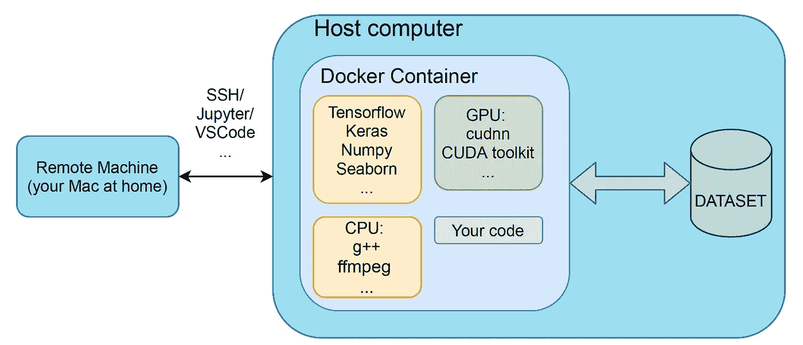
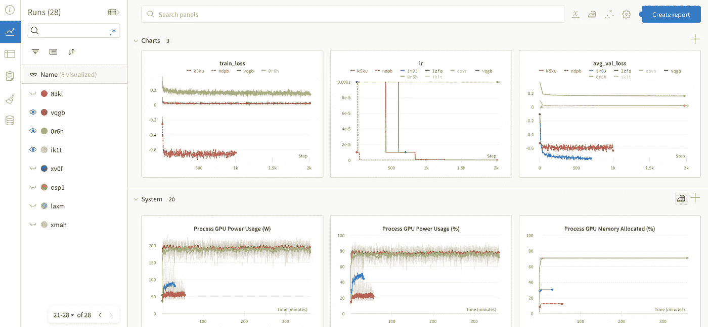
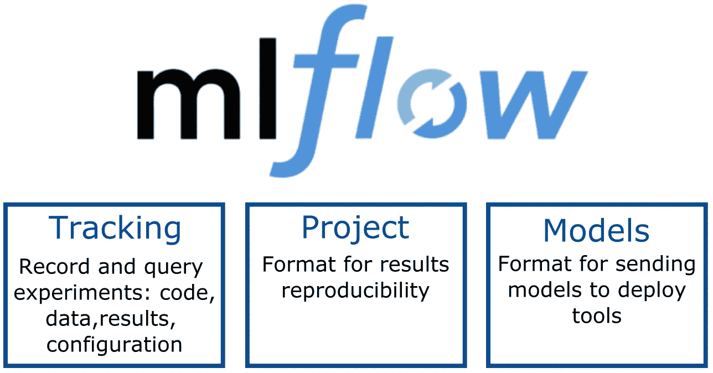

# 我希望在攻读机器学习博士学位之前掌握的九种工具

> 原文：<https://towardsdatascience.com/nine-tools-i-wish-i-mastered-before-my-phd-in-machine-learning-708c6dcb2fb0?source=collection_archive---------0----------------------->

## 无论你是在建立一个新公司还是在取得科学突破，这些工具都将把你的 ML 管道带到下一个层次

图片作者。

尽管学术界在推进技术方面发挥了巨大的作用，但它往往对工业成就一无所知。博士毕业时，我意识到有无数伟大的辅助工具，在学术界被忽视，但在工业界被广泛采用。

从我的个人经验来看，我知道学习和集成新工具可能会令人厌烦、害怕，可能会使人退缩和失去动力，尤其是当当前的设置如此熟悉和有效时。

改掉坏习惯可能很难。对于下面列出的每个工具，我不得不承认我做事的方式是次优的。然而，在这个过程中，我也了解到，有时一时看不到的结果会在以后得到十倍的回报。

下面我谈谈我发现的对研究和构建机器学习应用非常有用的工具，无论是作为一名学者还是人工智能工程师。我根据工具的用途将它们分为四个部分:环境隔离、实验跟踪、协作和可视化。

# 隔离环境

机器学习是一个发展非常迅速的领域，因此常用的软件包经常更新。尽管开发人员做出了努力，但较新的版本通常与以前的版本不兼容。这确实会引起很多痛苦！

幸运的是有工具可以解决这个问题！

## [码头工人](https://www.docker.com)

图片作者。

那些英伟达的驱动给你惹了多少次麻烦？在我读博士期间，我有一台定期更新的大学管理的机器。连夜更新，没有任何通知。想象一下，当我在更新后的第二天早上发现我的大部分工作与最新的驱动程序不兼容时，我有多惊讶。

虽然没有直接的意思，docker 把你从这些特别紧张的截止日期前的不幸中拯救出来。

Docker 允许将软件包装在称为容器的包中。容器是独立的单元，有自己的软件、库和配置文件。简单来说，容器是一个分离的、独立的虚拟操作系统，具有与外界通信的手段。

Docker 有太多现成的容器供你使用，如果你不知道如何自己配置所有东西，从基础开始是非常容易的。

对于那些想快速入门的人，看看这个[教程](https://docs.docker.com/get-started/)。亚马逊 AWS 也做了很好的工作，解释了为什么以及如何使用 docker 进行机器学习[这里](https://aws.amazon.com/blogs/opensource/why-use-docker-containers-for-machine-learning-development/)。

## [康达](https://docs.conda.io/en/latest/)

今天，重用某人的代码成为了一种新的规范。有人在 github 上创建了一个有用的库，你克隆代码，安装并获得你的解决方案，而不需要自己写任何东西。

但是有一点不方便。当多个项目一起使用时，你会遇到包管理的问题，不同的项目需要不同版本的包。

我很高兴在我读博士的时候发现了康达。Conda 是一个包装和环境管理系统。它允许创建多个环境，并快速安装，运行和更新软件包及其依赖关系。您可以在隔离环境之间快速切换，并始终确保您的项目只与您期望的包进行交互。

康达提供了他们自己的[教程](https://conda.io/projects/conda/en/latest/user-guide/getting-started.html#starting-conda)，教你如何创建第一个环境。

# 运行、跟踪和记录实验

严格性和一致性是两个基本支柱，没有这两个支柱，获得应用领域的博士学位几乎是不可能的。如果你曾经尝试过使用机器学习模型，你可能知道失去对测试参数的跟踪是多么容易。过去，参数跟踪是在实验室笔记本上完成的，我确信这些在其他领域仍然非常有用，但在计算机科学中，我们现在有了比这更强大的工具。

## [权重和偏差](https://wandb.ai/site)

一组简单指标的 wandb 面板快照—训练损失、学习率和平均验证损失。请注意，您还可以跟踪系统参数！图片作者。

*实验 _res_1.csv
实验 _res_1_v2.csv
实验 _ RES _ learning _ rate _ pt _ 5 _ v1 . CSV
…。*

这些名字看起来熟悉吗？如果是这样，那么你的模型跟踪技能应该加强。这是我博士第一年的样子。作为一个借口，我应该说我有一个电子表格，我会记录每个实验的细节和所有相关文件。然而，它仍然非常复杂，参数记录中的每个变化都不可避免地会影响后处理脚本。

权重和偏见(W&B/wandb)是我很晚才发现的瑰宝之一，但现在每个项目都在使用。它让你只需要几行代码就可以跟踪、比较、可视化和优化机器学习实验。它还允许您跟踪数据集。尽管有大量的选项，我发现 W&B 很容易建立和使用一个非常友好的网络界面。

感兴趣的可以查看他们的快速设置教程[这里](https://docs.wandb.ai/quickstart)。

## [MLflow](https://mlflow.org)

图片作者。

与 W&B 类似，MLFlow 提供了记录代码、模型和数据集的功能，您的模型就是在这些功能上进行训练的。尽管我只是为了记录数据、模型和代码而使用它，但它提供的功能远不止于此。它允许管理整个 ML 生命周期，包括实验、再现性和部署。

如果你想快速将它集成到你的模型中，看看这个[教程](https://www.mlflow.org/docs/latest/tutorials-and-examples/tutorial.html)。Databricks 也分享了一个非常好的关于 MLflow 的[解释](https://databricks.com/blog/2018/06/05/introducing-mlflow-an-open-source-machine-learning-platform.html)。

## [屏幕](https://linuxize.com/post/how-to-use-linux-screen/)

让实验通宵运行，并希望你的机器不会进入睡眠状态，这是我在攻读博士的前半年的选择。当工作转移到远程时，我曾经担心 ssh 会话中断——代码运行了几个小时，几乎就要收敛了。

我很晚才知道*屏幕*的功能，所以早上不能把自己从半途而废的结果中拯救出来。但在这种情况下，迟到总比不到好。

*屏幕*允许您从单个 ssh 会话启动和使用多个 shell 会话。从屏幕*开始的进程*可以从会话中分离，然后在以后重新连接。因此，您的实验可以在后台运行，而无需担心会话关闭或终端崩溃。

此处总结了[的功能。](https://www.geeksforgeeks.org/screen-command-in-linux-with-examples/)

# 合作

学术界因没有有效团队管理的适当机制而臭名昭著。在某种程度上，这是合理的非常严格的个人贡献的要求。然而，机器学习的进展速度需要共同努力。下面是两个非常基本的工具，可以方便地进行有效的交流，尤其是在远程工作的新领域。

## [GitHub](https://github.com)

很简单，是吧？在看到人们如何在 accademia 中跟踪他们的代码的所有恐怖之后，我不能强调精通版本控制是多么重要。不再有名为 code_v1，code_v2 的文件夹。

Github 为代码跟踪、合并和审查提供了一个非常有用的框架。每当一个团队在构建一个[深度图像质量指标](/deep-image-quality-assessment-30ad71641fac)时，每个成员都可以拥有自己的代码分支，并行工作。解决方案的不同部分可以合并在一起。每当有人引入一个 bug 时，很容易恢复到工作版本。总的来说，我认为 git 是我在本文中提到的所有工具中最重要的。

查看这个关于如何快速启动的循序渐进[指南](https://guides.github.com/activities/hello-world/)。

## [卢西德哈特](https://www.lucidchart.com/pages/)

Lucidchart 是最近介绍给我的，在那之前我使用的是[draw . io](https://app.diagrams.net)——一个非常简单的创建图表的界面。Lucidchart 的功能强大了数千倍，而且更加通用。它的主要优势是共享协作空间和在图表旁边做笔记的能力。想象一个巨大的在线白板，上面有一大堆模板。

快速入门，查看 Lucidchart 的本[教程](https://www.lucidchart.com/pages/tour)页面。

# (英)可视化(= visualization)

无数的论文提交，尤其是那些不成功的，让我明白了陈述往往和结果一样重要。如果通常没有太多时间的审稿人不理解文本，作品会被直接拒绝。匆忙制作的图像给人的印象很差。有人曾经告诉我:“如果你不会做图表，我怎么能相信你的结果呢？”。我不同意这种说法，但是，我同意印象确实很重要。

## [Inkscape](https://inkscape.org)

一图抵千言(其实是[修正 84.1](https://www.cl.cam.ac.uk/~afb21/publications/Student-ESP.html) 字)。

Inkscape 是一个免费的矢量图形软件。事实上，我在大学的网络开发课程中就已经学会了如何使用它。然而，只有在我读博士期间，我才学会如何充分享受这种乐趣——为报纸拍摄那些漂亮的照片。

在 Inkscape 提供的所有功能中，最有价值的是 [TexText](https://inkscape.org/~jcwinkler/%E2%98%85textext) 扩展。有了这个软件包，你可以将你的[乳胶](https://www.latex-project.org)配方无缝地整合到一个图像中。

有无数的教程，但是对于基本的功能，我推荐由 Inkscape 团队[在这里](https://inkscape.org/learn/tutorials/)提供的。

## [流线型](https://streamlit.io)

你曾经需要创建一个简单的网站来展示你的成果或者一个简单的机器学习应用程序吗？只需几行 python 代码，就可以用 Streamlit 实现。

我发现它对于纸质补充材料特别有用，但是对于简单的部署和向客户展示项目演示来说，它甚至更有用。

为了快速启动，请查看这个[教程](https://builtin.com/machine-learning/streamlit-tutorial)。

# 总结和超越

在工业领域定位自己的同时完成博士学位并不容易。但它教会了我几个重要的教训，我希望在我博士学位的早期就能学到。

最重要的教训是，好奇心和学习与改变的意愿会极大地影响你的工作质量。

下面是我在每一节提到的教程的总结:

[Docker](https://www.docker.com) : [教程](https://aws.amazon.com/blogs/opensource/why-use-docker-containers-for-machine-learning-development/)
Conda:[教程](https://conda.io/projects/conda/en/latest/user-guide/getting-started.html#starting-conda)
[度量衡](https://wandb.ai/site) : [教程](https://docs.wandb.ai/quickstart)
[MLflow](https://mlflow.org) : [教程](https://www.mlflow.org/docs/latest/tutorials-and-examples/tutorial.html)
[GitHub](https://github.com) : [教程](https://guides.github.com/activities/hello-world/)
[屏幕](https://linuxize.com/post/how-to-use-linux-screen/) : [教程](https://www.geeksforgeeks.org/screen-command-in-linux-with-examples/)

如果你喜欢这篇文章，请与朋友分享！要阅读更多关于机器学习和图像处理的主题，请点击订阅！

## 喜欢作者？保持联系！

我错过了什么吗？不要犹豫，直接在 [LinkedIn](https://www.linkedin.com/in/aliakseimikhailiuk/) 或 [Twitter](https://twitter.com/mikhailiuka) 上给我留言、评论或发消息吧！

 [## 应对机器学习面试

### 机器学习面试准备指南和资源。

towardsdatascience.com](/acing-machine-learning-interviews-aa73d6d7b07b)  [## 每个博士生免费获得的三项软技能

### 我在攻读机械博士期间学到的关于研究、沟通和团队工作的技巧和诀窍的综合列表…

towardsdatascience.com](/three-soft-skills-every-phd-student-gets-for-free-f63f4b1d3f2d)