# 使用 R 在 LinkedIn 上可视化九年

> 原文：<https://towardsdatascience.com/nine-years-on-linkedin-in-data-b34047c77223?source=collection_archive---------36----------------------->

## 您将学习如何使用 R、ggplot2 和 dpylr 分析您的 LinkedIn 连接数据。

# 介绍


照片由 [Unsplash](https://unsplash.com?utm_source=medium&utm_medium=referral) 上的 [inlytics | LinkedIn 分析工具](https://unsplash.com/@inlytics?utm_source=medium&utm_medium=referral)拍摄

**2021 年 3 月 15 日****标志着我在 LinkedIn 上的第九个年头**。[我加入 LinkedIn](https://www.linkedin.com/in/gscheithauer/) 不是在我职业生涯的开始，而是九年代表了我工作的大部分时间。在 2011 年进入咨询行业之前，我是西门子 CT 的一名研究员，至今仍活跃在该行业。回头看，我的组成主题是**流程管理**和**数据科学**——我真正喜欢的主题。自 2012 年加入 LinkedIn 以来，我已经建立了 720 个虚拟联系😯。

几周前，我读了理查德·科尼利厄斯·苏万迪的文章，内容是关于分析 T21 的 LinkedIn 数据。当然，这让我对自己在 LinkedIn 上的关系感到好奇。由于他使用了 python 和 pandas——这是一个很好的选择——我有意识地决定**将 R 与 ggplot2 和 dplyr** 一起使用，只是为了向您展示一些新的东西，并展示我的 R 技能。

如果你想跟进，请使用这个**git-repo**:[https://github.com/scheithauer/r-LinkedInConnections](https://github.com/scheithauer/r-LinkedInConnections)。请注意，我不会公开我自己的连接数据，但我会告诉你如何在 LinkedIn 上获得你自己的数据。

# 技术设置

## 稀有

我使用以下必要的工具来帮助您跟进:

*   https://cran.r-project.org/mirrors.html
*   RStudio(免费版)[https://rstudio.com/products/rstudio/download/](https://rstudio.com/products/rstudio/download/)

## 获取数据

跟随这个链接:[https://www.linkedin.com/psettings/member-data](https://www.linkedin.com/psettings/member-data)


作者图片

在那里你会发现一个标签为**的部分，获取你的数据的副本**。选择第二个选项，并在其中选择**连接选项**。在你点击**请求存档**并等待几分钟后，你应该**收到一封电子邮件**让你下载数据。

下载后，您应该有这个文件: **Connections.csv** 。

## 项目结构

我是这样组织我的项目的(但是请随意组织你想要的任何方式)。

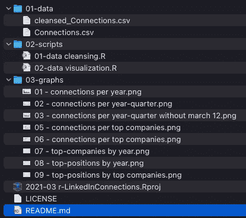

作者提供的图片—一种可能的项目结构

# 为分析准备好数据

当您打开 Connections.csv 时，您将看到 LinkedIn 允许以下数据字段:

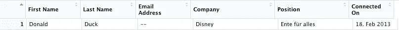

带有匿名数据条目的数据结构(图片由作者提供)

数据清理的**目标如下:**

1.  去掉我们不需要的数据字段，如姓名和电子邮件信息
2.  展开日期信息(连接于)(年、年季度、年、月、星期几)
3.  将清除的数据写入新文件

## 安装和使用必要的软件包

## 读取数据并删除不必要的数据字段

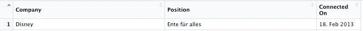

删除一些数据字段的结果(图片由作者提供)

## 展开日期信息

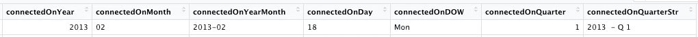

扩展后的附加数据字段(图片由作者提供)

## 将清理的数据写入磁盘

```
# write cleansed data to disk
write_csv(li_cons, "./01-data/cleansed_Connections.csv")
```

就这样:-)

# 数据探索和可视化

## 图书馆

```
library(tidyverse)
library(Hmisc)
library(ggthemes)
library(stringr)
```

## 一些有用的常数

## 清洁公司信息

公司信息由 LinkedIn 用户自己提供。因此，这些信息不一定是一致的，也不一定能立即用于分析，这并不奇怪。有人可能会写**谷歌**，有人会写**谷歌公司**或**谷歌有限责任公司**。

请查看您的数据和可能的不同拼写:

上面的代码将 company 字段分组，并告诉您为该公司工作的连接数。现在，您可以决定清理一些数据。

诸如此类。您可以根据自己的需要进行任意多或少的合并。

## 清洁公司信息

这同样适用于位置数据字段。请查看您的数据和可能的不同拼写:

诸如此类。

## 我每年有多少新的联系？

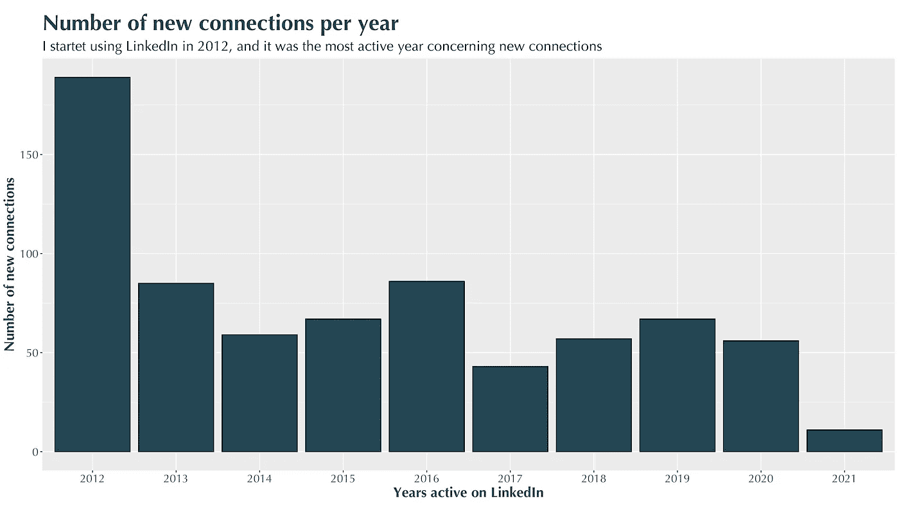

(作者图片)

## 每个月有多少新的联系发生？

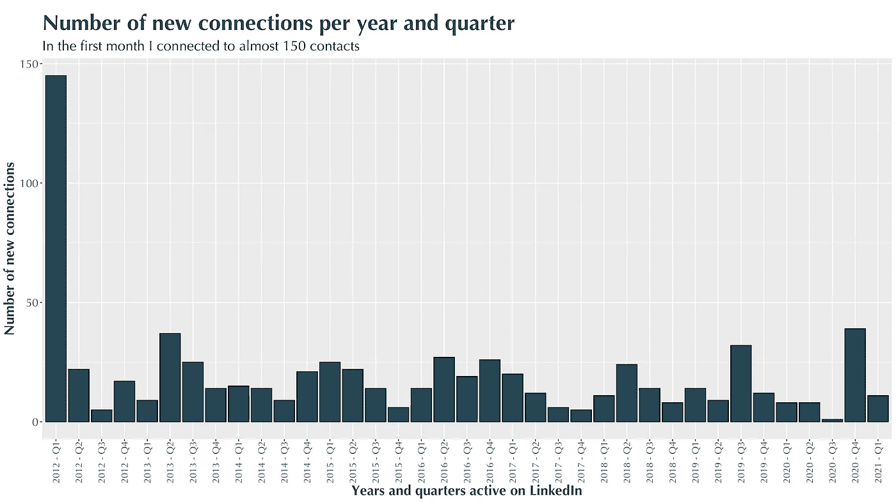

(作者图片)

## 不考虑加入后的第一个月，我每个月有多少新的联系？

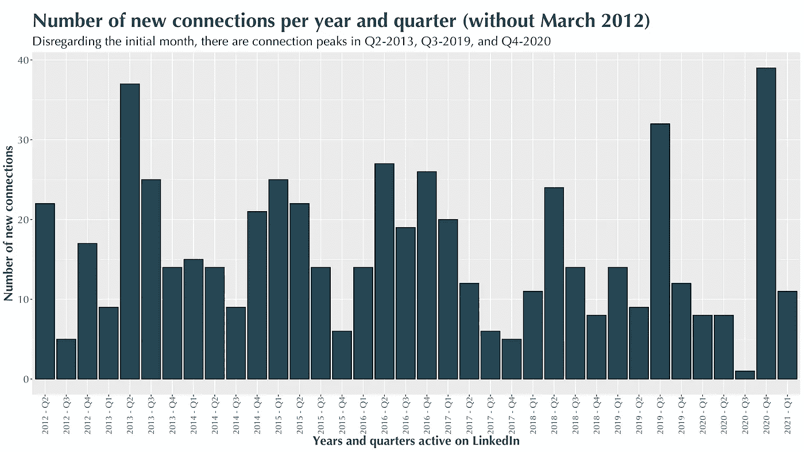

(作者图片)

## 我的关系在为哪些公司工作？

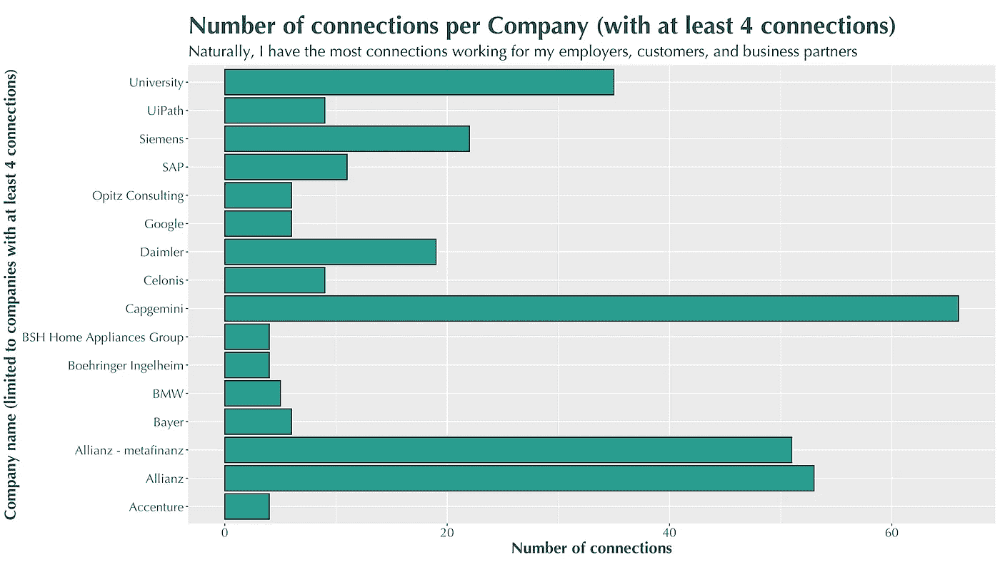

(作者图片)

## 顶级公司有什么巅峰时刻吗？


(作者图片)

## 我的关系在哪里？

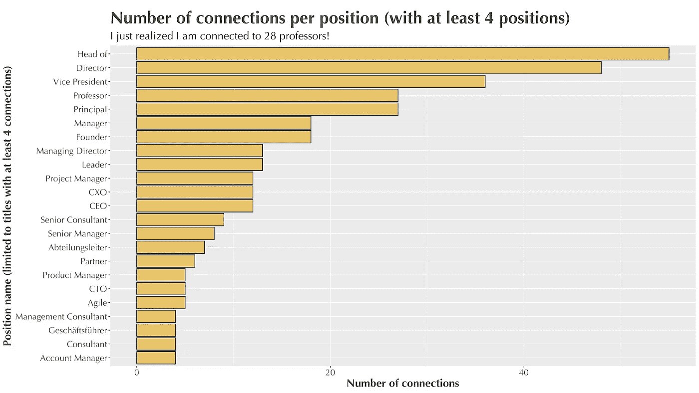

(作者图片)

## 有没有顶级位置的巅峰时刻？

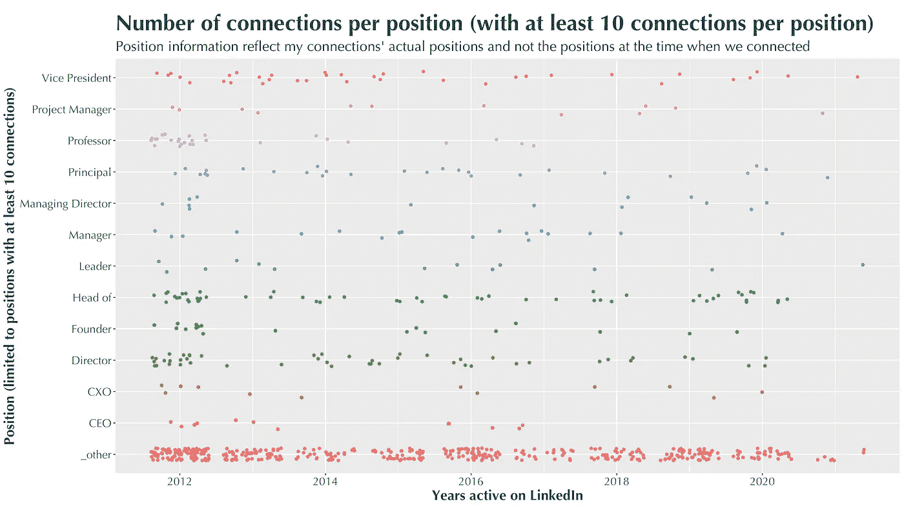

(作者图片)

## 目前高层职位在哪里工作？

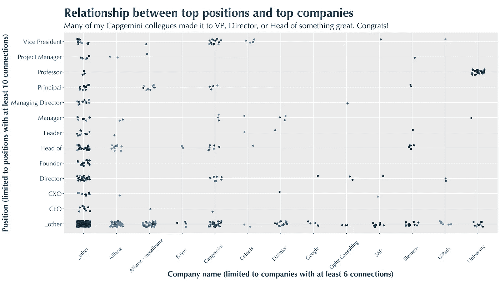

(作者图片)

# 结论

感谢欧盟的[**【GDPR】**](https://en.wikipedia.org/wiki/General_Data_Protection_Regulation)一般数据保护条例，特别是信息和访问权允许我从 LinkedIn 下载和分析我的连接数据。

有人可能会说，这样的分析对任何人或我来说会有多大用处。它**没有表现出太多的惊喜**——但这是我在努力之前不知道的事情。这绝对是一次有趣的回忆之旅:-)

我从这份工作中得到的**绝对是对我的 R 技能**的一次**锻炼，以及对使用 Git** 更加友好的**。**

> 如果您有改进此解决方案的想法，请随时联系我！

祝一切顺利，
格雷戈尔

**点击此处查看更多我的文章**:

1.  [了解我如何为媒体设计文章](https://medium.com/technical-excellence/article-pipeline-management-with-notion-app-template-13e83635ed1)
2.  [了解如何使用链接(或管道)在 Python 中编写干净的代码](https://medium.com/technical-excellence/article-pipeline-management-with-notion-app-template-13e83635ed1)
3.  [学习如何使用 R 分析你的 LinkedIn 数据](/nine-years-on-linkedin-in-data-b34047c77223)
4.  [学习如何使用图形语法在 Python 中以描述性的方式创建图表](/data-visualization-in-python-like-in-rs-ggplot2-bc62f8debbf5)
5.  [了解如何在两分钟内用 python 数据科学代码设置日志记录](/how-to-setup-logging-for-your-python-notebooks-in-under-2-minutes-2a7ac88d723d)

Gregor Scheithauer 是一名顾问、数据科学家和研究员。他专门研究流程挖掘、业务流程管理和分析。你可以在[**LinkedIn**](https://www.linkedin.com/in/gscheithauer/)[**Twitter**](https://twitter.com/gscheithauer)上和他连线，或者在 [**中**](https://gscheithauer.medium.com/) 上这里。谢谢大家！

[](https://github.com/scheithauer/r-LinkedInConnections) [## scheit hauer/r-linked connections

### 您将学习如何使用 R、ggplot2 和 dpylr 分析您的 LinkedIn 连接数据。2021 年 3 月 15 日标志着我的…

github.com](https://github.com/scheithauer/r-LinkedInConnections) 

# 沿途的有用资源

1.  [https://happygitwithr.com/rstudio-git-github.html](https://happygitwithr.com/rstudio-git-github.html)
2.  [https://dplyr.tidyverse.org/reference/mutate.html](https://dplyr.tidyverse.org/reference/mutate.html)
3.  https://coolors.co/palettes/trending
4.  [https://medium . com/@ gscheithauer/data-visualization-in-python-like-in-RS-gg plot 2-BC 62 f 8 deb BF 5](https://medium.com/@gscheithauer/data-visualization-in-python-like-in-rs-ggplot2-bc62f8debbf5)
5.  [https://sebastiansauer.github.io/dplyr_filter/](https://sebastiansauer.github.io/dplyr_filter/)
6.  [https://github.com/scheithauer/r-LinkedInConnections](https://github.com/scheithauer/r-LinkedInConnections)