# NL-Augmenter:一个任务敏感的自然语言扩充框架

> 原文：<https://towardsdatascience.com/nl-augmenter-a-framework-for-task-sensitive-natural-language-augmentation-833c9d444ce2?source=collection_archive---------12----------------------->

## [思想与理论](https://towardsdatascience.com/tagged/thoughts-and-theory)，ML 论文

## 我是如何对 NLP 数据增强框架做出贡献，并成为关于它的 ML 论文的合著者之一

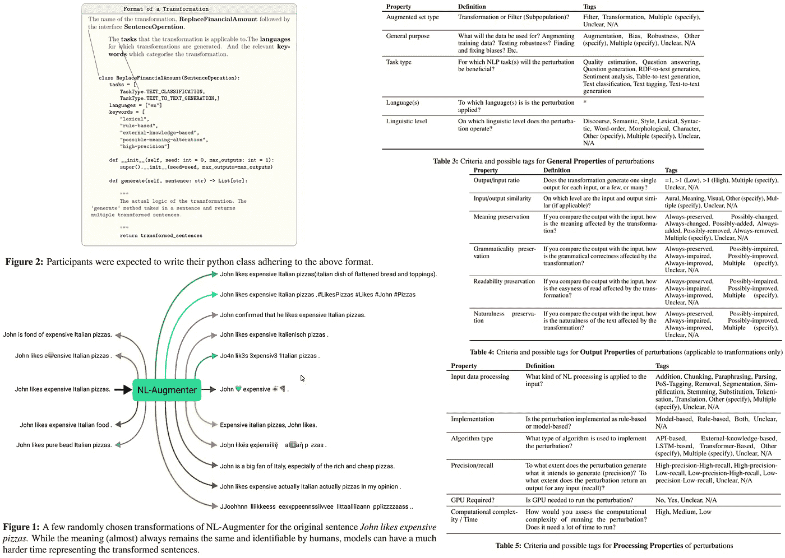

作者制作的【https://arxiv.org/abs/2112.02721】T2 论文截图拼贴

[论文链接](https://arxiv.org/abs/2112.02721)

[代码链接](https://github.com/GEM-benchmark/NL-Augmenter)

本文提出了一种新的基于 Python 的参与式自然语言增强框架，该框架支持转换(对数据的修改)和过滤器(根据特定特征对数据进行拆分)的创建。

该框架的当前版本包含 117 个转换和 23 个过滤器，用于各种自然语言任务。

作者通过使用 NL-Augmenter 的几个变换来分析流行的自然语言模型的健壮性，展示了 NL-Augmenter 的有效性。

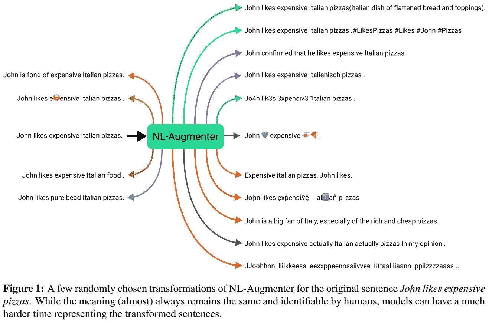

一张来自 https://arxiv.org/abs/2112.02721 的图

数据扩充是自然语言处理(NLP)中模型鲁棒性评估和增强训练数据多样性的重要组成部分。但是，大多数转换并没有以激烈和有意义的方式改变示例的结构，使得它们作为潜在的训练或测试示例不太有效。

有些转换是普遍适用的，例如，将地点改为来自不同地理区域的地点，或者将名称改为来自不同文化的名称。另一方面，一些 NLP 任务可能会受益于转换特定的语言属性:将输入中的单词“happy”更改为“very happy ”,这对于情感分析比对于摘要更相关。因此，有一个单一的地方来收集特定于任务和独立于任务的扩充将减少创建应该应用于不同任务的适当扩充套件的障碍。

在 2021 年，针对 [GEM 基准](https://gem-benchmark.com/)提出了几个评估套件:

*   转换(例如回译、引入印刷错误等。)
*   子群体，即根据诸如输入复杂度、输入大小等特征过滤的测试子集。
*   数据转移，即不包含任何原始测试集材料的新测试集。

NL-Augmenter 是一个参与者驱动的存储库，旨在测试和培训期间实现更多样化和更好表征的数据。为了鼓励特定于任务的实现，转换被绑定到广泛使用的数据格式(例如，文本对、问答对等。)以及各种任务类型(例如，蕴涵、标记等。)他们打算从中受益。

## 过程的组织

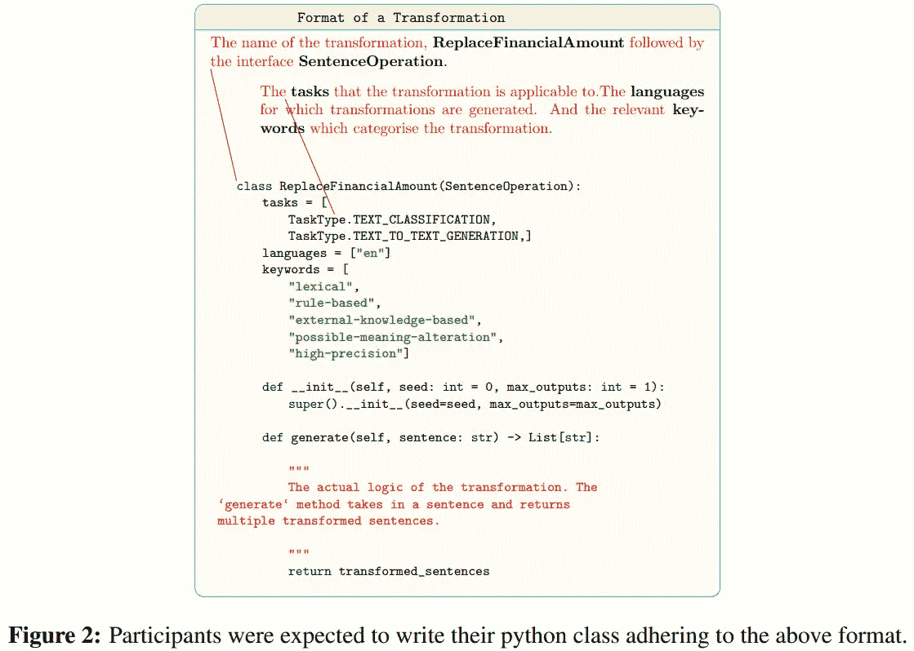

一张来自 https://arxiv.org/abs/2112.02721 的图

组织了一次研讨会，以构建这一资料库。与人们提交论文的传统研讨会不同，参与者被要求向 GitHub 存储库提交转换的 python 实现。

组织者创建了一个基本存储库，并整合了一组接口。然后，参与者可以提交遵循预定义接口的代码，并接受代码审查:遵循风格指南，实现测试，并被鼓励提交新颖和/或特定的转换/过滤器。

在论文发表时，知识库中有 117 个转换和 23 个过滤器。

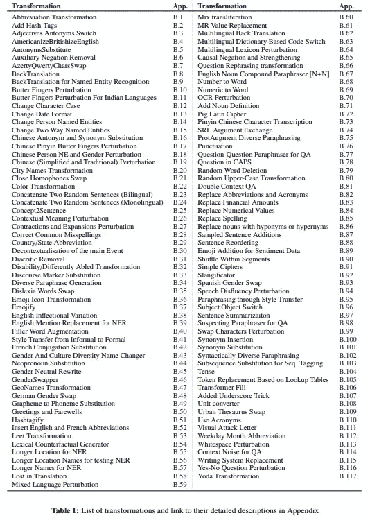

一张来自 https://arxiv.org/abs/2112.02721 的表格

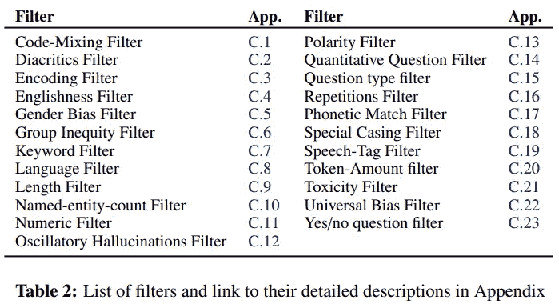

一张来自 https://arxiv.org/abs/2112.02721 的表格

## 标签

为了更容易地搜索特定的扰动并理解它们的特征，引入了三种主要类别的标签:

*   一般属性；
*   输出属性；
*   加工性能；

有些标签是自动分配的(来自代码中的元数据)，有些则是由贡献者自己分配的。

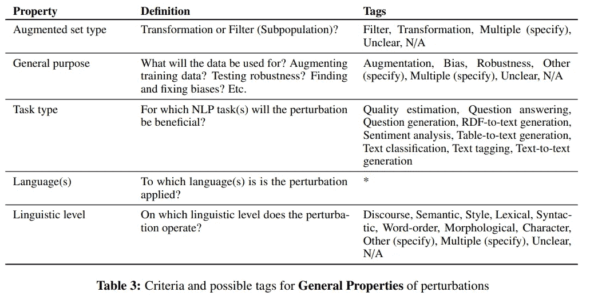

一张来自 https://arxiv.org/abs/2112.02721 的表格

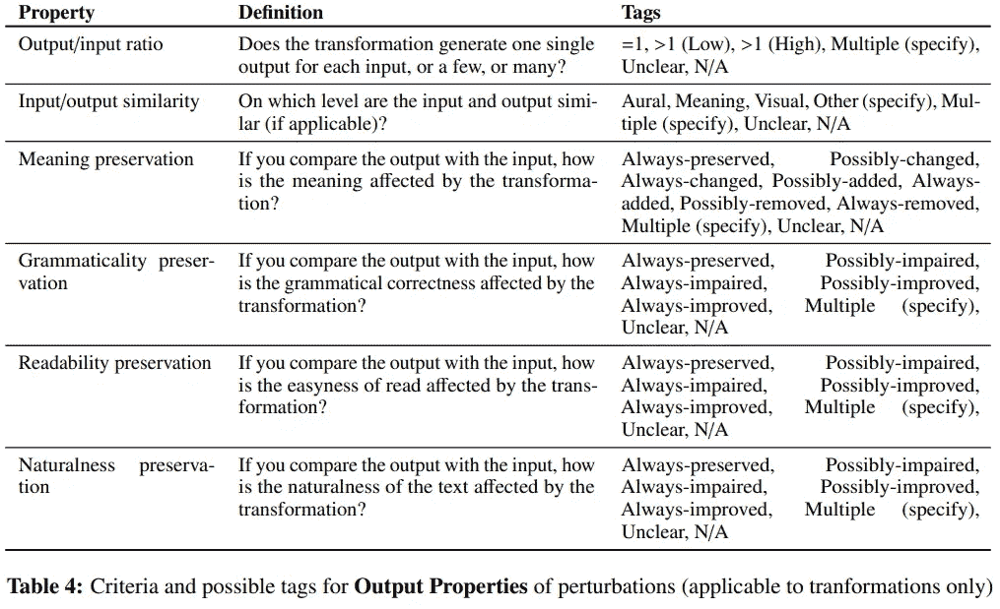

一张来自 https://arxiv.org/abs/2112.02721 的表格

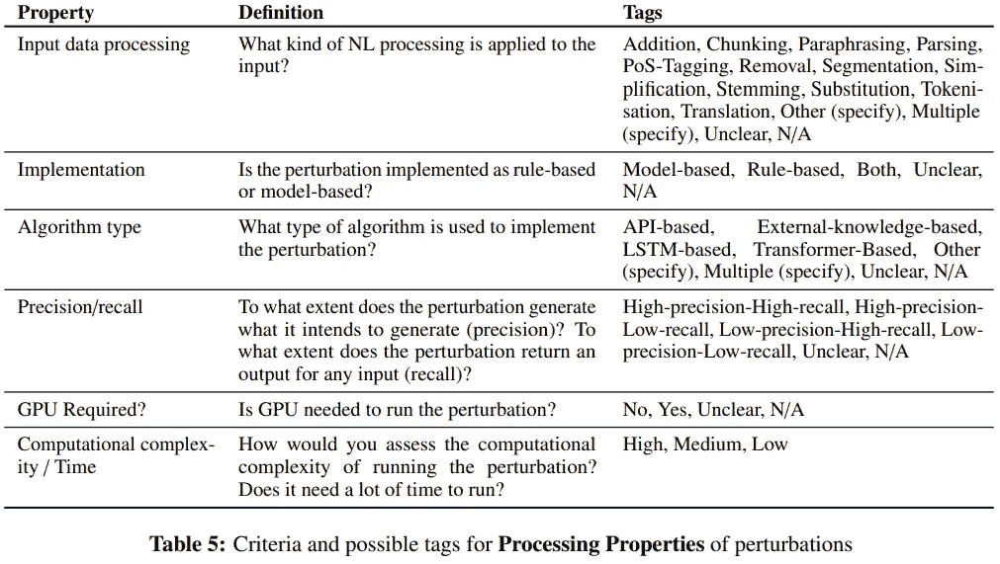

一张表格来自纸[https://arxiv.org/abs/2112.02721](https://arxiv.org/abs/2112.02721)

## 鲁棒性分析

被接受的扰动的所有作者被要求为他们各自的转换或过滤器提供任务表现分数。

扰动主要分为文本分类任务、标注任务、
和问答任务。对于本文中的实验，作者集中于文本分类和相关的扰动。
他们比较了原始数据和扰动数据的模型性能；报告了改变判决的百分比和业绩下降的情况。

使用四个数据集:用于情感分析的 SST-2 和 IMDB，用于重复问题检测的 QQP 和 MNLI。他们对应的模型(在 Huggingface 上下载的最多)用于评测。在评估过程中，随机有 20%的验证数据集受到干扰。

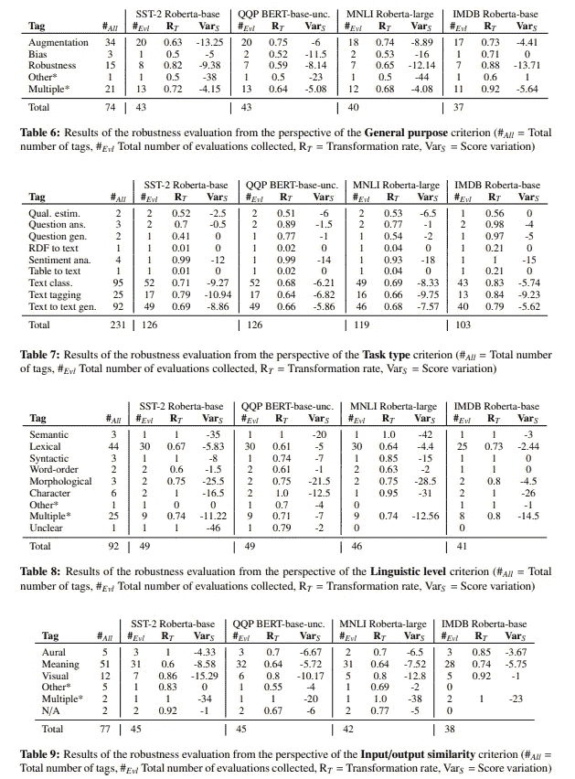

一张表格从纸上[https://arxiv.org/abs/2112.02721](https://arxiv.org/abs/2112.02721)

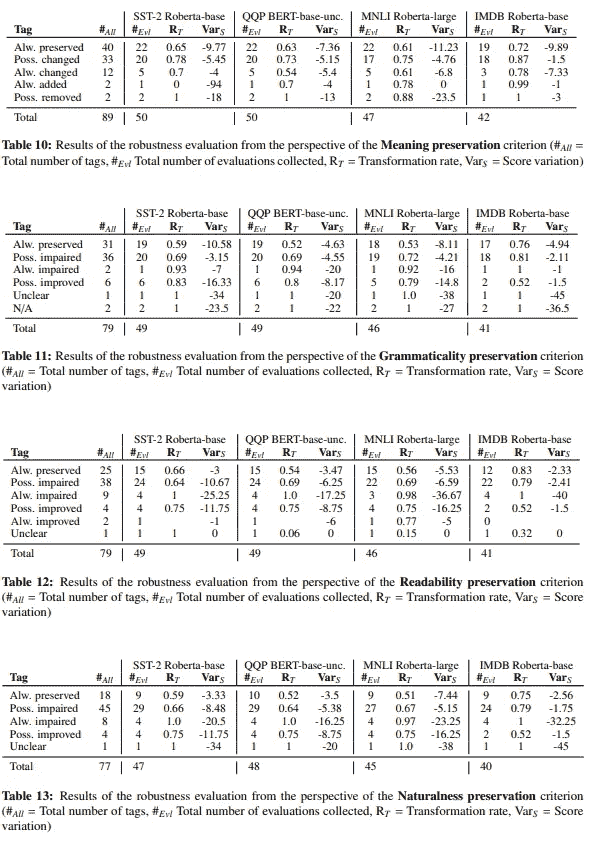

一张来自 https://arxiv.org/abs/2112.02721 的表格

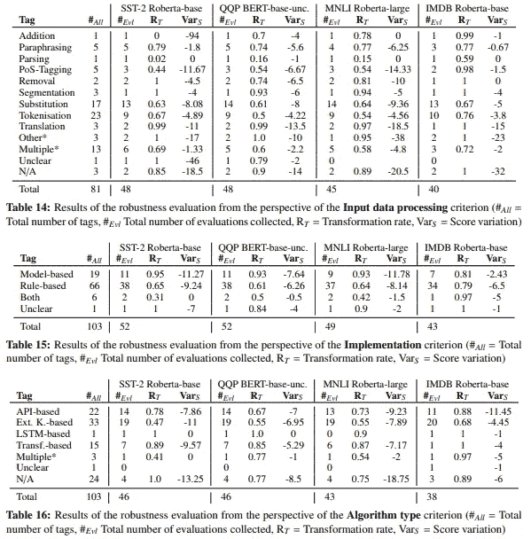

一张来自 https://arxiv.org/abs/2112.02721 的表格

## 讨论和影响

局限性:

*   结果表明，测试的扰动给模型带来了严重的挑战，并降低了它们的得分，但最好分析每个单独扰动的贡献；
*   一些扰动的标签可能是不一致的，并且有必要评估标签分配的质量以确保可靠的分析；
*   稳健性分析显示了模型的弱点，但有必要进行单独的分析，以验证在训练时使用这些扰动将减轻这些弱点；

NL-augmenter 是由许多参与者创建的，与独立项目相比，个人的贡献可能不太受重视。
为了主动给予适当的认可，每个转化都有一张提及贡献者的数据卡，所有参与者都被列为本论文的共同作者。

# 我的贡献

当我看到这个项目时，我立刻对它产生了兴趣，并想做出贡献。我以前做过多个 NLP 项目，知道模型的健壮性经常是一个问题，所以我想参与处理这个问题。

当时，存储库中已经有许多转换，涵盖了常见的增强和许多特定的新的增强。然而，我不想做无意义的贡献，所以我开始寻找新的想法。

过了一段时间，我选择了一篇论文[命名实体识别的简单数据扩充分析](https://arxiv.org/abs/2010.11683)。本文介绍了几个有趣的数据扩充，我认为它们会很有用。(后来我已经找到了这个[实现](https://github.com/boschresearch/data-augmentation-coling2020)，但是在我最初研究的时候漏掉了)。

我选择了以下与 NER 任务相关的增强功能:

> 片段内混洗(SiS):我们首先将令牌序列分成具有相同标签的片段。因此，每个片段对应于一个提及或一系列未提及的标记。例如，她没有抱怨头痛或任何其他神经症状的句子。问题被分成五个部分:[她没有抱怨]，[头痛]，[或]，[任何其他神经症状]，[。].然后，对于每个片段，我们使用二项式分布随机决定是否应该洗牌。如果是，片段内的标记顺序被打乱，而标签顺序保持不变。

以下是实现的完整代码:

[链接](https://github.com/GEM-benchmark/NL-Augmenter/tree/main/transformations/shuffle_within_segments)到增强页面。

这对我来说是一次有趣的经历，我希望人们能从 NL-Augmenter 的使用中受益。